# 数据库表结构说明-V2

> 项目：`order-java` （交易订单系统）
> 本文档整理了本项目涉及到的全部数据库表及其字段说明，按业务域分组。
> 字段类型与注释以 SQL DDL、MyBatis Mapper XML 以及对应 Java 实体类（`@TableField`）中的信息为准。
> 所有表默认包含主键 `id` (BIGINT, AUTO_INCREMENT)、`create_time`、`modified_time`，以及软删字段 `closed` / `deleted`（0=未删除，1=已删除），特殊情况会单独说明。

## 目录
- [一、三方订单域](#一三方订单域)
- [二、订单域](#二订单域)
- [三、支付与退款域](#三支付与退款域)
- [四、商品域](#四商品域)
- [五、营销与促销域](#五营销与促销域)
- [六、售后与履约域](#六售后与履约域)
- [七、用户与认证域](#七用户与认证域)
- [八、优惠券与标签域](#八优惠券与标签域)
- [九、采购与供应域](#九采购与供应域)
- [十、抽盒机（IKJ）域](#十抽盒机ikj域)
- [十一、众筹域](#十一众筹域)
- [十二、内容与社区域](#十二内容与社区域)
- [十三、其它支撑表](#十三其它支撑表)

---

## 一、三方订单域

### 1. `trade_third_order` — 三方订单主表
存储来自外部平台（如小红书）的订单信息。对应 Java 类：`ThirdOrder`。

| 字段 | 类型 | 说明 |
| --- | --- | --- |
| id | BIGINT PK | 主键 |
| user_id | VARCHAR(50) | 商家/用户 ID |
| vendor_id | VARCHAR(50) | 商家 ID |
| third_order_id | VARCHAR(100) | 三方订单号，与 origin 唯一 |
| origin | TINYINT(2) | 来源（2=小红书） |
| status | TINYINT(2) | 订单状态（1 待付款/2 待发货/4 已发货/5 已完成/6 已关闭） |
| total_amount | DECIMAL(10,2) | 订单总金额 |
| pay_amount | DECIMAL(10,2) | 实付金额 |
| shipping_fee | DECIMAL(10,2) | 运费 |
| shop_id | VARCHAR(50) | 店铺 ID |
| pay_method | TINYINT(2) | 支付方式 |
| closed_time | DATETIME | 关闭时间 |
| remark | VARCHAR(500) | 买家留言 |
| created_time | VARCHAR(50) | 三方订单创建时间（UTC） |
| promise_last_delivery_time | VARCHAR(50) | 承诺最晚发货时间（UTC） |
| open_address_id | VARCHAR(50) | 收货地址 ID |
| error_status | INT | 异常状态标记 |
| error_msg | VARCHAR | 异常信息 |
| origin_content | TEXT | 原始订单 JSON |
| origin_address_content | TEXT | 原始地址 JSON（加密） |
| closed | TINYINT(1) | 删除标记 |
| create_time / modified_time | VARCHAR(50) | 创建/更新时间（UTC） |

### 2. `trade_third_order_item` — 三方订单明细

| 字段 | 类型 | 说明 |
| --- | --- | --- |
| id | BIGINT PK | 主键 |
| third_order_id | VARCHAR(100) | 三方订单号 |
| third_order_item_id | VARCHAR(100) | 三方订单明细号（唯一） |
| user_id | VARCHAR(50) | 用户 ID |
| product_id | VARCHAR(50) | 商品 ID |
| product_name | VARCHAR(255) | 商品名 |
| sku_id | VARCHAR(50) | SKU ID |
| shipping_mode | TINYINT(2) | 发货模式（1 预售/2 现货） |
| image_id | VARCHAR(50) | 图片 ID |
| image_url | VARCHAR(500) | 图片 URL |
| price | DECIMAL(10,2) | 单价 |
| quantity | INT | 数量 |
| sku_specs | TEXT | SKU 规格 JSON |
| closed | TINYINT(1) | 删除标记 |
| create_time / modified_time | VARCHAR(50) | 时间戳 |

### 3. `trade_third_order_sync_task` — 三方订单同步任务
与三方平台（发货、签收）通知回传任务。

| 字段 | 类型 | 说明 |
| --- | --- | --- |
| id | BIGINT PK | 主键 |
| task_id | VARCHAR(50) | 任务号（唯一） |
| third_order_id | VARCHAR(100) | 三方订单号 |
| task_type | TINYINT(2) | 任务类型（1 发货通知/2 签收通知） |
| status | TINYINT(2) | 任务状态（0 待处理/1 处理中/2 成功/3 失败） |
| retry_count / max_retry_count | INT | 重试次数/最大重试次数 |
| task_data | TEXT | 任务数据 JSON（含运单号等） |
| error_msg | TEXT | 错误信息 |
| closed | TINYINT(1) | 删除标记 |
| create_time / modified_time | VARCHAR(50) | 时间戳 |

### 4. `trade_third_order_event_log` — 三方订单事件日志
对三方订单的 CREATE/CANCEL/UPDATE 等事件审计。

| 字段 | 类型 | 说明 |
| --- | --- | --- |
| id | BIGINT PK | 主键 |
| third_order_id | VARCHAR(64) | 三方订单号 |
| origin | INT | 来源 |
| event_type | VARCHAR(32) | 事件类型 |
| event_time | VARCHAR(32) | 事件业务时间（三方时间） |
| received_time | VARCHAR(32) | 事件接收时间 |
| event_data | TEXT | 事件数据 JSON（超出 64KB 截断） |
| processed | TINYINT | 是否已处理（0/1） |
| process_result | VARCHAR(512) | 处理结果 |
| create_time / modified_time | VARCHAR(32) | 时间戳 |

---

## 二、订单域

### 5. `trade_order` — 订单主表
对应 Java 类：`Order`。

| 字段 | 类型 | 说明 |
| --- | --- | --- |
| id | BIGINT PK | 主键 |
| app_id | INT | 应用 ID |
| user_id | VARCHAR | 用户 ID |
| order_id | VARCHAR | 订单业务号 |
| third_order_id | VARCHAR(100) | 关联三方订单号 |
| origin | INT | 订单来源（0 普通/1 学生/2 小红书/4 百度等） |
| status | INT | 订单状态（0 已创建/1 待付款/2 已支付/3 生产中/4 已发货/5 已完成/6 已关闭/7 退款中） |
| total_amount | DECIMAL(10,2) | 订单总金额 |
| discount_amount | DECIMAL(10,2) | 优惠金额 |
| discount_info | VARCHAR | 优惠信息 |
| pay_amount | DECIMAL(10,2) | 实付金额 |
| shipping_fee | DECIMAL(10,2) | 运费 |
| shop_id | VARCHAR | 店铺 ID（1=官方自营） |
| pay_method | INT | 支付方式 |
| refund_status | INT | 退款子状态 |
| closed_time | DATETIME | 关闭时间 |
| pay_success_time | VARCHAR | 支付成功时间 |
| remark | VARCHAR | 买家留言 |
| cs_remark | VARCHAR | 客服备注 |
| settle_status | INT | 结算状态 |
| settle_cool_down | INT | 结算冷静期 |
| cancel_reason | VARCHAR | 取消原因 |
| refund_reason | VARCHAR | 退款原因 |
| sub_status | INT | 订单子状态 |
| closed | INT | 删除标记 |
| last_origin_payment_amount | DECIMAL(10,2) | 上次改价前金额 |
| sys_completed | INT | 系统完成标识（1 系统完成/0 用户完成） |
| production_review_comment | VARCHAR | 生产审核备注 |
| after_sale_flag | INT | 售后中标识 |
| finish_time | VARCHAR | 订单完成时间 |
| create_time / modified_time | VARCHAR | 时间戳 |

### 6. `trade_order_item` — 订单商品明细
对应 Java 类：`OrderItem`。

| 字段 | 类型 | 说明 |
| --- | --- | --- |
| id | BIGINT PK | 主键 |
| user_id | VARCHAR | 用户 ID |
| app_id | INT | 应用 ID |
| type | INT | 1 想要/2 定制/3 商城非想要/0 默认 |
| order_id | VARCHAR | 订单号 |
| order_item_id | VARCHAR | 明细业务号 |
| shop_product_id | VARCHAR | 商城商品 ID |
| customized_product_id | VARCHAR | 定制商品 ID |
| product_id | VARCHAR | 商品 ID |
| sku_id | VARCHAR | SKU ID |
| shipping_mode | INT | 发货模式（1 预售/2 现货） |
| content_id | VARCHAR | 社区帖子 ID |
| content_user_id | VARCHAR | 社区帖子作者 |
| image_id | VARCHAR | 图片 ID |
| image_url | VARCHAR | 图片 URL |
| price | DECIMAL(10,2) | 单价 |
| quantity | INT | 数量 |
| product_info | VARCHAR | 商品详情 |
| product_name | VARCHAR | 商品名 |
| description | VARCHAR | 描述 |
| closed | INT | 删除标记 |
| create_time / modified_time | VARCHAR | 时间戳 |

### 7. `trade_order_ext` — 订单扩展信息
对应 `OrderExt`。

| 字段 | 类型 | 说明 |
| --- | --- | --- |
| id | INT PK | 主键 |
| user_id | VARCHAR | 用户 ID |
| order_id | VARCHAR | 订单号 |
| origin | INT | 1 内部/2 小红书 |
| erp_order_id | VARCHAR | ERP 单号 |
| erp_status | INT | 0 未同步/1 已同步/2 同步失败 |
| erpErrorMsg | VARCHAR | ERP 错误信息 |
| access_model | INT | 1 接口对接/2 线下对接 |
| supplier_id | VARCHAR | 供应商 |
| generate_file_id | VARCHAR | 生成文件 ID |
| closed | INT | 软删 |
| create_time / modified_time | VARCHAR | 时间戳 |

### 8. `trade_shipping_address` — 订单收货地址
对应 `ShippingAddress`。

| 字段 | 类型 | 说明 |
| --- | --- | --- |
| id | BIGINT PK | 主键 |
| user_id | VARCHAR | 用户 ID |
| order_id | VARCHAR | 订单号 |
| recipient_name | VARCHAR | 收货人 |
| mobile | VARCHAR | 电话 |
| country | VARCHAR | 国家 |
| province | VARCHAR | 省 |
| city | VARCHAR | 市 |
| district | VARCHAR | 区/县 |
| street | VARCHAR | 街道 |
| detail | VARCHAR | 详细地址 |
| postal_code | VARCHAR | 邮编 |
| closed | INT | 软删 |
| create_time / modified_time | VARCHAR | 时间戳 |

### 9. `trade_order_sale_share` — 订单分销主表
对应 `OrderSaleShare`。

| 字段 | 类型 | 说明 |
| --- | --- | --- |
| id | BIGINT PK | 主键 |
| unique_sale_share_id | VARCHAR | 业务唯一 ID |
| product_creator_id | VARCHAR | 创作者 ID |
| summary_time_type | INT | 汇总周期类型（1=季度） |
| summary_time | VARCHAR | 汇总时间（如 `2025-Q1`） |
| total_sale_amount | DECIMAL | 销售总额 |
| total_expected_share_amount | DECIMAL | 预计分润总额 |
| closed | INT | 软删 |
| create_time / modified_time | VARCHAR | 时间戳 |

### 10. `trade_order_sale_share_detail` — 订单分销明细
对应 `OrderSaleShareDetail`。

| 字段 | 类型 | 说明 |
| --- | --- | --- |
| id | BIGINT PK | 主键 |
| unique_sale_share_detail_id | VARCHAR | 业务唯一 ID |
| buyer_id | VARCHAR | 买家 |
| product_creator_id | VARCHAR | 创作者 |
| product_id / product_type | VARCHAR / INT | 商品（1 想要商品/2 单品作品） |
| order_id / order_item_id | VARCHAR | 关联订单与明细 |
| content_id | VARCHAR | 帖子/作品 ID |
| image_url | VARCHAR | 图片 |
| sale_amount | DECIMAL | 销售总额 |
| expected_share_amount | DECIMAL | 预计分润 |
| sku | VARCHAR | SKU |
| withdrawal_status | INT | 0 未提现/1 已提现 |
| withdrawal_id | VARCHAR | 提现批次业务 ID |
| closed | INT | 软删 |
| create_time / modified_time | VARCHAR | 时间戳 |

### 11. `trade_order_sale_share_withdrawal` — 分销提现
对应 `OrderSaleShareWithdrawal`。

| 字段 | 类型 | 说明 |
| --- | --- | --- |
| id | BIGINT PK | 主键 |
| unique_withdrawal_id | VARCHAR | 业务唯一 ID |
| product_creator_id | VARCHAR | 创作者用户 |
| withdrawal_amount | DECIMAL | 提现金额（元） |
| summary_time_type | INT | 与 `trade_order_sale_share.summary_time_type` 对齐 |
| summary_time | VARCHAR | 汇总时间维度 |
| withdrawal_time | VARCHAR | 打款时间（UTC） |
| status | INT | 状态 |
| remark | VARCHAR | 备注 |
| closed | INT | 软删 |
| create_time / modified_time | VARCHAR | 时间戳 |

---

## 三、支付与退款域

### 12. `trade_payment` — 支付流水
对应 `Payment`。

| 字段 | 类型 | 说明 |
| --- | --- | --- |
| id | BIGINT PK | 主键 |
| pay_user_id | VARCHAR | 付款用户 |
| payment_id | VARCHAR | 支付单号 |
| h5_info_type | INT | H5 场景（1 iOS/2 安卓/3 WAP） |
| order_id | VARCHAR | 关联订单号 |
| status | INT | 1 待支付/2 已支付/6 已关闭/8 超时关闭 |
| pay_url | VARCHAR | 支付链接 |
| pay_no | VARCHAR | 三方支付订单号 |
| trade_no | VARCHAR | 三方交易号 |
| pay_amount | DECIMAL(10,2) | 支付金额 |
| order_amount | DECIMAL(10,2) | 订单金额 |
| pay_method | INT | 101 微信 Native/102 H5/104 JSAPI/106 APP/107 支付宝 APP |
| pay_finish_time | DATETIME | 支付完成时间 |
| pay_success_time | DATETIME | 支付成功时间 |
| remark | VARCHAR | 备注 |
| expire_time | DATETIME | 二维码过期时间 |
| ext_info | VARCHAR | 三方扩展信息 |
| create_time / modified_time | VARCHAR | 时间戳 |

### 13. `trade_refund` — 退款流水
对应 `Refund`。

| 字段 | 类型 | 说明 |
| --- | --- | --- |
| id | BIGINT PK | 主键 |
| refund_no | VARCHAR | 退款流水号 |
| pay_user_id | VARCHAR | 付款用户 |
| order_item_id | BIGINT | 订单明细 ID |
| order_id | VARCHAR | 订单号 |
| status | INT | 退款状态 |
| trade_no | VARCHAR | 交易号 |
| refund_amount | DECIMAL(10,2) | 退款金额 |
| refund_method | INT | 退款方式 |
| reason | VARCHAR | 退款原因 |
| payment_id | VARCHAR | 关联支付号 |
| after_sale_order_id | VARCHAR | 关联售后单 |
| out_refund_id | VARCHAR | 外部退款单号 |
| order_type | INT | 1 普通/2 抽盒 |
| operate_detail | VARCHAR(1024) | 操作详情 |
| fail_reason | VARCHAR | 退款失败原因 |
| create_time / modified_time | VARCHAR | 时间戳 |

---

## 四、商品域

### 14. `trade_pd_product` — 商品主表
对应 `Product`（productdomain）。

| 字段 | 类型 | 说明 |
| --- | --- | --- |
| id | BIGINT PK | 主键 |
| product_id | VARCHAR(64) | 业务 ID |
| spu_id | VARCHAR | 关联 SPU |
| category_id | BIGINT | 关联类目 |
| product_type | INT | 1 众筹/2 模板/3 商城 |
| product_name | VARCHAR | 商品名 |
| description | TEXT | 商品描述 |
| price | DECIMAL(10,2) | 默认售价 |
| product_images | VARCHAR | 图片列表（JSON） |
| audit_status | TINYINT | 0 初始化/1 审核中/2 通过/3 驳回 |
| freight_setting | INT | 1 统一运费/2 模板 |
| shipping_mode | INT | 1 预售/2 现货 |
| delivery_time_type | INT | 发货时效 1-4 |
| business_mode | VARCHAR | self 自营/third 第三方 |
| create_method | INT | 0 手工/1 批量导入 |
| status | INT | 0 草稿/1 上架/2 下架 |
| precedence | BIGINT | 排序值 |
| version | INT | 版本号 |
| discount_channel | INT | 促销类型 |
| channel | VARCHAR | 销售渠道 |
| freight_template_id | BIGINT | 运费模板 |
| create_by / update_by | VARCHAR | 操作人 |
| closed | BOOLEAN | 软删 |
| custom_type | VARCHAR | MANUAL 模板/AI AI 创建 |
| buy_limit | INT | 0 不限/1 限购 |
| create_time / modified_time | VARCHAR | 时间戳 |

### 15. `trade_pd_product_audit_history` — 商品审核历史
对应 `ProductAuditHistory`。

| 字段 | 类型 | 说明 |
| --- | --- | --- |
| id | BIGINT PK | 主键 |
| product_id | VARCHAR(64) | 商品 ID |
| product_snapshot | MEDIUMTEXT | 商品快照 JSON |
| operation_type | TINYINT | 1 提交/2 通过/3 驳回 |
| operator | VARCHAR(64) | 操作人 |
| remark | VARCHAR(500) | 备注（如驳回原因） |
| create_time / modified_time | VARCHAR | 时间戳 |

### 16. `trade_pd_sku` — 商品 SKU
对应 `Sku`（productdomain）。

| 字段 | 类型 | 说明 |
| --- | --- | --- |
| id | BIGINT PK | 主键 |
| sku_id | VARCHAR | SKU 业务 ID |
| product_id | VARCHAR | 关联商品 |
| sku_code | VARCHAR | SKU 编码 |
| price | DECIMAL(10,2) | 售价 |
| want_price | DECIMAL(10,2) | 想要价 |
| stock | DECIMAL | 库存 |
| img_url | VARCHAR | 图片 |
| erp_status | INT | 0 未关联/1 已关联/2 失败 |
| closed | BOOLEAN | 软删 |
| create_by / update_by | VARCHAR | 操作人 |
| create_time / modified_time | VARCHAR | 时间戳 |

### 17. `trade_pd_spu` — SPU
对应 `Spu`。

| 字段 | 类型 | 说明 |
| --- | --- | --- |
| id | BIGINT PK | 主键 |
| spu_id | VARCHAR | 业务 ID |
| category_id | BIGINT | 类目 |
| attribute_hash | VARCHAR | 属性 hash |
| attribute_count | INT | 属性数量 |
| name | VARCHAR | 名称 |
| version | INT | 版本号 |
| closed | INT | 软删 |
| create_by / update_by | VARCHAR | 操作人 |
| create_time / modified_time | VARCHAR | 时间戳 |

### 18. `trade_pd_category` — 类目
对应 `Category`。

| 字段 | 类型 | 说明 |
| --- | --- | --- |
| id | BIGINT PK | 主键 |
| parent_id | BIGINT | 父类目（自关联） |
| code | VARCHAR | 类目编码 |
| name | VARCHAR | 名称 |
| description | VARCHAR | 描述 |
| level | INT | 层级 |
| is_leaf | INT | 是否叶子（0/1） |
| sort | INT | 排序 |
| status | INT | 状态 |
| version | INT | 版本号 |
| closed | INT | 软删 |
| create_by / update_by | VARCHAR | 操作人 |
| create_time / modified_time | VARCHAR | 时间戳 |

### 19. `trade_pd_attribute` — 属性
对应 `Attribute`。

| 字段 | 类型 | 说明 |
| --- | --- | --- |
| id | BIGINT PK | 主键 |
| code | VARCHAR | 属性编码 |
| name | VARCHAR | 属性名 |
| input_type | INT | 输入类型 |
| is_multiple | INT | 是否多选 |
| is_required | INT | 是否必填 |
| unit | VARCHAR | 单位 |
| status | INT | 状态 |
| origin | INT | 0 系统/1 用户创建 |
| version | INT | 版本号 |
| closed | INT | 软删 |
| create_by / update_by | VARCHAR | 操作人 |
| create_time / modified_time | VARCHAR | 时间戳 |

### 20. `trade_pd_stock` — 商品库存
对应 `Stock`。

| 字段 | 类型 | 说明 |
| --- | --- | --- |
| id | BIGINT PK | 主键 |
| product_id | VARCHAR | 商品 ID |
| sku_id | VARCHAR | SKU ID |
| channel | VARCHAR | 渠道（默认 zaohaowu） |
| sku_name | VARCHAR | SKU 名称 |
| sq | INT | 可售数量 |
| lq | INT | 锁定数量 |
| oq | INT | 已占用数量 |
| closed | BOOLEAN | 软删 |
| create_time / modified_time | VARCHAR | 时间戳 |

### 21. `trade_pd_stock_log` — 库存流水
对应 `StockLog`。

| 字段 | 类型 | 说明 |
| --- | --- | --- |
| id | BIGINT PK | 主键 |
| order_id | VARCHAR | 业务单号 |
| order_biz_code | VARCHAR | 业务批次号 |
| order_action | VARCHAR | 操作类型 |
| order_action_time | VARCHAR | 操作时间 |
| product_id | VARCHAR | 商品 ID |
| sku_id | VARCHAR | SKU ID |
| channel | VARCHAR | 渠道 |
| change_qty | INT | 变动数量（±） |
| sq | INT | 变动后可售 |
| lq | INT | 变动后锁定 |
| oq | INT | 变动后占用 |
| remark | VARCHAR | 备注 |
| operator | VARCHAR | 操作人 |
| ext | VARCHAR | 扩展信息 |
| closed | BOOLEAN | 软删 |
| create_time / modified_time | VARCHAR | 时间戳 |

### 22. `trade_pd_product_metric` — 商品指标
对应 `ProductMetric`。

| 字段 | 类型 | 说明 |
| --- | --- | --- |
| id | BIGINT PK | 主键 |
| product_id | VARCHAR | 商品 ID |
| owner_id | VARCHAR | 所有者 ID |
| total_sales | INT | 总销量 |
| closed | INT | 软删 |
| create_time / modified_time | VARCHAR | 时间戳 |

### 23. `trade_pd_product_ext` — 商品扩展信息
对应 `ProductExt`。

| 字段 | 类型 | 说明 |
| --- | --- | --- |
| id | BIGINT PK | 主键 |
| product_id | VARCHAR | 商品 ID |
| detail | TEXT | 商品详情 |
| extra | TEXT | 扩展字段 |
| publish_time | DATETIME | 首次上架时间 |
| last_publish_time | DATETIME | 最近一次上架时间 |
| main_image_info | VARCHAR | 主图信息 |
| is_featured | INT | 是否精选（0/1） |
| featured_sort_order | INT | 精选排序（升序） |
| featured_pick_time | DATETIME | 精选选中时间 |
| closed / create_time / modified_time | — | 标准字段 |

### 24. `trade_pd_product_language` — 商品多语言
对应 `ProductLanguage`。

| 字段 | 类型 | 说明 |
| --- | --- | --- |
| id | BIGINT PK | 主键 |
| product_id | VARCHAR | 商品 ID |
| language_code | VARCHAR | 语言编码 |
| product_name | VARCHAR | 商品名 |
| description | VARCHAR | 描述 |
| product_files | VARCHAR | 商品图片（JSON） |
| product_detail | TEXT | 商品详情 |
| status | INT | 0/1/2 草稿/上架/下架 |
| version | INT | 版本号 |
| closed / create_by / update_by / create_time / modified_time | — | 标准字段 |

### 25. `trade_pd_product_region` — 商品地域投放
对应 `ProductRegion`。

| 字段 | 类型 | 说明 |
| --- | --- | --- |
| id | BIGINT PK | 主键 |
| unique_product_id | VARCHAR | 商品业务 ID |
| region_code | VARCHAR | 地区编码 |
| unique_user_id | VARCHAR | 作者 |
| status | INT | 0 初始/1 在售/2 下架/3 售罄 |
| shipping_mode | INT | 1 现货/2 预售 |
| freight_setting | INT | 1 统一运费/2 模板 |
| unified_freight_price | DECIMAL | 统一运费金额（元） |
| closed / create_by / update_by / create_time / modified_time | — | 标准字段 |

### 26. `trade_pd_product_draft` — 商品草稿
对应 `ProductDraft`。

| 字段 | 类型 | 说明 |
| --- | --- | --- |
| id | BIGINT PK | 主键 |
| product_id | VARCHAR | 商品业务 ID |
| region_code / language_code | VARCHAR | 地域/语言 |
| category_id | VARCHAR | 关联类目 |
| product_name / description / product_files / product_detail | — | 商品基础信息 |
| status | INT | 0 初始/1 在售/2 下架/3 售罄 |
| product_type | INT | 1 众筹/2 模板/3 商城 |
| shipping_mode | INT | 1 现货/2 预售 |
| category_list / category_tree | VARCHAR | 类目数组与树（JSON） |
| freight_setting | INT | 1 统一/2 模板 |
| unified_freight_price | DECIMAL | 统一运费 |
| production_status | INT | 0 初始/1 已开/2 在售/3 不可生产 |
| manufacturing_status | VARCHAR | Prototyping/3DPrinting/manufacturing/shipping |
| coupon_percent_10 / coupon_percent_70 | VARCHAR | 9 折/7 折券 |
| product_main_image | VARCHAR | 主图（JSON） |
| product_relation_type | INT | 1 模型 ID/2 图片 |
| precedence | DECIMAL | 排序值 |
| precedence_index | BIGINT | 排序索引 |
| publish_status | INT | 0 未发布/1 已发布 |
| version | INT | 版本号 |
| attribute_list | VARCHAR | 属性列表 |
| unique_content_id / unique_image_id / unique_want_it_id | VARCHAR | 内容/图片/想要 |
| product_relation_model_id / product_relation_topic_code | VARCHAR | 关联模型/话题 |
| closed / create_by / update_by / create_time / modified_time | — | 标准字段 |

### 27. `trade_pd_product_category` — 商品-类目关联
对应 `ProductCategory`。

| 字段 | 类型 | 说明 |
| --- | --- | --- |
| id | BIGINT PK | 主键 |
| product_id | VARCHAR | 商品业务 ID |
| category_id | BIGINT | 类目 ID |
| category_name | VARCHAR | 类目名称 |
| parent_category_id | BIGINT | 父类目 ID |
| level | INT | 层级（从 1 开始） |
| is_leaf | INT | 是否叶子（0/1） |
| closed / create_by / update_by / create_time / modified_time | — | 标准字段 |

### 28. `trade_pd_product_creator` — 商品创建者
对应 `ProductCreator`。

| 字段 | 类型 | 说明 |
| --- | --- | --- |
| id | BIGINT PK | 主键 |
| product_id | VARCHAR | 商品业务 ID |
| unique_content_id | VARCHAR | 帖子内容 ID |
| unique_series_id | VARCHAR | 系列 ID |
| unique_image_id | VARCHAR | 商品图片 ID |
| unique_want_it_id | VARCHAR | 想要 ID |
| unique_topic_id | VARCHAR | 话题 ID |
| unique_user_id | VARCHAR | 作者 ID |
| model_id / code | VARCHAR | 模板模型/编码 |
| production_status | INT | 0 初始/1 开始/2 在售/3 不可生产 |
| manufacturing_status | VARCHAR | 制造状态 |
| coupon_percent_10 / coupon_percent_70 | VARCHAR | 9 折/7 折券 |
| content_type | VARCHAR | post / series |
| closed / create_by / update_by / create_time / modified_time | — | 标准字段 |

### 29. `trade_pd_front_category` — 前台类目
对应 `FrontCategory`。

| 字段 | 类型 | 说明 |
| --- | --- | --- |
| id / parent_id | BIGINT | 自关联 |
| code / name / description | VARCHAR | 编码/名称/描述 |
| level / is_leaf / sort | INT | 层级/是否叶子/排序 |
| status | INT | 1 启用/0 停用 |
| version | INT | 版本号 |
| config | VARCHAR | 类目配置 |
| closed / create_by / update_by / create_time / modified_time | — | 标准字段 |

### 30. `trade_supplier_category` — 供应商类目规则
对应 `SupplierCategory`。

| 字段 | 类型 | 说明 |
| --- | --- | --- |
| id | BIGINT PK | 主键 |
| category_id | BIGINT | 类目 ID |
| supplier_id | VARCHAR | 供应商 |
| rule_name | VARCHAR | 规则名 |
| include_channel_order | INT | 是否包含渠道订单 |
| need_production_file | INT | 是否需要生产文件 |
| production_file_format | VARCHAR | 生产文件格式 |
| sender_mobile | VARCHAR | 寄件人电话 |
| status | INT | 状态 |
| closed / create_time / modified_time | — | 标准字段 |

### 31. `trade_pd_custom_product_config` — 定制商品配置
对应 `CustomProductConfig`。

| 字段 | 类型 | 说明 |
| --- | --- | --- |
| id | BIGINT PK | 主键 |
| product_id | VARCHAR | 商品 ID |
| product_config | TEXT | 商品配置 |
| product_template_config | TEXT | 商品模板配置 |
| closed / create_time / modified_time | — | 标准字段 |

### 32. `trade_pd_sku_attribute` / `trade_pd_sku_attribute_draft` — SKU 属性 / 草稿
对应 `SkuAttribute` / `SkuAttributeDraft`。

| 字段 | 类型 | 说明 |
| --- | --- | --- |
| id | BIGINT PK | 主键 |
| sku_id | VARCHAR | SKU 业务 ID |
| attribute_id | BIGINT | 属性业务 ID |
| attribute_name | VARCHAR | 属性名（仅正式表） |
| attribute_value | VARCHAR | 属性值 |
| closed / create_by / update_by / create_time / modified_time | — | 标准字段 |

### 33. `trade_pd_sku_discount` — SKU 折扣
对应 `SkuDiscount`。

| 字段 | 类型 | 说明 |
| --- | --- | --- |
| id | BIGINT PK | 主键 |
| sku_id | VARCHAR | SKU 业务 ID |
| discount_price | DECIMAL | 折扣价 |
| discount_price2 | DECIMAL | 折扣价 2 |
| closed / create_by / update_by / create_time / modified_time | — | 标准字段 |

### 34. `trade_pd_sku_customized` — SKU 定制
对应 `SkuCustomized`。

| 字段 | 类型 | 说明 |
| --- | --- | --- |
| id | BIGINT PK | 主键 |
| sku_customized_id / sku_customized_code | VARCHAR | 定制 SKU 业务号/编码 |
| sku_id / product_id | VARCHAR | 关联 SKU/商品 |
| product_name | VARCHAR | 商品名 |
| specifications | VARCHAR | 规格 |
| img_url / image_id / image_key | VARCHAR | 图片信息 |
| price | DECIMAL | 售价 |
| erp_status | INT | 0 未关联/1 已关联/2 失败 |
| app_id | INT | 应用来源 |
| closed / create_by / update_by / create_time / modified_time | — | 标准字段 |

### 35. `trade_pd_sku_stock_record` — SKU 库存预占记录
对应 `SkuStockRecord`。

| 字段 | 类型 | 说明 |
| --- | --- | --- |
| id | BIGINT PK | 主键 |
| lock_id | VARCHAR | 锁定记录业务 ID |
| sku_id | VARCHAR | SKU 业务 ID |
| order_id / order_item_id | VARCHAR | 关联订单/明细 |
| quantity | DECIMAL | 预占数量 |
| lock_time | VARCHAR | 锁定时间 |
| status | INT | 0 默认/1 已锁/2 已扣减/3 已释放 |
| closed / create_time / modified_time | — | 标准字段 |

### 36. `trade_pd_spu_attribute` / `trade_pd_spu_attribute_history` — SPU 属性 / 历史
对应 `SpuAttribute` / `SpuAttributeHistory`。

| 字段 | 类型 | 说明 |
| --- | --- | --- |
| id | BIGINT PK | 主键 |
| spu_attribute_id | BIGINT | 关联表业务 ID |
| spu_id | VARCHAR | SPU ID |
| attribute_id | BIGINT | 属性 ID |
| attribute_value | VARCHAR | 属性值 |
| version | INT | 版本号 |
| operation_type | INT | 历史表特有：操作类型 |
| operator | VARCHAR | 历史表特有：操作人 |
| closed / create_by / update_by / create_time / modified_time | — | 标准字段 |

### 37. `trade_pd_category_attribute` — 类目属性
对应 `CategoryAttribute`。

| 字段 | 类型 | 说明 |
| --- | --- | --- |
| id | BIGINT PK | 主键 |
| category_attribute_id | BIGINT | 关联表业务 ID |
| category_id / attribute_id | BIGINT | 类目/属性 |
| attribute_code / attribute_name | VARCHAR | 属性快照（编码/名称） |
| attribute_type / attribute_input_type | INT | 类型/输入类型快照 |
| is_inherited / is_required | INT | 是否继承/必填 |
| allowed_attribute_value | VARCHAR | 允许的属性值范围 |
| version / closed / create_by / update_by / create_time / modified_time | — | 标准字段 |

### 38. `trade_pd_category_attribute_template` — 类目属性模板
对应 `CategoryAttributeTemplate`。

| 字段 | 类型 | 说明 |
| --- | --- | --- |
| id | BIGINT PK | 主键 |
| template_id / template_name | VARCHAR | 模板号/名称 |
| category_id | BIGINT | 类目 ID |
| description | VARCHAR | 描述 |
| attributes | TEXT | 属性配置（JSON） |
| closed / create_by / update_by / create_time / modified_time | — | 标准字段 |

### 39. `trade_pd_attribute_option` — 属性可选项
对应 `AttributeOption`。

| 字段 | 类型 | 说明 |
| --- | --- | --- |
| id | BIGINT PK | 主键 |
| attribute_id | BIGINT | 属性 ID |
| option_id | BIGINT | 选项 ID |
| value | VARCHAR | 选项值 |
| sort | INT | 排序 |
| version / closed / create_by / update_by / create_time / modified_time | — | 标准字段 |

### 40. `trade_production_order` — 生产单
对应 `ProductionOrder`。

| 字段 | 类型 | 说明 |
| --- | --- | --- |
| id | BIGINT PK | 主键 |
| production_id | BIGINT | 生产单号 |
| order_id | BIGINT | 订单 ID |
| fulfillment_id | BIGINT | 履约 ID |
| status | TINYINT | 单据状态 |
| product_id | VARCHAR | 商品 ID |

### 41. `trade_pd_category_relation` — 前后台类目映射
对应 `CategoryRelation`。

| 字段 | 类型 | 说明 |
| --- | --- | --- |
| id | BIGINT PK | 主键 |
| front_category_id | BIGINT | 前台类目 ID |
| category_id | BIGINT | 后台类目 ID |
| version / closed / create_by / update_by / create_time / modified_time | — | 标准字段 |

### 42. 类目/属性历史表（结构与对应主表一致 + 操作字段）
- `trade_pd_category_attribute_history`：类目属性历史
- `trade_pd_category_attribute_template_history`：类目属性模板历史
- `trade_pd_attribute_option_history`：属性选项历史
- `trade_pd_attribute_history`：属性历史
- `trade_category_history`：类目历史

通用字段：业务表所有字段 + `operation_type`、`operator`、`closed`、`create_time`、`modified_time`。

---

## 五、营销与促销域

### 24. `trade_promotion_record` — 促销记录（用户维度）
对应 `PromotionRecord`。

| 字段 | 类型 | 说明 |
| --- | --- | --- |
| id | BIGINT PK | 主键 |
| discount_id | VARCHAR | 折扣 ID |
| user_id | VARCHAR | 用户 ID |
| status | INT | 0 正常/1 已用/2 冻结/3 失效 |
| scope_type | INT | 1 商品/2 SKU |
| user_tag_name | VARCHAR | 用户标签 |
| biz_type | VARCHAR | 业务类型 |
| discount_value | DECIMAL(10,2) | 优惠金额 |
| discount_type | INT | 1 立减/2 折扣/3 促销价 |
| activity_id | BIGINT | 活动 ID |
| discount_count | INT | 可用次数（-1 不限） |
| expire_time | DATETIME | 到期时间（UTC） |
| shop_refund_recover | INT | 商家退款回收标识 |
| self_refund_recover | INT | 自身退款回收标识 |
| origin | INT | 2 电商/1 社区 |
| closed | INT | 软删 |
| create_time / modified_time | VARCHAR | 时间戳 |

### 25. `trade_promotion_activity` — 促销活动
对应 `PromotionActivity`。

| 字段 | 类型 | 说明 |
| --- | --- | --- |
| id | BIGINT PK | 主键 |
| activity_type | VARCHAR | 活动类型 |
| activity_name | VARCHAR | 活动名 |
| description | VARCHAR | 活动描述 |
| start_time | VARCHAR | 开始时间 |
| end_time | VARCHAR | 结束时间 |
| discount_type | INT | 1 立减/2 折扣/3 促销价/4-6 阶梯 |
| discount_value | DECIMAL(10,2) | 折扣值 |
| discount_expression | VARCHAR | 阶梯折扣表达式（SpEL） |
| target_user_type | VARCHAR | 目标人群（新客/关注/作者等） |
| status | INT | 0 已创建/1 生效/2 过期 |
| precedence | BIGINT | 排序 |
| activity_scope | INT | 0 指定商品/1 全量快照/2 全量/3 商品类型/4 类目/5 SKU |
| item_type | VARCHAR | product / sku |
| deleted | INT | 软删 |
| activity_group | INT | 1 用户身份/2 平台/3 单品 |
| created_at / updated_at | DATETIME | 时间戳 |
| create_by / update_by | VARCHAR | 操作人 |

### 26. `trade_promotion_activity_record` — 活动维度用户促销记录
对应 `PromotionActivityRecord`。

| 字段 | 类型 | 说明 |
| --- | --- | --- |
| id | BIGINT PK | 主键 |
| record_id | VARCHAR | 记录业务 ID |
| user_id | VARCHAR | 用户 ID |
| order_id | VARCHAR | 订单 ID |
| product_id | VARCHAR | 商品 ID |
| activity_id | BIGINT | 活动 ID |
| status | INT | 0 正常/1 已用/2 冻结 |
| channel | INT | 渠道 |
| closed | INT | 软删 |
| create_time / modified_time | VARCHAR | 时间戳 |

### 27. `trade_promotion_activity_item` — 活动关联商品/SKU
对应 `PromotionActivityItem`。

| 字段 | 类型 | 说明 |
| --- | --- | --- |
| id | BIGINT PK | 主键 |
| activity_id | BIGINT | 促销活动 ID |
| item_id | VARCHAR | 参与商品/SKU 业务 ID |
| discount_value | DECIMAL | 折扣金额 |
| discount_expression | VARCHAR | 阶梯折扣表达式（SpEL，仅 discount_type IN 4/5/6 时使用） |
| activity_stock | INT | 限量库存 |
| limit_per_user | INT | 单用户限购 |
| deleted | INT | 软删 |
| created_at / updated_at | DATETIME | 时间戳 |

### 28. `trade_promotion_record_item` — 促销记录明细
对应 `PromotionRecordItem`。

| 字段 | 类型 | 说明 |
| --- | --- | --- |
| id | BIGINT PK | 主键 |
| discount_id | VARCHAR | 折扣 ID |
| product_id | VARCHAR | 商品 ID |
| sku_id | VARCHAR | SKU ID |
| user_id | VARCHAR | 用户 ID |
| closed | INT | 软删 |
| create_time / modified_time | VARCHAR | 时间戳 |

### 29. `trade_discount_record` — 折扣使用记录
对应 `DiscountRecord`。

| 字段 | 类型 | 说明 |
| --- | --- | --- |
| id | BIGINT PK | 主键 |
| discount_id | VARCHAR | 折扣 ID |
| user_id | VARCHAR | 用户 ID |
| order_id | VARCHAR | 关联订单 |
| want_it_id | VARCHAR | 想要记录 ID |
| want_it_log_id | VARCHAR | 想要日志 ID |
| product_id | VARCHAR | 商品 ID |
| product_customized_id | VARCHAR | 定制商品 ID |
| shop_product_id | VARCHAR | 商城商品 ID |
| status | INT | 0 正常/1 已用/2 冻结 |
| channel | INT | 3=学生首单 |
| closed | INT | 软删 |
| create_time / modified_time | VARCHAR | 时间戳 |

### 30. `jewelry_want_it` — 想要/投票表
对应 `WantIt`。

| 字段 | 类型 | 说明 |
| --- | --- | --- |
| id | INT PK | 主键 |
| unique_want_it_id | VARCHAR | 想要业务 ID |
| unique_content_id | VARCHAR | 内容 ID |
| unique_user_id | VARCHAR | 作者 ID |
| unique_image_id | VARCHAR | 图片 ID |
| ticket_count | INT | 想要票数 |
| condition_nums | INT | 达成条件票数（默认 100） |
| activity_ticket_count | INT | 活动期票数 |
| activity_condition_nums | INT | 活动期低门槛 |
| alert_nums | INT | 提醒通知数 |
| return_reason | VARCHAR | 退回原因 |
| discount_coupon | VARCHAR | 关联优惠券 |
| discount_status | INT | 0 未用/1 已用/2 冻结 |
| status | INT | 0 正常/1 待审/2 不可生产/3 可生产/4 已转商品 |
| closed | INT | 软删 |
| update_by | VARCHAR | 更新人 |
| estimated_price | DECIMAL(10,2) | 预估售价 |
| approval_time | VARCHAR | 审核通过时间 |
| notify_status | INT | 通知状态 |
| create_time / modified_time | VARCHAR | 时间戳 |

---

## 六、售后与履约域

### 31. `trade_after_sale_order` — 售后工单
对应 `AfterSaleOrder`。

| 字段 | 类型 | 说明 |
| --- | --- | --- |
| id | BIGINT PK | 主键 |
| after_sale_order_id | VARCHAR | 售后单号 |
| order_id | VARCHAR | 关联订单 |
| supplier_id | VARCHAR | 供应商 |
| user_id | VARCHAR | 用户 |
| finish_time | VARCHAR | 售后完成时间 |
| third_refund_time | VARCHAR | 三方退款完成时间 |
| after_sale_type | INT | 1 仅退货/2 仅退款/3 退货退款/4 补发 |
| apply_reason_type | INT | 1 平台无货/2 用户取消/3 三方无货/4 客服取消 |
| operate_detail | VARCHAR | 操作详情 |
| fail_reason | VARCHAR | 失败原因 |
| user_reason | VARCHAR | 用户售后原因 |
| user_remark | VARCHAR | 用户备注 |
| paid_amount | DECIMAL(10,2) | 已付金额 |
| refund_amount | DECIMAL(10,2) | 退款金额 |
| check_status | INT | -1 不适用/0 待审/1 通过/2 驳回 |
| check_time | VARCHAR | 审核时间 |
| check_remark | VARCHAR | 审核备注 |
| status | INT | 0 待审/1 通过/2 驳回/3 成功/4 失败/5 关闭/6 撤销 |
| review_remark | VARCHAR | 内部审核备注 |
| operate_user_id | VARCHAR | 操作人 |
| closed | INT | 软删 |
| ext_info | VARCHAR | 扩展信息 |
| payment_id | VARCHAR | 关联支付单 |
| order_sub_status | INT | 订单子状态 |
| order_type | INT | 1 普通/2 抽盒 |
| create_time / modified_time | VARCHAR | 时间戳 |

### 32. `trade_after_sale_order_detail` — 售后明细
对应 `AfterSaleOrderDetail`。

| 字段 | 类型 | 说明 |
| --- | --- | --- |
| id | BIGINT PK | 主键 |
| detail_id | VARCHAR | 售后明细 ID |
| after_sale_order_id | VARCHAR | 售后单号 |
| order_id / order_item_id | VARCHAR | 关联订单/明细 |
| original_quantity | INT | 原订单数量 |
| original_price | DECIMAL | 原订单明细总额 |
| original_paid_amount | DECIMAL | 原订单已付款 |
| after_sale_quantity | INT | 售后数量 |
| after_sale_price | DECIMAL | 售后单价 |
| after_sale_amount | DECIMAL | 用户售后金额 |
| refund_amount | DECIMAL | 实际退款金额 |
| after_sale_type | INT | 1 仅退款（未发货）/2 仅退款/3 退货退款/4 补发 |
| reason_type | INT | 1 平台无货/2 用户取消/3 三方无货 |
| user_reason | VARCHAR | 用户售后原因 |
| status | INT | 0 待审/1 通过/2 驳回/3 成功/4 失败/5 关闭/6 撤销 |
| create_by / update_by | VARCHAR | 操作人 |
| closed | BOOLEAN | 软删 |
| create_time / modified_time | VARCHAR | 时间戳 |

### 33. `trade_after_sale_order_status_log` — 售后状态流转日志
对应 `AfterSaleOrderStatusLog`。

| 字段 | 类型 | 说明 |
| --- | --- | --- |
| id | BIGINT PK | 主键 |
| after_sale_order_id | VARCHAR | 关联售后单 |
| before_status | INT | 变更前状态 |
| after_status | INT | 变更后状态 |
| operate_user_id | VARCHAR | 操作人（用户/客服/SYSTEM/三方） |
| operate_time | VARCHAR | 操作时间 |
| create_time / modified_time | VARCHAR | 时间戳 |

### 34. `trade_order_fulfillment` — 履约单
对应 `Fulfillment`。

| 字段 | 类型 | 说明 |
| --- | --- | --- |
| id | BIGINT PK | 主键 |
| fulfillment_id | VARCHAR | 履约业务号 |
| user_id | VARCHAR | 用户 ID |
| order_id | VARCHAR | 订单号 |
| order_item_id | VARCHAR | 订单明细号 |
| sku_id | VARCHAR | SKU ID |
| quantity | INT | 数量 |
| status | INT | 0 待生产/1 生产中/2 待发货/3 已发货/4 已签收/5 已取消/6 待审批 |
| logistics_no | VARCHAR | 运单号 |
| create_time / modified_time | VARCHAR | 时间戳 |

### 35. `trade_virtual_outbound` — 虚拟出库
对应 `VirtualOutbound`。

| 字段 | 类型 | 说明 |
| --- | --- | --- |
| id | BIGINT PK | 主键 |
| purchase_order_id | VARCHAR | 关联采购单 |
| virtual_outbound_id | VARCHAR | 虚拟出库号 |
| supplier_id | VARCHAR | 供应商 |
| supplier_name | VARCHAR | 供应商名 |
| order_id | VARCHAR | 订单号 |
| logistics_company | VARCHAR | 物流公司 |
| logistics_no | VARCHAR | 运单号 |
| delivery_date | DATETIME | 发货日期 |
| status | INT | 状态 |
| remark | VARCHAR | 备注 |
| finished_time | DATETIME | 完成时间 |
| create_time / modified_time | VARCHAR | 时间戳 |

### 36. `trade_virtual_inbound` — 虚拟入库
对应 `VirtualInbound`。

| 字段 | 类型 | 说明 |
| --- | --- | --- |
| id | BIGINT PK | 主键 |
| virtual_inbound_id | VARCHAR | 虚拟入库号 |
| purchase_order_id | VARCHAR | 关联采购单 |
| supplier_id / supplier_name / third_party_name | VARCHAR | 供应商/三方名 |
| order_id | VARCHAR | 关联订单 |
| total_amount | DECIMAL | 入库总金额 |
| status | INT | 10 待入库/20 已完成/30 部分入库/0 取消 |
| remark | VARCHAR | 备注 |
| is_inbound_completed | INT | 是否完成入库 |
| inbound_complete_time | DATETIME | 完成时间 |
| create_time / modified_time | VARCHAR | 时间戳 |

### 36.1 `trade_virtual_inbound_detail` — 虚拟入库明细
对应 `VirtualInboundDetail`。

| 字段 | 类型 | 说明 |
| --- | --- | --- |
| id | BIGINT PK | 主键 |
| detail_id | VARCHAR | 明细 ID |
| virtual_inbound_id | VARCHAR | 虚拟入库号 |
| order_id / order_item_id | VARCHAR | 关联订单/明细 |
| purchase_quantity | INT | 采购数量 |
| purchase_price | DECIMAL | 采购单价 |
| inbound_quantity | INT | 入库数量 |
| inbound_price | DECIMAL | 入库单价 |
| inbound_amount | DECIMAL | 入库金额 |
| remark | VARCHAR | 备注 |
| is_inbound_completed | INT | 是否完成 |
| inbound_complete_time | DATETIME | 完成时间 |
| create_by / update_by | VARCHAR | 操作人 |
| create_time / modified_time | VARCHAR | 时间戳 |

### 37. `trade_shipping_trace` — 物流轨迹
对应 `ShippingTrace`。

| 字段 | 类型 | 说明 |
| --- | --- | --- |
| id | BIGINT PK | 主键 |
| user_id | VARCHAR | 用户 ID |
| order_id | VARCHAR | 订单号 |
| logistics_no | VARCHAR | 运单号 |
| origin | INT | 1 17Track/2 聚水潭 ERP/3 快递 100 |
| result | VARCHAR | 查询结果 |
| carrier | VARCHAR | 承运商编码 |
| carrier_name | VARCHAR | 承运商名 |
| info | VARCHAR | 轨迹数据 |
| closed | INT | 软删 |
| status | VARCHAR | 主状态 |
| sub_status | VARCHAR | 子状态 |
| delivered_time | VARCHAR | 签收时间 |
| shipped_time | BIGINT | 发货时间（ms） |
| registration_status | INT | 1 未登记/2 登记中/3 成功/4 失败 |
| last_query_time | VARCHAR | 最后查询时间（UTC） |
| sync_count | INT | 同步次数 |
| create_time / modified_time | VARCHAR | 时间戳 |

---

## 七、用户与认证域

### 38. `biz_user` — 用户表
对应 `User`。

| 字段 | 类型 | 说明 |
| --- | --- | --- |
| id | INT PK | 主键 |
| user_name | VARCHAR | 用户名 |
| password | VARCHAR | 密码 |
| nickname | VARCHAR | 昵称 |
| avatar | VARCHAR | 头像 |
| email | VARCHAR | 邮箱 |
| create_by / update_by | VARCHAR | 操作人 |
| closed | BOOLEAN | 软删 |
| unique_user_id | VARCHAR | 业务唯一 ID |
| type | VARCHAR | 用户类型 |
| source | INT | 来源 |
| attribute | VARCHAR | 用户属性 JSON |
| create_time / modified_time | VARCHAR | 时间戳 |

### 39. `biz_user_shipping_address` — 用户地址簿
对应 `UserShippingAddress`。

| 字段 | 类型 | 说明 |
| --- | --- | --- |
| id | BIGINT PK | 主键 |
| address_id | VARCHAR | 地址业务号 |
| user_id | VARCHAR | 用户 ID |
| is_default | INT | 是否默认 |
| recipient_name | VARCHAR | 收件人 |
| mobile | VARCHAR | 电话 |
| country | VARCHAR | 国家 |
| province | VARCHAR | 省 |
| city | VARCHAR | 市 |
| district | VARCHAR | 区/县 |
| street | VARCHAR | 街道 |
| detail | VARCHAR | 详细地址 |
| postal_code | VARCHAR | 邮编 |
| closed | INT | 软删 |
| create_time / modified_time | VARCHAR | 时间戳 |

### 40. `trade_user_platform_auth` — 用户平台授权
对应 `UserPlatformAuth`。

| 字段 | 类型 | 说明 |
| --- | --- | --- |
| id | BIGINT PK | 主键 |
| user_id | VARCHAR | 用户 |
| platform | VARCHAR | 平台 |
| platform_user_id | VARCHAR | 平台用户 |
| seller_id | VARCHAR | 卖家 ID |
| seller_name | VARCHAR | 卖家名 |
| access_token | VARCHAR | 访问 token |
| refresh_token | VARCHAR | 刷新 token |
| access_token_expire_time | BIGINT | 访问 token 过期（ms） |
| refresh_token_expire_time | BIGINT | 刷新 token 过期（ms） |
| logistics_address_id | VARCHAR | 物流地址 ID |
| logistics_template_id | VARCHAR | 物流模板 ID |
| logistics_template_name | VARCHAR | 物流模板名 |
| logistics_verified_time | BIGINT | 物流校验时间（ms） |
| closed | INT | 软删 |
| create_time / modified_time | VARCHAR | 时间戳 |

### 41. `trade_user_action_mark` — 用户行为标记
对应 `UserActionMark`。

| 字段 | 类型 | 说明 |
| --- | --- | --- |
| id | BIGINT PK | 主键 |
| user_id | VARCHAR | 用户 ID |
| platform | VARCHAR | 平台 |
| biz_type | VARCHAR | 业务类型 |
| biz_id | VARCHAR | 业务 ID |
| action_time | VARCHAR | 行为时间 |
| extra | VARCHAR | 扩展字段 |
| closed | INT | 软删（0/1） |
| create_time / modified_time | VARCHAR | 时间戳 |

---

## 八、优惠券与标签域

### 42. `trade_coupons` — 优惠券
对应 `Coupon`。

| 字段 | 类型 | 说明 |
| --- | --- | --- |
| id | BIGINT PK | 主键 |
| code | VARCHAR | 券码 |
| user_id | VARCHAR | 用户 ID |
| status | INT | 0 未用/1 已用/2 冻结/3 待领 |
| discount_type | INT | 1 定价/2 折扣/3 促销价 |
| applicable_products | VARCHAR | 适用商品 |
| discount_value | VARCHAR | 优惠值 |
| take_time | VARCHAR | 领取时间 |
| use_time | VARCHAR | 使用时间 |
| expire_time | VARCHAR | 过期时间 |
| take_expire_time | VARCHAR | 领取后过期时间 |
| user_tag_name | VARCHAR | 用户标签名 |
| type | INT | 0 小红书/1 隐藏券/2 得物 |
| closed | INT | 软删 |
| create_time / modified_time | VARCHAR | 时间戳 |

### 43. `trade_tag_definition` — 标签定义
对应 `TagDefinition`。

| 字段 | 类型 | 说明 |
| --- | --- | --- |
| id | BIGINT PK | 主键 |
| tag_type | VARCHAR | NORMAL / REAL_TIME |
| tag_id | VARCHAR | 标签编码 |
| tag_name | VARCHAR | 标签名（如 NEW_USER、STUDENT 等） |
| tag_description | VARCHAR | 描述 |
| is_global | INT | 是否全局 |
| status | INT | 1 启用/0 停用 |
| deleted | INT | 软删 |
| create_by / update_by | VARCHAR | 操作人 |
| created_at / updated_at | DATETIME | 时间戳 |

### 44. `trade_user_tags` — 用户标签绑定
对应 `UserTagBind`。

| 字段 | 类型 | 说明 |
| --- | --- | --- |
| id | BIGINT PK | 主键 |
| user_id | VARCHAR | 用户 ID |
| tag_id | VARCHAR | 标签编码 |
| tag_name | VARCHAR | 标签名 |
| status | INT | 1 有效/0 无效 |
| deleted | INT | 软删 |
| created_at / updated_at | DATETIME | 时间戳 |

---

## 九、采购与供应域

### 45. `trade_purchase_order` — 采购单
对应 `PurchaseOrder`。

| 字段 | 类型 | 说明 |
| --- | --- | --- |
| id | BIGINT PK | 主键 |
| purchase_order_id | VARCHAR | 采购单业务号 |
| fulfillment_id | VARCHAR | 关联履约 |
| order_id | VARCHAR | 关联订单 |
| supplier_id | VARCHAR | 供应商 |
| supplier_name | VARCHAR | 供应商名 |
| pay_price | DECIMAL(10,2) | 支付价 |
| total_amount | DECIMAL(10,2) | 总金额 |
| status | INT | 10 待处理/20 已接受/30 生产中/40 已完成/50 已发货/60 已结束/0 关闭 |
| remark | VARCHAR | 备注 |
| create_by / update_by | VARCHAR | 操作人 |
| closed | INT | 软删 |
| create_time / modified_time | VARCHAR | 时间戳 |

### 46. `trade_purchase_order_status_log` — 采购单状态日志
对应 `PurchaseOrderStatusLog`。

| 字段 | 类型 | 说明 |
| --- | --- | --- |
| id | BIGINT PK | 主键 |
| log_id | VARCHAR | 日志 ID |
| purchase_order_id | VARCHAR | 采购单号 |
| from_status | INT | 变更前状态 |
| to_status | INT | 变更后状态 |
| operator | VARCHAR | 操作人 |
| operate_time | VARCHAR | 操作时间 |
| remark | VARCHAR | 备注 |
| create_time / modified_time | VARCHAR | 时间戳 |

---

## 十、抽盒机（IKJ）域

### 47. `trade_ikj_order` — 抽盒机订单
对应 `IkjOrder`。

| 字段 | 类型 | 说明 |
| --- | --- | --- |
| id | BIGINT PK | 主键 |
| ikj_order_id | VARCHAR | 抽盒机订单业务号 |
| award_type | INT | 0 普通/1 特殊 |
| user_id | VARCHAR | 用户 ID |
| box_id | VARCHAR | 奖盒 |
| pool_id | VARCHAR | 奖池 |
| draw_type | INT | 1 单抽/2 三连/3 五连/4 整盒 |
| quantity | INT | 抽取数量 |
| discount | DECIMAL(10,2) | 本次抽盒折扣 |
| total_amount | DECIMAL(10,2) | 总额 |
| pay_amount | DECIMAL(10,2) | 实付 |
| shipping_fee | DECIMAL(10,2) | 运费 |
| order_status | INT | 支付状态 |
| sub_status | INT | 80 超时关闭/81 未中奖关闭 等 |
| expect_close_time | VARCHAR | 预计关闭时间 |
| pay_time | VARCHAR | 支付时间 |
| draw_status | INT | 0 未抽/1 已抽 |
| paid_callback_timestamp | BIGINT | 支付回调时间（ms） |
| create_timestamp | BIGINT | 创建时间（ms） |
| award_uuid | VARCHAR | 中奖结果 UUID |
| remark | VARCHAR | 留言 |
| app_id | INT | 应用 ID |
| after_sale_flag | INT | 售后标识 |
| refund_reason | VARCHAR | 退款原因 |
| closed | INT | 软删 |
| create_time / modified_time | VARCHAR | 时间戳 |

### 48. `trade_ikj_order_item` — 抽盒机订单明细
对应 `IkjOrderItem`。

| 字段 | 类型 | 说明 |
| --- | --- | --- |
| id | BIGINT PK | 主键 |
| ikj_order_id | VARCHAR | 关联订单号 |
| ikj_order_item_id | VARCHAR | 订单明细号 |
| user_id | VARCHAR | 用户 ID |
| pool_id | VARCHAR | 奖池业务 ID |
| box_id | VARCHAR | 奖盒业务 ID |
| award_level | VARCHAR | 奖级（A/B 等） |
| award_level_name | VARCHAR | 奖级名称 |
| precedence | INT | 奖级优先级 |
| ikj_name | VARCHAR | 奖品名（冗余字段） |
| ikj_img | VARCHAR | 奖品图（OSS） |
| poster_image | VARCHAR | 特奖海报 |
| allocation_id | VARCHAR | 关联预分配记录 |
| ticket_id | VARCHAR | 关联抽奖票 |
| award_id | VARCHAR | 关联奖品 |
| remark | VARCHAR | 备注（如三连/首抽） |
| is_special | INT | 是否特奖 |
| status | INT | 0 正常/1 取消 |
| paid_callback_timestamp | BIGINT | 支付回调时间（ms） |
| pay_time | VARCHAR | 支付时间 |
| closed | INT | 软删 |
| create_time / modified_time | VARCHAR | 时间戳 |

### 49. `trade_ikj_payment` — 抽盒机支付单
对应 `IkjPayment`。

| 字段 | 类型 | 说明 |
| --- | --- | --- |
| id | INT PK | 主键 |
| pay_user_id | VARCHAR | 付款用户 |
| order_id | VARCHAR | 订单 ID |
| status | INT | 0 待支付/1 已支付/2 已退款/3 关闭/4 错误 |
| pay_url | VARCHAR | 支付链接 |
| pay_no | VARCHAR | 三方支付号 |
| pay_amount / order_amount | DECIMAL | 支付/订单金额 |
| pay_method | INT | 101 微信扫码 等 |
| pay_success_time | VARCHAR | 支付成功时间 |
| remark | VARCHAR | 备注 |
| closed | INT | 软删 |
| expire_time | VARCHAR | 支付过期时间 |
| payment_id | VARCHAR | 支付单号 |
| h5_info_type | INT | H5 场景 |
| ext_info | VARCHAR | 扩展信息 |
| create_time / modified_time | VARCHAR | 时间戳 |

### 50. `trade_ikj_refund` — 抽盒机退款
对应 `IkjRefund`。

| 字段 | 类型 | 说明 |
| --- | --- | --- |
| id | BIGINT PK | 主键 |
| refund_no | VARCHAR | 退款流水号 |
| pay_user_id | VARCHAR | 付款用户 |
| order_item_id | BIGINT | 履约订单号 |
| order_id | VARCHAR | 订单号 |
| status | INT | 退款状态 |
| trade_no | VARCHAR | 交易号 |
| refund_amount | DECIMAL | 退款金额 |
| refund_method | INT | 退款方式 |
| reason | VARCHAR | 退款原因 |
| payment_id | VARCHAR | 关联支付 |
| after_sale_order_id | VARCHAR | 关联售后单 |
| out_refund_id | VARCHAR | 外部退款单 |
| create_time / modified_time | VARCHAR | 时间戳 |

### 51. `trade_ikj_product` — 抽盒机商品
对应 `IkjProduct`。

| 字段 | 类型 | 说明 |
| --- | --- | --- |
| id | BIGINT PK | 主键 |
| product_id | VARCHAR | 商品业务 ID |
| product_type | INT | 1 众筹/2 模板/3 商城/4 抽盒 |
| product_name | VARCHAR | 商品名 |
| price | DECIMAL | 默认售价 |
| product_images | VARCHAR | 商品图（JSON） |
| status | INT | 0/1/2 草稿/上架/下架 |
| description / detail | TEXT | 描述/详情 |
| version | INT | 版本号 |
| precedence | BIGINT | 排序值 |
| create_by / update_by | VARCHAR | 操作人 |
| closed / create_time / modified_time | — | 标准字段 |

### 52. `trade_ikj_award` — 奖品定义
对应 `IkjAward`。

| 字段 | 类型 | 说明 |
| --- | --- | --- |
| id | BIGINT PK | 主键 |
| award_id | VARCHAR | 奖品业务 ID |
| pool_id / box_id | VARCHAR | 关联奖池/奖盒 |
| level | VARCHAR | 关联奖级 |
| product_id | VARCHAR | 关联商品 |
| is_special | INT | 0 普通/1 特奖 |
| name / description / detail | VARCHAR/TEXT | 名称/描述/详情 |
| images | VARCHAR | 商品图（JSON） |
| poster_image | VARCHAR | 中奖海报 URL |
| price | DECIMAL | 奖品价值 |
| total_tickets | INT | 总票数 |
| remaining_tickets | INT | 剩余票数 |
| precedence | INT | C 端展示顺序 |
| sold_status | INT | 0 进行中/1 售罄 |
| sold_out_time | VARCHAR | 售罄时间 |
| create_by / update_by | VARCHAR | 操作人 |
| closed / create_time / modified_time | — | 标准字段 |

### 53. `trade_ikj_award_box` — 奖盒
对应 `IkjAwardBox`。

| 字段 | 类型 | 说明 |
| --- | --- | --- |
| id | BIGINT PK | 主键 |
| box_id | VARCHAR | 奖盒业务 ID（如 `B202510160004`） |
| pool_id | VARCHAR | 奖池 ID |
| box_number | INT | 盒序号（1/2/3...） |
| total_tickets / remaining_tickets | INT | 总/剩余票数 |
| level_config | TEXT | 奖级扩展配置（JSON） |
| sold_out_time | VARCHAR | 售罄时间 |
| sold_status | INT | 0 进行中/1 售罄 |
| box_draw_limit | INT | 高奖随机阈值 |
| normal_total_tickets | INT | 普通奖总数 |
| normal_remaining_tickets | INT | 普通奖剩余 |
| create_by / update_by | VARCHAR | 操作人 |
| closed / create_time / modified_time | — | 标准字段 |

### 54. `trade_ikj_award_pool` — 奖池
对应 `IkjAwardPool`。

| 字段 | 类型 | 说明 |
| --- | --- | --- |
| id | BIGINT PK | 主键 |
| pool_id | VARCHAR | 奖池业务 ID（如 `P202510160004`） |
| name | VARCHAR | 奖池名 |
| description | VARCHAR | 描述 |
| theme_type | VARCHAR | 主题（治愈/潮玩…） |
| ip_type | VARCHAR | IP 类型 |
| total_boxes | INT | 总奖盒数 |
| price_per_ticket | DECIMAL | 单抽价 |
| price_three_ticket / price_five_ticket | DECIMAL | 三连/五连价 |
| cover_image / poster_image / poster_image_rectangle | VARCHAR | 封面/海报/横版 |
| award_tag | VARCHAR | 奖品标签（如 A 奖） |
| precedence | INT | C 端展示顺序 |
| status | INT | 0 草稿/1 上架/2 下架 |
| sold_status | INT | 0 未售罄/1 售罄 |
| sold_out_time | VARCHAR | 售罄时间 |
| create_by / update_by | VARCHAR | 操作人 |
| closed / create_time / modified_time | — | 标准字段 |

### 55. `trade_ikj_award_level` — 奖级
对应 `IkjAwardLevel`。

| 字段 | 类型 | 说明 |
| --- | --- | --- |
| id | BIGINT PK | 主键 |
| level | VARCHAR | 奖级编码 |
| name | VARCHAR | 奖级名称 |
| is_special | INT | 0 否/1 是 |
| precedence | INT | C 端展示顺序 |
| create_by / update_by | VARCHAR | 操作人 |
| closed / create_time / modified_time | — | 标准字段 |

### 56. `trade_ikj_box_allocation` — 奖盒奖品预分配
对应 `IkjBoxAllocation`。

| 字段 | 类型 | 说明 |
| --- | --- | --- |
| id | BIGINT PK | 主键 |
| allocation_id | VARCHAR | 预分配业务 ID |
| box_id / pool_id | VARCHAR | 奖盒/奖池 |
| level_name | VARCHAR | 奖级名 |
| product_id | VARCHAR | 商品业务 ID |
| award_level | VARCHAR | 奖级编码 |
| award_id / award_name | VARCHAR | 奖品 ID/名称 |
| hash_code | VARCHAR | 防篡改 hash（MD5） |
| is_used | INT | 0 未用/1 已用 |
| used_time | VARCHAR | 使用时间 |
| is_special | INT | 0 普通/1 特奖 |
| create_by / update_by | VARCHAR | 操作人 |
| closed / create_time / modified_time | — | 标准字段 |

### 57. `trade_ikj_box_ticket_allocation` — 奖盒票数预分配
对应 `IkjBoxTicketAllocation`。

| 字段 | 类型 | 说明 |
| --- | --- | --- |
| id | BIGINT PK | 主键 |
| ticket_id | VARCHAR | 预分配业务 ID |
| box_id / pool_id | VARCHAR | 奖盒/奖池 |
| order_id / order_item_id | VARCHAR | 关联订单/明细 |
| is_used | INT | 0 正常/1 已用 |
| closed / create_time / modified_time | — | 标准字段 |

---

## 十一、众筹域

### 58. `trade_crowdfunding_product_progress` — 众筹商品进度
对应 `TradeCrowdfundingProductProgress`。

| 字段 | 类型 | 说明 |
| --- | --- | --- |
| id | BIGINT PK | 主键 |
| product_id | VARCHAR | 商品 ID |
| status | INT | 0 进行中/1 成功/2 失败 |
| supported_count | BIGINT | 支持人数 |
| raised_amount_fen | BIGINT | 已筹金额（分） |
| progress_percent | INT | 进度百分比 |
| finalized_at | VARCHAR | 终态冻结时间（UTC） |
| closed | INT | 软删 |
| create_time / modified_time | VARCHAR | 时间戳 |

---

## 十二、内容与社区域

### 59. `jewelry_product` — 社区商品
对应 `Product`（社区域）。

| 字段 | 类型 | 说明 |
| --- | --- | --- |
| id | BIGINT PK | 主键 |
| unique_product_id | VARCHAR | 商品业务 ID |
| unique_content_id | VARCHAR | 关联内容 |
| unique_image_id | VARCHAR | 关联图片 |
| unique_want_it_id | VARCHAR | 关联想要 |
| unique_user_id | VARCHAR | 作者 |
| detail | VARCHAR | 商品详情（JSON） |
| status | INT | 0 草稿/1 上架/2 下架 |
| production_status | INT | 0 初始/1 开始/2 开售/3 不可生产 |
| manufacturing_status | VARCHAR | Prototyping/3DPrinting/manufacturing/shipping |
| unique_category_domain_id | VARCHAR | 类目域 |
| unique_category_segment_id | VARCHAR | 类目细分 |
| unique_category_specification_id | VARCHAR | 类目规格 |
| create_by / update_by | VARCHAR | 操作人 |
| closed | BOOLEAN | 软删 |
| coupon_percent_10 | VARCHAR | 9 折券 |
| coupon_percent_70 | VARCHAR | 7 折券 |
| create_time / modified_time | VARCHAR | 时间戳 |

### 60. `jewelry_topic_content` — 社区内容
对应 `TopicContent`。

| 字段 | 类型 | 说明 |
| --- | --- | --- |
| id | BIGINT PK | 主键 |
| unique_content_id | VARCHAR | 内容业务号 |
| unique_topic_id | VARCHAR | 话题 |
| unique_user_id | VARCHAR | 作者 |
| description | VARCHAR | 描述 |
| poster_image | VARCHAR | 海报图（JSON） |
| content_image | VARCHAR | 内容图（JSON） |
| poster_image_hd | VARCHAR | 高清海报图 |
| content_image_hd | VARCHAR | 高清内容图 |
| thumbs_up_count | INT | 点赞数 |
| thumbs_up_fake_count | INT | 伪点赞数 |
| pv_count | INT | PV |
| status | INT | 0 草稿/1 发布/2 下架 |
| boost | INT | 新人加推（0/1） |
| closed | INT | 软删 |
| nva | INT | NVA 标记 |
| title | VARCHAR | 标题 |
| want_status | INT | 0 不可/1 全部/2 部分 |
| want_count | INT | 想要数 |
| activity_want_count | INT | 活动期想要数 |
| comment_count | INT | 评论数 |
| buy_status | INT | 0 不可买/1 可买 |
| hidden_prompt | INT | 是否隐藏提示（0/1） |
| ip | VARCHAR | IP |
| app_id | INT | 应用 |
| deleted_by | VARCHAR | 删除人 |
| deleted_time | VARCHAR | 删除时间 |
| delete_type | INT | 删除类型 |
| featured_flag | INT | 推荐标识 |
| create_time / modified_time | VARCHAR | 时间戳 |

### 61. `trade_product_customized` — 定制商品
对应 `ProductCustomized`。

| 字段 | 类型 | 说明 |
| --- | --- | --- |
| id | BIGINT PK | 主键 |
| customized_id | VARCHAR | 定制 ID |
| code | VARCHAR | 编码 |
| content | TEXT | 内容 |
| detail | TEXT | 详情 |
| model_type | VARCHAR | 模型类型 |
| discount | VARCHAR | 折扣信息 |
| description | VARCHAR | 描述 |
| product_name | VARCHAR | 商品名 |
| images | VARCHAR | 图片 |
| type | INT | 类型 |
| discount_channel | INT | 折扣渠道 |
| topic_id | VARCHAR | 关联话题 |
| closed / create_time / modified_time | — | 标准字段 |

### 62. `jewelry_product_images` — 商品图片
通过 `Image` / `ImageEdit` 维护。

### 63. `trade_sku` — 旧版 SKU（社区/商城）
对应 `Sku`（商品域）。

| 字段 | 类型 | 说明 |
| --- | --- | --- |
| id | BIGINT PK | 主键 |
| app_id | INT | 应用 |
| product_detail_id | VARCHAR | SPU ID |
| shop_product_id | VARCHAR | 商城商品 ID |
| image_id | VARCHAR | 图片 ID |
| image_key | VARCHAR | 图片 key |
| sku_id | VARCHAR | SKU ID |
| name | VARCHAR | 标题 |
| specifications | VARCHAR | 规格 |
| describe | VARCHAR | 描述 |
| images | VARCHAR | 图片列表（逗号分隔） |
| price | DECIMAL(10,2) | 价格 |
| indexes | VARCHAR | 属性模板索引 |
| closed | INT | 软删 |
| create_time / modified_time | VARCHAR | 时间戳 |

---

## 十三、其它支撑表

### 64. `freight_template` — 运费模板
对应 `FreightTemplateDo`。

| 字段 | 类型 | 说明 |
| --- | --- | --- |
| id | BIGINT PK | 主键 |
| template_name | VARCHAR | 模板名 |
| province | VARCHAR | 发货省 |
| city | VARCHAR | 发货市 |
| district | VARCHAR | 发货区 |
| bear_freight | INT | 0 自定义/1 包邮 |
| default_freight_fee | DECIMAL(10,2) | 默认运费 |
| deleted | INT | 软删 |
| created_at / updated_at | DATETIME | 时间戳 |

### 65. `trade_operation_log` — 通用操作日志
对应 `OperationLog`。

| 字段 | 类型 | 说明 |
| --- | --- | --- |
| id | BIGINT PK | 主键 |
| biz_id | VARCHAR | 业务 ID |
| biz_system | VARCHAR | 业务系统 |
| operation_type | VARCHAR | 操作类型 |
| operator | VARCHAR | 操作人 |
| operation_details | VARCHAR | 详情 |
| created_at | DATETIME | 时间 |

---

## 附一：核心业务流程与表数据变动

以下描述一个商品从上架到用户下单、算价、支付、履约完成的完整链路，以及每一步涉及的表操作。

### 流程总览

---

### 第一步：商品上架

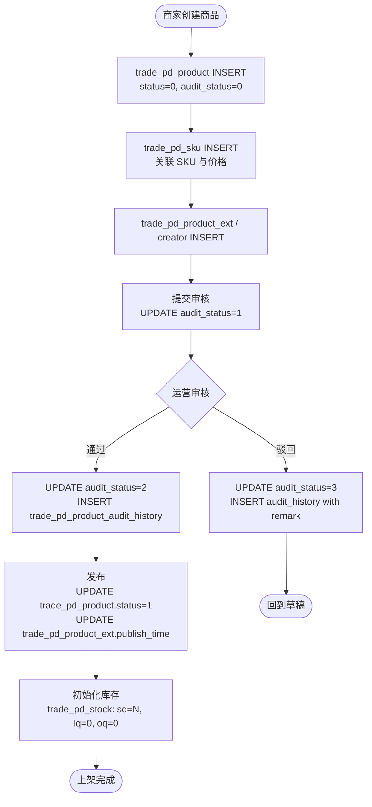

| 阶段 | 操作 | 涉及表 | 数据变动 |
| --- | --- | --- | --- |
| 创建草稿 | 商家创建商品 | `trade_pd_product` | INSERT，status=0（草稿），audit_status=0 |
| | | `trade_pd_sku` | INSERT，关联 SKU 及价格 |
| | | `trade_pd_product_ext` / `trade_pd_product_creator` | INSERT，扩展信息 |
| 提交审核 | 提交审核 | `trade_pd_product` | UPDATE audit_status → 1（审核中） |
| 审核通过 | 运营审核 | `trade_pd_product` | UPDATE audit_status → 2（通过） |
| | | `trade_pd_product_audit_history` | INSERT，记录商品快照 + operation_type=2 |
| 上架 | 发布商品 | `trade_pd_product` | UPDATE status → 1（上架） |
| | | `trade_pd_product_ext` | UPDATE publish_time = now |
| | 初始化库存 | `trade_pd_stock` | INSERT/UPDATE，sq=初始可售数量，lq=0，oq=0 |

---

### 第二步：用户下单（创建订单）

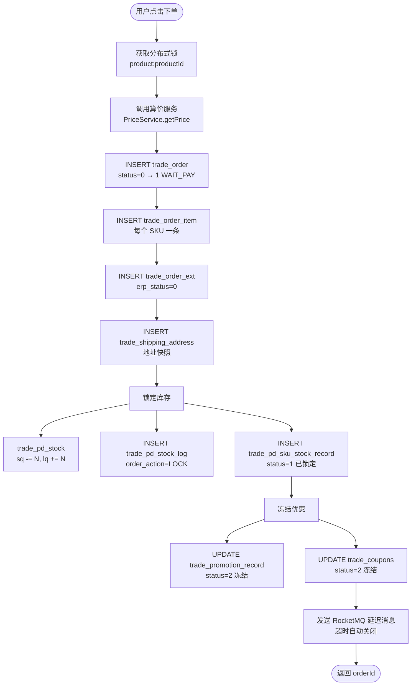

| 阶段 | 操作 | 涉及表 | 数据变动 |
| --- | --- | --- | --- |
| 创建订单 | 生成订单主记录 | `trade_order` | INSERT，status=0（CREATE），含 total_amount / discount_amount / pay_amount / shipping_fee |
| | 生成订单明细 | `trade_order_item` | INSERT，每个 SKU 一条记录 |
| | 生成订单扩展 | `trade_order_ext` | INSERT，erp_status=0（未同步） |
| | 保存收货地址 | `trade_shipping_address` | INSERT，快照用户地址 |
| 锁定库存 | 冻结可售库存 | `trade_pd_stock` | UPDATE sq -= quantity，lq += quantity |
| | 记录锁定流水 | `trade_pd_stock_log` | INSERT，order_action=LOCK，change_qty=+N |
| | 记录预占 | `trade_pd_sku_stock_record` | INSERT，status=1（已锁定） |
| 冻结优惠 | 锁定促销/优惠券 | `trade_promotion_record` | UPDATE status → 2（冻结） |
| | | `trade_coupons`（如有） | UPDATE status → 2（冻结） |
| | 记录折扣信息 | `trade_order.discount_info` | 存储 JSON（discountId / activityId / couponCode / discountValue） |
| 延迟取消 | 发送延迟消息 | — | RocketMQ 延迟消息，超时未支付自动关闭 |

> 订单创建后 status 立即从 0 → 1（WAIT_PAY）。

---

### 第三步：算价逻辑

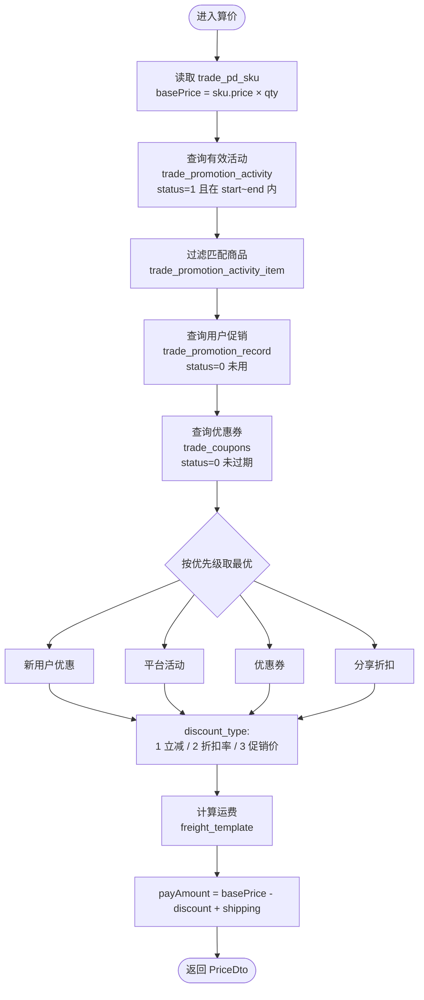

| 步骤 | 读取表 | 逻辑 |
| --- | --- | --- |
| 获取基础价 | `trade_pd_sku` | 取 sku.price × quantity |
| 匹配促销活动 | `trade_promotion_activity` | 查询 status=1 且当前时间在 start_time ~ end_time 内的活动 |
| 匹配活动商品 | `trade_promotion_activity_item` | 确认当前商品/SKU 参与活动 |
| 查询用户促销 | `trade_promotion_record` | 查询 user_id + status=0（可用）的促销记录 |
| 查询优惠券 | `trade_coupons` | 查询 user_id + status=0（未用）且未过期的券 |
| 计算折扣 | — | discount_type: 1 立减 / 2 折扣率 / 3 促销价 |
| 计算运费 | `freight_template` | 根据收货地址匹配运费模板 |
| 最终价格 | — | payAmount = (skuPrice × qty) - discountAmount + shippingFee |

> 折扣优先级：新用户优惠 > 平台活动 > 优惠券 > 分享折扣。取最优单一折扣，不叠加。

---

### 第四步：支付

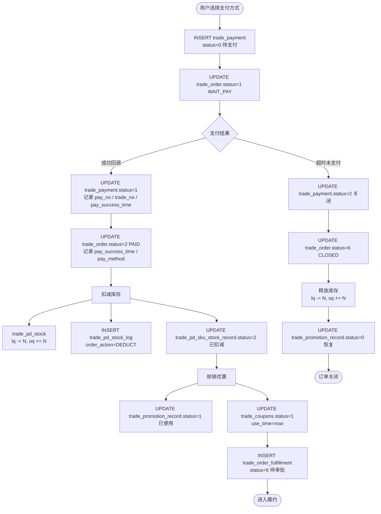

| 阶段 | 操作 | 涉及表 | 数据变动 |
| --- | --- | --- | --- |
| 发起支付 | 创建支付单 | `trade_payment` | INSERT，status=0（待支付），pay_method / pay_amount / expire_time |
| | 更新订单状态 | `trade_order` | UPDATE status → 1（WAIT_PAY） |
| 支付成功回调 | 更新支付单 | `trade_payment` | UPDATE status → 1（已支付），pay_no / trade_no / pay_success_time |
| | 更新订单 | `trade_order` | UPDATE status → 2（PAID），pay_success_time / pay_method |
| | 扣减库存 | `trade_pd_stock` | UPDATE lq -= quantity，oq += quantity |
| | 更新库存流水 | `trade_pd_stock_log` | INSERT，order_action=DEDUCT |
| | 更新预占记录 | `trade_pd_sku_stock_record` | UPDATE status → 2（已扣减） |
| | 使用优惠 | `trade_promotion_record` | UPDATE status → 1（已使用） |
| | | `trade_coupons`（如有） | UPDATE status → 1（已使用），use_time = now |
| | 创建履约单 | `trade_order_fulfillment` | INSERT，status=6（待审批） |
| 支付超时 | 关闭支付 | `trade_payment` | UPDATE status → 2（已关闭） |
| | 关闭订单 | `trade_order` | UPDATE status → 6（CLOSED），cancel_reason |
| | 释放库存 | `trade_pd_stock` | UPDATE lq -= quantity，sq += quantity |
| | 释放优惠 | `trade_promotion_record` | UPDATE status → 0（恢复可用） |

---

### 第五步：履约（生产 → 发货 → 签收）

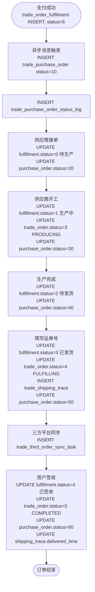

| 阶段 | 操作 | 涉及表 | 数据变动 |
| --- | --- | --- | --- |
| 创建采购单 | 异步消息触发 | `trade_purchase_order` | INSERT，status=10（待处理） |
| | | `trade_purchase_order_status_log` | INSERT，from_status=null → to_status=10 |
| 供应商接单 | 确认可生产 | `trade_order_fulfillment` | UPDATE status → 0（待生产） |
| | | `trade_purchase_order` | UPDATE status → 20（已接受） |
| 开始生产 | 供应商开工 | `trade_order_fulfillment` | UPDATE status → 1（生产中） |
| | | `trade_order` | UPDATE status → 3（PRODUCING） |
| | | `trade_purchase_order` | UPDATE status → 30（生产中） |
| 生产完成 | 供应商完工 | `trade_order_fulfillment` | UPDATE status → 2（待发货） |
| | | `trade_purchase_order` | UPDATE status → 40（已完成） |
| 发货 | 填写运单号 | `trade_order_fulfillment` | UPDATE status → 3（已发货），logistics_no |
| | | `trade_order` | UPDATE status → 4（FULFILLING） |
| | | `trade_shipping_trace` | INSERT，logistics_no / carrier / status |
| | | `trade_purchase_order` | UPDATE status → 50（已发货） |
| | 三方平台同步 | `trade_third_order_sync_task`（如有） | INSERT，task_type=1（发货通知），status=0 |
| 用户签收 | 确认收货 | `trade_order_fulfillment` | UPDATE status → 4（已签收） |
| | | `trade_order` | UPDATE status → 5（COMPLETED），finish_time = now |
| | | `trade_purchase_order` | UPDATE status → 60（已结束） |
| | | `trade_shipping_trace` | UPDATE delivered_time |

---

### 状态机汇总

**trade_order.status 流转：**

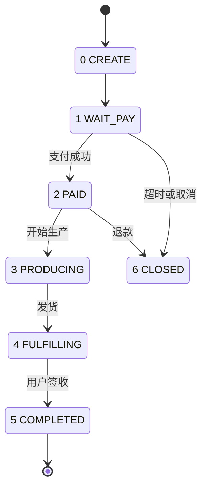

**trade_order_fulfillment.status 流转：**

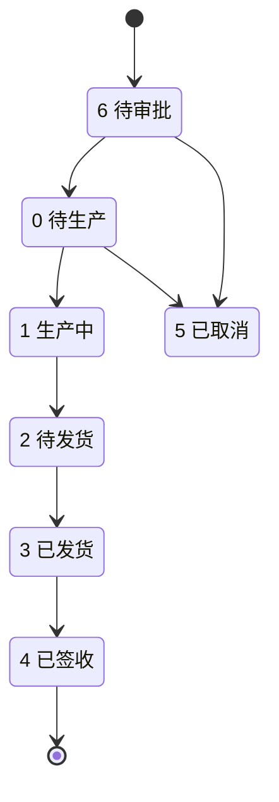

**trade_purchase_order.status 流转：**

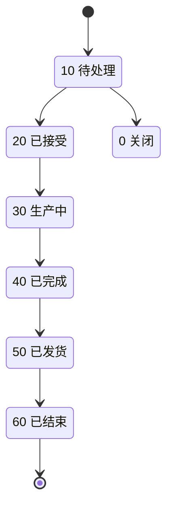

**trade_pd_stock 库存变动：**

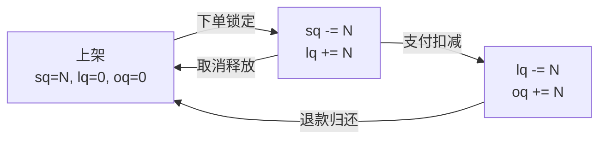

| 动作 | sq 可售 | lq 锁定 | oq 占用 |
| --- | --- | --- | --- |
| 上架 | N | 0 | 0 |
| 下单锁定 | -N | +N | 0 |
| 支付扣减 | 0 | -N | +N |
| 取消释放 | +N | -N | 0 |
| 退款归还 | +N | 0 | -N |

---

## 附二：数据库 E-R 图

按业务域拆分为多张 E-R 图，仅展示主要关系（一对多 `||--o{`，一对一 `||--||`）。

### E-R 图 1：商品域

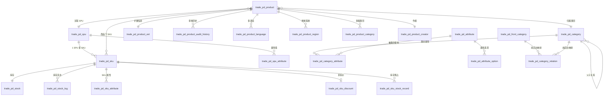

### E-R 图 2：订单域

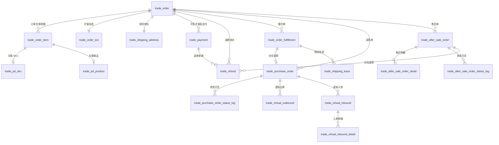

### E-R 图 3：用户/营销域

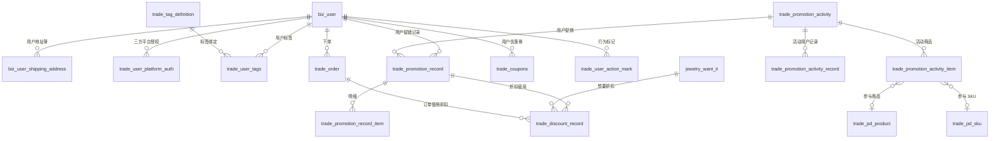

### E-R 图 4：三方订单域（小红书等）

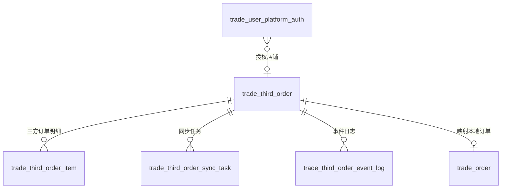

### E-R 图 5：抽盒机（IKJ）域

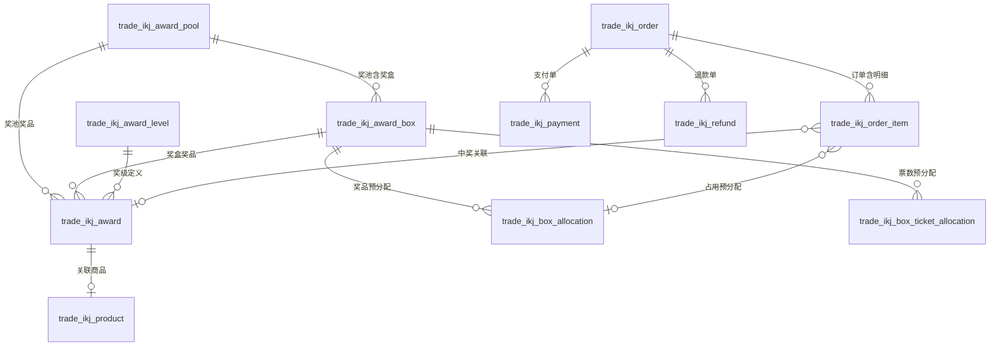

### E-R 图 6：内容/社区域

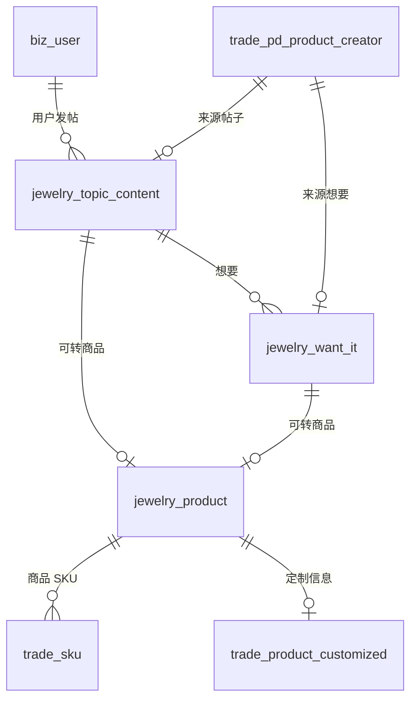

### E-R 图 7：分销与结算

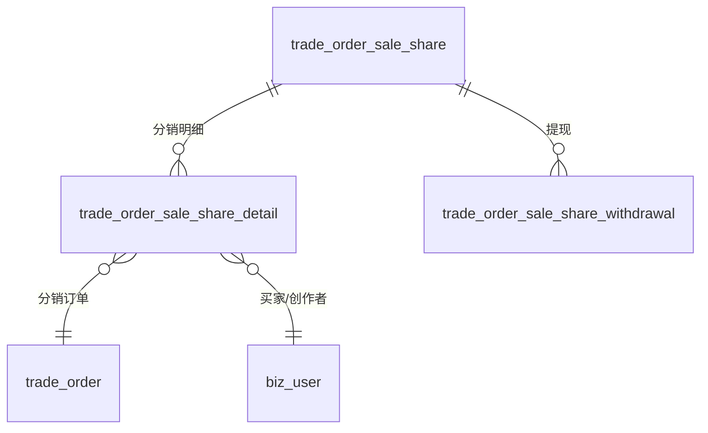

---

## 附三：约定与命名

- 前缀含义
  - `trade_*`：交易系统主力表（订单、商品、促销、售后等）
  - `jewelry_*`：社区/首饰业务域（内容、想要、社区商品）
  - `biz_*`：通用业务实体（用户、地址）
  - `freight_*`：物流/运费
- 时间：`create_time` / `modified_time` 多为 UTC 字符串（`yyyy-MM-dd HH:mm:ss`），部分活动/用户标签表使用 `created_at` / `updated_at` 的 DATETIME。
- 软删：主流使用 `closed`（0/1）；活动类、标签类表采用 `deleted`。
- 状态字段：不同表语义差异较大，请以上表“说明”为准；需交叉校验时建议查看对应 Java `enum`（如 `OrderStatus`、`AfterSaleStatus`、`PurchaseStatus` 等）。

> 若发现字段/状态含义有出入，以代码中 Java DO（`@TableName`/`@TableField`）及 Mapper XML 为准，并同步修订本文档。
