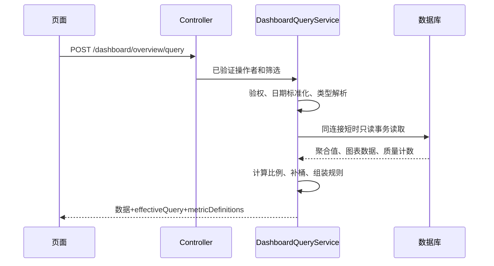
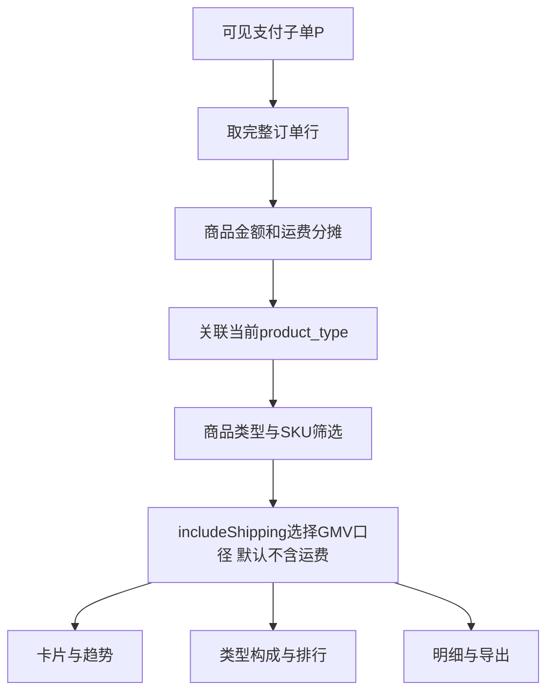

# 电商数据看板技术设计文档

版本：v2.1（数据库直查、商品类型筛选、GMV运费选项与指标解释版）  
更新日期：2026-09-23  
用途：供前后端开发、测试及其他 AI 按同一业务口径实现。本文替代 v1/v2.0，不需要结合聊天记录理解。

## 1. 已确定的约束

1. 前端：`/Users/rogerswang/my/work/FE/website-admin`；看板接口和 SQL：`/Users/rogerswang/my/work/jjewelry/operation-platform`。
2. 订单域：`/Users/rogerswang/my/work/jjewelry/order-java`，仅用于核对数据模型和写入语义；不新增接口、不修改其业务代码。
3. **看板业务数据全部实时查数据库。** 不使用 Redis、Caffeine、浏览器持久化缓存或预聚合快照；不新增 `DashboardSnapshotJob` 和快照表。已有登录基础设施不属于本次改造范围。
4. **商品 GMV 支持 `trade_pd_product.product_type` 单选、多选、全部和未知筛选，并提供“包含运费”选项，默认关闭（扣除运费）。** 参数为 `includeShipping=false`。筛选作用于商品行归属金额，不能选出相关订单后累加整单金额。
5. 图表是分析页主体，表格用于明细和对账。每个可见指标必须有悬停计算规则，包括卡片、图表系列、数据点、表格数值列、同比/环比和派生比例。
6. “已有”指本次本地代码核验结果；“新增/建议”指待开发内容。未连接生产数据库，未确认实际 DDL、索引、数据量或部署版本。
7. 首期经营范围为 `trade_order` 体系，包含该表中的普通、学校、小红书、百度、供应商等订单；独立 IKJ/抽赏订单不混入，UI 明示覆盖范围。众筹 V2 是此范围内的商品和项目维度。
8. 单次查询一个获授权租户、一个部署环境、一种币种。不跨国内/海外库合并、不把多币种相加。币种来自已核实的部署配置，不从租户名猜测。

## 2. 项目事实与数据字典

### 2.1 现有能力

| 项目 | 已有能力 | 本次落点 |
| --- | --- | --- |
| website-admin | Vue 3、TypeScript、Element Plus、ECharts 5、Axios、权限路由 | 复用 HTTP、图表注册和 PermissionEnum |
| op-ms-api | context-path `/op/api`、Token 登录、Controller | 新增 `/dashboard/*`；使用 CommonJsonObject 和 ResponseDataUtil |
| op-service | MyBatis、Repository、现有 OrderMapper 直查 trade_order | 新增专用只读聚合 Mapper，不调用订单 RPC |
| op-job | XXL-Job | 首期无需定时聚合；后续大文件导出才考虑 DB 任务队列 |
| order-java | 交易、商品、支付、退款、库存模型 | 仅作为字段及业务含义核验依据 |

本次读取的本地 HEAD：前端 `d3b3d716`、运营后端 `47f8200f`、订单域 `7fc45d713`。依据为读取时工作区文件，不代表生产已部署版本。

### 2.2 表与事实粒度

| 表 | 关键字段/粒度 | 用途与限制 |
| --- | --- | --- |
| trade_order | 子单 order_id；trade_id、tenant_id、user_id、origin、shop_id、pay_amount、shipping_fee、status、pay_success_time、create_time、closed | 支付事实；pay_amount 含运费；退款后可能 status=6 |
| trade_main_order | 主交易 trade_id；source、pay_amount、shipping_fee、refunded_amount | 对账/交易来源补充，不能与子单金额重复累加 |
| trade_order_item | 商品行 order_item_id；order_id、product_id、sku_id、type、price、quantity、sale_mode、shipping_mode、latest_ship_time | price×quantity 是分摊权重，不直接当实付 GMV |
| trade_pd_product | 商品 product_id；spu_id、category_id、product_type、product_name、sale_mode、channel、closed | 当前类型权威来源，不能用旧 jewelry_product 代替 |
| trade_pd_sku | SKU sku_id；product_id、sku_type | 当前商品域 SKU 元数据；旧 trade_sku 不是统一来源；定制 SKU 可能关联不上 |
| trade_payment | 支付尝试 payment_id；order_id、status、pay_amount、pay_success_time_utc | order_id 可能是 trade_id 或历史子单 order_id，不能无条件 join 子单 |
| trade_refund | 退款 refund_no；order_id、payment_id、after_sale_order_id、status、refund_amount、order_type | 没有独立成功时间，也没有实体级 closed 字段，不能统一套 closed=0 |
| trade_after_sale_order | 售后 after_sale_order_id；order_id、status、after_sale_type、third_refund_time、finish_time、create_time、order_type、closed | 售后状态、原因、退款时间；申请额不等于实际退款 |
| trade_order_ext | 子单扩展 order_id；supplier_id、access_model、free_purchase | 供应商业务等信息，不等于商品类型 |
| trade_pd_stock | 库存桶 sku_id+channel；product_id、sq、lq、oq、closed | 可售=sq−lq−oq；channel 不等于 origin；没有 tenant_id，需独立权限映射 |
| trade_pd_stock_log | SKU渠道流水；order_action、order_action_time、sq、lq、oq | 后续库存趋势重建；不能不分动作累加 change_qty |
| trade_order_fulfillment | 履约行 order_id、order_item_id、logistics_no、status | 一单可多行，避免放大订单数 |
| trade_shipping_trace | 包裹/轨迹 order_id、logistics_no、shipped_time、delivered_time、closed | shipped_time 注释为毫秒；需核验单位、时区、多来源去重 |
| trade_crowdfunding_order | 参与台账 campaign_id、order_id、quantity、state | quantity 是折算实物件数，不等于普通下单件数 |
| trade_promotion_activity / trade_promotion_record | 活动、优惠记录 | 当前 USED 资格状态不能独立证明历史活动成交归因 |

唯一性是实现前需要核验的业务假设：order_id、order_item_id、product_id 等重复时先报告质量问题，禁止随意 MAX 选一条隐藏重复。

### 2.3 商品类型字典

来源：`trade-order-client/.../enums/TradeProductTypeEnum.java`。

| product_type | 枚举 | 展示标签 |
| --- | --- | --- |
| 0 | DEFAULT | 默认 |
| 1 | WANT | 众筹商品（Want It） |
| 2 | TEMPLATE | 模板商品 |
| 3 | SHOP | 商城商品 |
| 4 | CROWDFUNDING | 拼团众筹商品 |
| -1 | 看板派生，不写业务表 | 未知/未关联 |

`product_type` 与 `sale_mode=0/1`（普通/盲盒）独立。商品实体旧注释只列到 3，枚举已包含 4，应以枚举和写入路径为准。

OrderService.buildOrderItem 将下单时 productType 写入订单行 type；**本版按用户要求固定筛选当前 `p.product_type`，不混用 `i.type`**。类型修改后历史分组会变化，tips 必须说明。未来若要“下单时类型”需显式新增口径并升版本，不能静默切换或用 ID 前缀推断。

## 3. 数据库直查架构


运营平台已有直查交易表的 Mapper，优先复用当前可访问业务表的数据源/MyBatis 基础设施。不得默认重建双数据源或引入 Hikari：现有配置存在 Druid，应保持工程习惯。若已有只读副本，可将看板 Mapper 显式绑定只读连接；没有时使用当前库并限制负载，不假定副本存在。

看板 Mapper 仅提供 SELECT，不继承带写操作的业务 Repository，不把现有数据源全部改成只读而破坏运营功能。新增只读账号和连接是部署事项，本次未执行。



单个页面主接口尽量在同连接、短时只读事务内完成。InnoDB REPEATABLE READ 的一致视图从首次一致性读建立；仅 readOnly=true 不自动保证一致视图，需核验事务管理器和隔离级别。后续下钻属于新查询，不承诺历史快照一致。

响应提供 queriedAt、queryId、readConsistency。queriedAt 是查询时间，不代表支付渠道事件完整性时间；副本延迟未知返回 null，不虚构零延迟。

无缓存下的限制：

- 默认近7天，日粒度最多93天；小时粒度最多7天；月粒度最多24个月，长窗口须先压测。
- 总览一次返回卡片、趋势、类型及排行，避免一张卡片一次扫库；其他页面进入后查询。
- 批量 SQL 聚合，禁止按日期/商品/用户循环查库。
- 默认手动刷新，可选60秒刷新；隐藏页面暂停，单页仅一个在途刷新。
- 前端取消请求不保证 DB 中止，必须配置 SQL 超时、连接池和实例并发闸门；多实例总并发=实例数×单实例上限。
- 建议起始参数：SQL 5秒、接口15秒、看板单实例并发4，均为压测起点而非已验证结果。
- 超时/过载显示失败及缩小范围建议，不回退缓存、旧数据、全表扫描或伪造0。

## 4. 统一筛选、时间与事实集合

### 4.1 请求契约

```json
{
  "tenantId": "ZHW",
  "startDate": "2026-09-01",
  "endDate": "2026-09-23",
  "timezone": "Asia/Shanghai",
  "origins": [0, 2, 4],
  "shopIds": [],
  "productTypes": [2, 3],
  "includeShipping": false,
  "productIds": [],
  "skuIds": [],
  "saleModes": [],
  "granularity": "DAY",
  "compareMode": "PREVIOUS_PERIOD"
}
```

| 参数 | 规则 |
| --- | --- |
| tenantId | 单租户必填，服务端验证授权，不能直接信任请求头 |
| startDate/endDate | 本地起止自然日，结束日包含；服务端转 `[startUtc,endExclusiveUtc)` |
| timezone | 入参优先，其次现有tz请求头，最后部署默认；验证ZoneId |
| productTypes | null/[]=全部含未知；[-1]=未知；[0]=默认类型不是全部；其他非法值拒绝 |
| includeShipping | Boolean；缺省或null归一为false（默认扣除运费），true为包含运费；字符串、数字等非法类型拒绝。后端默认值不可只依赖前端 |
| origins/shopIds | 订单维度，受授权约束；不能用空授权集合放宽成全部 |
| productIds/skuIds/saleModes | 与productTypes采用AND，同数组内部OR；数组数量设上限 |
| granularity | HOUR/DAY/MONTH，遵守窗口限制 |
| compareMode | NONE/PREVIOUS_PERIOD/YEAR_OVER_YEAR；相同非时间筛选与includeShipping值重新查DB |

北京时间2026-09-01自然日对应UTC `[2026-08-31 16:00:00,2026-09-01 16:00:00)`，禁止使用23:59:59边界漏掉小数秒。

今日未结束时结束点取当前时刻，对比也按同一本地日内进度截断；环比为等长前置自然日区间；同比为上一年对应本地日期，2月29日映射上一年2月末日。具体对比UTC起止在响应和tips回显。WHERE不对索引时间列套DATE/CONVERT_TZ；分组可一次传入由服务端计算的UTC桶边界。

### 4.2 事实集合

`O`：trade_order.closed=0 且满足授权租户、origin、shop筛选。tenant_id缺失不自动归ZHW，统计质量数量并排除。

`P`：O中 pay_success_time有效且在支付窗口内，pay_amount>0 的已付子单。退款关闭status=6仍保留历史支付；禁止用status IN(2,3,4,5,7)代替支付事实。零元支付不计本版付费交易、买家和件数，后续独立展示。

已付状态但没有有效支付时间的记录不猜归属日期，返回MISSING_PAID_TIME质量提示。三方来源指标以本系统订单记录为准，不宣称是第三方零售平台的完整GMV。

交易键=`COALESCE(NULLIF(trade_id,''),order_id)`；本版单租户下去重。未来跨租户需加tenant_id。主单缺失时一个历史子单视作一笔交易并披露兼容口径。主单金额与子单金额不能一起SUM。

交易数按交易键、子单数按order_id、买家数按非空user_id、下单件数按quantity。端盒不展开履约SKU；众筹台账折算实物件数是另一指标。

### 4.3 商品维度关联

```sql
LEFT JOIN trade_pd_product p ON p.product_id = i.product_id
```

历史交易关联商品时不加p.closed=0或p.status=1，否则下架/删除商品的历史销售会丢失。关联失败、类型NULL或不在0..4归-1未知，并保留质量提示。名称优先订单行product_name；SKU关联不上仍保留成交。

商品筛选必须覆盖商品GMV、支付归属金额、交易/子单/买家/件数、趋势、构成、排行、下钻、导出。库存为独立当前状态，使用stockChannels和授权映射；不能仅靠销售历史反推全部库存租户归属。

## 5. 金额计算：完整分摊、商品类型筛选与运费选项

### 5.1 定义

```text
P_o = trade_order.pay_amount               # 含运费支付额
F_o = trade_order.shipping_fee             # 运费
B_o = P_o - F_o                            # 固定不含运费的商品实付额
G_o = includeShipping ? P_o : B_o          # 当前GMV口径，默认B_o
W_i = trade_order_item.price × quantity    # 行原始金额权重
```

将基础金额与可选GMV分开：`goodsPaidAmount`固定为不含运费商品实付，`shippingAmount`为运费归属额，`paidAmount`固定为含运费支付归属额。`productGmv`随本次请求选项计算：

```text
includeShipping=false（默认）：productGmv = goodsPaidAmount
includeShipping=true：         productGmv = paidAmount
始终成立：                     paidAmount = goodsPaidAmount + shippingAmount
```

前端开关标签为“GMV包含运费”，默认未勾选。卡片/图表/表列名称必须标“商品GMV（不含运费）”或“商品GMV（含运费）”，不能仅改数值而隐藏口径。优惠已反映在pay_amount，不再次扣discount_amount；无论选项如何，退款均不回减历史GMV。

选项作用于所有GMV卡片、GMV趋势、类型/来源构成、商品/SKU的GMV排序和占比、GMV同比环比、下钻及导出。选项不改变订单筛选集合、数量、退款、固定支付额、固定商品实付额、运费、库存或履约指标；`averageTradeValue/averageBuyerValue`始终以含运费paidAmount为分子，名称及tips标注“含运费”，不能随GMV选项暗改。

每个新页面初次打开默认false，跨页面下钻保留显式选择；不从上一次浏览器持久化缓存自动恢复true。服务端独立设置默认值并在effectiveQuery中回显。对比区间与当前区间必须使用同一includeShipping值。

运费NULL历史记录按0处理并返回NULL_SHIPPING_ASSUMED_ZERO。P_o/F_o/B_o负值不截断0：金额指标排除异常单并标PARTIAL、记录排除数，订单计数仍按P。币种/最小精度未核实则金额指标不开放；示例为CNY、两位小数。转换分之前校验金额能精确表达为整数分；存在超出币种精度的金额时报告质量问题，不静默舍入源金额。

### 5.2 分摊算法

1. 对P中每个子单取得全部有效行（i.closed=0），此时不按商品类型、商品或SKU过滤。
2. 每行price非负、quantity为正且ΣW_i>0时按W_i分摊；全部价格为0且数量有效则令W_i=quantity再分摊。缺价格、负价格或非法数量时整单金额进入“未分配”虚拟行，类型-1、quantity=0、状态PARTIAL，并记录被排除的数量样本；不根据错误权重产生看似准确的单品金额。
3. 转最小货币单位整数。按order_item_id升序，前n−1行分配floor(B_o_cent×W_i/ΣW_i)，末行承接尾差；运费同理。行goodsPaidCent是固定商品实付分摊，行paidCent=goodsPaidCent+shippingCent。SQL用DECIMAL，禁止浮点运算；不针对开关重复分配整单支付额，以免两种口径出现尾差漂移。
4. 没有有效行时也生成一条虚拟行承接B_o/F_o，件数0；交易、子单不能静默丢失。虚拟行无productId/skuId/saleMode，在指定这些条件时不匹配。
5. 分配后关联p.product_type并执行商品筛选；对选中行计算productGmvCent = includeShipping ? paidCent : goodsPaidCent，再汇总。不能以筛选后商品行作为分母重新分配整个子单金额，也不能给选中类型附加整单运费。
6. 单有效行直接承接B_o/F_o，不先四舍五入单位实付再乘数量。

规范行集合`L`是查询中间结果，不是新表，字段包含：tenantId、tradeKey、orderId、orderItemId、userId、origin、shopId、productId、skuId、productType、saleMode、paidAt、quantity、goodsPaidCent、shippingCent、paidCent，以及按请求派生的productGmvCent。



### 5.3 算例

子单支付110、运费10；A模板权重60，B商城权重40。

| 商品类型筛选 | 默认GMV（includeShipping=false） | 含运费GMV（includeShipping=true） | 运费归属 | 固定支付归属额 | 交易数/子单数 |
| --- | ---: | ---: | ---: | ---: | ---: |
| 全部 | 100 | 110 | 10 | 110 | 1/1 |
| [2] | 60 | 66 | 6 | 66 | 1/1 |
| [3] | 40 | 44 | 4 | 44 | 1/1 |
| [2,3] | 100 | 110 | 10 | 110 | 1/1 |

相同includeShipping值下类型金额可加；类型交易数和买家数不可直接相加。时间范围买家数也不能用每天去重人数相加。

跨订单运费比例不同，切换选项可能改变GMV排名和占比。例如模板商品实付60、运费6，商城商品实付40、运费20：不含运费时模板占60/100=60%；包含运费时占66/126≈52.380952%。切换后必须重新计算GMV相关占比、排行和对比，不能沿用旧分母。

### 5.4 退款单独建模

trade_refund.status=3 对应订单域 Order.RefundStatus.COMPLETED，不是IKJ另一个RefundStatusEnum。本次读到微信回调存在先写完成状态，再按SUCCESS/CLOSED/ABNORMAL分支的代码，因此只看r.status=3不足以确认成功。

本版“已确认退款”条件：r.order_type=1且r.status=3，按after_sale_order_id唯一关联售后单，售后status=3、after_sale_type IN(1,2,3)、order_id一致；按refund_no去重一次。补发不计退款；NULL order_type、缺售后或不一致状态进待核对数量，不自动当成功。售后closed历史含义需抽样核验，不统一强加closed=0。

退款时间优先有效third_refund_time，其次有效finish_time；均缺失则排除期间指标并报告缺时间金额。历史迁移代码存在用modified_time回填这两个时间的路径，因此名称是“本地确认退款”，不是支付渠道账单对账结果，tips披露历史时间精度。

- periodRefundAmount：退款完成落在所选区间，原支付可以在区间外。
- cohortRefundOrderRate：支付落在所选区间的子单中，截至查询已确认退款的去重子单占比；部分退款也计一单。

商品筛选下，退款先取相关子单全部行，用本章模型计算每行paidCent占比，再按该比例分配每笔含运费退款，尾差给末行，最后过滤。无有效行同样归未知。此值为“退款分摊额”，不等于精确单品实际退款。不得把Long类型、语义不明确的refund.order_item_id直接等同业务order_item_id。

periodNetReceipt=paidAmount−periodRefundAmount，名为“期间净收款（本地确认）”，允许负数；includeShipping开关不影响此公式，也不改变退款分摊权重。不得拿含运费退款减不含运费商品GMV形成所谓净GMV；商品/运费退款拆分、成本不足时不展示商品净GMV或利润。

## 6. 指标目录：每个指标的公式与tips正文

以下均使用有效筛选和相应事实时间。后端定义还需附实际日期、时区、类型筛选、includeShipping有效值、口径版本及质量原因。所有业务计数仅针对授权范围。

### 6.1 交易与商品

| metricCode | 名称 | 公式及tips必须说明的规则 |
| --- | --- | --- |
| productGmv | 商品GMV（不含运费/含运费） | includeShipping=false默认取ΣgoodsPaidCent/100；true取ΣpaidCent/100；优惠后、不扣退款；按支付时间、当前商品类型；tips必须显示实际选项 |
| goodsPaidAmount | 商品实付额（固定不含运费） | Σ选中行goodsPaidCent/100；不随includeShipping变化，作为固定基础金额与对账项 |
| paidAmount | 含运费支付归属额 | Σ选中行paidCent/100；商品+运费归属额；商品筛选后不是整笔交易收款 |
| shippingAmount | 运费归属额 | ΣshippingCent/100；按完整子单商品权重分摊，只累计选中行 |
| paidTradeCount | 支付交易数 | COUNT DISTINCT tradeKey；购物车只计一笔；跨类型不可加 |
| paidOrderCount | 支付子单数 | COUNT DISTINCT orderId；多行商品不重复计数 |
| paidBuyerCount | 支付买家数 | COUNT DISTINCT非空userId；区间独立去重，不加每日人数 |
| paidQuantity | 支付下单件数 | Σ有效quantity；不展开盲盒、不使用众筹折算实物数；异常行排除并计数 |
| averageTradeValue | 交易均额（含运费） | paidAmount/paidTradeCount；分母不是买家；筛选后是选中商品对每笔交易的金额贡献 |
| averageBuyerValue | 买家客单价（含运费） | paidAmount/paidBuyerCount；缺userId导致分母不全则PARTIAL |
| productTypeShare | 类型GMV占比 | 本类型productGmv/当前筛选总productGmv；全部含未知；显示分子分母 |
| topProductShare | 商品GMV占比 | 本商品productGmv/当前筛选总productGmv；不能拿TopN合计当分母 |
| comparisonRate | 环比/同比变化 | (本期−对比期)/ABS(对比期)；同口径同筛选；基数0返回null和“无可比基数” |

金额用BigDecimal/DECIMAL，输出十进制字符串；比例保留至少6位再展示。分母0返回null、UNAVAILABLE、ZERO_DENOMINATOR，不是0%或Infinity。查询成功且确实无匹配事实才返回0；系统故障不能当无数据。

### 6.2 用户和售后

| metricCode | 名称 | 公式及tips必须说明的规则 |
| --- | --- | --- |
| newBuyerCount | 首购买家数 | 当前买家中，租户内历史首次付费交易在区间内的人数；历史查询不按商品/渠道缩小 |
| returningBuyerCount | 老买家数 | 当前买家首次付费早于起点人数；不是注册新老用户 |
| repeatBuyerCount | 区间重复购买人数 | 区间内匹配至少2个不同tradeKey的买家；同购物车多子单不算复购 |
| repeatBuyerRate | 区间重复购买率 | repeatBuyerCount/paidBuyerCount，不等于留存或历史复购率 |
| periodRefundAmount | 期间退款分摊额 | 本期已确认退款含运费归属额；可能来源于前期支付；按商品分摊不是精确单品退款 |
| cohortRefundOrderRate | 支付子单退款率 | 本期支付群组中截至查询已确认退款的去重子单/该群组支付子单；部分退款计一单 |
| periodNetReceipt | 期间净收款（本地确认） | paidAmount−periodRefundAmount；支付/退款各按发生时间，允许负数，不是利润 |
| afterSaleApplyCount | 售后申请单数 | create_time在区间的去重售后单；商品筛选用关联子单匹配行EXISTS，不展开重复计数 |
| afterSaleSuccessCount | 申请群组成功单数 | 与申请同群组，截至查询status=3；补发成功不等于退款 |
| afterSaleSuccessRate | 申请群组成功率 | success/apply；近期未结束售后会影响当前比例 |
| refundProcessHours | 平均退款处理时长 | 已确认退款群组中，售后申请到退款完成非负小时差均值；售后单去重；返回有效/排除样本数 |

历史覆盖不全时首购/老客指标PARTIAL或UNAVAILABLE，不能把数据起始日当全站上线日。仅对当前买家集合批量查全历史首购，但不得截断历史日期。每桶新老买家按该桶起止分类；区间汇总重新分类、去重，不累加每日结果。

### 6.3 库存和履约

库存为当前状态，独立筛选stockChannels/productTypes/productIds/skuIds，不适用交易日期、origin、shopIds，UI明确标注不适用，禁止静默忽略筛选。

| metricCode | 名称 | 公式及tips必须说明的规则 |
| --- | --- | --- |
| saleStock | 销售库存 | Σsq，粒度sku_id+channel；不是ERP实物库存或资产金额 |
| lockedStock | 锁定库存 | Σlq，待支付等业务锁定数量 |
| occupiedStock | 占用库存 | Σoq，占用/已用数量，与lq不重叠 |
| availableStock | 可售库存 | Σ(COALESCE(sq,0)−COALESCE(lq,0)−COALESCE(oq,0))；负值保留，NULL标质量提示 |
| lowStockBucketCount | 低库存SKU渠道数 | 可售在[0,threshold)的库存桶数；阈值来自配置，负库存独立统计 |
| negativeStockBucketCount | 负库存SKU渠道数 | 可售<0的库存桶数，不截断0隐藏异常 |
| awaitingShipmentCount | 支付群组未发货子单 | 本期支付群组当前status IN(2,3)的去重子单；不是全站积压或历史状态 |
| shipmentHours | 平均首次发货时长 | 首包发货−支付的非负小时差，按子单平均；未发货/无时点/负时长排除 |
| deliveryHours | 平均包裹运输时长 | (order_id,logistics_no)去重的签收−发货均值；不以订单完成时间当签收 |

物流上线前核验shipped_time毫秒单位、delivered_time时区、多来源轨迹。验证失败只开放状态图，时长UNAVAILABLE。状态分布数量、退款原因数量、图中样本覆盖率也必须注册metricCode或复用已有指标+groupBy，不能出现无定义数值。

图表专用计数也按以下定义注册，不能只使用一个没有含义的`count`：

| metricCode | 图中用途 | 规则 |
| --- | --- | --- |
| orderStatusCount | 销售/履约状态分布 | 对匹配支付群组按当前trade_order.status分组，COUNT DISTINCT order_id；状态0..7使用订单枚举，未知独立一组，不把退款中合并为已退款 |
| afterSaleReasonCount | 售后原因分布 | 同一申请窗口、普通订单售后、匹配子单范围，按apply_reason_type分组，COUNT DISTINCT after_sale_order_id；NULL/无法识别归未知 |
| afterSaleStatusCount | 售后状态环图 | 同一申请群组按当前售后status分组，去重售后单数；分母为同群组全部申请数 |
| shipmentDurationBucketCount | 首包时长分布 | 已核验首包且非负时长的支付群组子单，按第7.2节半开时长桶分组，COUNT DISTINCT order_id；不将未发货放入最长时长桶 |
| sampleCoverageRate | 时效数据覆盖率 | 有效时点样本数/当前匹配支付群组对应粒度的候选样本数，返回分子分母；子单时长按子单、运输时长按去重包裹分别计算 |

质量数量只覆盖本次授权范围。例如unknownProductLineCount为L中当前类型未知的行数，unallocatedOrderCount为进入虚拟行的去重子单数，excludedAmountOrderCount为金额异常子单数；详细诊断同样不能返回其他租户数据。质量计数自身也在tips里说明诊断范围，不冒充全站历史数据质量。

流量UV/PV、转化漏斗、ROAS、利润、营销订单归因、库存历史余额、用户cohort暂不作为可用指标发布；接入可靠事实后按同模板新增。

## 7. 图表页面设计

### 7.1 总览布局

```text
┌─────────────────────────────────────────────────────────────────────┐
│ 电商数据看板 [覆盖范围/币种]             查询于 xx:xx       [刷新]   │
├─────────────────────────────────────────────────────────────────────┤
│ 日期 | 租户 | 来源 | 店铺 | 商品类型多选 | 商品/SKU | 普通/盲盒       │
│ GMV包含运费 [关闭，默认扣除运费]                                    │
├───────────────┬───────────────┬───────────────┬───────────────────────┤
│ 商品GMV ⓘ    │ 支付交易数 ⓘ │ 支付买家数 ⓘ │ 买家客单价 ⓘ          │
│ 环比 ⓘ       │ 环比 ⓘ       │ 环比 ⓘ       │ 环比 ⓘ                │
├───────────────────────────────────┬─────────────────────────────────┤
│ 商品GMV趋势/对比 折线图 ⓘ         │ 商品类型GMV构成 环图 ⓘ          │
├───────────────────────────────────┼─────────────────────────────────┤
│ 商品类型GMV趋势 堆叠柱 ⓘ          │ 来源GMV 水平条形图 ⓘ            │
├───────────────────────────────────┼─────────────────────────────────┤
│ 商品Top10 水平条形图 ⓘ            │ 交易数/买家数 趋势图 ⓘ          │
├───────────────────────────────────┴─────────────────────────────────┤
│ 数据质量提示、统计口径版本、明细入口、当前明细导出                    │
└─────────────────────────────────────────────────────────────────────┘
```

首期总览至少六张分析图。所有GMV图形标题/轴/表列联动显示含运费或不含运费口径；示意图中的“商品GMV”是标题占位，实际不能省略口径标识。卡片第二行可扩展固定支付额、退款、净收款；不为凑图表添加无埋点漏斗。

### 7.2 图表清单

| chartId/页面 | 图形 | 轴、系列与点击行为 |
| --- | --- | --- |
| salesTrend/总览 | 多折线 | X时间桶、Y商品GMV，本期对比期同单位；点桶按支付时间下钻 |
| productTypeShare/总览 | 环图 | 扇区product_type、值商品GMV，含未知；单选类型显示100%；点击追加筛选 |
| productTypeTrend/总览 | 堆叠柱 | X日期、系列product_type、Y商品GMV，类型合计等于当天GMV |
| originRank/总览 | 水平条 | 来源与商品GMV；点击来源联动 |
| productRank/总览、商品 | 水平条 | Top10商品GMV，可切下单件数；点击productId下钻，不同单位不共轴 |
| buyerTradeTrend/总览 | 双折线 | X时间桶，支付交易数/买家数，每桶独立去重 |
| orderStatus/销售 | 分组柱 | 支付群组的当前状态分布，含退款关闭；标题标“当前”，不用漏斗表达 |
| skuRank/商品 | 水平条 | SKU金额/数量切换，下方分页表对账 |
| newReturningTrend/用户 | 堆叠柱 | 每桶新老支付买家，区间汇总独立去重 |
| repeatBuyerTrend/用户 | 折线 | 每桶重复购买率，显示分子分母，不平均日比率当区间率 |
| refundTrend/售后 | 柱状 | X退款发生日、Y退款分摊额；待核对金额独立提示 |
| afterSaleReason/售后 | 水平条 | 同一申请群组按原因，缺原因归未知；点原因下钻 |
| afterSaleStatus/售后 | 环图 | 同一申请群组当前状态数量，每个系列可查看规则 |
| stockStructure/库存 | 堆叠柱 | SKU+渠道的可售/lq/oq；只对非负完整桶展示，负库存另列 |
| lowStockRank/库存 | 水平条 | 可售升序的SKU渠道，参考线标阈值 |
| fulfillmentStatus/履约 | 柱状 | 支付群组当前未发货/发货/完成状态 |
| shipmentDuration/履约 | 分布柱 | 有效首包发货时长分桶[0,24)、[24,48)、[48,72)、[72,+∞)小时 |

首批完成前六张；其他随模块上线。现有src/plugins/echarts.ts已注册Line、Bar、Pie、Tooltip、DataZoom等；只有后续确需Heatmap等类型时补按需注册，不另引图表库。

### 7.3 图形一致性

- 类型使用固定色板、未知灰色；筛选后同类型不变色。
- 切换includeShipping作为一次新查询，通过请求取消与requestSeq防止前一口径晚响应覆盖；GMV数值、标题、tips、排行、占比分母及同比环比必须同时更新。数量类结果保持同一事实范围，不因切换金额口径改变。
- 成功查询无事实的时间桶补0，缺数据/不可计算为null和断线；时间桶由后端按时区生成。
- 负净收款采用能显示负值的折线/柱图；GMV=0时环图空态，不伪造占比。
- TopN同值按业务ID稳定排序；占比分母是全部金额，其他=完整结果−TopN。
- 查询按钮或300ms防抖；AbortController与requestSeq共同避免旧响应覆盖新结果。
- 组件负责resize/dispose；切换筛选期间旧数据不能标为新条件结果；失败显示重试。
- 页脚保留有效筛选、queryId、查询时间、口径版本；表格为明细，不替代核心图。

## 8. 所有指标tips的统一实现

### 8.1 唯一规则来源

后端新增MetricDefinitionRegistry，维护代码、名称、公式、单位、时间基准、来源、排除项、版本。它是代码契约，不缓存统计结果。计算与定义按metricCode/version绑定，前端不能独立写另一套公式。productGmv及其占比、变化率的定义按effectiveQuery.includeShipping解析为本次实际公式，不能给含运费结果仍返回“不含运费”的静态说明。

```ts
interface MetricDefinition {
  code: string;
  name: string;
  unit: "CURRENCY" | "COUNT" | "RATIO" | "HOUR";
  formula: string;
  grain: string;
  timeBasis: "PAID_AT" | "REFUND_AT" | "CREATED_AT" | "CURRENT";
  sourceFields: string[];
  filters: string[];
  exclusions: string[];
  zeroDenominatorRule: string;
  productTypeBasis: "CURRENT_PRODUCT_TABLE" | "NOT_APPLICABLE";
  shippingBasis: "EXCLUDED" | "INCLUDED" | "NOT_APPLICABLE";
  notes: string[];
  version: string;
}
interface MetricValue {
  metricCode: string;
  value: string | number | null;
  numerator?: string | number | null;
  denominator?: string | number | null;
  availability: "AVAILABLE" | "PARTIAL" | "UNAVAILABLE";
  reasonCodes: string[];
  definitionVersion: string;
  sampleCount?: number;
  excludedCount?: number;
}
```

shippingBasis描述该指标实际金额基准：productGmv及其派生指标按开关为EXCLUDED/INCLUDED，paidAmount及两个均额始终INCLUDED，goodsPaidAmount始终EXCLUDED；数量/库存等为NOT_APPLICABLE。

金额是十进制字符串、数量是安全整数、比例是小数字符串不是带%的文本；变化率可为负或大于1。ECharts坐标可转Number近似显示，金额tooltip仍显示原始字符串，不在前端计算财务合计。

### 8.2 所有入口覆盖

| 入口 | 必需行为 |
| --- | --- |
| 卡片 | 名称和ⓘ悬停/键盘聚焦展示公式、窗口、过滤、排除项、版本 |
| 图表标题/系列 | ⓘ解释全部metricCodes，多系列不能只解释第一条 |
| 数据点 | ECharts tooltip展示时间/维度、实际值、计算规则；比率含本点分子分母 |
| 表格 | 数值列表头ⓘ有规则，数值单元格hover包含本行计算口径与异常原因 |

复用MetricHelp.vue+Element Plus el-tooltip；约200ms延迟、360px宽、键盘可聚焦，移动端可点击。纯文本/安全模板渲染，数据库商品名不能拼未转义HTML。

默认includeShipping=false的示例：

> 商品GMV=所选商品行分摊后的实付商品金额之和。已扣优惠，不含运费，不扣退款。按支付成功时间，包含支付后退款关闭订单，不含零元支付。类型使用商品表当前product_type；混合商品订单先分摊再筛选。本次：模板、商城；时区Asia/Shanghai；区间2026-09-01至2026-09-23；口径commerce.v2.1。

includeShipping=true时的示例：

> 商品GMV（含运费）=所选商品行实付商品金额+运费分摊额。已扣优惠，包含运费，不扣退款；同一子单按完整商品行分摊后再筛选。本次“GMV包含运费”已开启。商品类型、支付时间和事实范围与默认模式相同。

缺metricDefinition必须使验收失败；生产缺定义显示“计算规则未加载”并上报，不能静默不显示tips。导出附同版本规则说明、includeShipping值及中文口径，GMV列名含口径；图形截图/下载附筛选、含运费状态及版本脚注。

## 9. 接口契约

以下均为/op/api下的相对路径，Controller不重复context-path。使用CommonJsonObject<T>/ResponseDataUtil.buildSuccess，不自创外层格式。

| 方法/路径 | 内容 | 约束 |
| --- | --- | --- |
| GET /dashboard/meta | 筛选字典、可用模块、metricDefinitions、默认includeShipping=false | 类型来自枚举；动态店铺选项查DB并验权；提供GMV两种公式模板，页面数据接口返回本次解析后的定义 |
| POST /dashboard/overview/query | 卡片、六图、有效条件、质量统计 | 页面级主接口 |
| POST /dashboard/sales/query | 趋势、当前订单状态 | 支付时间口径不混成创建时间 |
| POST /dashboard/products/query | 商品/SKU排行和分页 | 共用完整分摊规则 |
| POST /dashboard/users/query | 新老客和区间复购 | 首购回查覆盖历史，受超时保护 |
| POST /dashboard/refunds/query | 退款、售后原因和状态 | 退款窗口和申请窗口分别说明 |
| POST /dashboard/inventory/query | 当前库存和低库存排行 | 独立InventoryQuery，不冒充历史库存 |
| POST /dashboard/fulfillment/query | 当前状态、已核实的时效 | 未核实时点则时长不可用 |
| POST /dashboard/orders/page | 子单分页及匹配商品行金额 | 子单只一条，区分matchedAmount与orderAmount |
| POST /dashboard/export | 当前明细CSV/XLSX流 | 首期最多1万行，超限缩小范围；重新查DB |

总览data片段（仅示意数值，非真实经营数据）：

```json
{
  "queryId": "dashboard-example-001",
  "queriedAt": "2026-09-23T07:00:00Z",
  "readConsistency": "REQUEST_TRANSACTION",
  "replicaLagSeconds": null,
  "metricVersion": "commerce.v2.1",
  "currency": "CNY",
  "effectiveQuery": {
    "tenantId":"ZHW", "productTypes":[2,3], "includeShipping":false,
    "productTypeBasis":"CURRENT_PRODUCT_TABLE", "timezone":"Asia/Shanghai",
    "startUtc":"2026-08-31T16:00:00Z", "endExclusiveUtc":"2026-09-23T07:00:00Z"
  },
  "metrics": [
    {"metricCode":"productGmv","value":"100.00","availability":"AVAILABLE","reasonCodes":[],"definitionVersion":"commerce.v2.1"},
    {"metricCode":"goodsPaidAmount","value":"100.00","availability":"AVAILABLE","reasonCodes":[],"definitionVersion":"commerce.v2.1"},
    {"metricCode":"shippingAmount","value":"10.00","availability":"AVAILABLE","reasonCodes":[],"definitionVersion":"commerce.v2.1"},
    {"metricCode":"paidAmount","value":"110.00","availability":"AVAILABLE","reasonCodes":[],"definitionVersion":"commerce.v2.1"},
    {"metricCode":"paidTradeCount","value":1,"availability":"AVAILABLE","reasonCodes":[],"definitionVersion":"commerce.v2.1"}
  ],
  "charts": [],
  "metricDefinitions": [],
  "quality": {"unknownProductLineCount":0,"unallocatedOrderCount":0,"excludedAmountOrderCount":0}
}
```

示例缩略了charts/metricDefinitions；实际必须填充已展示图与指标定义。图形DTO为chartId+metricCodes+points，point含时间桶、dimensionCode/Label、MetricValue，后端不生成ECharts option。

例如默认不含运费时productTypeShare中的模板扇区，应返回dimensionCode=`2`、dimensionLabel=`模板商品`、productGmv=`60.00`，以及productTypeShare.value=`0.600000`、numerator=`60.00`、denominator=`100.00`；这两个metricCode均须关联本版MetricDefinition。前端直接显示“60.00元，60.00%；60.00÷100.00”，不能根据屏幕上可见扇区重新计算分母。第5.3节同单示例开启运费后，模板GMV为66.00、分母110.00，仍为60%；不同订单的运费比例不同则占比按新分母重算。返回effectiveQuery.includeShipping=true及对应shippingBasis，固定paidAmount/goodsPaidAmount/shippingAmount和交易数不变。

下钻请求带metricCode、drilldownBasis、bucketBounds、dimensionFilters及includeShipping；导出也显式传同一includeShipping值，漏传按false处理，前端必须保证口径透传；退款图按退款发生窗口追溯子单，售后图按申请窗口，库存图打开库存明细。服务端白名单映射SQL，不能拿同一支付窗口查询覆盖全部下钻，也不能拼任意字段。

参数非法、日期过大、越权、超时、繁忙、来源未接入各有稳定reasonCode。无分母是指标UNAVAILABLE，不使整页失败；DB故障不能返回成功+0。前端检查业务成功码，现有拦截器弹出错误提示不保证Promise被拒绝。

## 10. 实现结构与SQL规则

### 10.1 文件计划

```text
website-admin/src/
  router/modules/dashboard.ts
  views/dashboard/
    overview/index.vue, sales/index.vue, products/index.vue
    users/index.vue, refunds/index.vue, inventory/index.vue
    fulfillment/index.vue, api.ts, types.ts
    composables/useDashboardQuery.ts
    components/FilterBar.vue, MetricCard.vue, MetricHelp.vue
    components/DashboardChart.vue, DataQualityNotice.vue

operation-platform/op-ms-api/src/main/java/cn/mathmagic/jjewelry/
  controller/dashboard/DashboardController.java

operation-platform/op-service/src/main/java/cn/mathmagic/jjewelry/business/dashboard/
  dto/DashboardQuery.java, InventoryQuery.java, DashboardOverviewResp.java
  dto/MetricDefinition.java, MetricValue.java, DashboardChartDto.java
  service/DashboardQueryService.java, DashboardMetricCalculator.java
  service/DashboardPermissionService.java
  definition/MetricDefinitionRegistry.java
  repository/mapper/DashboardReadMapper.java
  repository/mapper/xml/DashboardReadMapper.xml
```

XML沿用现有business/**/repository/mapper/xml扫描及op-service Java目录XML打包规则。查询DTO独立投影，避免两个项目Order实体paySuccessTime类型不同导致时间解释差异。本版无统计实体/快照建表/定时聚合任务。

### 10.2 SQL执行分层

建议MySQL8 CTE/窗口函数，先核验部署版本。下列为可翻译为Mapper的结构性伪SQL，不是可直接执行完整SQL；分摊和质量分支必须严格实现第5章。

```sql
WITH paid_orders AS (
  SELECT o.*, COALESCE(NULLIF(o.trade_id,''),o.order_id) AS trade_key
  FROM trade_order o
  WHERE o.closed=0 AND o.tenant_id=#{tenantId}
    AND o.pay_success_time >= #{startUtc}
    AND o.pay_success_time < #{endExclusiveUtc}
    AND o.pay_amount > 0
    -- origin/shop条件用MyBatis foreach和#{...}，不拼接用户字符串
),
all_items AS (
  -- 取得这些子单的全部有效行，缺行/非法权重按第5.2节生成虚拟行
),
allocated_items AS (
  -- SUM(weight) OVER(PARTITION BY order_id)
  -- ROW_NUMBER/COUNT OVER(PARTITION BY order_id ORDER BY order_item_id)
  -- 固定金额分摊和尾差，输出goods_paid_cent/shipping_cent/paid_cent
),
typed_items AS (
  -- LEFT JOIN trade_pd_product ON product_id
  -- CASE WHEN p.product_type IN(0,1,2,3,4) THEN p.product_type ELSE -1 END
),
filtered_items AS (
  -- 此处才按productTypes/productIds/skuIds/saleModes筛选
  -- 派生GMV：CASE WHEN #{includeShipping} THEN paid_cent ELSE goods_paid_cent END
  -- 后端已将includeShipping归一化为非null Boolean，使用参数绑定
)
SELECT ...; -- 总览、桶、类型、来源、商品聚合
```

单个statement复用CTE；多个statement复用MyBatis sql片段，不各写一个版本。每层可单独验证，比例用原始聚合值计算，不平均日客单价/退款率或累加日买家数。

退款SQL从确认退款事实和退款窗口出发，再取相关订单全部行分摊；不能只join本期paid_orders，否则丢前期支付本期退款。cohortRefundOrderRate反过来从本期paid_orders查截至查询的退款，不限制退款也必须在本期。

### 10.3 索引候选

只提出候选，必须基于现有DDL/执行计划评估，本文不授权或执行生产ALTER。

| 表 | 候选访问路径 | 核验重点 |
| --- | --- | --- |
| trade_order | (tenant_id,closed,pay_success_time) | 支付范围选择性、扫描行数 |
| trade_order | (tenant_id,user_id,pay_success_time) | 当前买家全历史首购 |
| trade_order_item | (order_id,closed) | 批量读取完整行 |
| trade_pd_product | product_id唯一、(product_type,product_id)候选 | 防重复关联；不能先过滤改变分摊 |
| trade_refund | refund_no唯一、(after_sale_order_id,status,order_type)候选 | 确认退款关联和去重 |
| trade_after_sale_order | after_sale_order_id唯一、(status,third_refund_time)候选 | 日期检索和finish_time fallback |
| trade_pd_stock | (channel,sku_id)、product_id访问路径 | 库存渠道权限和商品过滤 |

退款日期COALESCE可能妨碍索引，可拆互斥UNION ALL分支（有效第三方时间/第三方时间缺失但finish有效），非法时间独立质量诊断。不能擅自改modified_time。时间类型、格式、collation和索引均先核验再定SQL。

### 10.4 权限和工程习惯

后端复用@OpLogin及business/system/util/PermissionUtil.checkPermission，登录不等于数据授权；增加看板、子页面、导出权限符号，具体数值码核验权限库后统一分配，不能直接把旧文档示例170000当空闲码。现有前后端众筹权限存在差异，应核对数据库、前端、后端三方映射。

主线程解析操作者租户/店铺范围形成不可变QueryScope；子线程不读取InheritableThreadLocal AuthContext。首期同请求不并行开后端查询线程，避免事务视图和权限传播失效。下钻、导出独立验权，不返回看板不需要的电话和地址。

前端沿用meta.permissionCode、http.post。后续修改Vue/TS须依仓库AGENTS执行格式化和lint，不把全仓遗留问题误当本次新增问题。

## 11. 验收案例

| 用例 | 输入 | 必须输出 |
| --- | --- | --- |
| 默认选项 | includeShipping缺省/null/false，付110、运费10 | GMV100、商品实付100、运费10、支付110、交易1、子单1；effectiveQuery=false |
| 开启运费 | includeShipping=true，同一订单 | GMV110；固定商品实付100、支付110、运费10及计数均不变 |
| 非法选项 | includeShipping为字符串或数字 | 参数校验失败，不按JS truthy或宽松Jackson强转处理 |
| 混合类型 | 模板权重60、商城40；付110运费10 | 默认类型2=60、类型3=40、同时=100；含运费为66、44、110；类型交易数不可加 |
| 跨单运费不同 | 模板实付60运费6；商城实付40运费20 | 默认总GMV100模板60%；含运费总126模板约52.380952%；重新计算构成和排序 |
| 对比与导出 | 开启运费后看环比、点图、导出 | 当前/对比期、明细、导出均includeShipping=true，标题及tips同步 |
| 运费开关乱序 | false请求未返回就切true | false晚响应不得覆盖true的值、标题或tips |
| 同主单多子单 | 相同tradeId，子单100/200 | 金额300、交易1、子单2，主单金额不再加 |
| 历史无主单 | tradeId为空 | 以orderId兜底，不把多笔空tradeId合为一笔 |
| 退款关单 | 9/1付110，9/5退110并status=6 | 9/1GMV仍100；9/5退款110，净收款可负 |
| 可疑退款状态 | r.status=3但售后未成功 | 不计确认退款，待核对计数增加 |
| 部分退款 | A/B子单退55，筛类型2 | 退款归属33含运费，明确为分摊非真实单品退款 |
| 未关联商品 | 查不到p | 全部仍包含，类型-1；[0]不包含未知 |
| 下架商品 | p.closed=1 | 历史GMV不丢失 |
| 修改类型 | p从2变3 | 重查历史归3，tips说明当前类型，不混用i.type |
| 尾差 | 100分三行等权 | 33/33/34，筛一行后不重分100分 |
| 零元支付 | pay_amount=0 | 不计本版付费订单/买家/件数 |
| 无有效行 | 付110运费10 | 未分配GMV100归未知、件数0、PARTIAL，交易仍1 |
| 日期边界 | 次日00:00本地时间 | 不算前一天，不遗漏末秒小数 |
| 跨日用户 | 同人两日各一交易 | 区间买家1、交易2、重复购买人数1 |
| 新客范围 | 去年买商城，本期首次买模板 | 模板筛选下仍为老客，不当全站首购 |
| 负库存 | sq5/lq2/oq4 | 可售-1、负桶1、低库存桶0 |
| 基数0 | 无交易/对比期0 | 比例null及原因，不0%/Infinity |
| 请求乱序 | 先选2后选3，2晚返回 | 所有最终图均为筛选3 |
| 越权 | 无权租户/店铺/库存渠道 | 拒绝，不因空数组放宽为全部 |
| tips全覆盖 | 卡片、系列、点、列、对比 | 均有规则/窗口/过滤/单位，比率有分子分母 |

代数约束：

```text
goodsPaidAmount = Σ选中行goodsPaidCent/100
paidAmount = goodsPaidAmount + shippingAmount（无论开关如何）
includeShipping=false：productGmv = goodsPaidAmount
includeShipping=true： productGmv = paidAmount
相同事实范围下：GMV(true) - GMV(false) = shippingAmount
同一includeShipping下：全部类型GMV（含未知）合计 = 卡片GMV = 时间趋势合计
类型交易数合计、日买家数合计 不必等于区间去重总数
每笔退款全部行分摊额之和 = refund_amount
导出和明细采用同口径；导出新查询期间有新业务则不承诺数值冻结
```

用代表性数据库数据验证Mapper、分摊、时区、退款、权限，不只测试假DTO。压测记录数据规模、扫描行数、p95/p99、DB CPU和连接占用；总览p95≤3秒、其他交互p95≤5秒为待验证目标，不能未测就宣称达到。

## 12. 给其他AI/开发人员的实施顺序

1. 阅读项目AGENTS及本文，明确v2.1替代v1/v2.0；不得沿用旧Redis、快照、支付状态白名单逻辑。
2. 在测试环境核验Schema、唯一性、时间、币种、索引；记录结果，不为看板新增order-java接口。
3. 先建QueryScope、日期边界、类型字典、MetricDefinition/MetricValue、统一错误和响应，再写Mapper。
4. 实现支付子单→固定商品金额/运费完整分摊→当前类型→商品筛选→按includeShipping派生GMV；后端默认false，用两种运费模式案例验证后再供给卡片/趋势/排行。
5. 首个交付完成总览六图、productTypes与includeShipping全链路、下钻及所有tips；前端只做展示不重新算口径。
6. 第二批实现退款、售后、用户；明确已确认/待核对、历史覆盖，不足则返回具体不可用原因。
7. 第三批实现库存/履约及上限导出；先核验库存权限和物流时点。确需大导出时另用运营库任务表与DB轮询，不使用Redis。
8. 完成金额/时间/去重/权限/tips用例，确认无看板缓存、快照依赖、交易库写操作后交付。

禁止猜测：未知币种按人民币、未知租户归默认、modified_time当真实退款时点、原价当实付GMV、从订单收入推ROAS、成本缺失算利润、流量缺失当0、当前库存当历史库存。

## 13. 代码证据索引

以下路径相对于第1章对应项目根目录，以文件/方法定位，避免行号变化。

| 事实 | 文件/定位 |
| --- | --- |
| 商品类型/当前SKU表 | order-java：trade-order-service/src/main/java/cn/mathmagic/jjewelry/business/productdomain/entity/Product.java、Sku.java |
| 类型0..4 | order-java：trade-order-client/src/main/java/cn/mathmagic/jjewelry/enums/TradeProductTypeEnum.java |
| 下单type、price、productId | order-java：trade-order-service/src/main/java/cn/mathmagic/jjewelry/business/order/service/OrderService.java，buildOrderItem |
| 子单多SKU存在 | order-java：trade-order-service/src/main/java/cn/mathmagic/jjewelry/business/order/service/impl/ExternalOrderServiceImpl.java，创建订单项逻辑 |
| 主子单、金额及支付关联 | order-java：business/order/entity/MainOrder.java、Order.java，business/payment/entity/Payment.java（均在trade-order-service/src/main/java/cn/mathmagic/jjewelry/下） |
| 微信退款状态证据 | order-java：trade-order-service/src/main/java/cn/mathmagic/jjewelry/business/payment/service/WechatRefund.java，processRefundCallbackInternal |
| 支付宝退款与售后驱动 | order-java：trade-order-service/src/main/java/cn/mathmagic/jjewelry/business/payment/service/AlipayRefund.java，processNormalRefundSuccess |
| 退款历史时点回填 | order-java：trade-order-service/src/main/java/cn/mathmagic/jjewelry/business/aftersale/service/AfterSaleDataMigrationService.java |
| 可售库存公式 | order-java：trade-order-service/src/main/java/cn/mathmagic/jjewelry/business/stock/entity/Stock.java，getAvailable |
| 运营现有直查 | operation-platform：op-service/src/main/java/cn/mathmagic/jjewelry/business/order/repository/mapper/OrderMapper.java |
| 权限工具 | operation-platform：op-service/src/main/java/cn/mathmagic/jjewelry/business/system/util/PermissionUtil.java |
| Controller封装 | operation-platform：op-ms-api/src/main/java/cn/mathmagic/jjewelry/controller/OpNacosPublishController.java |
| Mapper/Druid/context-path | operation-platform：op-ms-api/src/main/resources/application.yml（不复制凭据） |
| 前端接入 | website-admin：src/utils/http/index.ts、src/plugins/echarts.ts、src/permissions/permissionEnum.ts |

## 14. 上线前核验项

| 未确认事项 | 未通过时处理 |
| --- | --- |
| Schema、DB版本、索引、唯一性 | 先完成测试库SQL适配，不执行生产变更 |
| 支付历史时间及业务来源 | 显示覆盖范围及质量计数，不填造支付时间 |
| 币种和金额精度 | 不开放金额指标，不混多币种 |
| 退款状态及历史时间可信度 | 使用本地已确认口径、披露待核对，不宣称支付账单对账 |
| 库存渠道权限归属 | 未核实前不开放库存数据，不影响交易页 |
| 物流时间与多来源包裹去重 | 未核实前仅状态图，时长不可用 |
| 广告、成本、行为数据 | 后续接入，不列为可用指标；不能因三仓未找到就断言全公司没有 |

本文为技术设计更新，保存位置：`/Users/rogerswang/my/work/jjewelry/order-java/docs/电商数据看板技术设计文档.md`。仅新增/更新设计文档，不修改业务代码，不连接生产库或执行建表、索引、数据变更。
