# 造好物购物车技术设计

| 项目 | 内容 |
| --- | --- |
| 需求文档 | `docs/需求｜造好物购物车-0805.pdf` |
| 参考模板 | `docs/购物车-技术设计模板.md` |
| 版本 | v5.3 |
| 日期 | 2026-08-10 |
| 评审主 RD | 待补充 |
| 状态 | 方案设计中 |

> 本文档按目标服务架构描述系统边界，按当前 `order-java` 工程描述本期落地方式。目标架构中的“服务”不等同于本期新增微服务；本期优先通过清晰的 Java 接口在现有工程内实现，接口边界未来可替换为 RPC。

# 一、需求背景

## 1.1 需求简介

当前造好物 App 仅支持单商品立即购买。用户购买多个商品时需要重复下单和支付，运费无法按一次购买行为合并，优惠名额也缺少跨 SKU 的统一分配。本需求新增购物车、交易主单和合并支付能力，同时保持现有 SKU 子订单、库存、履约、ERP、支付渠道和售后链路尽可能稳定。

## 1.2 产品需求文档与设计稿

- 产品需求：`docs/需求｜造好物购物车-0805.pdf`
- 技术设计模板：`docs/购物车-技术设计模板.md`
- 交互设计：以需求文档内购物车页、确认订单页、优惠明细弹窗为准，正式设计稿链接待补充。

## 1.3 本期目标

1. 支持加购、列表、改数、勾选、删除、角标、结算和提交订单。
2. 购物车仅支持 `saleMode=NORMAL(0)` 且 `productType!=TEMPLATE(2)` 的普通非定制商品；预售与现货均可加购，一次提交生成一个交易主单并按 SKU 拆子订单。
3. 交易级合并支付、合并运费；履约、ERP、制作、发货和售后继续使用子 `orderId`。
4. 价格、普通营销优惠、作者免费打样配额和运费由服务端统一计算，前端不自行计算资金字段。
5. 商品、SKU、库存、算价、运费模板、地区规则和作者配额优先使用批量接口，禁止在购物车行循环中调用 DB、RPC 或 Redis。
6. 在加购、checkout、submit 三层统一执行商品范围门禁，客户端不得绕过商品类型限制。
7. 建立可观测、可灰度、可补偿的交易生命周期。

## 1.4 已确认业务口径

| 主题 | 已确认结论 |
| --- | --- |
| 购物车存储 | `RedisCartStore` 与 `MySqlCartStore` 共同实现 `CartStore`，按配置二选一作为唯一在线事实源；不双写、不自动跨存储切换；Redis 与 MySQL 均不因技术 TTL 静默删除 |
| 架构表达 | C4 只展示目标服务架构；各服务逻辑独占数据，本期不物理拆服务 |
| 支持商品范围 | 仅以商品维度判断：`saleMode=NORMAL(0)` 且 `productType!=TEMPLATE(2)` |
| 发货与 SKU | `shippingMode` 不参与购物车范围判定；SKU 必须属于商品，显式 `BLIND(1)/FULL(2)` 视为商品数据不一致并拒绝 |
| 普通商品拆单 | 按 SKU 拆；同 SKU 合并为一个子订单并保留累计 quantity |
| 提交失败 | 任一商品、库存、优惠或配额失败，整笔 submit 回滚并重新结算 |
| 作者配额 | 每个 SKU 子订单消耗 1 个名额；同一子订单 quantity>1 仍消耗 1 个 |
| 优惠选择 | 每个 SKU 子订单只采用定价引擎选出的最优普通营销优惠；购物车不处理端盒折扣 |
| 支付目标 | 不新增 `Payment.target_type`；购物车 `Payment.orderId=tradeId`，统一 trade-first 解析 |
| 订单来源 | `trade_order.origin` 保持平台来源语义；购物车由 `trade_order.trade_id → trade_main_order.source=CART` 表达 |
| promotionId | 本期购物车不处理，不进入加购、lineKey、checkout 或 submit 设计 |

## 1.5 非目标

- 不在本期物理拆分微服务或迁移独立数据库。
- 不建设通用满减、满赠、多件多折平台。
- 不改造现有立即购买的 `promotionId` 语义。
- 不做游客购物车和跨端共享购物车。
- 不以购物车数据承担价格、库存、优惠或订单事实源职责。
- 不支持 submit 剔除失败 SKU 后部分成功。
- 不支持 `productType=TEMPLATE(2)` 的定制品加购、checkout 或 submit。
- 不支持 `saleMode=BLIND(1)` 的盲盒及 `skuType=BLIND(1)/FULL(2)` 的盲盒、端盒 SKU。
- 不限制普通商品的 `shippingMode`；预售制作普通商品与现货普通商品均使用购物车，但库存写操作仍只作用于现货 SKU。
- 被排除商品继续沿用现有立即购买、定制 SKU 和盲盒抽取链路，本期不改造。

# 二、概要设计

## 2.1 设计原则

1. **目标边界清晰，落地改动克制**：架构按服务职责拆分，本期使用本地接口适配现有代码。
2. **购物车存引用，结算仅返回实时预览结果**：购物车保存普通商品/SKU 引用、数量和勾选态；价格、库存和优惠实时查询。
3. **批量优先**：一次收集所有标识，批量加载依赖，内存分组计算。
4. **资金以后端为准**：前端只展示 `checkout` 结果，不提交可信金额。
5. **交易聚合，订单执行**：交易主单负责支付、运费和交易级幂等；子订单负责履约和售后。
6. **资源先冻结后核销**：库存、普通优惠和作者配额均在 submit 占用，支付后核销，取消时释放。
7. **正确性依赖 DB 状态与幂等责任**：Redis 锁只减少竞争，不能替代交易和资源状态机。
8. **显式身份上下文**：入口生成 `RequestIdentity`，批量服务显式传递；不得在子线程读取 `AuthContext`。

### 2.1.1 状态与枚举约定

本文新增的持久化状态字段统一使用所属枚举的 `INT/Integer` code，已有字段保持现有存储类型；非状态枚举按自身 code 类型存储。接口同时返回数值状态 code 与 `xxxDesc` 展示文案。事件名、Redis Lua 返回码和业务错误码不是持久化状态，禁止混入状态字段。

**直接复用现有枚举**：

| 枚举 | 名称与编码 | 本方案用法 |
| --- | --- | --- |
| `Order.OrderStatus` / client `OrderStatusEnum` | `CREATE=0, WAIT_PAY=1, PAID=2, PRODUCING=3, FULFILLING=4, COMPLETED=5, CLOSED=6, REFUND_PENDING=7` | 子订单状态保持不变；新增交易主单枚举的同语义状态沿用相同编码，但不直接混用 Java 枚举类型 |
| `Payment.PaymentStatus` | `WAIT_PAY=1, PAID=2, CLOSED=6, TIMEOUT_CLOSED=8` | 支付创建、查单、回调和关单状态 |
| `Payment.PaymentMethod` | `WECHAT_NATIVE=101, WECHAT_H5_PAY=102, WECHAT_JSAPI_PAY=104, WECHAT_APP_PAY=106, ALIPAY_APP_PAY=107` | 支付方式；小程序/JSAPI 示例使用 `WECHAT_JSAPI_PAY(104)`，不得使用不存在的 code 1 |
| `TradeProductStatusEnum` | `DRAFT=0, PUBLISHED=1, UNPUBLISHED=2, SOLD_OUT=3` | 商品可售状态；购物车示例使用 `PUBLISHED(1)` |
| `TradeProductTypeEnum` | `DEFAULT=0, WANT=1, TEMPLATE=2, SHOP=3` | `TEMPLATE(2)` 定制品拒绝加购；其他类型仍需通过既有上架与归属校验 |
| `TradeProductSaleModeEnum` | `NORMAL=0, BLIND=1` | 仅 `NORMAL(0)` 可加购；历史 null 按现有读侧规则归一为 NORMAL，未知值拒绝 |
| `TradeSkuTypeEnum` | `NORMAL=0, BLIND=1, FULL=2` | 不作为商品范围主判据；NORMAL 商品下若出现 `BLIND(1)/FULL(2)`，按数据不一致拒绝 |
| `TradeShippingModeEnum` | `PRE_SALE=1, SPOT=2` | 不参与购物车范围判定；仅 `SPOT(2)` 进入库存 LOCK/DEDUCT/UNLOCK/RELEASE |
| `OrderTypeEnum` | `NORMAL=1, IKJ=2` | 子订单类型；不得据此假设交易主单存在 IKJ 类型 |
| `Order.Origin` | `NORMAL=0, SCHOOL=1, XHS=2, BAIDU=4` | 平台来源；购物车不得占用或扩展该字段 |
| `OrderAction` | `INCREASE, DECREASE, LOCK, UNLOCK, DEDUCT, RELEASE` | 库存操作动作；现有枚举无数值编码，持久化按现有实现 |
| `SkuStockRecord.LockStatus` | `DEFAULT=0, LOCK=1, USED=2, UN_LOCK=3` | 库存责任状态；复用现有状态，不新增同义 `AVAILABLE/LOCKED/DEDUCTED/RELEASED` |
| `PromotionRecord.Status` | `NORMAL=0, USED=1, FREEZE=2, INVALID=3` | 普通优惠继续使用该生命周期；`enableActivityAuthorQuota=1` 的作者配额分支只把记录作为资格来源，不按子订单修改该状态 |
| `PromotionChannel` | 本方案示例涉及 `NONE=0, WANTIT_AUTHOR=2` | `AggPriceInfo.channel=2` 表示作者优惠 |
| `Order.RefundStatus` | `APPLIED=0, APPROVED=1, REJECTED=2, COMPLETED=3, FAILED=4` | 商品与运费退款责任状态 |
| `AfterSaleTypeEnum` | `REFUND_ONLY_BEFORE_SHIPPING=1, REFUND_ONLY=2, RETURN_AND_REFUND=3, RESHIPMENT=4` | 售后申请类型 |
| `ApplyReasonTypeEnum` | `PLATFORM_CANCEL=1, USER_CANCEL=2, THIRD_PARTY_CANCEL=3, CUSTOMER_SERVICE_CANCEL=4` | 售后申请原因 |
| `AfterSaleStatusEnum` | `PENDING_REVIEW=0, REVIEW_APPROVED=1, REVIEW_REJECTED=2, SUCCESS=3, FAILED=4, CLOSED=5, CANCELLED=6` | 售后单状态；此处 `CANCELLED` 仅表示售后取消 |

**本方案新增枚举**（与现有枚举边界隔离）：

| 枚举 | 名称与编码 | 边界 |
| --- | --- | --- |
| `TradeMainOrderStatusEnum` | `WAIT_PAY=1, PAID=2, CLOSED=6, REFUND_PENDING=7, PARTIALLY_REFUNDED=9, REFUNDED=10` | 交易聚合状态；1/2/6/7 与 `Order.OrderStatus` 同义同码，1/2/6 同时与 `Payment.PaymentStatus` 对齐；9/10 为新增交易级退款终态 |
| `TradeSourceEnum` | `CART="CART"` | 交易来源，写 `trade_main_order.source`；不复用 `Order.Origin` |
| `CartStockStatusEnum` | `UNKNOWN=0, SUFFICIENT=1, INSUFFICIENT=2, NOT_APPLICABLE=3` | 购物车运行时库存展示；`PRE_SALE(1)` 返回 `NOT_APPLICABLE(3)`，不替代库存事实 |
| `CartCleanStatusEnum` | `PENDING=0, SUCCESS=1` | MySQL 清车责任持久化状态 |
| `RefundResponsibilityTypeEnum` | `PRODUCT=1, SHIPPING=2` | 复用 `trade_refund` 区分商品退款与交易运费退款，不新增退款责任表 |

**Redis Lua 返回码与服务结果码**（字符串 code，均不持久化为状态）：

| 分类 | code | 含义 |
| --- | --- | --- |
| 通用 Lua | `LIMIT_EXCEEDED` | 超过行数/数量上限 |
| `cart_clean.lua` 行结果 | `DECREMENTED`, `DELETED`, `LINE_CHANGED`, `ITEM_NOT_FOUND` | 已扣减、已删除或安全 no-op |
| 清车服务整体结果 | `ALREADY_CLEANED`, `SUCCESS`, `PARTIAL_DECREMENT`, `STORE_UNAVAILABLE` | 已完成、完成、部分扣减汇总、当前购物车存储不可用；不写入 `cart_clean_status` |

**业务错误码**（`ErrorCodeEnum` 的符号 code，不是状态；具体数字号段由 Owner 在开发前分配并冻结）：`PARAM_ERROR`、`ERROR_TOKEN`、`NOT_AUTHORIZED`、`CART_ITEM_NOT_FOUND`、`CART_PRODUCT_UNSUPPORTED`、`RECHECKOUT`、`STOCK_INSUFFICIENT`、`PROMOTION_UNAVAILABLE`、`AUTHOR_QUOTA_CONFLICT`、`IDEMPOTENCY_CONFLICT`、`CART_STORE_UNAVAILABLE`、`PRICING_UNAVAILABLE`、`PAYMENT_PROCESSING`、`REFUND_PROCESSING`。完整前端动作见 6.5；`PAYMENT_PROCESSING/REFUND_PROCESSING` 只表达本次查询结果未知，不是支付或退款责任的持久化状态。

## 2.2 领域模型概览

本章概要设计图同时提供两种源码：Mermaid 用于在线渲染，PlantUML 作为离线/设计工具源码。第三章及其他章节仅保留 Mermaid 图。

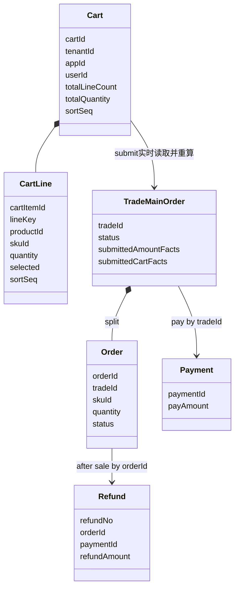

核心领域事实只包含 `Cart`、`CartLine`、`TradeMainOrder`、`Order`、`Payment`、`Refund`。`submittedCartFacts/submittedAmountFacts` 是 submit 成功后写入 MySQL 的交易事实（对应现有 DDL 列 `cart_snapshot/amount_snapshot`），不是 checkout 产物。

### 2.2.1 应用层预览读模型

`TradeCheckoutResult` 仅是请求响应内的应用层读模型/返回 DTO，不是领域实体，不持久化，不与 `TradeMainOrder` 建立关系。它只反映本次请求的实时计算依据；submit 不读取它。

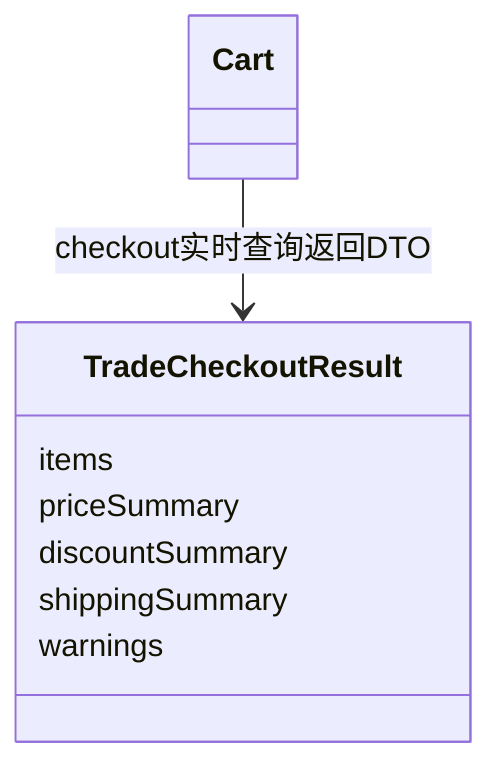

#### PlantUML 源码

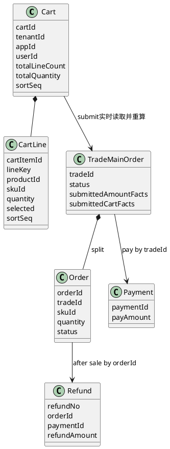

#### PlantUML 预览读模型源码

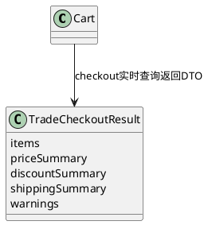

## 2.3 目标服务清单与逻辑数据边界

| 目标服务 | 核心职责 | 逻辑数据所有权 | 同步端口/事件 | 本期代码映射 |
| --- | --- | --- | --- | --- |
| 商品与 SKU 服务 | 商品、SKU 批量读取、可售校验与购物车范围门禁 | 商品、SKU | `ProductSkuQueryPort` | 复用 `ProductReadService/TradeSkuService` |
| 购物车服务 | CRUD、跨页勾选、分页列表、全车已选查询、安全清车 | 购买意图；配置选择 Redis Key 或 MySQL `cart/cart_item` | `CartStore`、`CartCleanRequested` | 新增 `business/cart` |
| 价格优惠服务 | 跨商品批量报价、普通优惠候选选择、冻结核销 | 优惠记录与提交时价格事实 | `TradePricingPort` | 复用 `PricingService/PriceService` |
| 作者配额组件 | Top-N 分配、按 quotaKey 批量冻结/核销/释放 | 现有 `trade_activity_author_quota` 汇总计数；获胜事实写子订单提交快照 | `AuthorQuotaPort` | 扩展 `ActivityAuthorQuotaService`，不新增 reservation 表 |
| 运费服务 | 模板/地区批量读取、交易运费、分摊尾差 | 运费模板与规则 | `TradeShippingPort` | 扩展 `ShippingFeeService` |
| 库存服务 | 批量读、LOCK/DEDUCT/UNLOCK/RELEASE | `trade_pd_stock*` | `TradeStockPort` | 复用批量库存实现 |
| 交易服务 | checkout、submit、主单状态与交易级幂等 | `trade_main_order`、submit 成功后的交易事实 | `TradeApplicationService`、交易事件 | 新增 `business/trade` |
| 订单服务 | 普通商品按 SKU 合并拆单、子订单构建与生命周期 | `trade_order*` | `OrderBuildPort`、订单事件 | 抽取 `OrderService` 纯内核 |
| 支付服务 | trade-first 目标解析；复用支付创建、查单、回调、关单 | `trade_payment` | `PaymentTargetResolver` | 扩展 `PayService` 目标解析和交易支付完成适配，不改渠道实现 |
| 售后服务 | 子单售后、累计退款、交易运费一次退款 | 售后、退款责任 | `AfterSaleOrderService`、`RefundService` | 扩展交易事实金额计算和 SHIPPING 责任判断，复用现有退款渠道 |
| 履约服务 | 制作、采购、ERP、发货 | 履约/采购数据 | 订单级事件 | 复用现有消费者 |
| 消息补偿服务 | 延时关单、资源核销、清车、退款补偿 | 消费幂等/任务状态 | RocketMQ、XXL-Job | `trade-order-job` |

逻辑数据所有权不等于本期物理拆库。当前可以共用 MySQL/Redis 实例，但模块只能通过端口访问其他模块的数据，禁止新增跨域 Mapper 直查。若 `trade_main_order`、子订单、库存、优惠、配额不在同一事务数据源，submit 不能宣称本地强事务，必须重新评审 Saga。

## 2.4 模块依赖总图

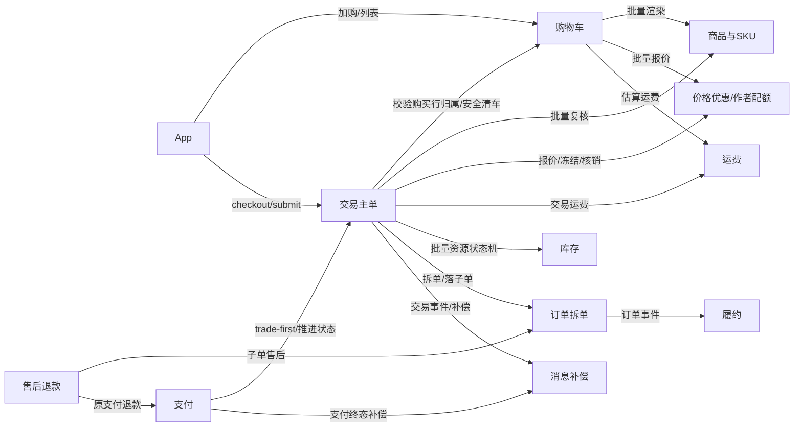

#### PlantUML 源码

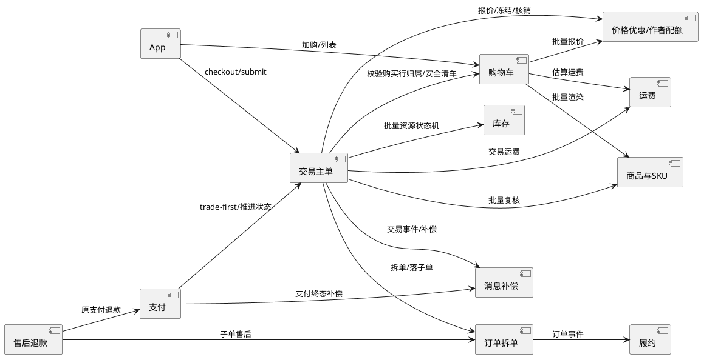

依赖方向固定为“应用编排层依赖领域端口，适配器依赖现有 Service”。商品、价格、运费、库存等模块不得反向依赖 Cart DTO；支付和售后通过 tradeId/orderId 及 MySQL submit 交易事实衔接，不读取购物车。

## 2.5 C4 Level 1：System Context

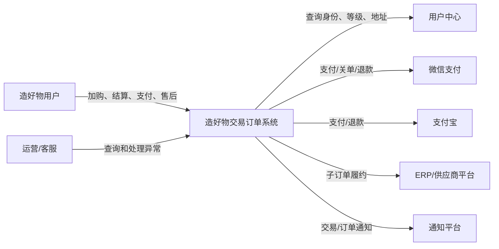

#### PlantUML 源码

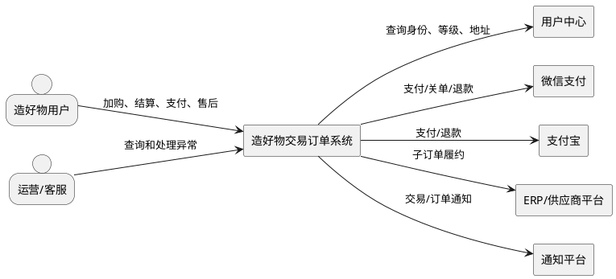

Level 1 只表达一个待设计系统与外部参与者。购物车、交易、订单、支付不是此层的多个 System，其内部边界在 Level 2/3 表达。

## 2.6 C4 Level 2：目标服务容器

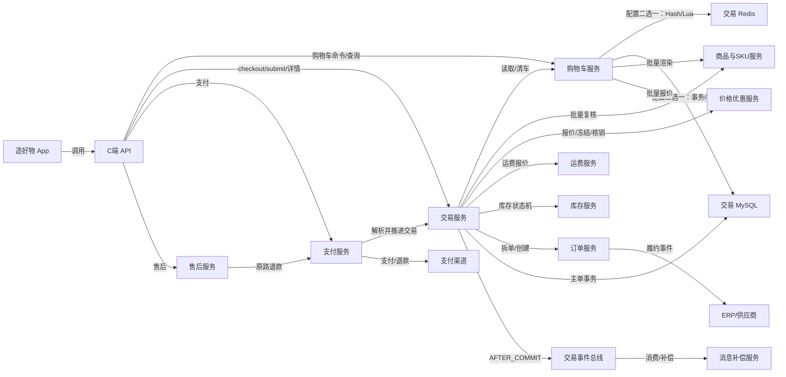

#### PlantUML 源码

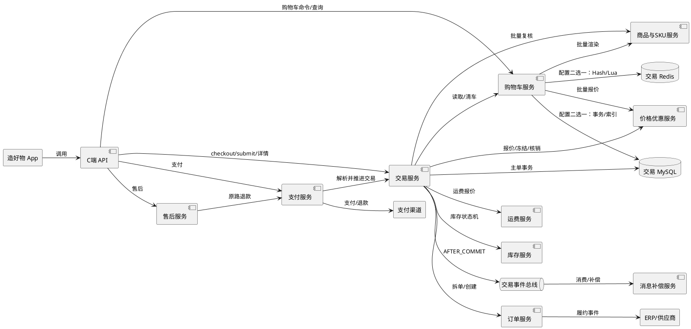

## 2.7 C4 Level 3：模块组件

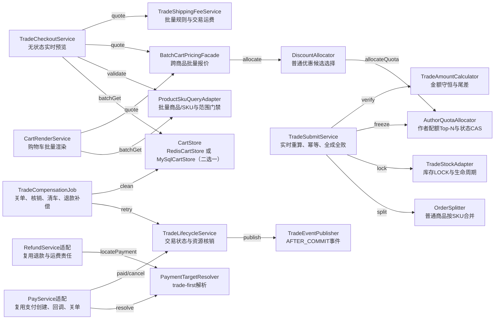

#### PlantUML 源码

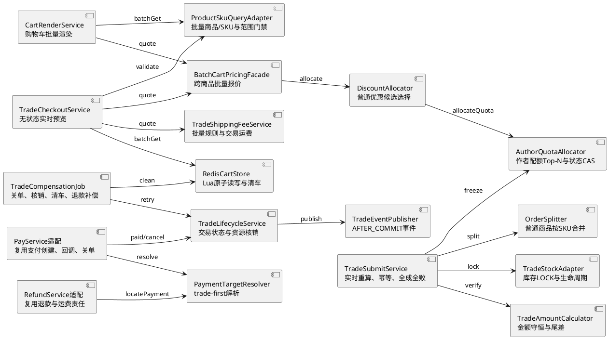

## 2.8 当前工程映射与演进

| C4 组件类型 | 当前 Maven 模块 | 说明 |
| --- | --- | --- |
| C端 API、请求校验、响应包装 | `trade-order-api` | 新增 Cart/Trade Controller；沿用支付和售后 Controller |
| 领域服务、端口、Redis/MySQL适配器 | `trade-order-service` | 本期不物理拆服务，以 Java 接口隔离模块 |
| MQ Consumer、XXL-Job、补偿扫描 | `trade-order-job` | 先发布兼容消费者，再生产新事件 |
| DTO/Feign 契约（确有跨服务调用时） | `trade-order-client` | 首期本地端口不必提前暴露为远程 Client |

后续物理拆服只替换端口适配器为 RPC Client，不把领域规则迁移到 Controller。任何请求内并行读取必须在入口构造不可变 `RequestIdentity` 并显式传递，子线程不得读取 `AuthContext`。

# 三、详细设计

本章只描述模块内部实现、系统交互、状态、并发、数据和补偿，不定义前端 URL 或请求响应协议。前端与内部接口统一见第六章，DDL、Redis Key 和 Lua 契约见第四章。

## 3.0 运行时依赖 DAG 与编排预算

列表与 checkout 的商品 SKU 事实、展示库存等纯读可受控并行；价格优惠依赖商品事实，作者配额依赖候选报价，运费依赖商品及优惠后的计费数量。submit 固定顺序为：校验提交行归属与数量 → 商品/SKU → 价格优惠 → 作者配额 → 运费 → 稳定排序后库存冻结 → 拆单及 MySQL 落库；冻结资源按资源类型和稳定业务键排序，避免循环调用耗时依赖和死锁。每类下游按固定 chunk（商品/SKU 100、库存100、优惠按 product 分组、配额100、运费模板100）调用，并遵守第5章预算，超限失败，不逐行调用。

## 3.1 商品与 SKU 模块

### 3.1.1 职责与复用边界

负责批量读取商品、SKU、作者及可售状态，为购物车展示和 submit 复核提供统一 runtimeFacts。复用 `ProductReadService`、`TradeSkuService`、`ProductCreatorReadService` 已有批量能力；不得在购物车模块直接访问商品 Mapper。

购物车只保存 `productId/skuId/quantity` 引用。商品名称、图片、售价、上下架、库存和优惠均以本次查询为准。SKU 必须属于 productId；已删除、未上架、不可售商品在列表中标记失效，在 checkout/submit 中整笔拒绝。加购、checkout、submit 均复用同一个 `CartProductEligibilityPolicy`，任何一层不得只信任前端门禁。

### 3.1.2 批量商品与 SKU 校验序列

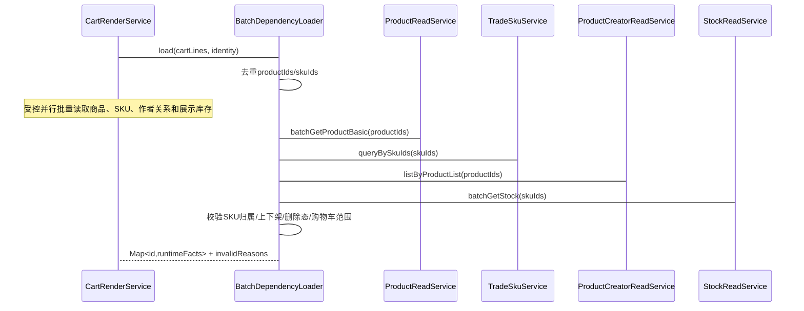

批量调用约束：一次请求先去重再调用；超出下游上限按固定 chunk 拆分；复杂度随批次数增长，不得退化为每行一次 DB/RPC。并行读使用受控线程池和显式不可变 `RequestIdentity`，子线程不得读取 `AuthContext`。

### 3.1.3 购物车商品资格判定

统一判定规则：

| 维度 | 允许 | 拒绝 |
| --- | --- | --- |
| `product.saleMode` | `NORMAL(0)`；历史 null 按现有读侧规则归一为 NORMAL | `BLIND(1)` 或未知值 |
| `product.productType` | 非 `TEMPLATE(2)`，并继续满足既有上架/删除校验 | `TEMPLATE(2)` |
| `sku.skuType` | 不作为范围主判据；应与 NORMAL 商品一致 | 显式 `BLIND(1)`、`FULL(2)` 视为数据不一致 |
| `product.shippingMode` | 不参与购物车范围判定 | 由既有商品/履约校验处理 |

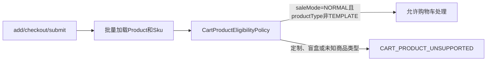

加购时命中拒绝条件直接失败，不写当前 CartStore。已有购物车行若因商品变更而不再满足范围，列表返回失效原因；checkout/submit 整笔拒绝并要求用户移除。`shippingMode` 不参与加购排除，但 `SPOT(2)` 才执行库存生命周期，`PRE_SALE(1)` 复用现有预售履约逻辑。

## 3.2 购物车模块

### 3.2.0 关系字段与运行时重建

首期仅支持无关系的普通商品，不预留 `parentCartItemId/relationType`，不引入赠品、加价购、Pulse、source 插件等 Karos 完整体系。持久化只表达购买意图，运行时列表批量重建展示事实；列表默认只读，count 严格只读。

### 3.2.1 职责与领域模型

购物车不设置版本号，也不做乐观版本冲突控制。加购、改数、勾选和删除由当前 CartStore 以 Redis Lua 或 MySQL 事务原子执行，采用最后一次写入生效。购物车行中的 quantity 仅用于购物车列表展示和 checkout 请求默认回填；checkout/submit 的最终购买数量由请求中的 `items[].quantity` 决定。数量是用户自己的购买行为，服务端只校验行归属、商品/SKU 归属和数量范围，不从购物车读取 submit 数量。

`CartApplicationService` 负责加购、改数、跨页勾选、全车全选和删除；`CartRenderService` 负责当前页批量渲染及全车已选项汇总；`CartStore` 隔离存储实现，由配置选择 Redis 或 MySQL。购物车不保存可信价格、库存和优惠事实；购物车数量也不是 submit 的最终数量事实。

```text
lineKey = SHA-256(UTF-8(canonicalJson))
canonicalJson 仅包含固定顺序的 schemaVersion、productId、skuId；算法版本随 schemaVersion 固定，禁止直接拼接未规范化字符串。
```

同 lineKey 加购合并数量并移到排序顶部。单车最多100行，单行 quantity 为1..99，角标使用 `totalLineCount` 而非总件数。分页按 `sortSeq DESC,cartItemId DESC` 稳定排序；`sortSeq` 是仅用于排序的单调序号，不是购物车版本号，不参与并发或资金判断。

### 3.2.2 CRUD 原子写序列

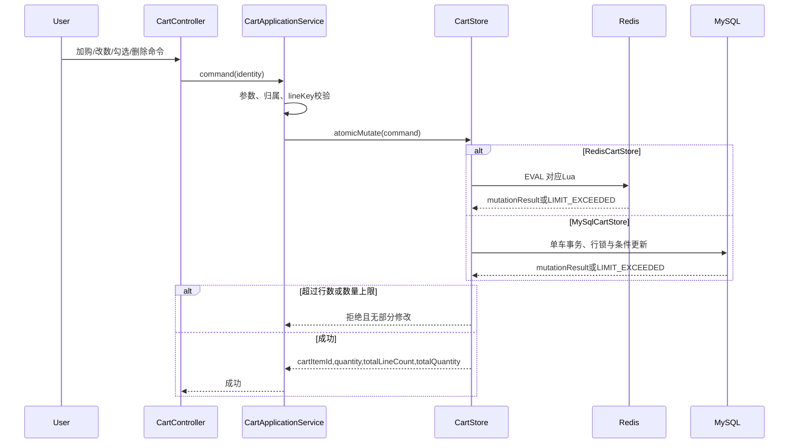

应用层禁止“先读后写”。勾选和删除批量命令必须全量校验后原子执行，不允许部分成功。单行/批量勾选作用于指定购物车行，与当前页无关；全选先批量加载全车最多100行并筛选有效商品，再由当前 CartStore 原子覆盖选中态；校验快照后新增行保持未选中。Redis modifiedAt 只用于观测，不参与资金、排序和并发判断。

### 3.2.3 MySqlCartStore 事务与并发语义

`MySqlCartStore` 与 Redis 实现遵守相同的 `CartStore` 返回结果和错误语义。每次写入先确保身份唯一的 `cart` 行存在，再按固定顺序锁定 `cart` 和目标 `cart_item`；禁止事务外先读后写。加购合并行时执行 `quantity += delta`、更新 `sort_seq`，只增加 `total_quantity`；新行要求 `total_line_count < 100`，插入后同时增加两个计数。delta 改数要求最终数量为1..99，只改变 `total_quantity`，并按 Redis 契约更新排序。

单选和批量选择在一个事务内按 cartItemId 排序锁定并校验全部行归属，任一行不存在则整体回滚。全选先在事务外批量校验商品快照，事务内重新锁定 cart 并原子覆盖已校验行；校验期间新增的行保持未选中。分页使用 `(sort_seq DESC,id DESC)`，`totalCount` 读取 `cart.total_line_count`；selected-items 使用 selected 复合索引一次加载最多100行并以返回有效购物车行数作为 `selectedLineCount`。

批量删除先锁 cart 和全部目标行，确认全部存在后一次删除；`total_line_count -= N`，`total_quantity -= SUM(quantity)`。支付后清车在同一事务内校验 `{cartItemId,lineKey,submittedQuantity}`：整行删除时行数减1并扣当前数量，部分扣量只扣 `submittedQuantity`。`ITEM_NOT_FOUND` 和 `LINE_CHANGED` 是安全终态 no-op；死锁、连接不可用和事务回滚进入 `PENDING` 并有限重试，不得伪装为空车。

### 3.2.4 分页列表与已选商品两步查询序列

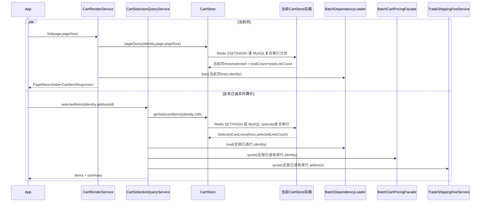

分页列表只渲染当前页并返回该页实时商品信息，不计算或返回全车 `selectionSummary`。全车已选商品、跨 SKU 优惠重新分配、运费和底部汇总统一由 `GET /cart/selected-items` 返回。页面首次进入时前端并行调用两个接口；加购、增减数量、勾选、全选、删除等写操作修改当前配置选中的 CartStore，成功后前端再调用 `selected-items` 刷新全部已选商品和汇总。两步职责分离，算价失败不影响已经成功的购物车写操作。

### 3.2.5 支付后安全清车序列

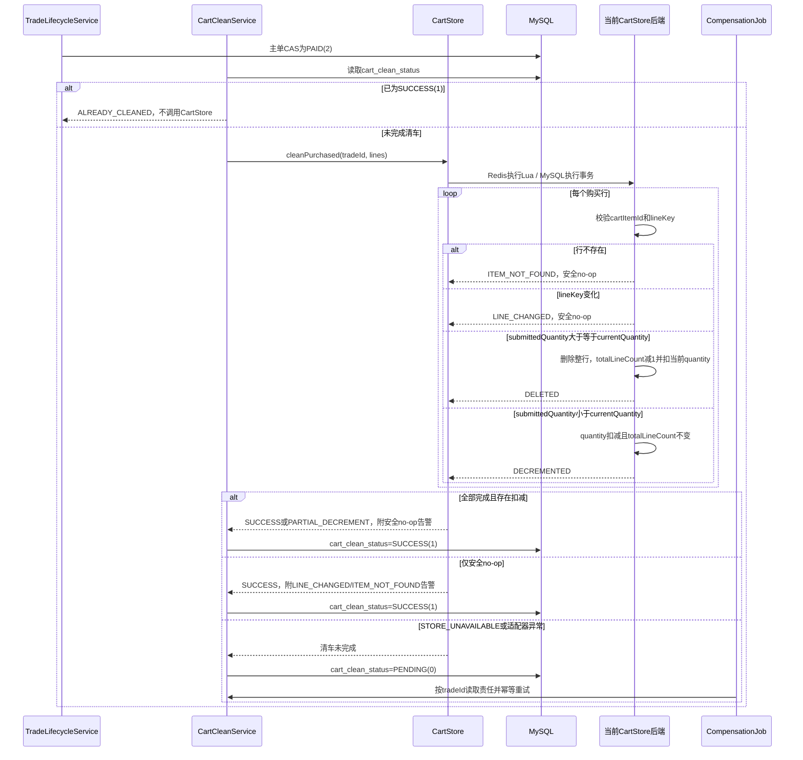

第三方支付成功不能因购物车存储清车失败回滚。`ALREADY_CLEANED` 是服务层读取 MySQL `cart_clean_status=SUCCESS(1)` 后返回的状态，不是存储适配器返回码。清车先校验 `cartItemId` 和 `lineKey`：匹配后，若 `submittedQuantity >= currentQuantity`，删除整行；Redis 同步删除 `items/line/order/selected` 索引；`totalLineCount` 减1并从 `totalQuantity` 扣减当前购物车数量；若 `submittedQuantity < currentQuantity`，仅将数量更新为 `currentQuantity - submittedQuantity`，并从 `totalQuantity` 扣减 submittedQuantity。该规则覆盖用户支付前后继续改数的情况，购买数量大于当前购物车数量时不得出现负数或残留行。CartStore 每行只返回 `DECREMENTED`、`DELETED`、`LINE_CHANGED`、`ITEM_NOT_FOUND`；`LINE_CHANGED` 和 `ITEM_NOT_FOUND` 都是防误删后的终态 no-op，不进入 PENDING 重试。只有 `STORE_UNAVAILABLE` 或适配器执行异常进入 PENDING。整体结果可返回 `SUCCESS` 或 `PARTIAL_DECREMENT`，并附安全 no-op 告警。清车责任三元组为 `{cartItemId,lineKey,submittedQuantity}`；重复执行由 MySQL `cart_clean_status` 拦截，不能重复扣减。

## 3.3 算价、优惠与作者配额模块

### 3.3.1 职责与现有能力

跨商品编排由 `BatchCartPricingFacade` 完成，按 productId 分组调用现有定价策略链，不复制 `DiscountCalculator`。候选顺序保持 `precedence ASC → discountedPrice ASC → activityGroup ASC`，每个 SKU 子订单只选择一个最优普通营销优惠。购物车不处理 `skuType=FULL(2)`，因此删除端盒折扣识别、叠加和展示分支。`PriceService` 继续承担普通优惠 freeze/use/unFreeze；作者配额复用现有 `trade_activity_author_quota` 汇总计数，Top-N 获胜结果以 `uniqueTopicId/enableActivityAuthorQuota/expectFree` 写入每个子订单的提交快照，不新增 reservation 表。

### 3.3.2 批量报价与优惠分配序列

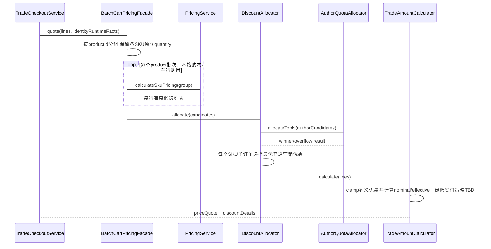

前端展示名义优惠，资金汇总使用 effectiveDiscount。若运行时发现 `skuType=BLIND(1)/FULL(2)`，按不支持购物车处理，不进入算价降级或端盒叠加。

### 3.3.3 金额规则与数据算例

```text
productOriginalAmount = unitPrice × quantity
if productOriginalAmount == 0:
  productPayAmount = 0
  effectiveDiscountAmount = 0
else:
  effectiveDiscountAmount = min(max(计算得到的实际优惠金额, 0), productOriginalAmount)
  productPayAmount = productOriginalAmount - effectiveDiscountAmount
  # 最低实付 0.01 的适用粒度：TBD；确认前不得擅自补差或产生负优惠
payAmount = productPayAmount + shippingFee
```

例：SKU 单价100、quantity=2、普通营销优惠40，原价200、有效优惠40、商品实付160。若计算出的优惠超过商品原价，effectiveDiscountAmount 最高取商品原价，保证商品实付不为负。

### 3.3.4 作者配额 checkout 分配序列

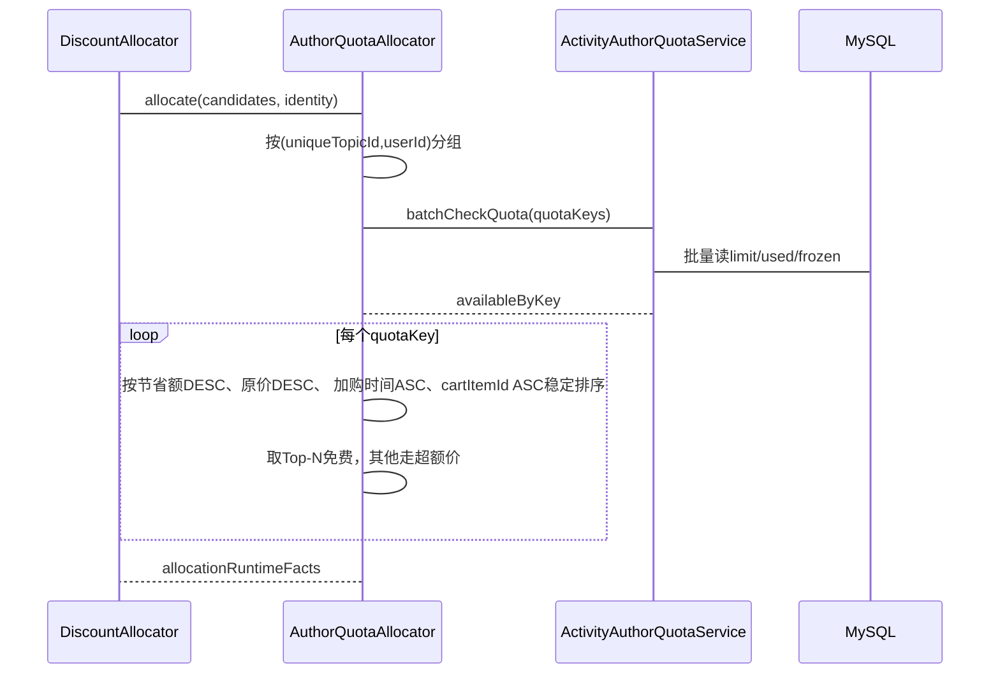

每个 SKU 子订单消耗1个名额，同一子订单 quantity>1 仍消耗1。checkout 只读，不冻结；分配结果仅在本次响应内返回，submit 必须二次校验。

### 3.3.5 submit 并发冻结与生命周期

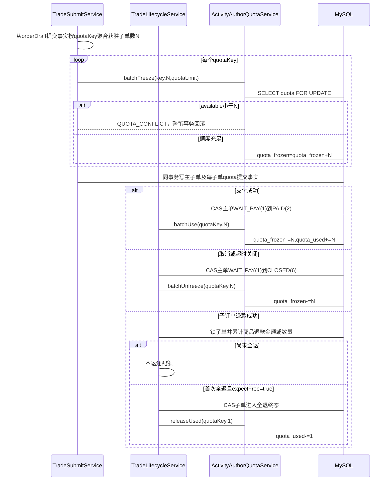

作者配额按 quotaKey 一次执行 delta SQL，禁止按子单循环 `+1/-1`：冻结使用 `quota_frozen += N` 且校验 `quota_used + quota_frozen + N <= quotaLimit`；支付使用 `quota_frozen -= N, quota_used += N` 且校验 `quota_frozen >= N`；取消使用 `quota_frozen -= N`；首次全退免费子单使用 `quota_used -= 1`。多个 quotaKey 按字典序加行锁，避免死锁。

`enableActivityAuthorQuota=1` 时，`PromotionRecord` 只表达作者优惠资格和适用范围，购物车与立即购买统一不得再用其单行 `FREEZE/USED/NORMAL` 表达订单占用；`0/null` 的普通历史优惠继续复用原状态机。每个子订单提交事实固定保存 `uniqueTopicId/enableActivityAuthorQuota/expectFree`，因此可从交易或子单确定 delta。

幂等不依赖新增 reservation：submit 由提交唯一键与本地事务保证；支付、取消由交易主单状态 CAS 与 quota delta 同事务保证；退款由退款单完成状态、子单全退 CAS 与 `quota_used -= 1` 同事务保证。只有子订单商品金额或数量全部退款才返还1个配额，部分退款不返还；该业务口径需在上线前由产品确认。上述方案的硬前提是 quota、交易主单、子订单和退款事实位于同一 MySQL 事务数据源；否则必须重新引入责任记录或 Saga。

## 3.4 运费模块

### 3.4.1 职责与计算口径

一次读取地址，批量加载全部 freightTemplateId 和目标地区规则，在内存按模板及计价单元分组。作者免费行和明确包邮行先从付费组件数排除，再计算阶梯运费。

```text
unitFee = 免费/包邮 ? 0
        : 地区规则命中 ? rule.freightFee
        : 模板存在 ? defaultFreightFee
        : 4.00
groupFee = unitFee == 0 ? 0 : ceil(paidItemQuantity / 6) × unitFee
tradeShippingFee = Σ groupFee
```

### 3.4.2 批量报价与分摊序列

```mermaid
sequenceDiagram
  participant TradeCheckoutService as TradeCheckoutService
  participant TradeShippingFeeService as TradeShippingFeeService
  participant AddressService as AddressService
  participant FreightTemplateReadService as FreightTemplateReadService
  participant FreightRuleAreaReadService as FreightRuleAreaReadService
  participant ShippingAllocator as ShippingAllocator
  TradeCheckoutService->TradeShippingFeeService: quote(addressId, pricedLines)
  TradeShippingFeeService->AddressService: getOwnedAddressOnce(addressId,userId)
  TradeShippingFeeService->TradeShippingFeeService: 去重templateIds 排除免费/包邮行
  Note over TradeCheckoutService: 受控并行批量读取模板和地区规则
  TradeShippingFeeService->FreightTemplateReadService: batchGet(templateIds)
  TradeShippingFeeService->FreightRuleAreaReadService: batchGet(templateIds,regionCode)
  TradeShippingFeeService->TradeShippingFeeService: resolveUnitFee并按模板分组 ceil(paidQuantity/6)
  TradeShippingFeeService->ShippingAllocator: allocateToOrderDrafts(totalFee)
  ShippingAllocator->ShippingAllocator: 前N-1 HALF_UP两位 最后稳定子单承接尾差
  ShippingAllocator-->TradeCheckoutService: total + groups + allocations
```

### 3.4.3 边界算例

| 场景 | 结果 |
| --- | ---: |
| 同模板1或6件，单位4元 | 4.00 |
| 同模板7或12件，单位4元 | 8.00 |
| 同模板13件，单位4元 | 12.00 |
| 模板A 7件×4元 + 模板B 2件×6元 | 14.00 |
| 作者免费2件 + 同模板付费6件×4元 | 4.00 |
| 包邮3件 + 同模板付费7件×4元 | 8.00 |

分摊只服务于子单展示和售后责任判断，交易运费仍是资金事实。部分退款是否退运费属于上线前业务门禁；未定稿前不得按子单展示分摊直接退款。

## 3.5 库存模块

### 3.5.1 职责与状态机

复用 `StockReadService/StockWriteService` 及批量原子 SQL。提交前仅筛选 `shippingMode=SPOT(2)` 的子订单，将相同 skuId 数量聚合并稳定排序，以 tradeId 作为责任业务号；`PRE_SALE(1)` 普通商品不执行库存写操作。

```mermaid
stateDiagram-v2
  [*] --> LOCK_1 : submit / LOCK
  LOCK_1 --> USED_2 : pay / DEDUCT
  LOCK_1 --> UN_LOCK_3 : cancel or timeout / UNLOCK
  USED_2 --> UN_LOCK_3 : after-sale / RELEASE
```

图中节点直接复用现有 `SkuStockRecord.LockStatus`：`LOCK(1)/USED(2)/UN_LOCK(3)`；`DEFAULT(0)` 仅表示未进入有效库存责任生命周期，不作为锁定成功态。边标签复用现有 `OrderAction`：`LOCK/DEDUCT/UNLOCK/RELEASE`；取消解锁和售后释放都进入 `UN_LOCK(3)`，具体动作由库存流水的 `orderAction` 区分。

### 3.5.2 批量库存生命周期序列

```mermaid
sequenceDiagram
  participant TradeSubmitService as TradeSubmitService
  participant TradeLifecycleService as TradeLifecycleService
  participant TradeStockAdapter as TradeStockAdapter
  participant StockWriteService as StockWriteService
  participant MySQL as MySQL
  TradeSubmitService->TradeStockAdapter: lock(tradeId, orderDrafts)
  TradeStockAdapter->TradeStockAdapter: 过滤PRE_SALE，仅对SPOT按skuId聚合并排序
  TradeStockAdapter->StockWriteService: batchLock(responsibilities)
  StockWriteService->MySQL: 条件原子更新+批量日志
  alt 任一SKU不足或更新失败
    MySQL-->StockWriteService: affectedRows不匹配
    StockWriteService-->TradeSubmitService: STOCK_INSUFFICIENT，submit事务回滚
  else 全部成功
    StockWriteService-->TradeSubmitService: LockStatus.LOCK(1)
  end
  alt 支付成功
    TradeLifecycleService->TradeStockAdapter: deduct(tradeId)
    TradeStockAdapter->StockWriteService: batchDeduct（幂等）
  else 取消或超时
    TradeLifecycleService->TradeStockAdapter: unlock(tradeId)
    TradeStockAdapter->StockWriteService: batchUnlock（幂等）
  else 售后释放
    TradeLifecycleService->TradeStockAdapter: release(orderResponsibility)
  end
```

checkout 的库存仅用于现货展示，submit 的 LOCK 才是现货最终判断；预售普通商品跳过库存不足校验。任何批量写部分成功都必须通过同事务回滚；分布式锁不是正确性依据。

## 3.6 交易主单与订单拆分模块

### 3.6.1 checkout 无状态实时预览序列

```mermaid
sequenceDiagram
  participant TradeCheckoutService as TradeCheckoutService
  participant CartStore as CartStore
  participant BatchDependencyLoader as BatchDependencyLoader
  participant BatchCartPricingFacade as BatchCartPricingFacade
  participant TradeShippingFeeService as TradeShippingFeeService
  Note over TradeCheckoutService: 前端已通过/cart/selected-items取得跨页完整items
  TradeCheckoutService->CartStore: batchGet(request.items.cartItemIds,identity)
  TradeCheckoutService->TradeCheckoutService: 校验提交行/数量/归属，不依赖当前页
  TradeCheckoutService->BatchDependencyLoader: 批量商品SKU库存校验
  alt 商品失效/依赖失败
    TradeCheckoutService-->TradeCheckoutService: 整笔checkout失败
  else 校验通过
    TradeCheckoutService->BatchCartPricingFacade: 跨商品批量报价
  BatchCartPricingFacade-->TradeCheckoutService: 价格/优惠/配额分配
  TradeCheckoutService->TradeShippingFeeService: 交易运费
  TradeShippingFeeService-->TradeCheckoutService: 运费/分摊
  TradeCheckoutService->TradeCheckoutService: 验证金额守恒 绑定用户/地址/version/algorithmVersion
  end
```

checkout 不冻结任何资源。实时预览结果只在当前响应中返回，不保存服务端上下文；submit 使用请求中的购买行和数量实时重算；仅校验购物车行归属与存在性，不从购物车读取数量。

### 3.6.2 拆单序列与规则

```mermaid
sequenceDiagram
  participant TradeSubmitService as TradeSubmitService
  participant OrderSplitter as OrderSplitter
  participant OrderBuildCore as OrderBuildCore
  TradeSubmitService->OrderSplitter: split(recalculatedLines)
  loop 每个行
    OrderSplitter->OrderSplitter: 按skuId分组并累加quantity
  end
  OrderSplitter->OrderSplitter: 校验全部商品满足购物车范围且子单数不超过100
  OrderSplitter->OrderBuildCore: batchBuild(drafts, runtimeFacts)
  OrderBuildCore-->TradeSubmitService: 无外部副作用的主子单草稿
```

示例：SKU A×3、SKU B×1，输出2个子订单：A(quantity=3)、B(quantity=1)。拆单不重新算价或运费，只基于本次实时重算结果分配；不存在定制 hash 隔离和盲盒按件展开。

### 3.6.3 submit 全成全败与幂等序列

```mermaid
sequenceDiagram
  participant TradeSubmitService as TradeSubmitService
  participant CartStore as CartStore
  participant ProductSkuQueryPort as ProductSkuQueryPort
  participant PromotionLifecycleCore as PromotionLifecycleCore
  participant AuthorQuotaPort as AuthorQuotaPort
  participant TradeStockAdapter as TradeStockAdapter
  participant OrderSplitter as OrderSplitter
  participant MySQL as MySQL
  participant TradeEventPublisher as TradeEventPublisher
  TradeSubmitService->MySQL: 按tenant/app/user/clientRequestId查询
  alt 已存在且requestHash一致
    MySQL-->TradeSubmitService: 返回原tradeId和orderIds
  else 已存在且requestHash不同
    MySQL-->TradeSubmitService: IDEMPOTENCY_CONFLICT
  else 不存在
    TradeSubmitService->CartStore: 批量校验完整items的身份、归属与当前行存在
    Note over TradeSubmitService: 数量取提交请求 items[].quantity，不读取购物车数量
    TradeSubmitService->ProductSkuQueryPort: 批量加载并复核商品SKU及购物车资格
    TradeSubmitService->PromotionLifecycleCore: 实时重算价格优惠和作者配额候选
    TradeSubmitService->TradeStockAdapter: 批量读取展示库存
    TradeSubmitService->OrderSplitter: 按本次事实拆单
    Note over TradeSubmitService: 单一MySQL事务；资源按稳定业务键冻结
    TradeSubmitService->MySQL: 插入幂等占位和trade_main_order
    TradeSubmitService->PromotionLifecycleCore: freezeOrdinaryPromotions
    TradeSubmitService->AuthorQuotaPort: batchFreeze(tradeId,orderDrafts)
    TradeSubmitService->TradeStockAdapter: batchLock
    TradeSubmitService->MySQL: 写子单、金额、地址和 submit 交易事实
    alt 任一资源变化或写入失败
      MySQL-->TradeSubmitService: ROLLBACK并返回RECHECKOUT
    else 全部成功
      MySQL-->TradeSubmitService: COMMIT
      TradeSubmitService->TradeEventPublisher: AFTER_COMMIT TradeSubmitted/OrderCreated
    end
  end
```

Redis 不参与提交幂等；数据库唯一约束为 tenant/app/user/clientRequestId，命中后比较 requestHash，才是最终屏障。提交期间价格、库存、优惠或配额变化时不得静默涨价或剔除失败 SKU。

### 3.6.4 主子单状态聚合

交易主单使用新增 `TradeMainOrderStatusEnum`，不直接持久化 `Order.OrderStatus`。相同语义沿用现有编码：提交成功直接进入 `WAIT_PAY(1)`，支付成功进入 `PAID(2)`，用户取消或超时关闭进入 `CLOSED(6)`，退款执行中进入 `REFUND_PENDING(7)`；关闭原因单独记录，交易主单不新增 `CANCELLED`。

交易退款完成后按资金事实推进：`0 < refundedAmount < payAmount` 为新增 `PARTIALLY_REFUNDED(9)`，`refundedAmount = payAmount` 为新增 `REFUNDED(10)`。部分退款后再次退款可由 `PARTIALLY_REFUNDED(9) → REFUND_PENDING(7)`，完成后再回到 `PARTIALLY_REFUNDED(9)` 或进入 `REFUNDED(10)`；退款失败时依据已有 `refundedAmount` 恢复到 `PAID(2)` 或 `PARTIALLY_REFUNDED(9)`。编码3/4/5保留给现有子订单履约状态，编码8保留给现有支付 `TIMEOUT_CLOSED(8)`，避免同码异义。

子订单继续使用 `Order.OrderStatus` 负责履约状态。支付成功一次推进主单，再批量推进各子单；任何子单消费者失败由事件/Job重试，不重复扣减资源。

### 3.6.5 订单列表交易聚合与兼容

现有 `GET /order/list` 返回 `PageReturnData<OrderResponse>`，语义是“一条记录对应一个子订单”。该旧接口保持现有分页、排序、字段语义和数据范围，历史立即购买及老 App 不切换返回层级；仅在 `OrderResponse` 中增加可空 `tradeId`，已有 `status/subStatus/payAmount/totalAmount/shippingFee/createTime/orderType` 等字段不改语义、不改单位、不改状态值。

新 App 使用独立的交易聚合列表接口，但数据范围不能仅限于 `trade_main_order.source=CART`。查询结果包含购物车交易和历史可兼容聚合的老订单；一番赏订单（包括独立 IKJ）排除。新购物车交易按 `trade_main_order` 聚合；没有 `trade_id` 的历史普通订单按单个订单生成一个兼容交易卡片，`tradeId` 为空、支付/取消仍使用该订单的 `orderId`。服务端必须先按交易卡片统一分页，再批量查询子订单组装卡片；不能先分页子订单后由前端分组，否则同一交易可能跨页。旧 `/order/list` 接口及历史订单原有字段语义保持不变。

```mermaid
sequenceDiagram
  participant OrderListController as OrderListController
  participant TradeOrderListService as TradeOrderListService
  participant MySQL as MySQL
  participant OrderRepository as OrderRepository
  participant TradeMainOrderRepository as TradeMainOrderRepository
  OrderListController->TradeOrderListService: queryTradeList(userId,page,pageSize)
  TradeOrderListService->TradeMainOrderRepository: 查询CART交易主单与可聚合历史订单
  TradeOrderListService->TradeOrderListService: 构造统一交易卡片键并分页
  TradeMainOrderRepository-->TradeOrderListService: tradeCard page,totalCount
  TradeOrderListService->OrderRepository: 批量查询卡片对应的交易子单或历史订单
  OrderRepository-->TradeOrderListService: 子订单/历史订单列表
  TradeOrderListService->TradeOrderListService: 按交易卡片分组并稳定排序
  Note over OrderListController: 保留现有OrderResponse字段原语义
  Note over OrderListController: 补充聚合字段
  TradeOrderListService-->OrderListController: PageReturnData<TradeOrderListItem>
```

新聚合只增加以下字段，不重新定义现有订单字段：

- `tradeId`：交易主单号；支付、取消和交易详情使用该 ID。
- `tradeStatus/tradeStatusDesc`：交易级状态及展示文案；子订单原 `status/subStatus` 仍表示子订单状态。
- `tradePayAmount`：交易实际支付金额；子订单原 `payAmount` 保持现有子订单金额口径。
- `tradeCreateTime`：交易创建时间；子订单原 `createTime` 保持原含义。
- `orderCount`：该交易包含的好物子订单数。
- `orderIndex`：当前子订单在该交易中的展示序号，从1开始。
- `orders`：子订单数组，元素复用现有 `OrderResponse` 字段，并额外带 `orderIndex/orderCount`。

交易卡片分页的 `totalCount` 统计交易主单数，不统计子订单数；子订单按交易内稳定顺序返回。交易级“继续付款/取消”使用 `tradeId`，物流和售后仍使用子 `orderId`。

## 3.7 合并支付模块

### 3.7.1 复用边界与交易目标

需求要求购物车一次结算生成一个交易单，交易单下按 SKU 生成订单；交易单负责一次支付和交易级运费，订单继续承担 SKU 数量、履约、物流和售后入口。该模型只新增交易目标适配，不新建支付渠道或重写现有支付生命周期。

现有 `PayService`、`PaymentMapInitializer`、`BasePayment` 及微信/支付宝实现继续复用：

- 支付创建、支付预检查、渠道参数组装、主动查单、支付回调验签和支付单状态推进继续由现有支付模块负责；
- 购物车支付请求沿用现有 `orderId` 字段，但传入 `tradeId`；历史立即购买继续传真实 `orderId`；
- `Payment.orderId` 在购物车场景保存 `tradeId`，不新增 `Payment.target_type`；
- 仅增加 `PaymentTargetResolver`，按“先交易主单、后历史订单”解析支付目标；不在 Resolver 中编排库存、优惠、配额或退款。

```mermaid
flowchart LR
  PaymentController[支付接口] --> PayService[现有PayService]
  PayService --> TargetResolver[PaymentTargetResolver]
  TargetResolver --> TradeTarget[交易主单目标]
  TargetResolver --> LegacyTarget[历史订单目标]
  PayService --> PaymentMap[PaymentMapInitializer]
  PaymentMap --> Wechat[现有微信支付实现]
  PaymentMap --> Alipay[现有支付宝支付实现]
  PayService --> Completion[支付完成适配]
  Completion --> TradeCompletion[交易主单支付完成]
  Completion --> OrderCompletion[历史订单支付完成]
```

目标解析结果只表达支付所需的统一事实：`targetType`、`tradeId`、`orderId`、`paymentOrderId`、`userId`、`payAmount`、`status` 和子订单列表引用。目标归属、待支付状态和服务端金额必须在 `PayService` 内再次校验，客户端的金额、状态和用户标识不可信。

### 3.7.2 创建、查单和关单

创建支付、预检查、主动查单、关闭其他未支付 Payment 的入口均调用 `PaymentTargetResolver`。支付渠道仍通过 `PaymentMapInitializer` 分发到现有 `BasePayment`，不新增交易专用微信/支付宝实现。

```mermaid
sequenceDiagram
  participant PaymentController as PaymentController
  participant PayService as PayService
  participant PaymentTargetResolver as PaymentTargetResolver
  participant PaymentRepository as PaymentRepository
  participant BasePayment as 现有渠道实现
  PaymentController->>PayService: create/pre/query/close(targetId)
  PayService->>PaymentTargetResolver: resolve(targetId)
  PaymentTargetResolver->>PaymentRepository: 先查trade_main_order.trade_id
  alt 命中交易主单
    PaymentRepository-->>PaymentTargetResolver: TradePaymentTarget
  else 未命中交易主单
    PaymentTargetResolver->>PaymentRepository: 查trade_order.order_id
    PaymentRepository-->>PaymentTargetResolver: LegacyOrderTarget
  end
  PayService->>PayService: 校验归属、WAIT_PAY和服务端payAmount
  PayService->>PaymentRepository: 以paymentId幂等创建或读取Payment
  PayService->>BasePayment: 复用现有渠道创建/查单/关单
  BasePayment-->>PayService: 渠道结果
```

支付回调和主动查单都复用现有支付入口。回调验签、商户号和金额校验成功后，支付单以 `paymentId` 幂等推进；支付完成适配根据目标类型分支：交易目标推进交易主单及全部子订单，历史订单继续执行现有订单支付完成逻辑。交易支付通知只发送一次 `TradePaid`；制作、发货等履约通知仍按每个子 `orderId` 发送，符合需求中的通知粒度。

### 3.7.3 支付成功后的交易完成

```mermaid
sequenceDiagram
  participant PaymentCallback as 支付回调或主动查单
  participant PayService as 现有PayService
  participant PaymentTargetResolver as PaymentTargetResolver
  participant TradePaymentCompletionService as TradePaymentCompletionService
  participant MySQL as MySQL
  participant StockPort as TradeStockPort
  participant PricingPort as TradePricingPort
  participant QuotaPort as AuthorQuotaPort
  participant EventPublisher as TradeEventPublisher
  PaymentCallback->>PayService: 渠道成功结果
  PayService->>PaymentTargetResolver: resolve(payment.orderId)
  PayService->>MySQL: 锁定Payment并校验金额/最新状态
  PayService->>TradePaymentCompletionService: complete(tradeTarget,payment)
  TradePaymentCompletionService->>MySQL: CAS trade WAIT_PAY(1)到PAID(2)
  TradePaymentCompletionService->>MySQL: 批量推进子订单支付状态
  TradePaymentCompletionService->>StockPort: batchDeduct(tradeId)
  TradePaymentCompletionService->>PricingPort: batchUseOrdinary(tradeId)
  TradePaymentCompletionService->>QuotaPort: batchUse(tradeId,submittedFacts)
  TradePaymentCompletionService->>EventPublisher: AFTER_COMMIT TradePaid一次、OrderPaid按子单
```

交易完成适配只负责把现有订单支付完成内核编排到交易主单上，不替换 `PayService` 的渠道代码。主单 CAS、子订单状态和资源核销必须在当前工程确认的同一事务数据源内完成；若实际跨库，则沿用本文资源一致性矩阵要求重新评审 Saga，不在支付回调中静默提交部分成功。

### 3.7.4 支付与关单竞争

支付回调与延时关单都通过交易主单/历史订单的状态 CAS 竞争：

- `PAID` CAS 成功后，关单读取终态并结束，不关闭渠道支付；
- `CLOSED` CAS 成功后，复用现有关单能力关闭未支付 Payment；
- 回调发现本地已关闭但渠道可能已支付，复用主动查单，再按异常支付策略处理；
- 延时消息目标先经 `PaymentTargetResolver` 解析，历史 `orderId` 继续兼容；
- 不新增第二套支付状态机，继续复用 `Payment.PaymentStatus` 和现有交易/订单状态映射。

## 3.8 售后退款模块

### 3.8.1 复用边界与商品退款

需求规定同一交易单内可以按商品处理退换货，生产前可无理由退款；订单详情仍以单个 SKU 订单展示，但退款是否退运费以交易单为判断基准。因此售后入口继续接收子 `orderId`，不要求客户端提交 `tradeId` 或可信退款金额。

现有 `AfterSaleOrderService` 负责售后校验和售后单创建，现有 `RefundService` 负责退款单、异步执行、零元退款、微信/支付宝渠道分发、退款回调和主动查单。购物车只新增 `TradeRefundAmountService` 的交易事实读取与运费判断，不新增退款渠道核心。

```mermaid
sequenceDiagram
  participant AfterSaleController as 售后接口
  participant AfterSaleOrderService as 现有AfterSaleOrderService
  participant TradeRefundAmountService as TradeRefundAmountService
  participant RefundService as 现有RefundService
  participant PaymentTargetResolver as PaymentTargetResolver
  participant MySQL as MySQL
  AfterSaleController->>AfterSaleOrderService: apply(orderId,items,reason)
  AfterSaleOrderService->>MySQL: 校验子单归属、履约状态和可退款数量
  AfterSaleOrderService->>TradeRefundAmountService: calculateProductRefund(orderId,items)
  TradeRefundAmountService->>PaymentTargetResolver: orderId解析tradeId/paymentId
  TradeRefundAmountService->>MySQL: 读取submit后的商品金额事实和已退款金额
  TradeRefundAmountService->>RefundService: createRefund(PRODUCT,afterSaleOrderId,amount,payment)
  RefundService->>MySQL: 复用现有Refund记录与幂等状态
  RefundService->>RefundService: 复用现有渠道退款/回调/查单
  RefundService-->>AfterSaleOrderService: 退款责任状态
```

商品退款金额完全根据 submit 成功后写入的订单/交易事实计算，不能使用购物车当前价格、checkout 预览金额或客户端 `refundAmount`。商品退款责任键为 `PRODUCT:{afterSaleOrderId}`；重复请求返回原 `refundNo`，不重复调用渠道退款。累计成功退款金额必须满足 `successfulRefundAmount <= payment.payAmount`，最终由数据库条件更新防止超额。

### 3.8.2 交易运费退款

需求明确：运费按交易单计算，不拆成各子订单的资金事实；同一交易单下所有 SKU 订单均退款时，全额退还交易单运费，否则不退。订单详情中的运费展示可以按现有需求口径展示分摊值，但分摊值不能直接作为退款金额。

```mermaid
sequenceDiagram
  participant RefundService as 现有RefundService
  participant TradeRefundAmountService as TradeRefundAmountService
  participant MySQL as MySQL
  participant PaymentTargetResolver as PaymentTargetResolver
  TradeRefundAmountService->>MySQL: 查询trade全部商品子订单及退款终态
  alt 仍有未全部退款的商品订单
    TradeRefundAmountService-->>RefundService: 不创建运费退款
  else 全部商品订单已退款
    TradeRefundAmountService->>MySQL: 读取submit事实trade.shippingFee
    TradeRefundAmountService->>PaymentTargetResolver: tradeId定位原支付单
    TradeRefundAmountService->>RefundService: createRefund(SHIPPING,SHIPPING:{tradeId},trade.shippingFee)
    RefundService->>MySQL: 唯一责任键幂等创建Refund
    RefundService->>RefundService: 复用现有微信/支付宝退款及回调
  end
```

运费退款责任键为 `SHIPPING:{tradeId}`，并与 `payment_id` 建立唯一约束；多个子订单退款成功回调并发时只有一个请求可以创建并执行该责任。运费退款成功后更新累计退款金额和交易退款状态；如果渠道结果未知，复用现有退款 `APPROVED(1)` 及主动查单补偿。退款政策未允许时不创建运费退款责任，不能由前端或子订单展示分摊金额推导退款。

### 3.8.3 定制审核失败和其他退款场景

需求中的定制商品进入 ERP 前需审核，审核失败自动退款；如果后续恢复定制购物车，审核失败退款仍复用 `AfterSaleOrderService`/`RefundService`，只由履约或审核结果触发同一商品退款责任。当前 v4 商品范围已排除定制品，因此本期不新增定制审核实现。

零元退款继续复用 `RefundService.handleZeroAmountPaymentRefund`，不调用第三方渠道但必须推进本地退款、售后和交易聚合状态。支付退款的渠道超时、重复回调和主动查单继续使用现有实现和补偿任务。

## 3.9 事件、消息与补偿模块

### 3.9.1 事件边界

交易级事件：`TradeSubmitted/TradePaid/TradeCancelled`；订单级事件：`OrderCreated/OrderPaid/OrderCancelled`。合并支付通知只消费一次 `TradePaid`，ERP/制作/发货继续消费每个子单事件。

### 3.9.2 事务后发布与幂等消费序列

```mermaid
sequenceDiagram
  participant DomainService as DomainService
  participant TradeEventPublisher as TradeEventPublisher
  participant MySQL as MySQL
  participant RocketMQ as RocketMQ
  participant Consumer as Consumer
  participant IdempotencyStore as IdempotencyStore
  DomainService->>MySQL: 本地事务写业务状态
  MySQL-->>DomainService: COMMIT
  DomainService->>TradeEventPublisher: AFTER_COMMIT event
  TradeEventPublisher->>RocketMQ: publish(eventId,aggregateId,stateVersion)
  RocketMQ->>Consumer: deliver
  Consumer->>IdempotencyStore: tryAcquire(eventType:aggregateId:stateVersion)
  alt 已处理
    Consumer-->>RocketMQ: ACK
  else 首次处理
    Consumer->>Consumer: 执行业务Handler
    alt 任一关键Handler失败
      Consumer-->>RocketMQ: 抛异常触发重试
    else 全部成功
      Consumer->>IdempotencyStore: markSuccess
      Consumer-->>RocketMQ: ACK
    end
  end
```

当前订单变更消费者若捕获单 Handler 异常后仍 ACK，会丢失重试机会；购物车关联事件必须改为关键 Handler 失败即重试，非关键通知可单独降级并落补偿责任。

### 3.9.3 状态扫描补偿序列

```mermaid
sequenceDiagram
  participant TradeCompensationJob as TradeCompensationJob
  participant MySQL as MySQL
  participant PayService as PayService
  participant CartCleanService as CartCleanService
  participant RefundService as RefundService
  participant RocketMQ as RocketMQ
  TradeCompensationJob->>MySQL: 游标扫描异常状态
  Note over TradeCompensationJob: 按状态分支执行幂等补偿
  alt WAIT_PAY且过期
    TradeCompensationJob->>RocketMQ: 补发关单或直接幂等关闭
  else 渠道已支付但本地主单仍WAIT_PAY
    TradeCompensationJob->>PayService: 复用主动查单并重放交易支付完成
    PayService->>MySQL: 主单CAS、库存DEDUCT和quota batchUse同事务提交
  else cart_clean_status=PENDING(0)
    TradeCompensationJob->>CartCleanService: clean(tradeId)
  else refund=APPROVED(1)超时
    TradeCompensationJob->>RefundService: queryAndAdvance(refundNo)
  else 业务状态已提交但事件缺失
    TradeCompensationJob->>RocketMQ: 按stateVersion补发事件
  end
```

扫描使用主键游标、租约和批次隔离，操作可重复执行。`@TransactionalEventListener(AFTER_COMMIT)` 仍存在进程崩溃窗口，关键链路必须依赖状态扫描或后续 transactional outbox，不以“发送过方法调用”作为可靠交付证据。

### 3.9.4 模块测试关注点

每个模块的必测用例见附录 C。详细设计至少覆盖：批量调用次数不随行数线性增长、AuthContext 不进入子线程、金额守恒、配额并发不超卖、库存状态幂等、支付与关单唯一终态、退款累计不超支付、MQ 重复/漏发可恢复。

# 四、存储与中间件

## 4.1 MySQL

### 4.1.1 MySQL 购物车

购物车 MySQL 是 `MySqlCartStore` 的唯一事实源，不是 Redis 的备份或双写副本。每个 `(tenant_id,app_id,user_id)` 保留一行 `cart` 元数据；删除最后一行后保留空车元数据，避免首次加购并发建车和身份唯一约束反复竞争。购物车写操作使用独立本地事务，不与 submit、支付或外部商品/价格服务共享事务。

```sql
CREATE TABLE cart (
  id BIGINT UNSIGNED NOT NULL AUTO_INCREMENT,
  cart_id VARCHAR(64) NOT NULL,
  tenant_id VARCHAR(32) NOT NULL,
  app_id VARCHAR(32) NOT NULL,
  user_id VARCHAR(64) NOT NULL,
  total_line_count INT NOT NULL DEFAULT 0,
  total_quantity INT NOT NULL DEFAULT 0,
  sort_seq BIGINT NOT NULL DEFAULT 0,
  create_time DATETIME(3) NOT NULL,
  update_time DATETIME(3) NOT NULL,
  PRIMARY KEY (id),
  UNIQUE KEY uk_cart_id (cart_id),
  UNIQUE KEY uk_cart_identity (tenant_id, app_id, user_id)
) ENGINE=InnoDB;

CREATE TABLE cart_item (
  id BIGINT UNSIGNED NOT NULL AUTO_INCREMENT,
  cart_id VARCHAR(64) NOT NULL,
  cart_item_id VARCHAR(64) NOT NULL,
  line_key CHAR(64) NOT NULL,
  product_id VARCHAR(64) NOT NULL,
  sku_id VARCHAR(64) NOT NULL,
  quantity INT NOT NULL,
  selected TINYINT NOT NULL DEFAULT 0,
  sort_seq BIGINT NOT NULL,
  create_time DATETIME(3) NOT NULL,
  update_time DATETIME(3) NOT NULL,
  PRIMARY KEY (id),
  UNIQUE KEY uk_cart_line_key (cart_id, line_key),
  UNIQUE KEY uk_cart_item_id (cart_id, cart_item_id),
  KEY idx_cart_page (cart_id, sort_seq DESC, id DESC),
  KEY idx_cart_selected_page (cart_id, selected, sort_seq DESC, id DESC)
) ENGINE=InnoDB;
```

不使用 MySQL `CHECK` 或物理外键。应用层校验 `total_line_count` 为 0..100、`quantity` 为 1..99、`total_quantity` 非负，并通过事务锁和条件更新保证最终值。首次加购先 `INSERT ... ON DUPLICATE KEY UPDATE cart_id=cart_id`，再按身份 `SELECT ... FOR UPDATE`；所有操作固定先锁 `cart` 再锁 `cart_item`，批量 ID 按字典序加锁。分页使用 `(sort_seq DESC,id DESC)`，pageSize 最大20；已选查询使用复合索引，最多100行。目标为100行场景 P99 100ms以内，并监控锁等待、死锁、回滚和慢SQL。

### 4.1.2 交易主单

```sql
CREATE TABLE trade_main_order (
  id BIGINT UNSIGNED NOT NULL AUTO_INCREMENT,
  tenant_id VARCHAR(32) NOT NULL,
  app_id VARCHAR(32) NOT NULL,
  trade_id VARCHAR(64) NOT NULL,
  user_id VARCHAR(64) NOT NULL,
  source VARCHAR(16) NOT NULL DEFAULT 'CART' COMMENT 'TradeSourceEnum: CART',
  status INT NOT NULL DEFAULT 1 COMMENT 'TradeMainOrderStatusEnum: WAIT_PAY=1',
  client_request_id CHAR(64) NOT NULL,
  submit_request_hash CHAR(64) NOT NULL,
  product_original_amount DECIMAL(12,2) NOT NULL,
  nominal_discount_amount DECIMAL(12,2) NOT NULL,
  effective_discount_amount DECIMAL(12,2) NOT NULL,
  product_pay_amount DECIMAL(12,2) NOT NULL,
  shipping_fee DECIMAL(12,2) NOT NULL,
  pay_amount DECIMAL(12,2) NOT NULL,
  refunded_amount DECIMAL(12,2) NOT NULL DEFAULT 0,
  -- 文档命名 submittedAmountFacts/submittedCartFacts；DDL 保留历史列名
  amount_snapshot JSON NOT NULL,
  cart_snapshot JSON NOT NULL,
  cart_clean_status INT NOT NULL DEFAULT 0 COMMENT 'CartCleanStatusEnum: PENDING=0,SUCCESS=1',
  expire_time DATETIME(3) NOT NULL,
  paid_time DATETIME(3) NULL,
  version INT NOT NULL DEFAULT 0,
  create_time DATETIME(3) NOT NULL,
  update_time DATETIME(3) NOT NULL,
  PRIMARY KEY (id),
  UNIQUE KEY uk_tenant_trade (tenant_id, trade_id),
  UNIQUE KEY uk_submit_idempotency (tenant_id, app_id, user_id, client_request_id),
  KEY idx_status_expire (status, expire_time),
) ENGINE=InnoDB;
```

`trade_main_order` 不使用 MySQL `CHECK` 约束。金额非负、优惠不超过原价以及 `pay_amount = product_pay_amount + shipping_fee` 由 `TradeAmountCalculator` 在 checkout/submit 计算并在 submit 事务内再次校验；支付和详情读取以已提交金额事实为准。退款累计由退款事务的条件更新保证 `refunded_amount + refundAmount <= pay_amount`，条件更新影响行数为0时拒绝退款并返回超额错误。状态合法性由状态机 CAS、事务和幂等唯一键保证。

例如退款累计更新：

```sql
UPDATE trade_main_order
SET refunded_amount = refunded_amount + :refundAmount,
    update_time = :now
WHERE trade_id = :tradeId
  AND refunded_amount + :refundAmount <= pay_amount;
```

现有 `trade_order` 增加可空 `trade_id` 及普通索引；历史为空.`origin` 不表示购物车，平台来源语义保持不变。建议拆出 `product_pay_amount`/`shipping_fee_allocated`，若首期不加列，必须放入版本化提交金额事实，禁止复用口径含混的 `totalAmount`。

### 4.1.3 作者配额复用与退款幂等

```sql
ALTER TABLE trade_refund
  ADD COLUMN responsibility_type TINYINT NULL
    COMMENT 'RefundResponsibilityTypeEnum: PRODUCT=1,SHIPPING=2',
  ADD COLUMN responsibility_key VARCHAR(128) NULL
    COMMENT '商品退款PRODUCT:{afterSaleOrderId}；运费退款SHIPPING:{tradeId}',
  ADD UNIQUE KEY uk_payment_responsibility (payment_id, responsibility_key);
```

作者配额不新增表。复用 `trade_activity_author_quota` 的 `quota_used/quota_frozen`，扩展 Mapper 支持按 delta 的条件原子更新；Top-N 获胜事实写入子订单版本化提交事实。quota 汇总更新与主单/子单状态 CAS 必须同事务，不能在 MQ Handler 中脱离状态转换单独增减。

商品与运费退款统一复用现有 `trade_refund`。新购物车退款必须填写非空 `responsibility_key`：商品退款为 `PRODUCT:{afterSaleOrderId}`，交易运费退款为 `SHIPPING:{tradeId}`；重复插入命中 `(payment_id,responsibility_key)` 后返回原 `refundNo`，不得生成新退款单。状态直接复用 `Order.RefundStatus`：创建 `APPLIED(0)`，渠道请求已受理或结果未知为 `APPROVED(1)`，成功 `COMPLETED(3)`，失败 `FAILED(4)`。历史行允许 `responsibility_key` 为空，避免回填阻塞上线。

### 4.1.4 事务边界

submit 同一 MySQL 事务包含：幂等占位、按 quotaKey 的 `quota_frozen += N`、库存LOCK、普通优惠FREEZE、主单、子单及submit 成功后的交易事实。支付事务包含支付单/主子单状态 CAS、库存DEDUCT 与 `quota_frozen -= N, quota_used += N`；取消事务包含主子单关闭、库存UNLOCK 与 `quota_frozen -= N`；子单首次全退事务包含退款/子单终态 CAS、库存RELEASE 与 `quota_used -= 1`。事务内不调用第三方支付、Redis清车或发送MQ。若库存、促销、quota、主子单或退款事实不在同一数据源，本期无 reservation 的实现不得落地，必须改为有持久化责任的 Saga。

### 4.1.5 MySQL 性能与容量评估

MySQL 购物车每个身份1条 `cart`、最多100条 `cart_item`；count 命中身份唯一索引，列表最多扫描20行，selected-items 最多扫描100行。写操作必须在单事务内批量完成，不逐行提交；上线前对两个复合索引执行 EXPLAIN，并以真实行宽估算主表、二级索引、主从副本和增长余量。监控 `total_line_count != COUNT(cart_item)` 与 `total_quantity != SUM(quantity)`，异常只告警和离线修复，不在在线请求中逐行对账。

submit 每笔写1条主单、M条子单和M条订单明细；作者配额只按 quotaKey 更新现有汇总行，不产生M条 reservation。普通商品按 SKU 合并且无盲盒展开，因此 `M <= 购物车有效行数 <= 100`，首期子单上限固定为100。主单状态扫描使用 `(status,expire_time)` 覆盖索引，交易详情使用 `uk_tenant_trade`，不得按JSON字段做在线主查询。容量按日交易数 × 单交易主单/提交事实/索引字节 × 保留年限估算；上线前以真实提交事实序列化样本，并预留2倍索引和增长空间。提交事实 JSON 超过64KB时拒绝submit并告警，不无限扩张单行。

## 4.2 Redis

### 4.2.1 Key 与结构

购物车 Redis Key 使用统一 hash tag `{tenantId|appId|userId}`，保证同一用户购物车的 Lua 操作在 Redis Cluster 单槽执行。示例身份为 `tenantId=T001`、`appId=APP001`、`userId=U001`：

```text
cart:{T001|APP001|U001}:items       HASH cartItemId -> CartLine JSON
cart:{T001|APP001|U001}:meta        HASH totalLineCount,totalQuantity,sortSeq,modifiedAt
cart:line:{T001|APP001|U001}        HASH lineKey -> cartItemId
cart:order:{T001|APP001|U001}       ZSET cartItemId -> sortSeq
cart:selected:{T001|APP001|U001}    SET cartItemId
```

字段和示例数据：

```text
HGETALL cart:{T001|APP001|U001}:items
CI001 -> {"cartItemId":"CI001","productId":"P001","skuId":"S001","quantity":2}
CI002 -> {"cartItemId":"CI002","productId":"P002","skuId":"S002","quantity":1}

HGETALL cart:{T001|APP001|U001}:meta
totalLineCount -> 2
totalQuantity -> 3
sortSeq       -> 108
modifiedAt    -> 1786318200123

HGETALL cart:line:{T001|APP001|U001}
S001 -> CI001
S002 -> CI002

ZRANGE cart:order:{T001|APP001|U001} 0 -1 WITHSCORES
CI002 -> 107
CI001 -> 108

SMEMBERS cart:selected:{T001|APP001|U001}
CI002
```

这里 `items` 保存购物车行事实；`meta.totalLineCount` 是角标行数；`meta.totalQuantity` 是所有行 quantity 之和，仅用于内部核对和清车；`meta.sortSeq` 是加购置顶用的单调排序序号，不是购物车版本号；`line` 是 `lineKey` 到 `cartItemId` 的合并索引；`order` 按 score 支持 `sortSeq DESC` 分页；`selected` 保存跨页选中态。当前普通商品场景中 `lineKey` 可直接使用 `skuId`，例如 `S001 -> CI001`。

分页读取示例：

```text
ZREVRANGE cart:order:{T001|APP001|U001} 0 19
=> CI001, CI002, ...                  # 当前第1页，最多20行
HMGET cart:{T001|APP001|U001}:items CI001 CI002 ...
SMISMEMBER cart:selected:{T001|APP001|U001} CI001 CI002 ...
=> 0, 1, ...                           # 合并当前页 selected 状态
```

`GET /cart/selected-items` 的读取示例：

```text
SMEMBERS cart:selected:{T001|APP001|U001}
=> CI002
HMGET cart:{T001|APP001|U001}:items CI002
=> {"cartItemId":"CI002","productId":"P002","skuId":"S002","quantity":1}
```

随后服务端批量加载商品/SKU、优惠和运费，返回全车已选商品实时算价和汇总；Redis 只保存购买意图，不保存可信价格。

加购/置顶示例：

```text
# 原 CI001 quantity=2、totalLineCount=2、totalQuantity=3、sortSeq=108；再次加购 S001 delta=1
EVAL cart_add.lua ... S001 ... 1 ...
# 原子结果：quantity=3,totalLineCount=2,totalQuantity=4,sortSeq=109
HSET cart:{T001|APP001|U001}:items CI001 ...quantity=3...
HSET cart:{T001|APP001|U001}:meta totalLineCount 2 totalQuantity 4 sortSeq 109
ZADD cart:order:{T001|APP001|U001} 109 CI001
```

数量增减示例：

```text
# CI001 当前 quantity=3，delta=-1
EVAL cart_quantity.lua ... CI001 -1 1 99
# 原子结果：quantity=2,totalLineCount=2,totalQuantity=3
```

删除和支付后清车都必须同步维护 `items/line/order/selected` 以及两个计数；删除 N 行按 N 减少 `totalLineCount`，按数量和减少 `totalQuantity`。支付后清车使用 `{cartItemId,lineKey,submittedQuantity}`：购买数量大于等于当前数量时删除整行；小于当前数量时只更新数量并保留索引。五类 Key 使用相同 hash tag；购物车不设置业务 TTL，清车幂等责任以 MySQL `cart_clean_status` 为准，不使用跨槽 Redis marker。

### 4.2.2 购买意图与运行时重建

购物车持久化保存普通商品/SKU 引用和数量，跨页勾选态保存于独立 `selected` SET；不保存定制输入或关系字段，商品/SKU/库存等运行时事实不写入购物车。列表批量加载展示事实；checkout/submit 按请求中的 `items[].quantity` 批量加载商品、SKU、库存、价格优惠、作者配额和运费等运行时事实并重新执行范围门禁；默认列表是严格只读，不自动删除失效行、不改数。确认永久删除只能通过显式清理命令或异步治理完成。`count` 只读 items/meta，不触发商品或价格依赖。

仅 submit 成功时在 MySQL 写入 `submittedCartFacts` 与 `submittedAmountFacts`（映射现有 DDL 列 `cart_snapshot`/`amount_snapshot`）。它们是提交事实，供支付、履约、售后和对账使用；checkout 不写入，也不生成提交前上下文。

### 4.2.3 Lua 脚本契约

| 脚本 | 输入 | 原子行为 |
| --- | --- | --- |
| `cart_add.lua` | lineKey,lineJson,delta,maxLines,maxQty | 同行合并只增加 totalQuantity；新行同时增加 totalLineCount 和 totalQuantity；递增sortSeq并置顶 |
| `cart_quantity.lua` | cartItemId,delta,minQty,maxQty | 结果必须为1..99；只更新 totalQuantity，行数不变；更新排序且不承担删除语义 |
| `cart_select.lua` | itemId-selected列表 | 全量校验行存在后批量更新selected SET，不部分成功，支持跨页ID |
| `cart_select_all.lua` | validItemIds | 全量校验后原子覆盖selected SET；只选择服务端已批量校验有效的全车行 |
| `cart_delete.lua` | itemIds | 删除行及索引；按删除行数减少 totalLineCount，按数量和减少 totalQuantity |
| `cart_clean.lua` | `{cartItemId,lineKey,submittedQuantity}` | 整行删除时 totalLineCount 减1并扣当前数量；部分扣量只减少 totalQuantity；返回行结果，幂等责任由 MySQL cart_clean_status 管理 |

CartStore 每行返回 `DECREMENTED`、`DELETED`、`LINE_CHANGED`、`ITEM_NOT_FOUND`；服务层在 MySQL status 已 SUCCESS(1) 时返回 `ALREADY_CLEANED`，它不是存储适配器返回码。整体结果为 `SUCCESS` 或 `PARTIAL_DECREMENT`；只有 `STORE_UNAVAILABLE`/适配器异常写 PENDING，实际变更或安全 no-op 完成后写 SUCCESS。禁止脚本内调用 `TIME` 参与业务判断；modifiedAt 从应用传毫秒时间并只作观测。

### 4.2.4 RedisCartStore 容量与故障

购物车不可从 MySQL 重建，因此 Redis 必须使用 Cluster、AOF everysec、跨AZ副本、自动故障转移和定期RDB备份。容量按活跃+长期沉默账户总量计算：`用户数 × 平均行数 × 单行序列化字节 × 1.5开销 × 2副本`。告警包括内存70/80/90%、key增速、AOF rewrite、复制延迟、evicted_keys>0。淘汰策略必须 `noeviction`。永久保存不等于无限容量：90/180/365天沉默购物车只做报表与产品确认后的治理，本期不得静默清理。

Redis不可用时：购物车读写/checkout快速失败并提示重试；已生成的交易、支付和售后继续依赖MySQL运行。不得返回空购物车伪装成功。

### 4.2.5 Redis 性能评估

分页列表固定5次以内 Redis 命令（order/meta/当前页items/selected 可流水化）；`selected-items` 固定3次以内（SMEMBERS、HMGET、meta）；写操作单次 Lua；脚本只做O(本次item数)操作，不在Lua中遍历整库或访问外部依赖。100行场景压测P99目标100ms以内，脚本执行超过20ms告警。大value拆行存储，避免整车JSON每次全量重写。

### 4.2.6 Redis 容量评估

示例：1000万账户、平均6行、每行压缩前1KB、结构和allocator系数1.5、主从2份，约 `10,000,000×6×1KB×1.5×2≈180GB`，再按峰值与碎片率预留50%，集群规划不低于270GB。该数字仅为方法示例，最终以生产序列化样本和真实账户分布校准。

## 4.3 RocketMQ

建议事件：`TradeSubmitted`、`TradePaid`、`TradeCancelled`、`OrderCreated`、`OrderPaid`、`OrderCancelled`、`CartCleanRequested`。交易级通知只消费 `TradePaid` 一次，履约仍消费每个 `OrderPaid`。

发布采用 Spring `@TransactionalEventListener(AFTER_COMMIT)`；该机制进程崩溃窗口仍可能丢消息，因此资金/履约关键事件必须由状态扫描Job补偿，或后续升级 transactional outbox。消费者幂等键=`eventType:aggregateId:stateVersion`，先用状态机CAS再执行业务副作用。

超时关单：提交后发送延时消息，消息失败不影响事务，`idx_status_expire` 扫描兜底。禁止在回调线程逐个串行发送子订单RPC；先落状态，再异步批处理。

### 4.3.1 事件信封示例

```json
{
  "eventId":"EVT001",
  "eventType":"TradePaid",
  "aggregateId":"TR001",
  "stateVersion":2,
  "tenantId":"T001",
  "appId":"APP001",
  "occurredAt":"2026-08-06T04:40:00+08:00",
  "traceId":"TRACE001",
  "payload":{"tradeId":"TR001","orderIds":["O001","O002"],"payAmount":"164.00"}
}
```

消息体只保存下游必要字段；消费者需要完整交易事实时按aggregateId批量回查MySQL。容量按峰值submit/payment QPS × 平均子单数 × 重试系数3评估，保留时间需覆盖最长故障恢复窗口。

## 4.4 ES 与数据分析

购物车首期不写 ES。订单索引增加 `tradeId/source` 时保持字段可空以兼容历史；索引由订单事件异步更新。核心查询和对账不能依赖 ES。埋点建议：加购成功率、结算人数、提交转化、价格变化率、库存冲突率、配额冲突率、支付成功率、清车延迟和退款超额拦截数。

# 五、内外部依赖

## 5.1 内部依赖

| 依赖 | 批量能力 | 超时/降级 | 一致性要求 |
| --- | --- | --- | --- |
| 商品/SKU | productIds/skuIds去重批量查并执行范围门禁 | 200ms；失败整页失败 | checkout/submit必须成功；定制/盲盒统一拒绝 |
| 库存读 | 仅SPOT商品batchGetStock | 200ms；列表可标记未知，现货结算失败 | SPOT submit以写侧LOCK为准；PRE_SALE跳过 |
| 价格优惠 | 按product分组批量算价 | 300ms；不允许旧价格兜底提交 | 服务端事实源 |
| 作者配额 | quotaKeys批量读、submit有序写锁 | 200ms；失败重新结算 | DB行锁、主子单状态CAS与quota delta同事务 |
| 运费模板/地区 | templateIds批量查、地址查一次 | 200ms；列表可估算，submit失败 | submit 成功后的交易事实包含地址和规则版本；checkout 响应仅展示本次计算依据 |

`BatchDependencyLoader` 仅做去重、批量调用和结果映射，不包含定价规则。请求内可并行的纯读操作使用受控线程池并显式传 `RequestIdentity`；不得依赖或传播 `AuthContext` 的 `InheritableThreadLocal`。

## 5.2 资源一致性矩阵

| 资源 | 与主子单是否同数据源 | 已确认事实 | 开发前置结论 |
| --- | --- | --- | --- |
| 库存 | TBD | LOCK/DEDUCT/UNLOCK/RELEASE 有责任号 | 同库用本地事务；跨库必须 Saga/责任表 |
| 普通优惠 | TBD | 复用既有生命周期 | 同库用本地事务；跨库必须 Saga/责任表 |
| 作者配额 | TBD | 子单提交事实记录获胜资格，主单/子单状态 CAS 与 quota delta 同事务幂等 | 必须同库；跨库时当前无 reservation 方案不可落地，需重新设计 Saga/责任记录 |
| 主单/子单 | TBD | 主子单需同次提交落库 | 不得宣称跨库本地强事务 |

## 5.3 外部依赖

微信/支付宝调用使用已有渠道策略，创建支付幂等键为 paymentId，退款幂等键为 refundNo。网络超时时先主动查询渠道结果，不直接重复扣款或退款。ERP/供应商平台只接收子订单；用户中心读取失败时不得臆测会员身份或配额等级。

# 六、接口设计

## 6.1 通用协议约定

### 6.1.1 路径、身份与请求

- `/aigc/trade` 是网关对外前缀，不写入 Controller 的 `@RequestMapping`。本文每个接口同时列相对路径和完整 URL。
- 交易主单 Controller 可不加二次 `/trade` 类级前缀，因此完整路径直接为 `/aigc/trade/checkout` 等，不得重复追加交易模块前缀。
- 登录用户由现有 AOP 注入 `BaseApiDto`，Controller 使用 `baseApiDto.getUserId()`；body/query 不接受 `userId/tenantId/appId` 冒充身份。
- JSON 请求使用 `Content-Type: application/json`；写 DTO 使用 `@Valid @RequestBody`，嵌套集合必须 `@Valid` 级联校验。
- 请求追踪沿用网关现有 Trace Header；`clientRequestId` 是客户端一次提交意图；checkout 不产生提交凭证。

### 6.1.2 响应信封

订单、支付、售后等现有 C 端主链路使用 `CommonJsonObject<T>`，新接口统一通过 `ResponseDataUtil.buildSuccess(data)` 返回，不与 `Result<T>` 混用。当前公共类由外部依赖提供，已确认字段为 `code/msg/data`；文档不额外虚构 `traceId/retryable` 顶层字段。

```json
{
  "code": 200,
  "msg": "success",
  "data": {}
}
```

成功 code/msg 的精确运行时值以公共依赖为准。业务失败仍通过现有 `ServiceException(ErrorCodeEnum, message)` 和全局异常处理器转换：

```json
{
  "code": 400001,
  "msg": "购物车已发生变化，请刷新后重试",
  "data": null
}
```

领域错误的附加数据（如失效商品）放在错误专用 data DTO；不承诺库存内部错误号直接暴露给 C 端。

### 6.1.3 类型与兼容规则

| 类型 | 约定 |
| --- | --- |
| ID | JSON 字符串，避免客户端整数精度问题 |
| 金额 | Java `BigDecimal`，单位元、两位小数；JSON 示例使用数值，前端不得自行重算 |
| 时间 | 兼容现有 C 端 `yyyy-MM-dd HH:mm:ss` |
| 枚举 | 返回稳定 code 和可展示 desc；前端按 code 判断 |
| 集合 | 无数据返回空数组，不返回 null |
| 可选字段 | 新字段允许缺失/null，老 App 忽略未知字段 |
| 分页 | `page/pageSize/totalCount/dataList`，page 从1开始 |
| 批量上限 | 购物车行100，列表 pageSize 1..20，已选项最多100，单次 cartItemIds 100；普通商品按SKU合并后 submit 子订单上限100 |

本期购物车不处理 `promotionId`，任何 Cart/Checkout/Submit DTO 都不得增加该字段。客户端提交的金额、优惠、运费、库存和拆单结果不可信。

## 6.2 前端（B 端）

本期不新增直接面向浏览器的 B 端购物车 API。operation-platform（OMS）通过 `trade-order-client` 的 `OrderClient` / `PaymentClient` 调用 order-java；以下接口属于 B 端系统间 Feign 契约，不经过 C 端登录态，不允许浏览器直接调用。OMS 负责运营权限、表单格式和操作人采集，order-java 必须再次执行订单归属、状态、金额、退款资格和交易子单数的权威校验。

### 6.2.1 OMS Feign 接口总览

| Feign Client | Method | order-java Path | 复用与职责 |
| --- | --- | --- | --- |
| `OrderClient` | GET | `/aigc/trade/internal/order/trade/aggregate` | 复用现有订单字段语义和退款状态；在 trade-order-client 新增聚合响应 DTO |
| `OrderClient` | POST | `/aigc/trade/internal/order/refund/preview` | 复用退款金额计算内核，只读预览商品可退金额及交易运费责任 |
| `OrderClient` | POST | `/aigc/trade/internal/order/trade/orderCount/batch` | 按 `tradeIds` 批量返回子单数，供列表和改价入口展示 |
| `OrderClient` | POST | `/aigc/trade/internal/order/modifyPrice` | 复用现有 `OrderModifyPriceRequest` 和改价逻辑，增加交易仅一个子单的权威校验 |
| `PaymentClient` | POST | `/aigc/trade/internal/payment/refund` | 复用现有 `RefundRequest` 和退款入口；忽略/覆盖调用方金额并按交易处理运费退款 |

Feign 继续使用 `Result<T>` 作为系统间响应信封，避免改动 OMS 现有 client 调用方式；order-java Controller 内部将领域结果映射为 `Result<T>`。业务失败返回稳定业务 code，不用 HTTP 200 + null 表示失败。查询接口超时不得在 OMS 本地推导资金事实；写接口超时按原业务责任查询结果，禁止更换责任号盲目重试。

### 6.2.2 交易聚合查询

Feign 签名：

```java
@GetMapping("/aigc/trade/internal/order/trade/aggregate")
Result<TradeAggregateResponse> tradeAggregate(@RequestParam("tradeId") String tradeId);
```

`tradeId` 必填、最长64。购物车交易读取 `trade_main_order` 并按 `trade_order.trade_id` 一次批量查询子单；历史立即购买订单若未命中交易主单，则按 `tradeId=orderId` 兼容为单子单聚合。不得先分页子单再内存拼接交易资金事实。

`TradeAggregateResponse` 放在 `trade-order-client`，字段命名复用现有 `OrderInfoDto`、`QueryPaymentStatusResponse` 和本文 C 端交易详情语义，不直接依赖 `trade-order-service` 中的 `OrderResponse`（client 模块不能反向依赖 service）：

| 字段 | 类型 | 来源与说明 |
| --- | --- | --- |
| tradeId | String | 交易主单号；历史单等于 orderId |
| status/statusDesc | Integer/String | 复用交易主单状态 code/文案；历史单映射子单状态 |
| productOriginalAmount | BigDecimal | 交易商品原价合计 |
| discountAmount | BigDecimal | 交易优惠合计 |
| productPayAmount | BigDecimal | 交易商品实付，不含运费 |
| shippingFee | BigDecimal | `trade_main_order.shipping_fee`，历史单复用订单运费 |
| payAmount | BigDecimal | 交易实付，满足 `productPayAmount + shippingFee` |
| paymentStatus/paymentStatusDesc | Integer/String? | 字段语义复用 `QueryPaymentStatusResponse.status/statusDesc`；无支付单为 null |
| expireTime | LocalDateTime? | 复用现有订单/支付过期时间格式 |
| shippingRefundStatus | Integer? | 复用退款责任状态；无交易运费责任时为 null |
| shippingRefundAmount | BigDecimal | 已成功退回的交易运费，未退为0 |
| refundTipCode/refundTipText | String? | 稳定提示 code 与展示文案，无提示为 null |
| orders | List<TradeAggregateOrderResponse> | 子单数组；字段见下表 |

`TradeAggregateOrderResponse` 复用 `OrderInfoDto` 已有的 `orderId,productName,imageUrl,status,quantity,productInfo,totalAmount,discountAmount,payAmount,refundPayAmount,shippingFee,expireTime,orderType` 字段名，仅增加 OMS 所需字段：

| 增量字段 | 类型 | 说明 |
| --- | --- | --- |
| tradeId | String | 非空交易号 |
| productPayAmount | BigDecimal | 子单商品实付，不含分摊运费 |
| shippingFeeAllocated | BigDecimal | 子单分摊运费，仅展示，不能作为运费退款金额 |
| refundedAmount | BigDecimal | 子单已成功退款累计金额 |
| closed | Boolean | `status=CLOSED(6)` |

禁止直接把 `trade-order-service` 的 `OrderResponse` 暴露到 Feign；新增 DTO 均放入 `trade-order-client/src/main/java/cn/mathmagic/jjewelry/dto/order/`，OMS 只升级 client 依赖即可编译联调。

只允许 OMS 查询其业务范围内的订单。order-java 根据内部调用身份和租户参数执行数据范围校验，不能仅凭 `tradeId` 返回跨租户交易。交易不存在返回 `CART_ITEM_NOT_FOUND` 不合适，应复用订单不存在错误码或新增稳定的 `TRADE_NOT_FOUND`。

### 6.2.3 退款预览

Feign 签名：

```java
@PostMapping("/aigc/trade/internal/order/refund/preview")
Result<OrderRefundPreviewResponse> refundPreview(
        @Valid @RequestBody OrderRefundPreviewRequest request);
```

```java
public class OrderRefundPreviewRequest {
    @NotBlank
    private String orderId;
}
```

响应字段：

| 字段 | 类型 | 说明 |
| --- | --- | --- |
| orderId/tradeId | String | 子订单号与非空交易号；历史单的 tradeId 等于 orderId |
| orderPayAmount | BigDecimal | 现有订单支付展示金额 |
| productPayAmount | BigDecimal | 本单商品实付及尚可退部分的计算依据 |
| shippingFee | BigDecimal | 本单分摊运费，仅展示，不作为退款责任 |
| tradeShippingFee | BigDecimal | 交易总运费，来自 `trade_main_order.shipping_fee` |
| refundAmount | BigDecimal | 本次预览总应退金额 |
| includeShippingFee | Boolean | 本次是否包含交易运费 |
| hasInProgressSibling | Boolean | 是否存在其他未关闭且商品退款未终结的兄弟子单 |
| shippingAlreadyRefunded | Boolean | 交易运费责任是否已经成功退款 |
| shippingRefundHint | String? | 不退运费时的稳定展示文案，无提示为 null |

实现复用 `PaymentTargetResolver`、`TradeRefundAmountService` 和已提交金额事实。OMS 不传退款金额；预览也不生成退款责任或冻结资源。历史单继续沿用原单笔退款口径；购物车交易先计算当前子单尚可退商品金额，仅当全部其他子单商品退款责任已终结且交易运费未退时，预览中加入整笔交易运费。预览结果不是写操作凭证，实际退款必须重新计算。

### 6.2.4 批量查询交易子单数

Feign 签名：

```java
@PostMapping("/aigc/trade/internal/order/trade/orderCount/batch")
Result<Map<String, Integer>> batchTradeOrderCount(
        @Valid @RequestBody BatchTradeOrderCountRequest request);
```

```java
public class BatchTradeOrderCountRequest {
    @NotEmpty
    @Size(max = 100)
    private List<@NotBlank String> tradeIds;
}
```

请求拒绝重复 `tradeId`；结果必须包含每个请求 ID，存在交易返回实际子单数，不存在返回业务错误而不是静默填0。实现使用一次 `GROUP BY trade_id` 查询并命中 `trade_order.idx_trade_id`，禁止 OMS 或 order-java 在列表循环中逐个 RPC/SQL。历史回填后 `tradeId=orderId`，计数为1。

OMS 与 order-java 共享 `trade_order` 时，OMS 列表也可本地批量统计以减少一次 RPC；无论是否保留该 Feign，order-java 的改价写入口必须独立做权威计数校验，不能信任 OMS 传入的 `tradeOrderCount/canModifyPrice`。

### 6.2.5 待支付改价

沿用现有 `OrderClient.modifyPrice`、`OrderModifyPriceRequest`、邮箱白名单、待支付状态和金额校验，不新增平行请求 DTO。路径统一映射为 `POST /aigc/trade/internal/order/modifyPrice`。请求继续以 `orderId` 定位子单，客户端传入的新金额按现有精度和范围规则校验。

order-java 在原改价事务内增加：按 orderId 锁定订单并解析非空 tradeId → 查询该 tradeId 的子单数 → 仅 `count=1` 继续原改价逻辑；`count>1` 返回稳定错误 `ORDER_MODIFY_PRICE_MULTI_TRADE_FORBIDDEN`。该校验必须在 order-java 执行，OMS 的按钮置灰或前置计数只能改善交互。历史单 `tradeId=orderId` 且 count=1，行为保持不变。

### 6.2.6 发起退款

真实代码已存在 `PaymentClient.refund(RefundRequest)`，Feign 路径也是 `POST /aigc/trade/internal/payment/refund`，因此不新增平行退款方法。复用 `RefundRequest.orderId,reason,operateDetail,operator,refundType,afterSaleOrderId`；其中现有 `refundAmount,orderAmount,refundMethod,userId,paymentId/tradeNo,status/subStatus` 均不可信，order-java 必须按订单、支付和提交金额事实覆盖，不能因为 DTO 中已有字段就采用 OMS 传值。OMS 通过既有 `operator` 字段传操作人，不新增同义 `operatorId`，不得在异步子线程读取 `AuthContext`。

order-java 收到请求后重新执行：订单状态与退款资格校验 → `orderId → tradeId → paid Payment` 的 trade-first 解析 → 计算当前子单尚可退商品金额 → 以商品退款责任键防重 → 必要时以 `SHIPPING:{tradeId}` 独立责任键整笔退一次交易运费 → 调用原支付渠道 → CAS 推进退款、订单和交易状态。必须保证 `successfulRefundAmount <= payment.payAmount`；渠道超时保持退款责任为处理中并主动查单，不能直接创建新 refundNo 重退。现有 `PaymentInnerController.refund` 中按 orderId 查询 Payment 的逻辑需替换为 `PaymentTargetResolver`，现有 ERP 取消、第三方订单权限和 `refundType` 分支继续复用。

查询预览与实际退款共用同一金额计算内核，但退款写事务不信任预览缓存。`canNotMake` 等现有逆向入口若最终触发退款，也必须进入同一退款内核，不能继续按单个子单误退整笔 `payment.payAmount`。

### 6.2.7 代码落点与发布契约

| 模块 | 落地点 | 改造内容 |
| --- | --- | --- |
| `trade-order-client` | `cn.mathmagic.jjewelry.client.OrderClient` | 新增 `tradeAggregate/refundPreview/batchTradeOrderCount`；现有 `modifyPrice` 签名不变 |
| `trade-order-client` | `cn.mathmagic.jjewelry.client.PaymentClient` | 现有 `refund(RefundRequest)` 签名和路径不变 |
| `trade-order-client` | `cn.mathmagic.jjewelry.dto.order` | 新增 `TradeAggregateResponse/TradeAggregateOrderResponse/OrderRefundPreviewRequest/Response/BatchTradeOrderCountRequest` |
| `trade-order-api` | `OrderInnerController` | 实现三个新增 `OrderClient` 方法；Controller 只做校验和 service 调用 |
| `trade-order-api` | `PaymentInnerController` | 保留接口，改为调用统一退款应用服务，不在 Controller 拼退款金额 |
| `trade-order-service` | 交易查询服务 | 按 tenant/tradeId 查询主单，批量查询子单、支付与退款责任并组装聚合响应 |
| `trade-order-service` | 退款服务 | preview 与 refund 共用纯金额计算内核；refund 负责责任落库、渠道调用和状态推进 |
| `trade-order-service` | `OrderService.modifyPrice` | 锁订单后按 tradeId 权威校验子单数等于1 |

数据库前置：`trade_order.trade_id` 必须有普通索引 `idx_trade_id`；聚合查询按 `(tenant_id,trade_id)` 的真实查询条件执行 `EXPLAIN`，若现有索引选择性不足则调整为联合索引。`batchTradeOrderCount` 单批最多100，不逐个查询；聚合接口一次请求最多查询一个交易的100个子单。退款预览为只读接口，不使用 Redis 锁；退款写正确性依赖 DB 责任唯一键、行锁/CAS，不依赖分布式锁。

发布顺序：先发布数据库字段/索引和兼容的 order-java 实现，再发布包含新增 DTO/Feign 方法的 `trade-order-client`，最后升级 OMS。新增响应字段向后兼容；未升级 client 的调用方不受影响。联调前必须冻结 Feign 路径、DTO 包名、错误码和金额精度。

## 6.3 前端（C 端）

### 6.3.1 接口总览

| 模块 | Method | Controller 相对路径 | 对外完整 URL | 说明 |
| --- | --- | --- | --- | --- |
| 购物车 | POST | `/cart/add` | `/aigc/trade/cart/add` | 加购/同line合并 |
| 购物车 | GET | `/cart/list` | `/aigc/trade/cart/list` | 当前页购物车分页列表 |
| 购物车 | GET | `/cart/count` | `/aigc/trade/cart/count` | 购物车行数角标（`totalLineCount`） |
| 购物车 | GET | `/cart/selected-items` | `/aigc/trade/cart/selected-items` | 全部已选商品实时算价、运费和汇总 |
| 购物车 | POST | `/cart/items/query` | `/aigc/trade/cart/items/query` | 按购物车行 ID 批量刷新未选行的独立参考优惠 |
| 购物车 | POST | `/cart/items/quantity` | `/aigc/trade/cart/items/quantity` | 修改单行数量 |
| 购物车 | POST | `/cart/selection/update` | `/aigc/trade/cart/selection/update` | 批量勾选 |
| 购物车 | POST | `/cart/items/delete` | `/aigc/trade/cart/items/delete` | 批量删除，避免DELETE Body |
| 交易 | POST | `/checkout` | `/aigc/trade/checkout` | 确认订单报价 |
| 交易 | POST | `/submit` | `/aigc/trade/submit` | 全成全败提交 |
| 交易 | GET | `/detail` | `/aigc/trade/detail` | 交易及子单详情 |
| 交易 | POST | `/cancel` | `/aigc/trade/cancel` | 取消待支付交易 |
| 支付 | GET | `/payment/pre` | `/aigc/trade/payment/pre` | 复用支付预检查 |
| 支付 | POST | `/payment/create` | `/aigc/trade/payment/create` | 复用创建支付 |
| 支付 | POST | `/payment/result` | `/aigc/trade/payment/result` | 复用主动查单 |
| 售后 | POST | `/after-sale/create` | `/aigc/trade/after-sale/create` | 子订单申请售后 |
| 售后 | GET | `/after-sale/detail` | `/aigc/trade/after-sale/detail` | 售后进度详情（新增/兼容） |

### 6.3.2 公共 DTO

`CartItemResponse`：

购物车商品行复用现有订单字段命名、`AggPriceInfo` 优惠字段和既有枚举语义；新字段仅表达购物车行、分页选中态和失效原因。

| 字段 | 类型 | 说明 |
| --- | --- | --- |
| cartItemId | String | 购物车行 ID |
| productId/skuId | String | 商品/SKU 引用 |
| productName/skuName/imageUrl | String | 展示字段 |
| quantity/selected | Integer/Boolean | 数量和勾选态 |
| saleStatus/saleStatusDesc | Integer/String | 商品状态 code/文案，复用 `TradeProductStatusEnum` |
| stockStatus/stockStatusDesc | Integer/String | 库存展示 code/文案，使用新增 `CartStockStatusEnum` |
| invalidReason | String? | 失效原因 |
| unitPrice | BigDecimal | 当前单价 |
| productOriginalAmount/productPayAmount | BigDecimal | 商品原价/实付 |
| aggPriceInfoList | List<AggPriceInfo> | 复用现有优惠展示项 |
| promotionChannelInfo | PromotionChannelInfo? | 复用现有优惠渠道话术；无优惠时为 null |

`CartPageResponse`：分页 envelope 复用 `PageReturnData` 的 `page/pageSize/totalCount/dataList`，`dataList` 只放当前页 `CartItemResponse`，不包含全车汇总。

`CartItemsQueryResponse`：按指定 `cartItemIds` 返回购物车行实时展示结果，最多100行；返回顺序与请求 ID 顺序一致，缺失或不属于当前身份的行返回统一归属/不存在错误，不返回空对象。

该响应中的 `CartItemResponse` 只表达单行独立参考口径：商品、SKU、库存展示、单价和该行可用优惠。它不继承取消勾选前的已选集合优惠，不计算跨 SKU 优惠重新分配、运费或底部汇总，金额均标注为“参考值，以 checkout/submit 实时重算为准”。

`CartSelectedItemsResponse`：

| 字段 | 类型 | 说明 |
| --- | --- | --- |
| items | List<CartItemResponse> | 全车已选商品的实时商品、优惠、价格结果，最多100行 |
| summary | CartSelectionSummary | 全车已选行数、商品金额、优惠、运费和应付金额 |

`CartSelectionSummary` 固定字段：`selectedLineCount,productOriginalAmount,discountAmount,productPayAmount,estimatedShippingFee,payAmount`。`selected-items` 统一返回该结构；列表接口不返回 `summary`。

`CartMutationResponse`：

| 字段 | 类型 | 说明 |
| --- | --- | --- |
| cartItemId | String? | 本次直接操作的行；批量操作可为空 |
| quantity | Integer? | 操作后的行数量；删除后为空 |
| totalQuantity | Integer | 全车 quantity 之和，仅用于内部核对和清车，不作为角标 |
| totalLineCount | Integer | 全车购物车行数；用于角标、100行上限和分页 totalCount |

写接口只返回购物车状态变更结果，不嵌套全量已选商品价格；写成功后前端调用 `selected-items`。

`PriceSummary` 固定字段：`productOriginalAmount,effectiveDiscountAmount,productPayAmount,shippingFee,payAmount`。effectiveDiscountAmount 表示经过优惠互斥、封顶、精度和金额守恒处理后的最终实际抵扣金额。`DiscountSummary` 固定字段：`itemQuantity,discountAmount,discountItems`；商品/子订单优惠明细优先复用 `AggPriceInfo`/`aggPriceInfoList`，不为详情新增同义优惠列表。`ShippingSummary` 固定字段：`fee,estimated,groups`。`TradeSummary` 固定字段：`tradeId,status,statusDesc,payAmount,expireTime,orderIds`，其中 `status` 为 `Integer` 状态编码，`statusDesc` 为展示文案。

### 6.3.3 加购

- 相对路径：`POST /cart/add`
- 完整 URL：`POST /aigc/trade/cart/add`
- 鉴权：必须登录；用户由 `BaseApiDto` 注入。
- Java DTO：`CartItemAddRequest`，`@Valid @RequestBody`。

| 请求字段 | 类型 | 必填 | 约束 |
| --- | --- | ---: | --- |
| productId | String | 是 | 非空，最长64 |
| skuId | String | 是 | 非空，最长64，必须属于商品 |
| quantity | Integer | 是 | 1..99 |

```json
{"productId":"P001","skuId":"S001","quantity":2}
```

成功 `data` 为 `CartMutationResponse`：

```json
{
  "code":200,"msg":"success",
  "data":{"cartItemId":"CI001","quantity":2,"totalLineCount":2,"totalQuantity":5}
}
```

服务端先校验商品为 `saleMode=NORMAL(0)` 且 `productType!=TEMPLATE(2)`；不满足时返回 `CART_PRODUCT_UNSUPPORTED`。`shippingMode` 不参与该判定，SKU 只校验归属和与商品类型的一致性。幂等语义：同 lineKey 重复加购是数量累加，不是网络幂等；达到数量/行数上限时整次拒绝。

### 6.3.4 指定购物车行刷新

- 相对路径：`POST /cart/items/query`
- 完整 URL：`POST /aigc/trade/cart/items/query`
- 鉴权：必须登录；服务端按 `tenantId/appId/userId` 校验每个 `cartItemId` 的归属。
- Java DTO：`CartItemsQueryRequest`，`@Valid @RequestBody`。

```json
{"cartItemIds":["CI001","CI002"]}
```

请求行 ID 去重后数量为1..100；服务端从当前配置选中的 `CartStore` 批量读取购买意图，再批量加载商品/SKU/库存事实并计算每行独立参考价格和优惠。接口不读取或修改 selected 状态，不参与全车已选集合的优惠分配和运费计算；禁止在请求内逐行调用下游依赖。返回 `CartItemsQueryResponse`，不属于当前身份的行整体失败，不部分返回。

取消勾选时的推荐调用顺序：先原子调用 `/cart/selection/update`，成功后立即清除前端该行旧的已选集合优惠结果；并行调用 `/cart/selected-items` 刷新剩余已选行的集合优惠、运费和汇总，以及 `/cart/items/query` 刷新仍展示在页面上的被取消行独立参考优惠。若被取消行不在当前页面，则无需调用该接口，待进入对应页面时由 `/cart/list` 刷新。

### 6.3.4 分页列表、角标与全部已选项

`GET /cart/list`，完整 URL `/aigc/trade/cart/list`，Query：`page` 必填且从1开始，`pageSize` 必填且范围1..20。单车最多100行，按 `sortSeq DESC,cartItemId DESC` 稳定分页；新加购和同 SKU 重复加购都更新 sortSeq 并置顶。该接口只返回当前页，不计算全车已选汇总。

```json
{
  "code":200,"msg":"success",
  "data":{
    "page":1,"pageSize":20,"totalCount":100,
    "dataList":[{
      "cartItemId":"CI001","productId":"P001","skuId":"S001",
      "productName":"金属复古木星键帽","skuName":"蓝色","imageUrl":"https://cdn/p.png",
      "quantity":2,"selected":false,"saleStatus":1,"saleStatusDesc":"已发布","stockStatus":1,"stockStatusDesc":"库存充足",
      "invalidReason":null,"unitPrice":100.00,
      "productOriginalAmount":200.00,"productPayAmount":160.00,
      "promotionChannelInfo":null,
      "aggPriceInfoList":[{"name":"作者折扣","value":"-40.00","channel":2,"discountTag":null}]
    }]
  }
}
```

`totalCount` 为全车行数，`dataList` 仅是当前页。当前页商品使用实时商品/SKU/库存和单行候选价格渲染；商品依赖失败时不得返回空页伪装成功。前端不能从当前页推导全车选中数量或金额。

`GET /cart/selected-items`，完整 URL `/aigc/trade/cart/selected-items`，Java 返回类型为 `CommonJsonObject<CartSelectedItemsResponse>`，可选 Query `addressId` 用于计算运费。该接口批量加载全车最多100条已选行，对所有已选商品统一重新分配跨 SKU 优惠并计算运费，返回实时商品信息和底部汇总：

```json
{
  "code":200,"msg":"success",
  "data":{
    "items":[{
      "cartItemId":"CI100","productId":"P100","skuId":"S100","quantity":2,
      "unitPrice":100.00,"productOriginalAmount":200.00,"productPayAmount":160.00,
      "promotionChannelInfo":{"promotionChannel":2,"productList":"作者优惠"},
      "aggPriceInfoList":[{"name":"作者折扣","value":"-40.00","channel":2,"discountTag":null}]
    }],
    "summary":{
      "selectedLineCount":1,"allValidSelected":false,
      "productOriginalAmount":200.00,"discountAmount":40.00,"productPayAmount":160.00,
      "estimatedShippingFee":4.00,"payAmount":164.00
    }
  }
}
```

页面首次进入时，前端并行调用 `/cart/list` 和 `/cart/selected-items`。所有购物车写接口只返回变更结果；写成功后前端再次调用 `/cart/selected-items`，刷新全部已选商品优惠、运费和底部汇总。该接口结果只用于展示和组装 checkout 的 `items[{cartItemId,quantity}]`，checkout/submit 仍必须重新校验和算价。删除 Lua 必须同步清理 selected SET；若因历史异常残留已删除行，服务端以 items 中实际存在的行计算 `selectedLineCount`，安全忽略并异步清理。

`GET /cart/count`，完整 URL `/aigc/trade/cart/count`：

```json
{"code":200,"msg":"success","data":{"totalLineCount":2}}
```

`count` 只返回全车行数 `totalLineCount`，不触发分页渲染或价格依赖。

### 6.3.5 修改数量

`POST /cart/items/quantity`，完整 URL `/aigc/trade/cart/items/quantity`。数量修改使用增量语义，正数增加、负数减少；删除继续使用 `/cart/items/delete`。

```json
{"cartItemId":"CI001","delta":1}
```

字段均必填；`delta` 为非零整数，服务端在当前 CartStore 内以 Redis Lua 或 MySQL 事务原子计算最终数量，结果必须为1..99。减少到0或超出上限返回 `PARAM_ERROR`，前端需要删除时调用删除接口。成功返回 `CartMutationResponse`，其中 `quantity` 是更新后的结果值。

### 6.3.6 批量勾选

`POST /cart/selection/update`，完整 URL `/aigc/trade/cart/selection/update`。

```json
{
  "selections":[{"cartItemId":"CI001","selected":true},{"cartItemId":"CI002","selected":false}]
}
```

`selections` 为1..100项，元素需 `@Valid`；重复 cartItemId 视为参数错误。传入的 cartItemId 可来自任意页，整批原子更新，不部分成功。成功只返回 `CartMutationResponse` 变更结果；前端随后调用 `/cart/selected-items` 获取全车已选实时算价。

全选复用同一路径并增加 `selectAll=true/false`：`true` 时服务端批量加载全车最多100行，只把当前有效商品写入选中集合；`false` 时原子清空选中态。全选不等于“选中当前页”，前端不得只提交当前页 ID 模拟全选。

### 6.3.7 批量删除

`POST /cart/items/delete`，完整 URL `/aigc/trade/cart/items/delete`。

```json
{"cartItemIds":["CI001","CI002"]}
```

cartItemIds 为1..100、去重后数量不变。成功返回 `CartMutationResponse` 变更结果；前端随后调用 `/cart/selected-items` 刷新全车已选实时算价。不使用历史 GET 删除，也不使用 DELETE JSON Body。

### 6.3.8 checkout

`POST /checkout`，完整 URL `/aigc/trade/checkout`。checkout 接收客户端提交的购买行和数量，校验购物车行归属后批量读取商品与依赖并实时计算，只返回当前请求预览 DTO；数量以请求为准，不保证价格、库存或优惠未变化。

| 字段 | 类型 | 必填 | 约束 |
| --- | --- | ---: | --- |
| items | List<CartCheckoutItem> | 是 | 1..100，不重复；每项包含 cartItemId、quantity，quantity 为1..99 |
| addressId | String | 是 | 当前用户地址 |

```json
{"items":[{"cartItemId":"CI001","quantity":2},{"cartItemId":"CI002","quantity":1}],"addressId":"ADDR001"}
```

成功 `data` 为 `TradeCheckoutResponse`：

```json
{
  "code":200,"msg":"success",
  "data":{
    "items":[
      {
        "cartItemId":"CI001","productId":"P001","skuId":"S001",
        "productName":"金属复古木星键帽","skuName":"彩色款","imageUrl":"https://cdn/p001.png",
        "quantity":2,"selected":true,"unitPrice":79.00,
        "productOriginalAmount":198.00,"productPayAmount":158.00,
        "promotionChannelInfo":{"promotionChannel":2,"productList":"想要优惠"},
        "aggPriceInfoList":[{"name":"想要折扣","value":"-20.00","channel":2,"discountTag":null}]
      },
      {
        "cartItemId":"CI002","productId":"P002","skuId":"S002",
        "productName":"金属复古木星键帽","skuName":"粉色款","imageUrl":"https://cdn/p002.png",
        "quantity":2,"selected":true,"unitPrice":69.00,
        "productOriginalAmount":198.00,"productPayAmount":138.00,
        "promotionChannelInfo":{"promotionChannel":2,"productList":"创作者优惠"},
        "aggPriceInfoList":[{"name":"创作者折扣","value":"-30.00","channel":2,"discountTag":null}]
      }
    ],
    "discountSummary":{"itemQuantity":4,"discountAmount":100.00,"discountItems":[
      {"cartItemId":"CI001","quantity":2,"discountAmount":40.00,"aggPriceInfoList":[{"name":"想要折扣","value":"-20.00","channel":2,"discountTag":null}]},
      {"cartItemId":"CI002","quantity":2,"discountAmount":60.00,"aggPriceInfoList":[{"name":"创作者折扣","value":"-30.00","channel":2,"discountTag":null}]}
    ]},
    "shippingSummary":{"fee":4.00,"estimated":false,"groups":[{"templateId":"FT01","paidQuantity":4,"fee":4.00}]},
    "priceSummary":{"productOriginalAmount":396.00,"effectiveDiscountAmount":100.00,"productPayAmount":296.00,"shippingFee":4.00,"payAmount":300.00},
    "warnings":[]
  }
}
```

checkout 不占资源。分页场景下，前端先调用 `/cart/selected-items` 获取全部跨页已选行，可在确认页调整数量后携带完整 items 调用 checkout；禁止只提交当前页。任一商品、价格、优惠、配额查询或运费失败则整体失败；前端不得把预览金额作为提交依据。

### 6.3.9 submit

`POST /submit`，完整 URL `/aigc/trade/submit`。submit 不读取 checkout 结果或上下文，也不从购物车读取数量；分页只影响购物车展示，submit 必须携带确认页完整 items，不能只提交当前页；接收请求中的 `items[].quantity`，校验购物车行归属、商品/SKU 归属和数量范围后实时重算，成功后才冻结资源、拆单落库。

```json
{"items":[{"cartItemId":"CI001","quantity":2},{"cartItemId":"CI002","quantity":1}],"addressId":"ADDR001","clientRequestId":"UUID001","remark":"周末送达"}
```

| 字段 | 类型 | 必填 | 约束 |
| --- | --- | ---: | --- |
| items | List<TradeSubmitItem> | 是 | 1..100，不重复；每项包含 cartItemId、quantity，quantity 为1..99 |
| addressId | String | 是 | 当前用户地址且归属当前用户 |
| remark | String | 否 | 最长200，过滤不可见字符 |
| clientRequestId | String | 是 | UUID，同一次提交重试保持不变；参与身份/请求哈希幂等 |

不接收 promotionId、金额、优惠、运费、库存或拆单。成功：

```json
{
  "code":200,"msg":"success",
  "data":{"tradeId":"TR001","orderIds":["O001","O002"],"status":1,"statusDesc":"待支付","payAmount":164.00,"expireTime":"2026-08-06 05:20:00"}
}
```

相同 clientRequestId 与相同 requestHash 返回原结果；同 clientRequestId 不同 requestHash 返回 `IDEMPOTENCY_CONFLICT`。库存/价格/配额变化返回 `RECHECKOUT`，不部分创建订单。

### 6.3.10 交易聚合订单列表

- 相对路径：`GET /order/list/v2`
- 完整 URL：`GET /aigc/trade/order/list/v2`
- 返回类型：`CommonJsonObject<PageReturnData<TradeOrderListItem>>`
- 鉴权：必须登录，按当前用户查询。
- 数据范围：返回购物车交易和可兼容聚合的历史老订单；排除一番赏订单（包括独立 IKJ）。没有 `trade_id` 的历史普通订单按单个订单聚合为一张交易卡片。
- 分页：以统一交易卡片为分页单元，购物车交易按交易主单聚合，历史无 `trade_id` 的普通订单按单订单聚合；字段仍为 `page/pageSize/totalCount/dataList`。

```json
{
  "code":200,"msg":"success",
  "data":{
    "page":1,"pageSize":10,"totalCount":1,
    "dataList":[{
      "tradeId":"TR001",
      "tradeStatus":1,"tradeStatusDesc":"待支付",
      "tradePayAmount":164.00,
      "tradeCreateTime":"2026-08-06 05:00:00",
      "orderCount":2,
      "orders":[
        {"orderIndex":1,"orderCount":2,"orderId":"O001","tradeId":"TR001","productName":"金属复古木星键帽","quantity":2,"status":1,"subStatus":null},
        {"orderIndex":2,"orderCount":2,"orderId":"O002","tradeId":"TR001","productName":"金属复古木星键帽","quantity":2,"status":1,"subStatus":null}
      ]
    }]
  }
}
```

示例仅展示稳定且必要的子订单字段；省略 `payAmount/totalAmount/shippingFee` 不代表接口删除，真实返回仍沿用 `OrderResponse` 既有语义。交易级金额为 164.00，口径是商品实付 160.00 + 交易运费 4.00；不能据此反推子单金额分摊。新接口不能复用“先分页子订单再前端分组”的实现。

### 6.3.11 交易详情与取消

`GET /detail`，完整 URL `/aigc/trade/detail`，现有详情接口不新增路径。购物车交易使用 `tradeId` 定位；历史无 `tradeId` 的普通订单兼容使用 `orderId` 定位；一番赏继续走现有独立详情链路。响应 `TradeDetailResponse` 复用现有 `OrderResponse` 作为 orders 子订单字段，并补充 `TradeSummary,PriceSummary,ShippingSummary,paymentSummary,orders[]`；每个子订单商品优惠严格复用真实 `OrderResponse.aggPriceInfoList` / `AggPriceInfo{name,value,channel,discountTag}`，不新增平行优惠明细结构。

交易详情必须与 checkout 使用同一组金额和优惠数据，避免确认页与订单详情展示不一致。以下示例对应截图：两个子订单各2件，原价99元/件；第一行优惠后79元/件，第二行优惠后69元/件；商品原价396元，优惠100元，运费4元，应付300元。

```json
{
  "code":200,"msg":"success",
  "data":{
    "tradeId":"TR001","tradeStatus":1,"tradeStatusDesc":"待支付",
    "tradePayAmount":300.00,"productPayAmount":296.00,"shippingFee":4.00,
    "priceSummary":{"productOriginalAmount":396.00,"effectiveDiscountAmount":100.00,"productPayAmount":296.00,"shippingFee":4.00,"payAmount":300.00},
    "shippingSummary":{"fee":4.00,"estimated":false,"groups":[{"templateId":"FT01","paidQuantity":4,"fee":4.00}]},
    "paymentSummary":{"status":1,"statusDesc":"待支付","payAmount":300.00},
    "orderCount":2,
    "orders":[
      {
        "orderIndex":1,"orderCount":2,"orderId":"O001","tradeId":"TR001",
        "productId":"P001","skuId":"S001","productName":"金属复古木星键帽","skuName":"彩色款","imageUrl":"https://cdn/p001.png",
        "quantity":2,"status":1,"statusDesc":"待支付","unitPrice":79.00,
        "totalAmount":198.00,"productPayAmount":158.00,"payAmount":158.00,"shippingFee":2.00,
        "aggPriceInfoList":[{"name":"想要折扣","value":"-20.00","channel":2,"discountTag":null}],
        "refundedAmount":0.00,"closed":false
      },
      {
        "orderIndex":2,"orderCount":2,"orderId":"O002","tradeId":"TR001",
        "productId":"P002","skuId":"S002","productName":"金属复古木星键帽","skuName":"粉色款","imageUrl":"https://cdn/p002.png",
        "quantity":2,"status":1,"statusDesc":"待支付","unitPrice":69.00,
        "totalAmount":198.00,"productPayAmount":138.00,"payAmount":138.00,"shippingFee":2.00,
        "aggPriceInfoList":[{"name":"创作者折扣","value":"-30.00","channel":2,"discountTag":null}],
        "refundedAmount":0.00,"closed":false
      }
    ]
  }
}
```

`POST /cancel`，完整 URL `/aigc/trade/cancel`；购物车交易传 `tradeId`，历史无 `tradeId` 的普通订单传 `orderId`：

```json
{"tradeId":"TR001","reason":"用户取消"}
```

仅 `WAIT_PAY(1)` 可取消。用户取消与超时关闭都推进至 `CLOSED(6)`，关闭原因/子状态分别记录“用户取消”或“支付超时”；重复取消返回 `CLOSED(6)` 成功终态，已支付返回明确不可取消错误。成功 data 返回最新 `TradeSummary`（`status: Integer` + `statusDesc`）。

### 6.3.12 支付预检查、创建和查单

复用现有 Controller 相对路径：`GET /payment/pre`、`POST /payment/create`、`POST /payment/result`，完整 URL 均在 `/aigc/trade` 下。兼容字段名 `orderId`，购物车场景传 tradeId，服务端 trade-first 解析。

创建支付请求只要求客户端提供目标和渠道相关必要字段；`payAmount/orderAmount/userId/status` 以服务端查询结果覆盖，不作为可信输入：

```json
{"orderId":"TR001","payMethod":104,"openId":"OPEN001","miniAppCode":"APP001"}
```

示例 `payMethod=104` 对应现有 `Payment.PaymentMethod.WECHAT_JSAPI_PAY`；`payMethod=1` 不是当前工程的有效支付方式编码。

创建支付响应沿用 `CreatePaymentResponse`：

```json
{
  "code":200,"msg":"success",
  "data":{"orderId":"TR001","status":1,"codeUrl":null,"expireTime":"2026-08-06 05:20:00","appId":"wx...","nonceStr":"...","packageVal":"prepay_id=...","paySign":"...","timeStamp":"...","signType":"RSA","appPayParams":null,"orderStr":null}
}
```

查单响应沿用 `QueryPaymentStatusResponse{orderId,status,statusDesc,codeUrl}`，其中 `status` 直接复用 `Payment.PaymentStatus`：`WAIT_PAY(1)/PAID(2)/CLOSED(6)/TIMEOUT_CLOSED(8)`；创建支付响应示例的 `status=1` 即 `WAIT_PAY`。支付处理中允许前端按退避策略查单；网络超时不得盲目重复创建不同 paymentId。

### 6.3.13 售后创建与详情

售后仍以子 orderId 申请，复用 `POST /after-sale/create`，完整 URL `/aigc/trade/after-sale/create`。现有 DTO 中 `paidAmount/refundAmount` 即使保留兼容，也必须由服务端覆盖；客户端只提交订单、售后类型、原因、备注和申请明细。

```json
{
  "orderId":"O001","afterSaleType":1,"applyReasonType":2,
  "userReason":"不需要了","userRemark":"",
  "detailList":[{"orderItemId":"OI001","afterSaleQuantity":1}]
}
```

示例 `afterSaleType=1` 对应 `AfterSaleTypeEnum.REFUND_ONLY_BEFORE_SHIPPING`，`applyReasonType=2` 对应 `ApplyReasonTypeEnum.USER_CANCEL`。

成功沿用并扩展 `AfterSaleOrderCreateResponse`：

```json
{"code":200,"msg":"success","data":{"afterSaleOrderId":"AS001","success":true,"errorMessage":null,"orderId":"O001","status":0,"statusDesc":"待审核","message":"申请成功","tradeId":"TR001","productRefundAmount":100.00,"shippingRefundAmount":0.00}}
```

示例 `status=0` 明确表示 `AfterSaleStatusEnum.PENDING_REVIEW(0)`，不是退款责任状态。`GET /after-sale/detail?afterSaleOrderId=AS001` 返回进度、商品退款、运费退款、refundNo 和处理状态；退款处理中前端仅展示进度，不重复申请。

## 6.4 后端内部接口

所有端口显式传 `RequestIdentity` 或持久化责任 ID，禁止实现在线程池中读取 `AuthContext`。批量写以 tradeId/refundNo 为幂等责任，Controller 不直接编排 Mapper。

### 6.4.1 商品与 SKU

```java
public interface ProductSkuQueryPort {
    ProductSkuBatchRuntimeFacts batchGet(RequestIdentity identity,
                                     Collection<String> productIds,
                                     Collection<String> skuIds);
}
```

`batchGet` 必须返回 `productType,saleMode,shippingMode,skuType`，由统一 `CartProductEligibilityPolicy` 完成范围判定；端口不提供定制 SKU 查询或创建能力。

### 6.4.2 购物车

```java
public interface CartApplicationService {
    CartMutationResponse add(RequestIdentity identity, CartAddCommand command);
    CartMutationResponse changeQuantity(RequestIdentity identity, CartQuantityCommand command);
    CartMutationResponse updateSelection(RequestIdentity identity, CartSelectionCommand command);
    CartMutationResponse selectAll(RequestIdentity identity, CartSelectAllCommand command);
    CartMutationResponse delete(RequestIdentity identity, CartDeleteCommand command);
}

public interface CartQueryService {
    CartPageResponse list(RequestIdentity identity, int page, int pageSize);
    CartItemsQueryResponse queryItems(RequestIdentity identity, Collection<String> cartItemIds);
    int count(RequestIdentity identity); // 固定返回 totalLineCount
}

public interface CartSelectionQueryService {
    CartSelectedItemsResponse selectedItems(RequestIdentity identity, String addressId);
}

public interface CartItemRenderService {
    CartItemsQueryResponse queryItems(RequestIdentity identity, Collection<String> cartItemIds);
}

public interface CartCleanService {
    CartCleanResult clean(String tradeId, Collection<PurchasedCartLine> lines);
}

public interface CartStore {
    /** 当前页购物车行；只返回购买意图和当前页选中态，不负责商品/价格渲染。 */
    CartPage pageQuery(RequestIdentity identity, int page, int pageSize);

    /** 全车已选行；最多返回100行，供 CartSelectionQueryService 批量算价。 */
    SelectedCartLines getSelectedItems(RequestIdentity identity, int limit);

    /** 按购物车行 ID 批量读取，供 checkout/submit 校验归属和行存在性。 */
    List<CartLine> batchGet(RequestIdentity identity, Collection<String> cartItemIds);

    /** 只读购物车元数据，例如 totalQuantity 和 totalLineCount。 */
    CartMeta getMeta(RequestIdentity identity);

    /** 加购、增量改数、跨页勾选、全选和删除，由当前适配器以 Lua 或 MySQL 事务原子执行。 */
    CartMutationResult mutate(RequestIdentity identity, CartCommand command);

    /** 支付成功后的安全清车；按 lineKey 和 submittedQuantity 逐行幂等处理。 */
    CartCleanResult cleanPurchased(RequestIdentity identity, String tradeId,
                                   Collection<PurchasedCartLine> lines);
}
```

`CartStore` 只负责购物车购买意图的读写，具体由配置选中的 Redis 或 MySQL 适配器实现，不负责商品查询、算价、优惠分配、运费计算或商品范围门禁。配置项 `cart.store.type=redis|mysql` 由 Spring 条件装配确保只生成一个实现；非法值启动失败。运行中不得在没有存量迁移和校验的情况下切换，否则另一存储会表现为空购物车。`CartApplicationService` 负责参数校验和命令编排；`CartRenderService` 负责当前页展示；`CartSelectionQueryService` 负责全车已选行批量加载和实时算价；`CartCleanService` 负责支付后的清车责任。

`CartCommand` 是封闭命令族。以下为命令字段、边界和对应 CartStore 契约：

```java
public sealed interface CartCommand
        permits CartAddCommand, CartQuantityCommand, CartSelectionCommand,
                CartSelectAllCommand, CartDeleteCommand {
}

public record CartAddCommand(
        String productId,
        String skuId,
        int delta,              // 1..99；同 lineKey 合并并置顶
        String lineKey) implements CartCommand {
}

public record CartQuantityCommand(
        String cartItemId,
        int delta,              // 非零；currentQuantity + delta 必须为1..99
        int minQuantity,        // 固定1
        int maxQuantity)        // 固定99
        implements CartCommand {
}

public record CartSelectionCommand(
        List<CartItemSelection> selections) implements CartCommand {
}

public record CartSelectAllCommand(
        boolean selectAll) implements CartCommand {
}

public record CartDeleteCommand(
        List<String> cartItemIds) implements CartCommand {
}

public record CartItemSelection(
        String cartItemId,
        boolean selected) {
}
```

命令语义：

| 命令 | CartStore 操作 | 约束 |
| --- | --- | --- |
| `CartAddCommand` | Redis Lua / MySQL事务 | 同行合并只增加 totalQuantity；新行同时增加 totalLineCount；更新 sortSeq；新行默认不选中 |
| `CartQuantityCommand` | Redis Lua / MySQL事务 | 原子执行 `currentQuantity + delta`；只更新 totalQuantity，行数不变；结果必须为1..99 |
| `CartSelectionCommand` | Redis Lua / MySQL事务 | 支持任意页 cartItemId；先全量校验再批量更新 selected SET；不部分成功 |
| `CartSelectAllCommand(true)` | Redis Lua / MySQL事务 | 服务端批量筛选全车有效行后原子覆盖 selected SET；不是当前页全选 |
| `CartSelectAllCommand(false)` | Redis Lua / MySQL事务 | 原子清空 selected SET |
| `CartDeleteCommand` | Redis Lua / MySQL事务 | 批量删除并分别扣减行数和数量和；不部分成功 |

删除必须通过 `CartDeleteCommand`，数量增量减到0不转换为删除。适配器状态码在适配器内转换为领域结果或业务异常；CartStore 不直接暴露 Lua 原始返回码。

### 6.4.3 价格优惠与作者配额

```java
public interface TradePricingPort {
    CartPriceQuote batchQuote(RequestIdentity identity, List<CartPricingLine> lines);
    PromotionReservationResult batchFreezeOrdinary(String tradeId, List<OrderPromotionDraft> drafts);
    void batchUseOrdinary(String tradeId);
    void batchUnfreezeOrdinary(String tradeId);
}

public interface AuthorQuotaPort {
    Map<QuotaKey, QuotaAvailability> batchCheck(RequestIdentity identity, Collection<QuotaKey> keys);
    QuotaBatchResult batchFreeze(String tradeId, Collection<OrderQuotaDraft> drafts);
    void batchUse(String tradeId, Collection<OrderQuotaFact> submittedFacts);
    void batchUnfreeze(String tradeId, Collection<OrderQuotaFact> submittedFacts);
    void releaseOnFullRefund(String orderId, OrderQuotaFact submittedFact);
}
```

`OrderQuotaDraft/OrderQuotaFact` 固定包含 `orderId,uniqueTopicId,userId,expectFree`。实现先过滤 `expectFree=true`，再按 quotaKey 聚合 count 并执行一次 delta SQL；调用方必须把主单或子单状态 CAS 与 quota 更新放在同一事务中。`releaseOnFullRefund` 仅允许在子单首次进入全退终态时调用。

### 6.4.4 运费

```java
public interface TradeShippingPort {
    ShippingQuote batchQuote(RequestIdentity identity, AddressRuntimeFacts address,
                             List<ShippingLine> lines);
}
```

适配器内部一次批量加载模板和目标地区规则；返回总运费、分组明细和确定性子单分摊。

### 6.4.5 库存

```java
public interface TradeStockPort {
    void batchLock(String tradeId, Collection<SkuQuantity> quantities);
    void batchDeduct(String tradeId);
    void batchUnlock(String tradeId);
    void batchRelease(String responsibilityId, Collection<SkuQuantity> quantities);
}
```

调用前按 skuId 聚合并排序；实现必须验证批量 affectedRows 和责任幂等。

### 6.4.6 交易与订单

`TradeCheckoutResult` 是 checkout 唯一的应用层返回 DTO，仅存在于当前请求响应；`TradeSubmitCommand` 只携带本次提交输入，不携带任何 checkout 凭证、预览对象或服务端 checkout 上下文。`OrderBuildPort` 接收本次 submit 重新计算得到的 `SubmitRuntimeFacts`/drafts，不接收 `TradeCheckoutResult`。

```java
public class TradeSubmitCommand {
    private List<TradeSubmitItem> items;
    private String addressId;
    private String clientRequestId;
    private String remark;
}

public class TradeCheckoutResult {
    private List<?> items;
    private PriceSummary priceSummary;
    private DiscountSummary discountSummary;
    private ShippingSummary shippingSummary;
    private DiscountSummary discountSummary;
    private ShippingSummary shippingSummary;
    private List<String> warnings;
}

public interface TradeApplicationService {
    TradeCheckoutResult checkout(RequestIdentity identity, TradeCheckoutCommand command);
    TradeSubmitResult submit(RequestIdentity identity, TradeSubmitCommand command);
    TradeDetail getDetail(RequestIdentity identity, String tradeId);
    TradeSummary cancel(RequestIdentity identity, String tradeId, String reason);
}

public interface OrderBuildPort {
    List<OrderDraft> splitAndBuild(SubmitRuntimeFacts facts);
    void batchPersist(String tradeId, Collection<OrderDraft> drafts);
}
```

`TradeApplicationService` 对外对应 checkout、submit、detail、cancel 四类订单接口；`checkout` 和 `submit` 都接收确认页最终 `items[{cartItemId,quantity}]`，不接收可信金额、优惠、运费或库存字段。`detail` 的查询参数支持 `tradeId`，历史普通订单兼容 `orderId`；返回复用 `TradeOrderListItem`、`OrderResponse`、`PriceSummary`、`ShippingSummary` 和 `AggPriceInfo`。

### 6.4.7 支付与售后

```java
public interface PaymentTargetResolver {
    PaymentTarget resolve(String targetId); // trade-first, legacy order fallback
}

public interface PaymentApplicationService {
    PaymentPreResponse pre(String targetId, RequestIdentity identity);
    CreatePaymentResponse create(PaymentCreateCommand command, RequestIdentity identity);
    QueryPaymentStatusResponse query(String targetId, RequestIdentity identity);
    PaymentCloseResponse close(String targetId, RequestIdentity identity);
}

public interface TradePaymentCompletionService {
    void completeTradePayment(PaymentTarget target, Payment payment);
}

public interface TradeRefundAmountService {
    RefundCalculation calculateProductRefund(String orderId, Collection<RefundItemDraft> items);
    boolean allTradeProductsRefunded(String tradeId);
    BigDecimal getTradeShippingRefundAmount(String tradeId);
}

// 退款单创建、渠道调用、回调和查单继续复用现有 RefundService；
// 仅在现有 createRefundForAfterSale 入参中增加 responsibilityType/key。

public interface AfterSaleApplicationService {
    AfterSaleOrderCreateResponse create(AfterSaleCreateCommand command,
                                         RequestIdentity identity);
    AfterSaleOrderDetailResponse detail(String afterSaleOrderId,
                                        RequestIdentity identity);
}

public interface PaymentCallbackService {
    PaymentNotifyResponse handle(PaymentNotifyRequest request);
}

public interface RefundCallbackService {
    void handle(RefundNotifyRequest request, Integer refundMethod);
}
```

### 6.4.8 消息事件

```java
public interface TradeEventPublisher {
    void publishAfterCommit(TradeEvent event);
}
```

事件信封使用第四章定义的 `eventId,eventType,aggregateId,stateVersion,tenantId,appId,occurredAt,traceId,payload`。消费者幂等键为 `eventType:aggregateId:stateVersion`。

## 6.5 错误码与前端动作

| HTTP | 业务 code | 场景 | 是否自动重试 | 前端动作 |
| ---: | --- | --- | --- | --- |
| 400 | `PARAM_ERROR` | 字段、重复ID、数量越界 | 否 | 修正参数 |
| 401 | `ERROR_TOKEN` | 未登录/登录失效 | 否 | 重新登录 |
| 403 | `NOT_AUTHORIZED` | 对象不属于当前用户 | 否 | 拒绝并上报 |
| 404 | `CART_ITEM_NOT_FOUND` | 行已删除 | 否 | 刷新购物车 |
| 422 | `CART_PRODUCT_UNSUPPORTED` | 定制品、盲盒或未知商品类型 | 否 | 不允许加购；已有行提示删除 |
| 409 | `RECHECKOUT` | 价格/库存/优惠/地址变化 | 否 | 展示变化并重新确认 |
| 409 | `STOCK_INSUFFICIENT` | submit锁库存失败 | 否 | 标记商品并重新checkout |
| 409 | `PROMOTION_UNAVAILABLE` | 普通优惠不可用 | 否 | 重新checkout |
| 409 | `AUTHOR_QUOTA_CONFLICT` | 作者配额竞争失败 | 否 | 重新checkout |
| 409 | `IDEMPOTENCY_CONFLICT` | 同 clientRequestId 不同 requestHash | 否 | 禁止继续提交并上报 |
| 503 | `CART_STORE_UNAVAILABLE` | 当前购物车存储不可用 | 是 | 保留页面并退避重试 |
| 503 | `PRICING_UNAVAILABLE` | 算价依赖失败 | 是 | 禁止提交，退避重试 |
| 200 | `PAYMENT_PROCESSING` | 渠道结果未知 | 是（查单） | 展示处理中 |
| 200 | `REFUND_PROCESSING` | 退款结果未知 | 是（查详情） | 展示处理中 |

库存内部 `1001..1999` 等领域码由应用层映射，不保证原样暴露。未知运行时异常沿用现有全局处理行为；新接口应尽量将已知业务失败转换为 `CommonJsonObject`，避免同一路径在正常与异常时出现两套包装。

# 七、高可用与容灾设计

## 7.1 可用性与性能目标

| 接口 | 可用性 | P99目标 | 说明 |
| --- | ---: | ---: | --- |
| 角标 | 99.95% | 100ms | 仅访问当前 CartStore 的 totalLineCount |
| 分页列表 | 99.9% | 500ms | 当前页渲染（pageSize最大20） |
| checkout | 99.9% | 800ms | 完整实时算价 |
| submit | 99.95% | 1000ms | 不含支付渠道 |
| 支付回调 | 99.99% | 500ms | 先落状态后异步副作用 |

单车最多100行、单行quantity 1..99。批量调用入参数量大于下游限制时按固定chunk拆分，但一个接口维度不得退化为逐行调用。数据库索引必须经 EXPLAIN，submit 压测覆盖热点 SKU 和同一作者配额。

## 7.2 故障矩阵与补偿

| 故障点 | 同步结果 | 数据状态 | 补偿 |
| --- | --- | --- | --- |
| 当前购物车存储不可用 | 列表/checkout失败 | 订单不受影响 | Redis Cluster 或 MySQL 主库恢复；禁止空结果或自动切换另一存储 |
| 价格/运费超时 | checkout失败 | 无占用 | 客户端重试 |
| submit事务失败 | 整笔失败 | DB整体回滚 | 无需逆向补偿 |
| commit后MQ失败 | submit仍成功 | 主子单有效 | 状态扫描补发 |
| 支付回调重复 | 返回成功 | CAS只推进一次 | 幂等消费 |
| 支付成功清车失败 | 支付成功 | cart_clean_status=PENDING(0) | Job重试当前 CartStore |
| 关单与支付竞争 | 一方CAS成功 | 状态唯一 | loser读取终态 |
| 第三方退款超时 | 返回处理中 | 退款责任APPROVED(1) | 主动查单后推进至COMPLETED(3)或FAILED(4) |
| 渠道已支付但本地支付事务失败 | 渠道成功，本地主单仍WAIT_PAY(1)且quota仍frozen | 主动查单后重放主单CAS、库存DEDUCT和quota batchUse事务 |

高风险补偿必须可重复执行，不能依赖分布式锁维持正确性。扫描Job按主键游标分页并带租约，单批失败隔离。

## 7.3 监控告警

核心指标：Cart API QPS/P99/错误率（带 `cart.store.type` 标签）、Redis命中和内存、MySQL购物车锁等待/死锁/事务回滚/慢SQL、两个计数守恒异常、批量接口批大小、DB查询次数/请求、checkout价格变化率、submit成功率、幂等命中、库存/配额冲突、主子单金额不平、MQ滞后、WAIT_PAY超时未关单、渠道已支付但本地主单仍WAIT_PAY、quota汇总与子单提交事实对账差异、清车PENDING、退款累计超限拦截。

日志统一包含 `traceId,tenantId,appId,userIdHash,tradeId,orderId,submitRequestIdempotencyKey,algorithmVersion`，不得记录完整地址。告警建议：5分钟submit失败率>2%、金额不平>0、evicted_keys>0、PAID核销延迟>5分钟、退款超额拦截>0立即P1。

## 7.4 安全与风控

- `clientRequestId` 仅用于客户端提交幂等；服务端按身份、请求体计算 `requestHash`，不产生提交 token。
- 商品范围门禁必须在 add/checkout/submit 三层执行，禁止通过伪造 `saleMode/productType` 绕过。
- 所有对象按 tenantId/appId/userId 校验归属，禁止仅凭cartItemId读取。
- 客户端金额、promotionId、退款额、订单拆分一律不可信。
- 支付回调验签、金额与商户号校验；退款累计使用DB原子条件更新。

# 八、排期

## 8.1 排期口径

- 下表为本期最小改造排期，已有商品/SKU、库存、定价策略、订单实体、支付渠道和售后能力均按复用计算，不重复建设通用平台。
- `PD` 表示1名研发投入1个工作日；模块人力已包含编码、单元测试和模块自测，不再单列重复研发测试人日。
- “AI提效后预计人力”按研发全程使用 AI 辅助代码骨架、DTO/SQL/Lua、单元测试、测试数据和静态检查估算，以0.5 PD为最小粒度；架构与业务决策、人工评审、资金/并发正确性验证、真实渠道联调、故障演练和上线验收不计入可压缩范围。
- AI提效值用于人力容量评估，不直接承诺自然周期等比例缩短；在团队尚无本项目实测数据前，排期和里程碑仍按基准关键路径执行。
- 裁剪估算只删除定制品、盲盒和端盒相关工作；预售普通商品、现货库存分支、普通营销优惠、作者配额、生产履约、合并支付和售后退款全部保留，因此节省值按保守口径计算。
- 排期使用相对工作日 `T+n`。`T` 为接口和业务口径确认后的首个开发日；人员姓名由研发负责人在排期评审时补充，本文不虚构具体姓名。
- 实施前置确认不计入研发模块工期：默认运费、部分退款运费政策、支付超时、MySQL同数据源、MySQL版本与DDL索引、所选 Redis/MySQL 生产配置、API/事件契约。商品范围与子单上限已确认：仅 `saleMode=NORMAL + productType非TEMPLATE`，`shippingMode` 不参与范围判定，子单最多100。

## 8.2 后端研发排期

相对全品类方案，删除定制上下文/定制 SKU、盲盒按件拆单和端盒折扣分支。建议后端4人并行、DBA/SRE按需评审：后端基准开发量由 **34 PD 降至29.5 PD**，减少 **4.5 PD（约13%）**；AI提效后由 **24 PD 降至20.5 PD**，减少 **3.5 PD（约15%）**。受支付、退款和联调关键路径约束，对外后端周期由约11个工作日保守调整为 **10个工作日**。

| 模块 | 任务拆解 | 预计人力 | AI提效后预计人力 | 排期 | 研发人员 | 说明 |
| --- | --- | ---: | ---: | --- | --- | --- |
| 前置与数据 | 1. 业务/API/事件口径确认<br>2. `cart/cart_item`、`trade_main_order` DDL，`trade_refund` 幂等字段与索引<br>3. `trade_order.trade_id` 与索引<br>4. `RequestIdentity`、功能开关 | 2 PD | 1.5 PD | T～T+1 | 交易研发（待分配）<br>DBA（评审） | 新增交易主单表并扩展现有退款表；必须先确认quota、库存、促销、主子单和退款事实同一数据源 |
| 购物车 | 1. CartStore 与双实现契约测试<br>2. RedisCartStore、MySqlCartStore、Lua、DDL/Mapper/事务<br>3. 加购、改数、跨页勾选/全选、分页、selected-items、删除、行数角标<br>4. 三层商品范围门禁与批量渲染<br>5. 支付后安全清车 | **7.5 PD** | **5 PD** | T～T+5 | 购物车研发（待分配） | 需实现6个Lua和完整MySQL事务适配器，验证双实现计数守恒、唯一键竞争、锁顺序、并发置顶和清车不误删；删除customization模型与定制lineKey分支 |
| 商品/SKU | 1. 商品、SKU、作者、库存去重批量加载<br>2. `CartProductEligibilityPolicy` 与批量结果映射 | 0.5 PD | 0.5 PD | T | 商品研发（待分配） | 删除定制归属校验、customContextHash和定制SKU查建，仅补统一范围门禁 |
| 价格优惠与作者配额 | 1. 跨商品批量算价适配<br>2. 最优普通营销优惠选择<br>3. 作者Top-N分配及子单事实落库<br>4. quota按key批量delta与主子单状态CAS同事务 | **3.5 PD** | **2.5 PD** | T～T+3 | 价格/营销研发（待分配） | 删除端盒识别与叠加；保留跨商品普通优惠和作者配额并发正确性 |
| 运费 | 1. 模板和地区规则批量查询<br>2. 免费行排除、每6件阶梯计费<br>3. 交易运费及子单尾差分摊 | 1.5 PD | 1 PD | T+2～T+3 | 运费研发（待分配） | 复用 ShippingFeeService 的现有单模板规则，只新增批量装载和交易级聚合 |
| 库存 | 1. 同SKU数量聚合<br>2. tradeId责任适配<br>3. LOCK/DEDUCT/UNLOCK/RELEASE幂等验证 | 1 PD | 0.5 PD | T+2 | 库存研发（待分配） | 底层已有批量原子更新和日志，首期只增加交易责任适配及回归测试 |
| 交易主单与订单 | 1. 无状态实时预览与实时 submit<br>2. 普通商品按SKU合并拆单<br>3. 子订单纯构建内核<br>4. submit幂等与全成全败事务<br>5. 交易详情、取消和状态聚合 | **5 PD** | **3.5 PD** | T+2～T+6 | 交易研发A/B（待分配） | 删除定制SKU解析、custom hash隔离和盲盒按件展开；主子单金额、资源事务及旧立即购买兼容仍是关键路径 |
| 支付与关单 | 1. PaymentTargetResolver trade-first<br>2. 创建、校验、主动查单入口迁移<br>3. 微信/支付宝回调与关闭支付迁移<br>4. 支付/关单CAS竞争<br>5. `finishPay`锁和二次校验修正 | **4 PD** | **3 PD** | T+6～T+9 | 支付研发（待分配） | 多个渠道入口必须逐一迁移并回归历史立即购买；商品范围收敛不降低支付改造风险 |
| 售后退款 | 1. 子orderId定位trade/payment<br>2. 服务端计算商品退款<br>3. 累计退款CAS<br>4. 全部商品退款后运费只退一次 | 2 PD | 1.5 PD | T+8～T+9 | 售后/支付研发（待分配） | 复用现有售后单和退款渠道；商品范围收敛不改变合并支付退款责任 |
| 消息与补偿 | 1. 新旧交易/订单事件兼容<br>2. 延时关单扫描<br>3. 优惠库存核销补偿<br>4. 清车与退款APPROVED(1)补偿<br>5. Handler失败重试 | 1.5 PD | 1 PD | T+8～T+9 | Job研发（待分配） | 保留预售制作普通商品，生产/履约消费者兼容仍需回归；不建设通用Outbox平台 |
| 接口与详情兼容 | 1. `/aigc/trade` C端DTO和错误码<br>2. CART交易与历史可兼容订单的聚合列表与详情<br>3. B端可空tradeId、支付汇总、运费退款态<br>4. 商品范围拒绝协议 | 1 PD | 0.5 PD | T+8 | API研发（待分配） | 保留历史订单聚合兼容和一番赏排除；已有 `/order/list` 保持不变 |

### 8.2.1 后端人力汇总

| 类型 | 基准估算 | AI提效后估算 | 说明 |
| --- | ---: | ---: | --- |
| 后端研发 | 29.5 PD | 20.5 PD | 相比全品类方案分别减少4.5 PD和3.5 PD；包含编码、单元测试和模块自测 |
| DBA/SRE支持 | 按需 | 按需 | 购物车DDL、Redis/MySQL生产条件和灰度评审不由AI替代 |
| 后端自然周期 | 约10个工作日 | 仍按约10个工作日排期 | 交易拆单关键路径缩短，支付与退款联调周期不压缩 |

## 8.3 测试排期

测试从后端模块交付后滚动介入，不等全部后端开发结束。本表只统计测试设计、测试执行和验收，不重复计算后端单元测试。删除定制、盲盒和端盒矩阵后，测试基准工作量为 **8 PD**，AI提效后为 **6 PD**；真实渠道验证、故障演练和灰度验收不压缩。

| 测试模块 | 测试任务拆解 | 预计人力 | AI提效后预计人力 | 排期 | 测试人员 | 准入条件与说明 |
| --- | --- | ---: | ---: | --- | --- | --- |
| 测试准备 | 1. 评审需求和技术方案<br>2. 建立商品/SKU/地址/优惠/配额/库存数据<br>3. 编写接口和资金测试用例 | 1 PD | 0.5 PD | T～T+1 | 测试（待分配） | API、金额公式和错误码已冻结；可与后端开发并行 |
| 购物车专项 | 1. 两种 CartStore 共用契约测试<br>2. 首次建车、唯一键竞争、锁/死锁重试、同line并发加购<br>3. 行数/件数守恒、稳定分页、跨页全选与安全清车<br>4. NORMAL/非TEMPLATE门禁 | 1.5 PD | 1 PD | T+5 | 测试（待分配） | 删除定制lineKey矩阵，保留三层范围绕过测试 |
| 价格、配额与运费 | 1. 最优普通营销优惠<br>2. 最低实付和金额守恒<br>3. 作者Top-N并发<br>4. 1/6/7/12/13件、多模板、免费行 | 1 PD | 0.5 PD | T+4～T+5 | 测试（待分配） | 删除端盒叠加矩阵，保留配额与运费组合 |
| checkout、拆单与submit | 1. 实时重算、身份、地址与请求数量校验<br>2. 同SKU合并拆单<br>3. 重复submit幂等<br>4. 类型绕过及库存/价格/配额全成全败 | 1 PD | 0.5 PD | T+6～T+7 | 测试（待分配） | 删除定制hash与盲盒N件展开用例 |
| 支付与关单 | 1. trade-first与历史orderId<br>2. 微信/支付宝创建和查单<br>3. 重复回调<br>4. 支付与关单并发<br>5. 老立即购买回归 | 1 PD | 1 PD | T+9～T+10 | 测试（待分配） | Resolver、现有支付模块适配和兼容消费者提测 |
| 售后与补偿 | 1. 子单分次退款<br>2. 累计退款不超支付<br>3. 运费只退一次<br>4. MQ漏发、清车失败、退款APPROVED(1)补偿 | 1 PD | 1 PD | T+10～T+11 | 测试（待分配） | 售后、消息和扫描Job提测；渠道超时可使用Mock/沙箱 |
| 全链路回归 | 1. 普通商品购物车→checkout→submit→支付→履约→售后<br>2. PRE_SALE/SPOT普通商品<br>3. 历史订单/支付/售后兼容<br>4. CART交易主单分页<br>5. 定制/盲盒/端盒拒绝<br>6. 老 `/order/list` 与C/B端详情 | 0.5 PD | 0.5 PD | T+12 | 测试（待分配） | 所有后端模块提测完成，P0/P1问题清零 |
| 故障演练与灰度验收 | 1. Redis主从切换与MySQL主从切换/连接池耗尽<br>2. MQ重复/漏发<br>3. 支付/退款渠道超时<br>4. 金额与资源对账<br>5. 10%→30%→100%验收 | 1 PD | 1 PD | T+13～T+14 | 测试/SRE/交易/支付 | 不单独重复计算后端工时；线上问题按灰度回滚预案处理 |

### 8.3.1 测试人力汇总

| 类型 | 基准估算 | AI提效后估算 | 说明 |
| --- | ---: | ---: | --- |
| 功能与专项测试 | 7 PD | 5 PD | 相比全品类方案删除定制、盲盒和端盒组合；渠道与人工验收不压缩 |
| 故障演练与灰度验收 | 1 PD | 1 PD | 测试、SRE和研发共同参与，AI不替代真实演练 |
| 测试合计 | 8 PD | 6 PD | 1名测试滚动投入，T～T+14期间非连续满负荷 |
| 项目合计 | 37.5 PD | 26.5 PD | 相比全品类方案40 PD/29 PD，分别减少2.5 PD（约6%）和2.5 PD（约9%）；DBA/SRE按需支持不重复计入 |

## 8.4 并行安排与依赖

```mermaid
flowchart LR
  W1["T～T+1\n购物车DDL/双适配器骨架/商品批量/价格骨架"]
  W2["T+2～T+5\nMySQL与Redis购物车实现/优惠配额/运费/库存/普通SKU拆单"]
  W3["T+6～T+9\nsubmit/支付/消息/详情"]
  W4["T+8～T+12\n售后/滚动测试/兼容回归"]
  W5["T+13～T+14\n故障演练/灰度验收"]
```

关键依赖：

1. checkout 依赖购物车读取、统一商品范围门禁、商品批量、优惠和运费结果，但可先基于端口 Stub 开发。
2. submit 仅保留普通 SKU 合并拆单，仍依赖配额冻结和现货库存责任；依赖未完成前不能做真实事务验收。
3. 支付 Resolver 可提前开发，但全支付回归依赖交易主单状态机。
4. 售后模型可提前开发，真实退款联调依赖支付解析和交易金额submit 成功后的交易事实。
5. 第一笔 `Payment.orderId=tradeId` 产生前，Resolver、兼容关单消费者和补偿必须上线。

## 8.5 里程碑

1. M1（T+4）：两种购物车存储及契约测试、商品范围门禁、商品批量、价格/运费基础能力完成。
2. M2（T+6）：购物车接口和 checkout 联调完成。
3. M3（T+9）：submit、普通 SKU 拆单、支付和关单主链路完成。
4. M4（T+11）：售后退款和消息补偿开发及专项测试完成。
5. M5（T+12）：功能、资金、并发和老链路回归完成。
6. M6（T+14）：故障演练和全量灰度完成。

# 九、上线计划

## 9.1 发布顺序

1. 先发DDL（包含 cart/cart_item，仅新增表/可空列/索引）和监控，旧代码无感。
2. 发布后端但关闭 `cart.enabled`、`cart.submit.enabled`、`trade.payment.enabled`。
3. 开启内部账号购物车读写，再开启checkout和影子金额对比。
4. 开启submit但限定白名单和支付渠道；验证主子单、资源与金额对账。
5. 发布App入口并按用户哈希灰度。

兼容规则：老App继续立即购买；历史payment.orderId仍解析orderId；新字段可空；消费者先兼容新旧消息再由生产者发送新字段；不修改现有 `origin` 枚举含义。

## 9.2 灰度与回滚

开关粒度：tenant/app/userBucket/productType/saleMode。`cart.store.type` 是部署配置，每个环境只启用一个 CartStore。回滚优先关入口和新submit，已创建交易必须继续支付、关单、履约和售后，不能回滚消费者对新交易的识别。DDL不做紧急删除；Redis Key 和 MySQL 表均保留。没有存量迁移时，切换 store 类型会显示空车，不能作为自动降级或业务无损回滚。支付灰度一旦产生 `orderId=tradeId`，Resolver 和补偿Job必须保持运行至全部交易终态。

上线门禁：金额对账100%、重复回调、并发配额、热点库存、MQ丢失演练、Redis/MySQL主从切换、MySQL事务回滚、第三方退款超时、老App回归全部通过。

# 十、评审记录

| 日期 | 参与人 | 结论 | 遗留项 | Owner | 截止时间 |
| --- | --- | --- | --- | --- | --- |
| 2026-08-06 | 待补充 | v2.0 初稿待架构/资金/测试评审 | 见附录D | 待补充 | 上线前 |

评审必须包含：订单、支付、售后、价格优惠、库存、运费、Redis运维和测试Owner。资金公式、作者配额多SKU、trade-first单SKU碰撞、全退运费是必过项。

# 附录

## 附录 A：关键 ADR

### ADR-001：购物车存储可替换且单写

决定：`RedisCartStore` 与 `MySqlCartStore` 共同实现 `CartStore`，部署配置二选一，当前实现是唯一在线事实源，不双写、不自动故障切换。Redis 需要 AOF、备份、noeviction 和容量治理；MySQL 需要行锁、索引、死锁重试和容量治理。存量切换必须单独迁移并校验，不能把切换配置当作无损回滚。

### ADR-002：目标服务架构，首期单工程落地

决定：C4按逻辑服务和数据所有权表达，当前在 `trade-order-service` 内以接口和适配器实现，不为购物车需求仓促拆微服务。

### ADR-003：交易主单合并支付

决定：一次submit一个tradeId；支付orderId=tradeId，子单继续履约。支付目标采用trade-first，避免新增target_type，同时兼容历史立即购买。

### ADR-004：全成全败提交

决定：库存、优惠、配额任一失败，整笔submit回滚。客户端重新checkout，不自动剔除商品，不静默改变金额。

### ADR-005：作者配额按SKU子订单

决定：每个SKU子订单消耗1，quantity不放大。`enableActivityAuthorQuota=1` 时 `PromotionRecord` 只作为资格来源；Top-N 获胜事实写子订单提交快照，quota 按key批量增减，并与主单/子单状态 CAS 同事务，不新增配额 reservation 表。

### ADR-006：promotionId本期不处理

决定：不进入加购、lineKey、checkout、submit。后续若支持用户选券，需单独设计选择、失效校验和候选回退。

### ADR-011：购物车仅支持普通非定制商品

决定：仅 `saleMode=NORMAL(0)` 且 `productType!=TEMPLATE(2)` 的商品可进入购物车；`shippingMode` 不参与范围判定。定制品和盲盒继续走现有立即购买链路；add/checkout/submit 共用同一商品范围门禁，SKU 归属与类型一致性另行校验。

## 附录 B：现有代码映射

| 能力 | 现有代码 | 复用/调整 |
| --- | --- | --- |
| 订单创建/支付完成/取消 | `business/order/service/OrderService.java` | 复用实体构建，抽取 `OrderPaidCore/OrderCancelCore`，避免购物车复制整段方法 |
| 批量SKU报价 | `business/pricing/service/PricingService.java` | 按product分组批量调用，扩展候选暴露能力 |
| 优惠冻结核销 | `business/price/service/PriceService.java` | 复用 freeze/use/unFreeze，增加trade级批量编排 |
| 作者配额 | `business/marketing/service/ActivityAuthorQuotaService.java` | 复用锁行和额度计算，扩展按 quotaKey 的 delta SQL；状态 CAS 与计数更新同事务 |
| 作者优惠策略 | `business/marketing/service/strategy/WantItAuthorStrategy.java` | quota分支将PromotionRecord作为资格来源，不再按子订单推进单行状态；历史非quota分支保持不变 |
| 运费 | `business/price/service/ShippingFeeService.java` | 提取 `resolveUnitFee`，批量模板/地区加载和交易分组 |
| 支付 | `business/payment/service/PayService.java` 及微信/支付宝创建、校验、主动查单、回调、关单实现 | 所有按 orderId 定位目标的入口接入 `PaymentTargetResolver`，不是只改 PayService |
| 支付实体 | `business/payment/entity/Payment.java` | 不新增target_type，orderId兼容tradeId/orderId |
| 订单实体来源 | `business/order/entity/Order.java` | origin保持平台；新增可空tradeId |
| 优惠展示 | `business/product/dto/AggPriceInfo.java` | 行级复用，交易级扩展聚合DTO |
| 优惠快照 | `business/product/dto/DiscountSnapshot.java` | 持久化继续复用并增加算法版本 |

建议新增包：

```text
business/cart/{controller,service,domain,store/{redis,mysql}}
business/trade/{controller,service,domain,repository,adapter}
business/trade/domain/{split,amount,allocation,lifecycle}
```

避免改造：不替换现有策略引擎、不重写立即购买、不改变ERP子单协议、不拆物理服务、不在循环调用耗时依赖。

## 附录 C：测试矩阵

| 类别 | 必测用例 | 断言 |
| --- | --- | --- |
| CartStore契约 | Redis/MySQL 参数化执行同SKU加购、新SKU、delta、删除、分页、全选和清车 | 两实现返回、错误和两个计数完全一致 |
| 指定行刷新 | 取消勾选后批量查询1..100行、越权行、已删除行、优惠变化 | 只返回当前身份行；不继承旧集合优惠；批量刷新独立参考价，不计算运费 |
| RedisCartStore | 同line并发加购置顶、100行边界、跨页勾选/全选、删除与清车 | items/line/order/selected索引及meta两个计数一致 |
| MySqlCartStore | 首次并发建车、唯一键竞争、固定锁序、死锁重试、稳定分页、批量全有或全无 | 事务原子、索引命中、无部分成功且计数守恒 |
| 商品范围 | NORMAL非TEMPLATE、PRE_SALE/SPOT、TEMPLATE、BLIND、FULL、未知枚举 | 普通非定制通过；定制/盲盒/端盒拒绝；发货模式不影响加购 |
| 批量 | 100行跨多product/template；当前页20行且跨页已选100行 | DB/RPC次数按批次而非行数增长；汇总不遗漏跨页项 |
| 金额 | 零价、优惠打穿、最低实付策略TBD、普通营销优惠、尾差 | 金额公式守恒 |
| 作者配额 | 0/1/N可用、多SKU、quantity>1、并发双提交、重复支付/取消、部分退款/首次全退 | 每SKU子单1额度；按key delta正确；不超卖、不重复核销或返还 |
| 运费 | 1/6/7/12/13件、多模板、免费/包邮混合 | ceil分组和排除正确 |
| 拆单 | 同SKU多行、不同SKU、100行边界 | 同SKU合并quantity；子单数不超过100 |
| submit | 跨页完整items、只传当前页、clientRequestId 重复、requestHash 不同、库存/优惠失败 | 跨页项不遗漏；当前页不能代替完整确认意图；幂等且全成全败 |
| 支付 | tradeId、历史orderId、tradeId=orderId | trade-first且回调一次 |
| 关单 | 回调并发、重复延时消息 | 唯一终态、资源一次释放 |
| 清车 | 两种实现均覆盖已SUCCESS、购买量大于/等于/小于当前量、支付后改数、lineKey变化、行不存在、存储不可用 | 整行删除时行数减1，部分扣量行数不变；安全no-op不重试；存储异常进入PENDING |
| 退款 | 单子单、多次、全部退款、运费重复 | 累计不超支付，运费一次 |
| 故障 | Redis/MySQL主从切换、MySQL连接池耗尽/事务回滚、MQ丢失、渠道超时 | 明确失败或Job恢复；禁止自动切换到另一CartStore |
| 兼容 | 老App立即购买、历史订单/支付/售后 | 行为不变 |
| 安全 | 越权cartItem/address、商品类型伪造、金额篡改 | 全部拦截 |

资金属性测试建议随机生成原价、quantity、优惠、模板和拆单，恒等式始终满足：

```text
Σ order.productPayAmount = trade.productPayAmount
trade.payAmount = trade.productPayAmount + trade.shippingFee
Σ successfulRefundAmount <= payment.payAmount
```

## 附录 D：开放问题

以下不影响主体设计，但上线前必须定稿：

1. 现有库存、优惠、交易表是否位于同一事务数据源，由DBA确认；不满足时需单独Saga评审。
2. 运费地区规则缺失时默认4元是否继续沿用，由产品/运费Owner确认。
3. 全部商品退款才退交易运费是否符合售后政策；部分退货退运费规则需产品确认。
4. Redis永久购物车容量/RPO/RTO与 MySQL 购物车容量、锁等待和主从切换目标由运维、DBA压测后填写。
5. 交易/子单号是否可能数值碰撞；无论结论如何trade-first不可省略。
6. `/aigc/trade` 网关前缀已确认；购物车领域错误码号段、支付超时时间和设计稿链接待 Owner 补齐。
7. 作者免费配额是否仅在子订单商品全部退款时返还；本文暂按“部分退款不返还、首次全退返还1个”设计，由产品和营销 Owner 确认。

## 附录 E：证据等级与验收门禁

- **FACT**：现有代码或生产约束已验证；**CONFIRMED**：业务/架构评审已确认；**PROPOSED**：本文建议实现；**TBD**：必须由 Owner 定稿；**ASSUMPTION**：为估算暂取，不能当作事实。
- Golden Fixture 必须覆盖零价、优惠打穿、普通SKU合并拆单、商品范围拒绝、PRE_SALE/SPOT、免费行运费、配额 Top-N、地址归属、重复 submit；fixture 输出固定包含金额守恒、quota delta、资源状态和submit 成功后的交易事实。
- 失败语义：商品失效、身份/归属/请求行或数量不符、价格优惠、配额、运费或库存失败均整笔失败，不部分成功、不自动改购意图；当前购物车存储故障明确返回不可用，不伪造空车。
- 必须验收分页列表只读、count 严格只读、pageSize最大20、第100行跨页选中后通过selected-items仍计入汇总、全车全选、写操作后selected-items与checkout一致、取消勾选行旧集合优惠清除且指定行参考优惠可刷新、增量数量边界与并发、三层商品范围门禁、支付后清车、两种 CartStore 契约、MySQL EXPLAIN 与并发事务、Redis Lua返回码、totalLineCount角标、C端无selectedQuantity、CART主单分页，以及受控并行不传播 `AuthContext`。

## 附录 F：关键 ADR

### ADR-007：无状态实时 checkout 与 submit

**CONFIRMED**：checkout 只做实时预览，不保存服务端上下文；checkout/submit 均携带 `items[{cartItemId,quantity}]`、`addressId`、`clientRequestId` 和可选 remark。submit 使用请求数量，校验购物车行归属后重新加载商品及依赖并计算价格、库存、优惠和运费。订单 MySQL 的 `submittedCartFacts/submittedAmountFacts` 仅在 submit 成功时写入；checkout 只返回 `TradeCheckoutResult` DTO。

### ADR-008：提交幂等键与请求数量语义

**CONFIRMED**：唯一约束为 `tenant/app/user/clientRequestId`，命中后比较 `requestHash`。购物车加购、改数、勾选和删除均采用最后一次写入生效，不设置 cartVersion。checkout/submit 携带购买行及数量，submit 以请求数量为准；服务端校验行归属和数量范围，并实时计算价格、库存、优惠和运费。

### ADR-012：购物车分页与跨页选择

**CONFIRMED**：购物车列表使用服务端分页，`pageSize` 最大20，业务排序按 `sortSeq DESC` 稳定分页；Redis 使用 `order` ZSET 和 `selected` SET，MySQL 使用 `(cart_id,sort_seq,id)` 与 selected 复合索引，单选、批量选择和全选均作用于全车而非当前页。分页响应只返回当前页明细，不返回全车汇总；前端通过第二步 `/cart/selected-items` 获取全部已选商品实时算价、优惠、运费和汇总，再携带完整 items 调用 checkout/submit。

### ADR-009：资源一致性

库存、普通优惠、作者配额及主子单是否同一数据源为 TBD；同库使用本地事务，跨库必须 Saga/责任表，不宣称本地强事务。

### ADR-010：支付成功安全清车

支付成功先以 tradeId CAS 进入 PAID(2)。服务层先读取 MySQL cart_clean_status，已 SUCCESS(1) 直接返回 ALREADY_CLEANED；否则调用当前 CartStore；Redis 执行 Lua，MySQL 执行事务。行匹配时，submittedQuantity>=currentQuantity 删除整行，否则仅扣减 submittedQuantity；CartStore 每行返回 DECREMENTED、DELETED、LINE_CHANGED、ITEM_NOT_FOUND，安全 no-op 不进入 PENDING；当前存储不可用或适配器异常才写 PENDING 并由 Job 重试。

## 附录 G：版本记录

| 版本 | 日期 | 说明 |
| --- | --- | --- |
| v5.4 | 2026-08-10 | 金额汇总只保留最终实际优惠 effectiveDiscountAmount，移除 nominalDiscountAmount |
| v5.3 | 2026-08-10 | 按确认订单页统一 checkout/交易详情字段与金额示例，优惠明细复用 AggPriceInfo |
| v5.2 | 2026-08-10 | 补充 OMS B端 Feign/internal 落地契约，复用真实 OrderClient、PaymentClient 与现有 DTO 字段 |
| v5.1 | 2026-08-10 | 增加指定购物车行批量刷新接口，明确取消勾选后的集合优惠清除与单行参考优惠刷新语义 |
| v5.0 | 2026-08-10 | 增加可配置 MySqlCartStore，统一行数角标、selectedLineCount、双实现契约测试及存储切换边界 |
| v4.0 | 2026-08-07 | 购物车范围收敛为NORMAL非TEMPLATE普通商品，删除定制、盲盒、端盒分支并重估工作量与周期 |
| v3.4 | 2026-08-07 | 作者配额改为复用子单提交事实与按key批量delta，取消配额reservation表；退款统一扩展现有trade_refund |
| v3.3 | 2026-08-07 | 排期增加AI提效后预计人力，补充估算口径及后端、测试和项目汇总 |
| v3.2 | 2026-08-07 | 对齐现有订单、支付、商品、库存、优惠、退款和售后枚举；明确交易主单及购物车新增枚举边界 |
| v3.1 | 2026-08-07 | 领域模型拆分预览读模型与提交事实，消除 checkout 快照歧义，统一无状态 checkout/实时 submit，修复订单列表示例与范围 |
| v2.7 | 2026-08-06 | 概要设计图补充 PlantUML 源码，详细设计仍使用 Mermaid |
| v2.6 | 2026-08-06 | 移除 checkout 服务端上下文，submit 改为实时重算；全部图表统一 Mermaid；吸收 Karos 对比后的运行时重建、列表只读和最小关系字段改进 |
| v2.5 | 2026-08-06 | 交易聚合订单列表路径确认为 `/aigc/trade/order/list/v2` |
| v2.4 | 2026-08-06 | 补充交易聚合订单列表兼容、一番赏排除和现有字段语义保持不变 |
| v2.3 | 2026-08-06 | 排期拆分为后端研发排期和独立测试排期，分别统计人日和准入条件 |
| v2.2 | 2026-08-06 | 排期按模块、人力、相对日期、人员和说明重排，压缩为最小改造约40 PD并解释长任务 |
| v2.1 | 2026-08-06 | 按业务模块重排 C4、详细设计序列图、`/aigc/trade` C端协议和并行WBS |
| v2.0 | 2026-08-06 | 按模板重构；补齐目标态C4、当时的单 Redis 购物车方案、批量依赖、价格优惠/端盒、作者配额、运费、拆单、交易支付退款、接口、容灾和测试 |

## 附录 H：架构—设计—接口—排期追踪矩阵

| 目标模块 | C4/边界 | 详细设计 | 前端/内部接口 | 开发任务 |
| --- | --- | --- | --- | --- |
| 商品与SKU | 2.3/2.7 | 3.1 | 6.4.1 | 商品/SKU（0.5 PD） |
| 购物车 | 2.3/2.7 | 3.2、4.1.1、4.2 | 6.3.3～6.3.8、6.4.2 | 购物车双实现、指定行刷新与契约测试（7.5 PD） |
| 价格优惠/作者配额 | 2.3/2.7 | 3.3 | 6.3.8、6.4.3 | 价格优惠与作者配额（3.5 PD） |
| 运费 | 2.3/2.7 | 3.4 | 6.3.8、6.4.4 | 运费（1.5 PD） |
| 库存 | 2.3/2.7 | 3.5 | 6.4.5 | 库存（1 PD） |
| 交易与订单 | 2.3/2.7 | 3.6 | 6.3.8～6.3.11、6.4.6 | 交易主单与订单（5 PD） |
| 支付 | 2.3/2.7 | 3.7 | 6.3.11、6.4.7 | 支付与关单（4 PD） |
| 售后退款 | 2.3/2.7 | 3.8 | 6.3.12、6.4.7 | 售后退款（2 PD） |
| 事件与补偿 | 2.3/2.7 | 3.9 | 6.4.8 | 消息与补偿（1.5 PD） |

该矩阵用于评审缺口检查：任一新增模块必须同时有职责边界、核心序列、契约和可验收任务，不能只在某一章出现。

## 附录 I：参考资料

- `docs/需求｜造好物购物车-0805.pdf`
- `docs/购物车-技术设计模板.md`
- `docs/购物车-技术设计-sol.md`
- C4 Model：System Context / Container / Component
- Redis Cluster Lua 单槽与持久化规范
- RocketMQ 消费幂等与延时消息规范
