# 造好物购物车 技术设计文档

| 项目 | 内容 |
| --- | --- |
| 需求文档 | docs/需求｜造好物购物车.pdf |
| 评审主 RD | 待补充 |
| 版本 | v1.1（决策点已拍板，见第五章决策记录；含详细排期） |
| 日期 | 2026-08-04（v1.0 初稿 2026-07-30） |

---

## 一、背景与目标

### 1.1 背景

目前造好物 App 仅支持单件商品立即购买，用户购买多件商品时需要逐件下单，运费无法合并。新增购物车功能，以降低用户多件购买的成本，提升客单价，也是后续满赠/满减/多件多折等促销玩法的基础。

### 1.2 本次目标

- App 端新增购物车：加购、查看、数量修改、勾选、删除、结算。
- 引入**交易单（trade）**概念：一次购物车结算 = 一个交易单（trade_id），交易单下按 SKU 拆分生成多个订单（order_id），支持**合并支付**。
- 运费按交易单合并计算：按运费模板分组，组内按件数阶梯计费（6 件内 4 元，每超 6 件加 4 元）。
- 优惠体系适配多商品结算：多 SKU 共享折扣名额时按规则分配，优惠计算结果由后端统一返回。
- 兼容盲盒、定制商品、外部生产商品等特殊商品类型。
- 数据观测：购物车漏斗、转化指标、运费阶梯合理性。

### 1.3 非目标

- 不做满减/满赠/多件多折等新促销玩法（本期只打基础）。
- 不重构现有单商品立即购买链路的对外接口（保持兼容）。
- 不做跨端购物车（本期仅 App，Web/小程序后续演进）。
- 不做游客购物车（未登录点击加购拉起登录）。

### 1.4 需求要点提炼（来自 PRD）

**购物车页（"我的购物车"）**

- 入口：商详页购物车按钮、"我的"页常驻入口；有商品时入口右上角红点提示加购件数。
- 展示：全部加购成功商品，不同 SKU 分开展示（商品图/名/规格、预计发货时间、优惠价/原价）。
- 数量：复用现有数量选择器，范围 [1, 99]；外采商品校验有货/无货，自制商品不校验库存。
- 排序：新加入排最上方；同用户+同 SKU 重复加购数量 +1 不新增条目并移到顶部；无货/下架商品保留原位置。
- 选择：默认不选中，支持单选/全选，全选只选中有效商品；无货/下架不可选、可删除。
- 删除：支持单个/批量删除，需二次确认。
- 下架商品：卡片置灰 + 已下架标签，不可勾选、可删除、不显示优惠信息。
- 底部合计：实时计算 = 选中商品优惠价 + 运费合计。
- 刷新：每次进入购物车页刷新商品最新状态；点击结算/订单确认页支付时均需刷新校验。
- 结算校验：商品是否下架、外采商品是否有货、数量是否超限、价格/折扣有效性；选中结算有商品失效时，自动移除失效商品后剩余商品进入结算，toast 提示。
- 空态：引导用户去逛首页。

**优惠显示与规则**

- 多 SKU 共享一个折扣名额时：未勾选状态，单个 SKU 显示可得的最低优惠价+优惠标签；勾选状态下如有冲突，默认将折扣分配给**优惠金额最高的 SKU**，其余 SKU 按无冲突优惠价结算，展示"优惠已用于其他商品"。
- 同 SKU 多次加购下单：第一次提交订单即占据折扣名额，购物车内刷新后保留的同 SKU 不再显示优惠价。
- 优惠计算结果由后端返回，前端只作展示。

**交易单与订单**

- 保持现有订单号规则：一个订单号只对应一个 SKU；同 SKU 的多件商品仍归为同一订单。
- 交易单（trade_id）：用户发起一次购买行为 = 一个交易单；交易单下按 SKU 拆分生成订单。
- 商详页立即购买（单 SKU）→ 交易单号 = 订单号；购物车选 1 个 SKU 结算 → 交易单号 = 订单号；购物车选多个 SKU 结算 → 交易单号 ≠ 订单号。
- 订单列表/详情展示结构不变，仅新增交易单号透出（trade_id = order_id 时不显示）。
- 交易单下有多条订单时，需**交易单合并支付**。
- 用户侧仍感知"一次下单"，拆单仅在后端体现。

**运费规则**

- 运费不拆单，按交易单计算。
- 每个 SKU 配置对应运费模板，不同模板的商品不混合计算件数，按模板分组分别计算，各组相加得交易单总运费。
- 同一模板组：每组运费 = ceil(组内商品总件数 / 6) × 4 元（具体金额以该组运费模板为准）；包邮商品视为 0 元运费模板组。
- 不区分商品类型（自制/外部生产等统一参与件数计算）。
- 直接购买保持与购物车统一：运费 = ceil(商品件数 / 6) × 4 元。
- 订单详情页展示口径：订单运费 = 交易单总运费 ÷ 交易单商品总件数 × 当前 SKU 购买数量。

**退换货规则**

- 一个交易单内，可以按商品维度处理退换货，生产前可无理由退款。
- 运费退款：交易单号作为判断基准，交易单下所有 SKU 订单均退款 → 全额退还运费；否则不退运费。

**特殊商品**

- 盲盒：单个随机款独立随机概率，单个 SKU 只能选择一个；一次只能加购一件但可加购多次；每次加购都随机抽取，结果不显示给用户（注：抽取时机实现上已调整为下单后异步抽取，用户无感知，见 5.4 决策）；不影响拆单结构，可多 SKU 组合下单（按数量拆单，单个盲盒一个订单）。
- 定制商品：进入 ERP 前需审核，审核通过才进履约平台；审核失败自动退款。
- 外部生产商品：进入外部 ERP 流程，强制拆单。

**数据观测**

- 核心指标：购物车使用率、购物车订单占比、多 SKU 交易单占比、交易单平均 SKU 数量和平均购买件数。
- 漏斗：商详页 → 点击加购 → 加购成功 → 查看购物车 → 购物车操作 → 点击结算 → 订单确认页 → 支付成功。
- 转化：加购后支付率、各步骤流失率。
- 运费：交易单商品数量阶梯占比、支付运费 - 实际物流成本差额。

---

## 二、现状分析

### 2.1 现有订单域架构

工程为 Maven 多模块（trade-order-client / trade-order-service / trade-order-api / trade-order-job），技术栈：Spring Boot + MyBatis-Plus + MySQL + Redis(Redisson) + RocketMQ + XXL-Job + ES + Nacos。

现有核心表（均为逻辑外键，`BaseEntity` 提供 `create_time/modified_time`，UTC 字符串）：

| 表 | 实体 | 说明 |
| --- | --- | --- |
| trade_order | `Order` | 订单主表，**一单一 SKU**，orderId 格式 `TO+yyMMddHHmmssSSS+序列`（Redis Lua 发号） |
| trade_order_item | `OrderItem` | 订单明细（当前一单恰好一条 item），含 skuId/quantity/price/type/saleMode/extInfo |
| trade_order_ext | `OrderExt` | 订单扩展（ERP 同步状态、供应商、extend JSON） |
| trade_payment | `Payment` | 支付单，**按 order_id 维度**，paymentId 格式 `PO+序列`，一订单可多支付单（多渠道），支付成功主动关闭其他未支付单 |
| trade_pd_sku / trade_pd_product | `Sku`/`Product` | 商品域，product.saleMode 区分普通/盲盒，product.freightTemplateId 关联运费模板，businessMode 区分自营/外采 |
| trade_pd_sku_box | `SkuBox` | 盲盒随机款配置（skuId + probability） |
| trade_pd_stock | `Stock` | 库存（sq/lq/oq 三量模型，原子 SQL 条件更新 + stock_log 幂等） |
| trade_promotion_record (+item) | `PromotionRecord` | 优惠记录（status 0 普通/1 已用/2 冻结/3 失效，scopeType 商品/SKU，expireTime，discountCount 名额） |
| jewelry_want_it 等 | `WantIt`/`Coupon`/`DiscountRecord` | 多套历史优惠资产，统一由 `PriceService.use/unUse` 在支付完成/退款时占用/恢复 |
| freight_template (+rule_area) | `FreightTemplateDo` | 运费模板：bearFreight 包邮标记、defaultFreightFee 默认运费、按省市区匹配 freightFee |

### 2.2 现有下单链路（立即购买）

```
预提单 GET /order/common/pre → PreOrderService.getPreOrderHasAddressId()
   （商品/SKU 校验 + PriceService 询价 + ShippingFeeService 运费 + 发 token 存 Redis）
        ↓
创建订单 OrderService.createOrderWithProductLimit() → createOrder()  [@Transactional + Redisson 锁]
   validContentId → validProduct（上架/盲盒限购/众筹校验）
   → initContext（生成 orderId、算价快照）→ buildAddress
   → 构建 Order（buildDiscount：priceService.freeze 冻结优惠名额）/OrderItem → lockStock（现货 LOCK）
   → orderRepository.save → orderExt/orderItem/shippingAddress 落库
   → rocketmqService.sendDelay(CANCEL_ORDER_MESSAGE, orderId, 过期时间)   // 延时关单
   → eventPublisher(OrderStatusChangedEvent CREATE)
        ↓
支付 PayService.execPay（按 orderId 创建 Payment，微信/支付宝多渠道）
        ↓
回调 paymentResultNotify → OrderService.finishPay(orderId, payMethod, paymentId)
   订单 WAIT_PAY→PAID → 创建履约单 → use(优惠冻结→已用) → DEDUCT 扣库存
   → 关闭其他未支付 Payment → 发 FINISH_PAY 事件
        ↓
超时 CANCEL_ORDER_MESSAGE 消费 → cancelOrder（关单/UNLOCK 库存/关支付单/恢复优惠）
```

关键结论（对购物车方案的约束）：

1. **订单粒度天然是 SKU 级**——与 PRD"一个订单号只对应一个 SKU"一致，拆单模型无需改动订单表结构本身，只需在其上增加"交易单"聚合层。
2. **Payment 以 order_id 维度**——合并支付需要让支付单挂到交易单上。由于 PRD 约定"单 SKU 时 trade_id = order_id"，让 `Payment.order_id` 存 trade_id 即可**天然兼容历史数据**（历史单均为单 SKU，其 order_id 本身就是退化的 trade_id）。
3. **优惠名额在下单时即已冻结**（`createOrder → buildDiscount → priceService.freeze()`），支付成功 `finishPay → use()` 冻结转已用，取消订单经 CANCEL 事件 `unFreeze()` 恢复——与 PRD"第一次提交订单即占据折扣名额"**天然一致**。购物车链路只需把该机制从"单订单"扩展为"交易单维度逐子单执行"，占用时机与状态机均不变。
4. **运费是单商品固定值**（模板匹配一口价，无件数阶梯）——需新增"按交易单分组阶梯计费"的运费服务，并同步改造立即购买链路（`ceil(件数/6)×4`）。
5. **询价体系已具备 SKU 级能力**（`PricingService.calculateSkuPricing`、PromotionRecord.scopeType=SKU），购物车需要在其上增加"多商品组合 + 名额冲突分配"逻辑。
6. 基础设施齐备：Redis 发号器（`GlobalIdGeneratorUtil`）、Redisson 分布式锁、RocketMQ 延时消息、DTS→ES 同步、XXL-Job 兜底补偿，购物车直接复用这些模式。

### 2.3 现有体量与容量评估

来自 PRD 相关数据：月订单量约 3k~6k 单（国内仓），DAU 万级。购物车属于**读多写多但总量可控**的场景。设计按大厂模式（读写分离、缓存加速、异步化）搭骨架，但实施上避免过度设计（如暂不分库分表），预留水平扩展路径。

---

## 三、业界方案调研

### 3.1 存储选型对比（购物车数据放哪）

| 维度 | A. 纯 Redis（京东未登录车/早期淘宝） | B. 纯 MySQL | C. MySQL 为主 + Redis 缓存（淘宝现行/主流大厂） |
| --- | --- | --- | --- |
| 读写性能 | 极高（10w+ QPS 单分片） | 一般（需索引优化） | 读走缓存接近 Redis；写走 DB 略慢 |
| 数据可靠性 | 弱。RDB+AOF 也可能丢最近数据；购物车丢失直接损失成交 | 强，事务保证 | 强，缓存仅加速可重建 |
| 数据分析 | 差，需额外导出 | 好，SQL/DTS 直达 | 好（DB 是事实源，DTS→ES/数仓） |
| 功能演进 | 复杂结构（勾选态、失效态、优惠快照）膨胀后难维护 | 灵活加列 | 灵活加列 + 缓存结构可独立演进 |
| 一致性复杂度 | 无缓存一致性问题 | 无 | 需处理缓存失效（Cache-Aside + 双删/短 TTL） |
| 典型代表 | 京东购物车（Redis 集群为主、异步持久化兜底） | 中小电商 | 淘宝（DB 持久化 + 多级缓存，购物车扩容 120→300 条） |

**业界结论**：购物车是"重要且不希望丢失，但可容忍短暂不一致"的数据。头部大厂（淘宝）购物车持久化在 DB（分库分表按 userId），Redis/Tair 做读加速；京东以 Redis 为主但配套了完善的持久化与多机房复制设施。对本项目（已有成熟 MySQL + Redis 设施、体量可控、强诉求数据观测）而言，**方案 C 是工程性价比最优解**，详见 5.1 决策点。

### 3.2 交易单（主子单）模型对比

| 维度 | 淘宝/天猫 | 京东 | 拼多多 |
| --- | --- | --- | --- |
| 主单模型 | 主订单（合并付款）+ 子订单（按店铺/SKU 拆分） | 父单 → 按仓/品类拆子单 | 单商品下单为主，弱化购物车 |
| 拆单时机 | 创单即拆（主子单同时落库） | 支付后履约前拆单为主 | —— |
| 支付维度 | 主订单支付，支付成功传导子单 | 父单支付 | 单单支付 |
| 运费 | 按店铺/运费模板组计算后挂主单 | 按仓组计算 | 单商品 |

**业界结论**：PRD 的"交易单 + SKU 级订单"实质是淘宝主子单模型的简化版（单店铺、单仓）。**创单即拆**（提交订单时交易单与子订单同事务落库）是最匹配现有架构的方式：现有订单表已经是子单粒度，履约/售后/ERP 全部以 order_id 运转，改造面最小。

### 3.3 购物车核心设计共识（业界）

1. **存引用不存快照**：购物车行只存 skuId + quantity + 勾选态；价格、库存、上下架、优惠一律**渲染时实时计算**，避免脏价格（本方案遵循，仅冗余少量展示兜底字段）。
2. **行数上限**：淘宝 120（扩至 300）、京东 999+。本方案上限 **100 行/人**（Nacos 可配），单 SKU 数量上限 99（与 PRD 一致）。
3. **合并加购**：同 user + 同 SKU 加购做数量累加（UPSERT），移动到顶部用 `modified_time` 排序实现。
4. **结算三段式**：查车（渲染）→ 结算校验（checkout，锁定价格快照发 token）→ 提交订单（submit，token 幂等 + 二次校验），大厂通用，能挡住绝大多数超卖/价格漂移问题。
5. **服务端算价**：优惠分配、合计金额一律后端算，前端只展示（PRD 已明确）。

---

## 四、总体方案设计

### 4.1 领域模型

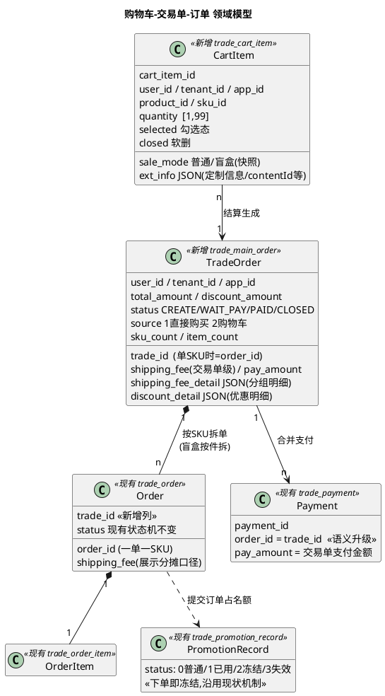

### 4.2 系统架构

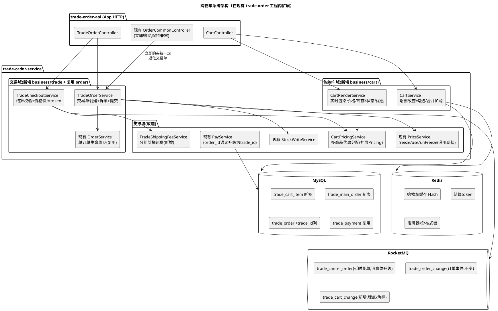

### 4.3 核心设计原则

1. **交易单是聚合层，订单是执行层**：履约、售后、ERP、结算分账等下游全部继续以 order_id 运转，零改动；交易单只承载"支付聚合 + 运费聚合 + 退运费判断"。
2. **单 SKU 退化兼容**：trade_id = order_id 时（立即购买/购物车单 SKU 结算），交易单表仍落一条记录，但对外不透出交易单号——历史订单无交易单记录，查询侧 fallback 按旧逻辑，**存量数据零迁移**。
3. **购物车行存引用**：价格/库存/状态渲染时实时算；仅 `sale_mode`、定制信息（generatedFileId/imageId/contentId）等"加购瞬间才能确定"的信息落快照（盲盒不存抽取结果，见 5.4）。
4. **占用类资源两阶段**：库存（提交订单 LOCK → 支付成功 DEDUCT → 取消 UNLOCK）与优惠名额（提交订单 FREEZE → 支付成功 USED → 取消恢复），**均沿用现状机制**，购物车仅扩展为交易单维度逐子单执行。
5. **一切校验以"提交订单"为准**：购物车页/结算页的校验只影响交互提示，最终一致性由 submit 的事务+锁保证。

---

## 五、关键决策点（多方案对比）

> **决策记录（2026-08-03，RD 评审）**
>
> | 决策点 | 结论 |
> | --- | --- |
> | 5.1 购物车存储 | 未提异议，**按推荐执行：MySQL 为主 + Redis 缓存** |
> | 5.2 交易单建模 | ✅ **已拍板：方案 A，新增交易主单表**（对标淘宝主子单） |
> | 5.3 优惠占用时机 | ✅ **已确认：保持现有逻辑**（下单冻结→支付已用→取消恢复，现状即满足 PRD） |
> | 5.4 盲盒抽取时机 | ✅ **已拍板：保持现有逻辑**（订单创建后 BlindOrderHandler 异步抽取，购物车不抽取；与 PRD 字面差异需同步产品，见 5.4） |
> | 5.5 定制商品入口 UI | 等 UI 结论，不阻塞后端 |

### 5.1 决策点一：购物车存储选型

| 方案 | A. MySQL 为主 + Redis 缓存（推荐） | B. 纯 Redis | C. 纯 MySQL |
| --- | --- | --- | --- |
| 做法 | trade_cart_item 表为事实源；`cart:{userId}` Hash 缓存整车，Cache-Aside，写后删缓存 + 5min TTL 兜底 | Hash 存储 + 定时异步落库 | 只走 DB，每次查库 |
| 性能 | 查车 P99 < 50ms（缓存命中）；写 P99 < 30ms | 全链路 < 10ms | 查车需 join 渲染，P99 ~100ms |
| 可靠性 | 高；缓存丢失可重建 | Redis 故障丢购物车（体验事故）；需自建持久化对账 | 高 |
| 数据观测 | DB→DTS→ES，复用现有链路，指标全 | 需额外同步作业，易漏 | 同 A |
| 开发成本 | 中（缓存一致性双删模板项目里已有） | 低（首期）→ 高（对账/迁移） | 低 |
| 兼容未来 | 支持行数扩容、跨端购物车、优惠快照演进 | 大 value 热 key 风险 | QPS 涨后需加缓存=演进成 A |
| 结论 | **推荐**。与现有基建（MyBatis-Plus/DTS/告警）完全同构，PRD 的数据观测诉求强 | 体量不大时收益有限，可靠性短板致命 | 可作为 A 的降级形态（缓存开关关闭即是 C） |

> 推荐 A。实现上加 Nacos 开关 `cart.cache.enabled`，关闭即退化为 C，天然具备降级预案。

### 5.2 决策点二：交易单建模方式

| 方案 | A. 新增交易主单表 trade_main_order（推荐） | B. 只在 trade_order 加 trade_id 列，"首单"兼职主单 | C. 虚拟交易单（不落表，支付单挂多订单关联表） |
| --- | --- | --- | --- |
| 做法 | 主单表承载交易级金额/运费/状态；trade_order 加 trade_id 列 | 无主单实体，交易级运费/总额挂在第一个子单上 | 支付时临时聚合，加 payment_order_rel 关联表 |
| 支付改造 | Payment.order_id 存 trade_id，单 SKU 天然兼容 | 支付单挂首单 order_id，需特判"首单"语义 | Payment 一对多关联，回调逻辑重写 |
| 运费/退运费 | 交易级字段清晰，"整单全退才退运费"直接查主单 | 首单被退款/拆单后语义崩坏（首单退了运费挂谁？） | 无处存交易级运费明细 |
| 状态机 | 主单状态独立（支付态）；子单状态不变 | 子单状态混入交易语义，历史逻辑易被污染 | 无交易状态，超时关单需扫关联表 |
| 未来演进 | 满减/满赠/分单发货/合并履约都有挂靠点 | 每加一个交易级属性都在订单表打补丁 | 几乎无演进空间 |
| 成本 | 新表 + 建单事务改造（中） | 低（首期）→ 极高（后期理解成本） | 中 |
| 结论 | **推荐**，对齐淘宝主子单，边界清晰 | 明确不推荐：破坏订单表语义纯洁性 | 仅当"绝不新增表"时的妥协 |

> 推荐 A。PRD 中"交易单号作为运费退款判断基准""合并支付"两条规则都需要交易级实体承载。**（2026-08-03 已拍板：采纳方案 A）**

### 5.3 说明项：优惠名额占用时机（✅ 已确认保持现有逻辑）

现有立即购买链路已经是"下单即冻结"三段式：`OrderService.createOrder → buildDiscount → priceService.freeze()` 冻结名额；`finishPay → use()` 冻结转已用；`cancelOrder` 发 CANCEL 事件 → `unFreeze()` 恢复。与 PRD"第一次提交订单即占据折扣名额"完全一致。

购物车链路的改造仅为：**submit 拆单事务内逐子单复用 `priceService.freeze()`**（入参从单订单扩展为交易单下的每个子单），取消/超时按交易单逐子单恢复，占用时机与状态机均不变。购物车渲染时排除"冻结(2)/已用(1)"状态的优惠记录，即可满足"同 SKU 刷新后不再显示优惠价"。

### 5.4 决策点四：盲盒抽取时机（✅ 已拍板：保持现有逻辑）

**现有机制**：加购/下单时不抽取；订单创建成功后，`BlindOrderHandler`（trade-order-job，消费 `trade_order_change` 的 create_order 消息）对 `sale_mode=BLIND` 的订单项按 `trade_pd_sku_box` 概率**异步随机抽取**（单盲盒 `randomOneSkuBox` / 端盒 `randomFullSkuBox` 含隐藏款替换），结果写入 `order_item.ext_info.skuDtoList`，定制盲盒同步生成定制 SKU 给履约侧。

**购物车下的适配（零改动复用）**：

- 购物车行只记 skuId + quantity，**不做抽取、不存抽取结果**；同 SKU 多次加购正常数量 +1（单次加购限 1 件，PRD 加购限制保留）。
- submit 拆单时盲盒按件展开（quantity=N → N 个子单，每单 1 件），每个子单独立触发 CREATE 消息 → BlindOrderHandler 独立抽取，天然满足 PRD"单个随机款独立随机概率、单个 SKU 只能选择一个"。
- `BlindOrderHandler` 本身按订单项处理，**无需任何代码改动**。

**与 PRD 的字面差异**：PRD 写"每次加购都进行随机抽取，抽取结果不显示给用户"。因抽取结果本就不透出，改为"下单后抽取"用户体验完全无差异，且避免了购物车滞留期间概率配置变更、减数量回滚抽取记录等复杂性。**已由 RD 决策确认，需同步产品更新 PRD 表述**。

| 对比 | 原方案 A：加购时抽取存 ext_info | ✅ 已拍板：保持现有逻辑（下单后异步抽取） |
| --- | --- | --- |
| 代码改动 | 加购集成抽取 + 减量回滚 blindDraws + 拆单按快照生成（约 +1d） | 零改动（BlindOrderHandler 原样复用） |
| 概率生效时刻 | 加购时刻（滞留期配置变更不生效，需快照口径） | 下单时刻（配置即时生效，口径更简单） |
| PRD 字面符合 | 完全符合 | 有差异，用户不可感知，需同步产品 |

### 5.5 决策点五：定制商品详情页购物车入口（PRD 待 UI 讨论项）

PRD 给出两个 UI 方案（方案一：带走好物弹窗里增加加购按钮；方案二：参考小红书购买按钮旁增购物车图标）。**技术侧两方案后端能力完全一致**（同一加购接口，ext_info 携带定制信息），不构成技术决策项，随 UI 结论落地即可。定制商品加购后仍走现有订单级审核链路（进 ERP 前审核，审核失败自动退款），本方案不改动。

---

## 六、存储设计（Schema）

### 6.1 MySQL

#### 6.1.1 新表：trade_cart_item（购物车行）

```sql
CREATE TABLE `trade_cart_item` (
  `id`            BIGINT UNSIGNED NOT NULL AUTO_INCREMENT COMMENT '主键ID',
  `cart_item_id`  VARCHAR(64)  NOT NULL COMMENT '购物车行业务ID，CI+Redis序列',
  `user_id`       VARCHAR(64)  NOT NULL COMMENT '用户ID',
  `tenant_id`     VARCHAR(32)  DEFAULT NULL COMMENT '多租户编码 ZHW/ZWXJ，对齐trade_order.tenant_id',
  `app_id`        INT          DEFAULT NULL COMMENT '端ID，对齐trade_order.app_id',
  `product_id`    VARCHAR(64)  NOT NULL COMMENT '商品ID → trade_pd_product.product_id',
  `sku_id`        VARCHAR(64)  NOT NULL COMMENT 'SKU ID → trade_pd_sku.sku_id',
  `quantity`      INT          NOT NULL DEFAULT 1 COMMENT '数量，范围[1,99]',
  `selected`      TINYINT      NOT NULL DEFAULT 0 COMMENT '勾选态 0未选 1选中（PRD默认不选中）',
  `sale_mode`     TINYINT      NOT NULL DEFAULT 0 COMMENT '加购时销售模式快照 0普通 1盲盒，对齐order_item.sale_mode',
  `item_type`     TINYINT      NOT NULL DEFAULT 0 COMMENT '商品类型，对齐order_item.type：0默认 1want 2定制 3商城',
  `ext_info`      TEXT         DEFAULT NULL COMMENT '扩展JSON：定制generatedFileId/imageId、contentId等（盲盒不存抽取结果,下单后异步抽取见5.4）',
  `closed`        TINYINT      NOT NULL DEFAULT 0 COMMENT '软删 0正常 1已删除',
  `create_time`   VARCHAR(32)  NOT NULL COMMENT '创建时间UTC字符串（对齐BaseEntity）',
  `modified_time` VARCHAR(32)  DEFAULT NULL COMMENT '修改时间UTC字符串（购物车排序依据）',
  PRIMARY KEY (`id`),
  UNIQUE KEY `uk_cart_item_id` (`cart_item_id`),
  UNIQUE KEY `uk_user_sku` (`user_id`, `sku_id`),
  KEY `idx_user_closed_modified` (`user_id`, `closed`, `modified_time`)
) ENGINE=InnoDB DEFAULT CHARSET=utf8mb4 COMMENT='购物车行表';
```

设计要点：

- **`uk_user_sku` 全局唯一（含软删行）**：合并加购用一条原子 SQL 完成，天然防并发双写：

```sql
INSERT INTO trade_cart_item (cart_item_id, user_id, ..., quantity, selected, closed, create_time, modified_time)
VALUES (?, ?, ..., ?, 0, 0, ?, ?)
ON DUPLICATE KEY UPDATE
  quantity      = IF(closed = 1, VALUES(quantity), LEAST(quantity + VALUES(quantity), 99)),
  ext_info      = IF(closed = 1, VALUES(ext_info), ext_info),   -- 软删行复用时重置扩展信息
  selected      = IF(closed = 1, 0, selected),
  closed        = 0,
  modified_time = VALUES(modified_time);   -- 触发"移到顶部"
```

  同 SKU 重复加购数量 +1 且 `modified_time` 更新 → 排序自然置顶（PRD 排序规则）；删除后再加购复用软删行并重置状态。盲盒同 SKU 多次加购同样走数量累加（单次加购限 1 件校验在应用层），抽取发生在下单后（5.4），购物车无特殊数据结构。
- **无货/下架商品保留原位置**：失效态是渲染时算出来的，不改 `modified_time`，位置自然不变。
- 行数上限 100/人（Nacos `cart.maxItems`），加购前 count 校验。
- 不加价格快照列：价格、优惠、库存、上下架均实时渲染（业界共识，见 3.3），避免脏价格。

#### 6.1.2 新表：trade_main_order（交易主单）

```sql
CREATE TABLE `trade_main_order` (
  `id`               BIGINT UNSIGNED NOT NULL AUTO_INCREMENT COMMENT '主键ID',
  `trade_id`         VARCHAR(64)  NOT NULL COMMENT '交易单号。多SKU: TR+序列；单SKU退化: =order_id',
  `user_id`          VARCHAR(64)  NOT NULL COMMENT '用户ID',
  `tenant_id`        VARCHAR(32)  DEFAULT NULL COMMENT '多租户编码',
  `app_id`           INT          DEFAULT NULL COMMENT '端ID',
  `source`           TINYINT      NOT NULL DEFAULT 1 COMMENT '来源 1直接购买(退化单) 2购物车结算',
  `status`           TINYINT      NOT NULL DEFAULT 0 COMMENT '0已创建 1待支付 2已支付 6已关闭（对齐Order.OrderStatus编码子集）',
  `sub_status`       TINYINT      DEFAULT NULL COMMENT '关闭子状态，对齐Order.SubStatus：60用户主动 62任务关闭',
  `sku_count`        INT          NOT NULL DEFAULT 1 COMMENT '子订单数（SKU数，盲盒按件计）',
  `item_count`       INT          NOT NULL DEFAULT 1 COMMENT '商品总件数（运费分摊分母）',
  `total_amount`     DECIMAL(10,2) NOT NULL DEFAULT 0 COMMENT '商品总金额（优惠前，不含运费）',
  `discount_amount`  DECIMAL(10,2) NOT NULL DEFAULT 0 COMMENT '优惠总金额',
  `shipping_fee`     DECIMAL(10,2) NOT NULL DEFAULT 0 COMMENT '交易单总运费（运费不拆单）',
  `pay_amount`       DECIMAL(10,2) NOT NULL DEFAULT 0 COMMENT '应付金额 = total - discount + shipping',
  `pay_method`       INT          DEFAULT NULL COMMENT '支付方式，对齐Payment.PaymentMethod',
  `pay_success_time` VARCHAR(32)  DEFAULT NULL COMMENT '支付成功时间UTC',
  `expect_close_time` VARCHAR(32) DEFAULT NULL COMMENT '预计超时关单时间UTC',
  `shipping_fee_refund_status` TINYINT NOT NULL DEFAULT 0 COMMENT '运费退还状态 0未退 1已退（整单全退时置1，防重复退）',
  `cart_snapshot`    TEXT         DEFAULT NULL COMMENT '结算行快照JSON[{cartItemId,skuId,quantity}]，支付成功后据此清车',
  `shipping_fee_detail` TEXT      DEFAULT NULL COMMENT '运费分组明细JSON[{templateId,itemCount,unitFee,groupFee}]',
  `discount_detail`  TEXT         DEFAULT NULL COMMENT '优惠分配明细JSON[{discountId,skuId,orderId,amount,discountType,name}]（订单确认页优惠明细弹窗数据源）',
  `remark`           VARCHAR(512) DEFAULT NULL COMMENT '购买留言（交易级，冗余到各子单）',
  `closed`           TINYINT      NOT NULL DEFAULT 0 COMMENT '软删',
  `create_time`      VARCHAR(32)  NOT NULL COMMENT '创建时间UTC',
  `modified_time`    VARCHAR(32)  DEFAULT NULL COMMENT '修改时间UTC',
  PRIMARY KEY (`id`),
  UNIQUE KEY `uk_trade_id` (`trade_id`),
  KEY `idx_user_status_create` (`user_id`, `status`, `create_time`),
  KEY `idx_status_expect_close` (`status`, `expect_close_time`)
) ENGINE=InnoDB DEFAULT CHARSET=utf8mb4 COMMENT='交易主单表（一次结算=一单）';
```

设计要点：

- `idx_status_expect_close` 供 XXL-Job 兜底扫描超时未关单（延时消息丢失的补偿，对齐现有 `IkjOrderTimeoutCloseJob` 模式）。
- `status` 编码复用 `Order.OrderStatus` 子集（CREATE/WAIT_PAY/PAID/CLOSED），交易单支付后不跟踪履约态——履约/售后仍在子单。
- `discount_detail` 同时服务 PRD"订单确认页优惠明细弹窗"（按优惠来源分条：优惠名称、适用商品、优惠金额、优惠类型）。

#### 6.1.3 存量表变更

```sql
-- 1) 订单表增加交易单号（历史数据为 NULL，查询侧 COALESCE(trade_id, order_id) 兼容）
ALTER TABLE `trade_order`
  ADD COLUMN `trade_id` VARCHAR(64) DEFAULT NULL COMMENT '交易单号，NULL表示历史单（视同=order_id）' AFTER `order_id`,
  ADD KEY `idx_trade_id` (`trade_id`);

-- 2) trade_payment 不改结构：order_id 列语义升级为"支付目标ID"
--    历史单/单SKU退化单: order_id = trade_id = 原订单号，全量历史数据天然兼容
--    多SKU交易单:       order_id = trade_id (TR开头)
```

`trade_order_item.ext_info` 追加 `cartItemId` 字段（JSON 内），标记订单来源购物车行，供支付成功清车与数据分析。

#### 6.1.4 ER 关系

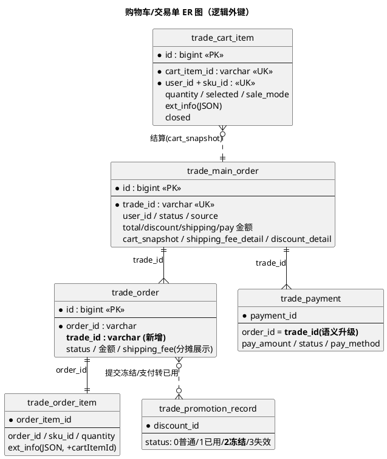

### 6.2 Redis Schema

Key 规范沿用现有 `RedisKey`（前缀 `trade:`），新增 `CART`/`TRADE` 命名空间：

| Key | 类型 | 内容 | TTL | 读写方 |
| --- | --- | --- | --- | --- |
| `trade:cart:items:{userId}` | STRING(JSON) | 整车渲染前的行数据 List<CartItemCacheDto>（不含价格） | 5min | 查车读；所有写操作后 DEL（Cache-Aside+短TTL兜底） |
| `trade:cart:count:{userId}` | STRING | 有效行件数合计（入口角标红点） | 1h | 加购/删除/改数后 DEL，查询回填 |
| `trade:checkout:token:{token}` | STRING(JSON) | 结算价格快照：行列表、单价、优惠分配、运费明细、payAmount | 15min | checkout 写入；submit 读取+DEL（幂等） |
| `trade:cart:lock:{userId}` | Redisson Lock | 购物车写操作用户级串行锁 | waitTime 3s / lease 10s | 加购/改数/删除/submit |
| `trade:submit:lock:{userId}` | Redisson Lock | 提交订单防重锁 | waitTime 0s / lease 10s | submit（tryLock 失败直接提示勿重复提交） |
| `trade:trade:id:{key}` | STRING | 交易单号发号序列（复用 `GlobalIdGeneratorUtil.getNextSeq` Lua） | 30d 滚动 | 提交订单，`TR` + 序列 |
| `trade:main_order:{tradeId}` | STRING(JSON) | 交易单基础缓存（支付页/回调高频读） | 12h | 对齐现有 `ORDER_BASIC` 模式 |

设计要点：

- 整车缓存 value 上限约 100 行 × 500B ≈ 50KB，无大 key 风险；用户维度天然分片，无热 key。
- 价格/优惠**不进缓存**（用户维度优惠实时性要求高，且现有 `PricingService` 已有独立的 2min 询价缓存 `trade:pricing:product:*`，避免双层缓存口径打架）。
- checkout token 沿用现有立即购买的 preOrder token 思路（`RedisKey.PreOrder`），submit 时 `GETDEL` 语义保证一次性消费。

### 6.3 RocketMQ Schema

| Topic | Tag | 消息体 | 生产方 | 消费方 | 变更类型 |
| --- | --- | --- | --- | --- | --- |
| `trade_cancel_order`（现有） | - | **升级**：tradeId 字符串（单SKU时=orderId，历史在途消息为 orderId） | submit 后 sendDelay（过期时间 Nacos `orderExpireTime`） | `CancelOrderConsumerConfig`：先按 trade 查，命中→关交易单+全部子单；未命中→按 orderId 走存量关单逻辑 | 消息体语义扩展，**双查兼容，不新增 topic** |
| `trade_order_change`（现有） | create/finish_pay/cancel 等 | orderId（不变，子单粒度） | 子单状态变更（拆单后逐子单发） | 现有全部下游（ERP/推送/分账/ES），**零改动** | 无 |
| `trade_main_order_change`（新增） | create / finish_pay / cancel | `{tradeId, userId, source, skuCount, itemCount, payAmount, timestamp}` | 交易单状态变更 | 数据观测（漏斗/报表）、清车重试 | 新增 |
| `jjewelry_notify_message`（现有） | - | 不变 | 支付成功通知走子单 | 现有 | 无 |

消费幂等：对齐现有模式（Redis setnx 消费标记 + DB 状态机判断），交易单关单消费者以 `trade_main_order.status` 状态迁移为幂等屏障。

---

## 七、核心流程设计（PlantUML）

### 7.1 加购流程

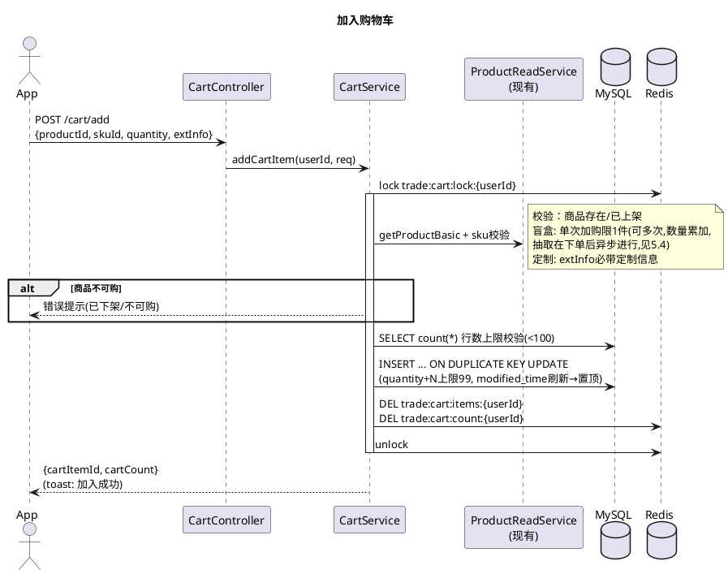

### 7.2 购物车查询（渲染）

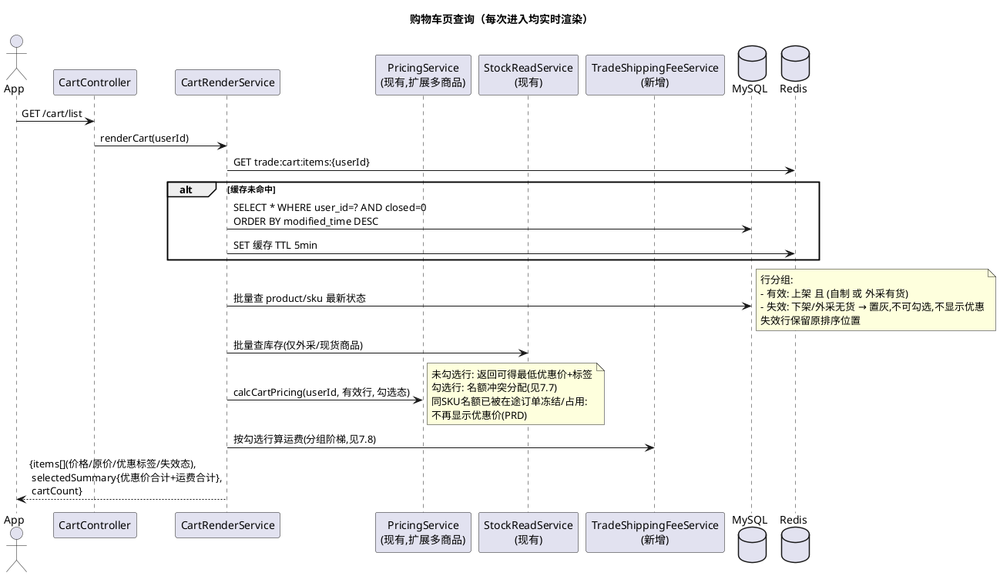

### 7.3 结算（checkout：校验 + 价格快照）

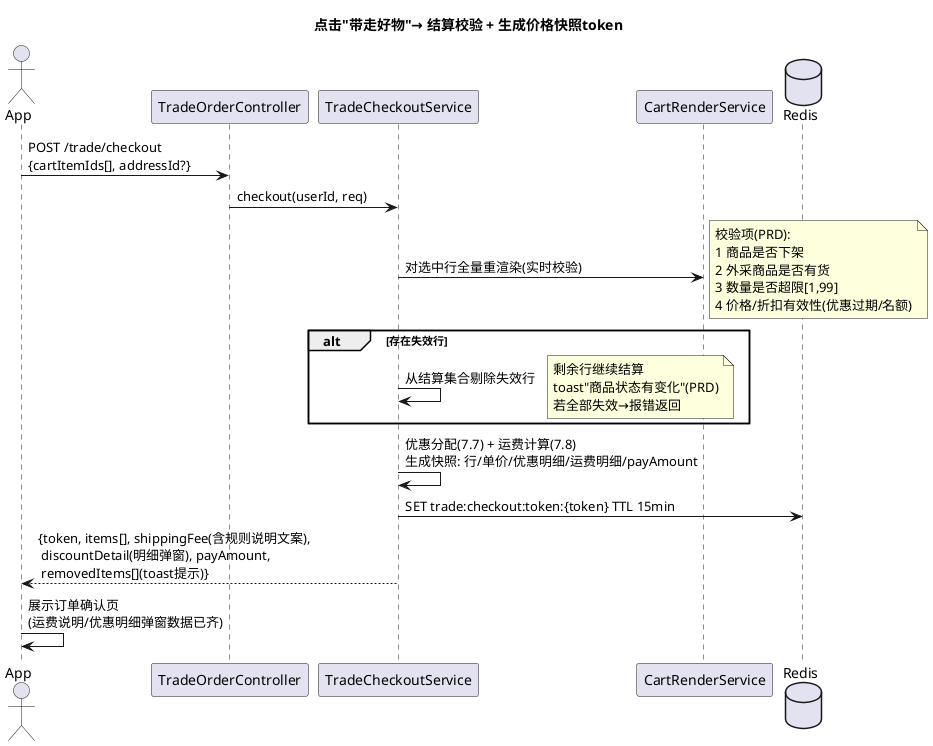

### 7.4 提交订单（拆单事务，核心）

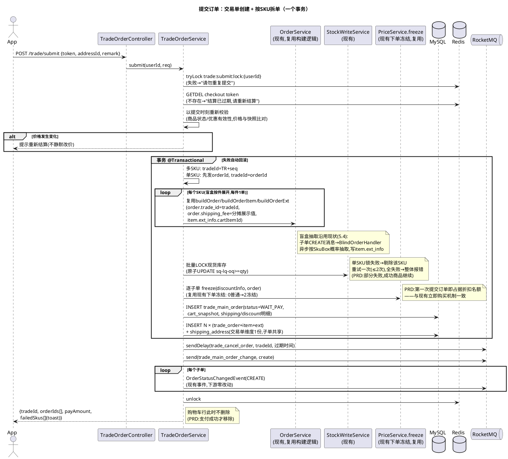

### 7.5 合并支付与回调

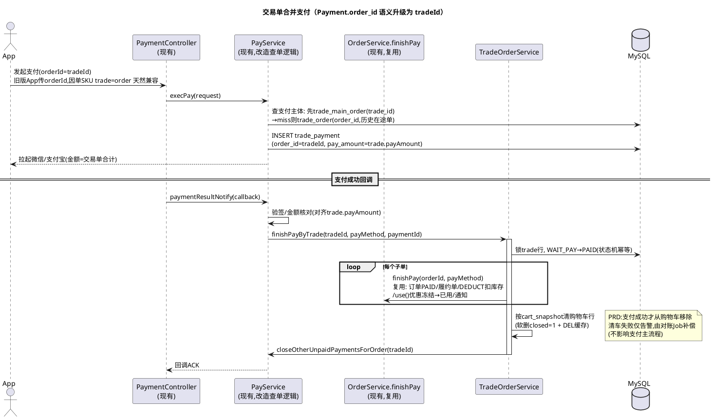

### 7.6 超时关单（延时消息 + Job 兜底）

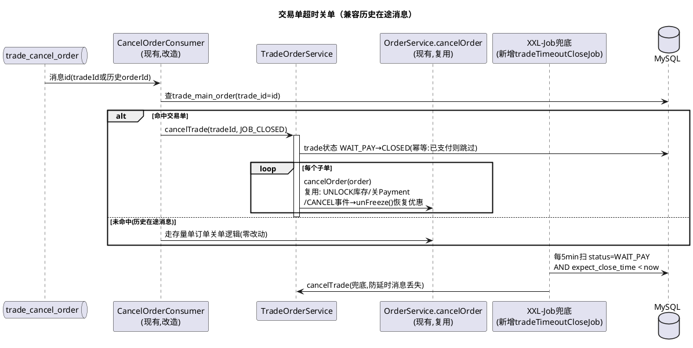

### 7.7 优惠名额冲突分配算法

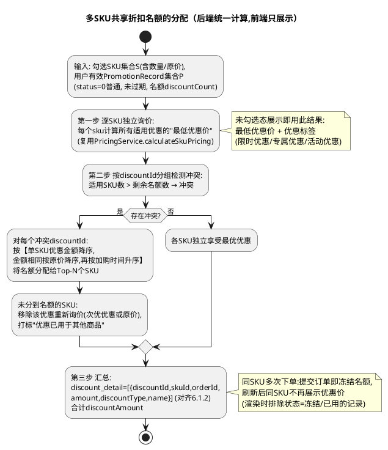

分配口径说明：优惠名额作用于"一笔子订单内该 SKU 的购买行为"，与现有立即购买链路一致，不引入按件分摊（已随 5.3"保持现有逻辑"决策确认）。

### 7.8 运费计算（分组阶梯）

```plantuml
@startuml
title 交易单运费计算（运费不拆单,按模板分组阶梯计费）
start
:输入: 勾选行(skuId,quantity),收货地址addressId;
:按product.freight_template_id分组;
note right
  包邮商品(bearFreight=1或未配模板视为包邮组):
  归入0元组,不参与件数计算
end note
while (还有未计算的模板组?) is (是)
  :组内件数 n = Σ quantity;
  :单价 unitFee = 模板地区匹配运费
  (rule_area命中→freightFee,
   未命中→defaultFreightFee, 兜底4元)
  (复用现有ShippingFeeService匹配逻辑);
  :组运费 = ceil(n / 6) × unitFee;
  note right
    阶梯6件/箱: Nacos可配
    cart.freight.groupSize=6
    示例: 1-6件4元,7-12件8元,13-18件12元
  end note
endwhile (否)
:交易单总运费 = Σ 各组运费;
:落shipping_fee_detail明细JSON
(前端"运费规则说明"弹窗数据源);
:子单展示分摊 = 总运费 ÷ 总件数 × 该SKU件数
(前n-1单四舍五入,最后一单=总-Σ前,消除尾差;
仅展示口径,对账以交易单shipping_fee为准);
stop
@enduml
```

同步改造：立即购买链路运费从"模板一口价"升级为同一公式（单组，`ceil(件数/6)×unitFee`），保证 PRD"直接购买与购物车统一，增加数量阶梯"。改造点在 `ShippingFeeService` 出口处按件数包装，原模板匹配逻辑不动。

### 7.9 售后退款：运费退还判断

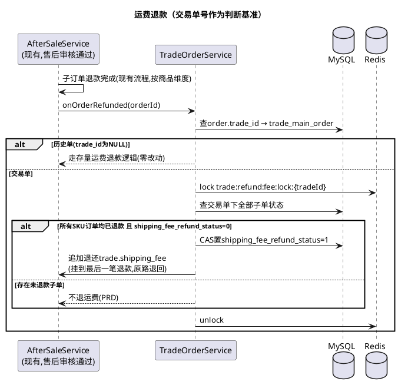

### 7.10 交易单状态机

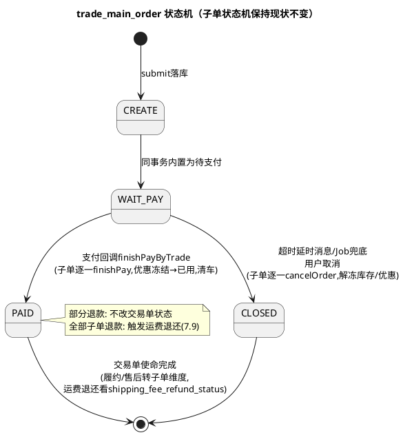

---

## 八、接口设计（App BFF，trade-order-api）

鉴权沿用现有 Token 体系（`uc-auth-sdk`），未登录返回 401 由 App 拉起登录（PRD）。响应统一 `CommonJsonObject` 包装。

### 8.1 购物车接口（新增 CartController）

| 接口 | 方法 | 入参 | 出参（data） | 说明 |
| --- | --- | --- | --- | --- |
| `/cart/add` | POST | `{productId, skuId, quantity, extInfo?}` | `{cartItemId, cartCount}` | 合并加购；盲盒单次限 1 件（可多次加购，数量累加）；行数超 100 报错 |
| `/cart/list` | GET | - | `{items[], invalidItems[], selectedSummary{totalDiscountPrice, shippingFee, payAmount}, cartCount}` | 实时渲染（7.2）；`items[]` 含价格/原价/优惠标签/预计发货时间/库存态 |
| `/cart/quantity` | POST | `{cartItemId, quantity}` | `{selectedSummary}` | [1,99]；外采校验有货；盲盒行数量正常增减（无抽取记录联动） |
| `/cart/select` | POST | `{cartItemIds[], selected}` | `{selectedSummary}` | 单选/多选；失效行拒绝勾选 |
| `/cart/select-all` | POST | `{selected}` | `{selectedSummary}` | 全选只作用于有效行（PRD） |
| `/cart/delete` | POST | `{cartItemIds[]}` | `{cartCount}` | 单个/批量；二次确认在端上 |
| `/cart/count` | GET | - | `{count}` | 入口角标；走 Redis 缓存 |

### 8.2 交易单接口（新增 TradeOrderController）

| 接口 | 方法 | 入参 | 出参（data） | 说明 |
| --- | --- | --- | --- | --- |
| `/trade/checkout` | POST | `{cartItemIds[], addressId?}` | `{token, items[], shippingFee, shippingFeeDetail[], discountDetail[], payAmount, removedItems[]}` | 结算校验+价格快照（7.3）；`removedItems` 供 toast |
| `/trade/submit` | POST | `{token, addressId, remark?}` | `{tradeId, orderIds[], payAmount, failedSkus[]}` | 拆单事务（7.4）；幂等键=token |
| `/trade/detail` | GET | `tradeId` | `{tradeId, status, payAmount, orders[]}` | 收银台/结果页轮询 |

### 8.3 存量接口改造

| 接口 | 变更 | 兼容性 |
| --- | --- | --- |
| 支付系列（`/payment/*`） | 入参 orderId 语义扩展为 tradeId；查单先 trade 后 order | 旧版 App 传 orderId（=退化 tradeId），无感 |
| 订单列表/详情 | 响应新增 `tradeId` 字段 | `tradeId == orderId` 或为空时前端不展示（PRD）；旧版 App 忽略新字段 |
| 订单详情运费 | 返回分摊展示值（7.8 尾差规则） | 历史单返回原 shipping_fee |
| 立即购买（`/order/common/pre` + createOrder） | 内部统一走"退化交易单"（source=1 落 trade_main_order）；运费公式升级为件数阶梯 | 对外请求/响应结构不变 |

---

## 九、非功能设计（对标大厂标准）

### 9.1 性能指标

| 场景 | 目标（P99） | 依据与手段 |
| --- | --- | --- |
| 加购/改数/勾选 | < 100ms | 单行原子 UPSERT + 缓存失效，无外部调用 |
| 查车渲染 | < 300ms | 行数据缓存命中 < 50ms；商品/库存批量查询（IN 一次取回）；询价复用现有 2min 缓存 |
| 结算 checkout | < 500ms | 全量实时校验 + 询价 + 运费，无法省；批量化所有查询 |
| 提交订单 | < 1s（10 SKU 内） | 单事务批量 INSERT；库存原子 UPDATE 逐条（≤勾选上限）；发号 Redis Lua |
| 支付回调处理 | < 2s | 子单 finishPay 串行执行（量小）；后续可演进为 MQ 异步 fan-out |
| 吞吐目标 | 加购 500 QPS / 查车 1000 QPS / 提交 100 QPS | 当前月订单 6k 级，预留 10 倍余量；压测验收 |

### 9.2 可用性与容灾（目标 99.95%）

| 故障场景 | 表现 | 预案 |
| --- | --- | --- |
| Redis 故障 | 缓存/发号/锁不可用 | 查车降级直查 DB（Nacos 开关 `cart.cache.enabled`）；发号器已有 UUID 降级（`GlobalIdGeneratorUtil` 现状）；锁降级为 DB 唯一键兜底（uk_user_sku 防重复行、token 一次性防重复提交） |
| 延时消息丢失 | 交易单不关 | XXL-Job `tradeTimeoutCloseJob` 每 5min 扫描 `idx_status_expect_close` 兜底 |
| 支付成功清车失败 | 已购商品滞留购物车 | 仅告警不阻断；对账 Job 按 cart_snapshot 与 PAID 交易单比对补偿清车 |
| 库存 LOCK 成功但事务回滚 | 库存悬挂 | 现有 stock_log + requestId 幂等机制，事务内操作随事务回滚，无跨事务悬挂 |
| 优惠冻结与订单不一致 | 名额悬挂 | 冻结随订单 discount_info 关联（现状机制）；对账 Job 扫描"冻结超 X 小时且关联订单/交易单已关或不存在"→ unFreeze 恢复 |
| 部分子单创建失败 | 用户少下了商品 | PRD 允许：失败 SKU 保留购物车 + toast；重试 ≤2 次 |

### 9.3 一致性设计

- **DB 事务边界**：trade_main_order + 子单三件套 + 库存 LOCK + 优惠 FREEZE 同一本地事务（同库），强一致。
- **缓存一致性**：Cache-Aside，写后删 + 5min TTL 兜底；购物车数据允许秒级不一致（渲染兜底实时校验）。
- **消息可靠性**：状态先落库、消息后发（对齐现有 `eventPublisher` 事务提交后发送模式）；消费端幂等靠状态机 CAS。
- **金额一致性**：支付回调强校验回调金额 == trade.pay_amount，不一致告警并拒绝状态推进。

### 9.4 安全与风控

- 价格快照 token 一次性消费（GETDEL），防止重放旧价格下单。
- submit 用户级 tryLock(0s) 防连点双开交易单。
- 提交时价格与快照比对，价格漂移拒单重结算，不静默改价。
- submit 拆单构建子单时复用现有 `WantOrderCreateRiskService` 风控 Guard（want 商品，现状挂在 createOrder 内，逐子单生效）。
- 行数/数量上限防恶意撑爆（100 行、99 件、Nacos 可调）。

### 9.5 监控告警（复用 AlarmManager 飞书 + SkyWalking）

| 告警项 | 阈值建议 |
| --- | --- |
| submit 失败率 | > 1% / 5min |
| 支付回调金额不一致 | 单次即告警 |
| 清车补偿队列堆积 | > 100 条 |
| 优惠冻结悬挂对账 | 单次发现即告警 |
| checkout→submit 转化异常下跌 | 环比 -50%（发布期观测） |
| 交易单兜底 Job 关单量 | > 10 单/次（说明延时消息异常） |

---

## 十、兼容性设计（历史 + 未来）

### 10.1 历史兼容清单

| 存量资产 | 兼容策略 |
| --- | --- |
| 历史订单（无 trade_id） | 列为 NULL；查询 `COALESCE(trade_id, order_id)`；详情不展示交易单号（PRD：相等不显示） |
| 历史/在途 Payment | order_id 本来就是单 SKU 订单号 = 退化 tradeId，语义升级后无需任何数据迁移 |
| 在途延时关单消息（消息体 orderId） | 消费端双查：trade 命中走新逻辑，miss 走旧逻辑（7.6） |
| 立即购买链路 | 对外接口不变；内部落退化交易单，灰度期间可开关（`trade.degrade.write.enabled`）控制是否写 trade 表 |
| 履约/售后/ERP/分账/推送/ES 下游 | 全部以 order_id 驱动，**零改动**；`trade_order_change` 消息结构不变 |
| 旧版本 App | 无购物车入口，立即购买正常；订单列表新增字段向后兼容（JSON 加字段） |
| 优惠冻结机制 | 完整沿用现状 freeze/use/unFreeze 三段式与状态机（下单冻结→支付已用→取消恢复），仅调用入口从单订单扩展为交易单逐子单，无时机变更、无数据迁移 |

### 10.2 面向未来的扩展点

- **满减/满赠/多件多折**（PRD 明示的下一步）：优惠分配算法（7.7）入口已抽象为"交易单维度多商品询价"，新玩法以新 DiscountType 策略接入 `discount_detail`，无需动表结构。
- **跨端购物车**（小程序/Web）：cart 表带 tenant_id/app_id，仅需放开端上入口；行合并策略按 user 维度已天然跨端。
- **多仓/多店铺拆单**：拆单器当前按 SKU，未来按 (shopId, warehouse, SKU) 分组即可，trade 层结构不变（对齐淘宝主子单演进路径）。
- **行数扩容/分表**：uk(user_id, sku_id) + user 维度查询，天然支持按 user_id hash 分表；量级到千万行时按 16 表拆分，业务代码无感（MyBatis-Plus 分表插件或中间件）。
- **购物车个性化**（凑单推荐、降价提醒）：`trade_main_order_change`/DTS 已提供数据流，后续接算法侧。

### 10.3 回滚方案

功能开关三层：`cart.enabled`（App 入口）、`trade.submit.enabled`（购物车结算通道）、`cart.cache.enabled`（缓存）。任一异常可分钟级关闭对应层；已产生的交易单数据保留（子单独立可用，不影响履约），回滚不需要数据清理。

---

## 十一、灰度与发布计划

| 阶段 | 内容 | 出口标准 |
| --- | --- | --- |
| P0 后端先行 | 发布 DB 变更 + 退化交易单影子写（立即购买双写 trade 表，不透出） | 影子数据对账 3 天无差异：trade 金额 == 子单金额+运费 |
| P1 内部白名单 | App 内测包 + Nacos 白名单 userId 开放购物车 | 全流程（加购→支付→退款→运费退还）用例通过；漏斗埋点数据到位 |
| P2 灰度放量 | userId 尾号 5% → 20% → 50% | submit 失败率 < 0.5%；支付回调零金额告警；客诉零新增 |
| P3 全量 | 100% + 应用商店发版 | 观测 1 周，出购物车使用率/客单价基线报告 |

DB 变更均为加表/加列/加索引，在线 DDL 无锁风险；`trade_order` 加列选择低峰期执行。

---

## 十二、数据观测方案（对应 PRD 数据需求）

### 12.1 指标口径

| 指标 | 口径（SQL 来源） |
| --- | --- |
| 购物车使用率 | DAU 中有加购行为用户数 / DAU（埋点） |
| 购物车订单占比 | `trade_main_order WHERE source=2` 的子单数 / 全部订单数（DB/ES） |
| 多 SKU 交易单占比 | `sku_count > 1` 交易单数 / 全部交易单数 |
| 交易单平均 SKU 数 / 平均件数 | `AVG(sku_count)` / `AVG(item_count)` |
| 加购后支付率 | 漏斗事件：cart_add → pay_success（同用户 24h 窗口） |
| 运费阶梯占比 | `item_count` 按 (1-6, 7-12, 13-18, >18) 分桶统计 |
| 支付运费-物流成本差额 | `SUM(shipping_fee)` 对账物流账单（离线报表） |

### 12.2 漏斗埋点（客户端事件 + 服务端事件）

`商详曝光 → cart_add_click → cart_add_success(服务端) → cart_view → cart_action(勾选/改数/删除) → checkout_click → checkout_success(服务端) → submit_success(服务端) → pay_success(服务端)`

服务端事件通过 `trade_main_order_change` topic 落数仓；客户端事件走现有埋点体系。DB 明细经现有 DTS→Kafka→ES 链路（`OrderKafkaDtsConsumer` 增加 trade_main_order/trade_cart_item 两个 DtsHandler）支持实时看板。

---

## 十三、改动清单、工作量与排期

### 13.1 改动清单与工作量（后端）

| 编号 | 模块 | 改动 | 工作量 |
| --- | --- | --- | --- |
| F1 | DB/实体/Repository | 2 新表 + 1 加列 DDL + 实体/Mapper（MyBatis-Plus 模式）+ TR 发号器扩展 | 1.5d |
| F2 | 购物车-加购 | 合并加购 UPSERT/行数上限/盲盒限购校验/定制 extInfo | 1.5d |
| F3 | 购物车-列表渲染 | 有效/失效分组、实时询价对接、库存态、排序置顶 | 2d |
| F4 | 购物车-操作 | 数量修改/单选/全选/批量删除/角标 count | 1d |
| F5 | 购物车-缓存 | Cache-Aside + Nacos 开关 + 失效策略 | 0.5d |
| F6 | API 层 | CartController + TradeOrderController + 出入参 DTO | 1d |
| F7 | 运费-分组阶梯 | TradeShippingFeeService（模板分组 + ceil(n/6)×unitFee + 明细 JSON） | 1d |
| F8 | 运费-立即购买统一 | ShippingFeeService 出口按件数阶梯包装 | 0.5d |
| F9 | 优惠-冲突分配 | 交易单维度多商品询价 + 名额分配算法（PricingService 扩展） | 1.5d |
| F10 | 结算 checkout | 全量校验/失效剔除/价格快照/token | 1d |
| F11 | 提交 submit | 拆单事务（交易单+子单+批量锁库存+逐子单 freeze+部分失败重试） | 2d |
| F12 | 立即购买退化交易单 | 影子写开关 + source=1 落 trade 表 | 0.5d |
| F13 | 支付改造 | 查单双查/金额校验/finishPayByTrade 逐子单/支付成功清车 | 1.5d |
| F14 | 超时关单 | 延时消息兼容消费 + cancelTrade + XXL-Job 兜底 | 1d |
| F15 | 退款运费退还 | 整单全退判断 + 防重锁 + CAS 标记 | 0.5d |
| F16 | 对账/监控 | 清车补偿 Job + 优惠悬挂对账 Job + 告警埋点 | 1d |
| F17 | 订单透出改造 | 列表/详情 tradeId 字段 + 运费分摊展示（尾差） | 0.5d |
| F18 | 数据观测 | DTS Handler（cart/main_order→ES）+ 服务端漏斗事件 | 1d |
| F19 | 测试与联调 | 单测 + 前后端联调 + 压测（含用例矩阵 13.5） | 4d |
| | **合计** | | **约 21 人日** |

### 13.2 详细排期（按功能点，2 名后端并行）

假设：kickoff 2026-08-04（周二），后端 RD-A / RD-B 各 1 名，客户端另计（见 13.4），QA 1 名自 W4 介入。遇节假日/App 发版车顺延。

| 工作日 | 日期 | RD-A | RD-B | 交付物/节点 |
| --- | --- | --- | --- | --- |
| D1 | 8/4 | 技术评审（决策点已拍板，见第五章决策记录；会上宣讲+过细节）｜F1 DDL 评审 | 同左 | 方案冻结 |
| D2 | 8/5 | F1 实体/Mapper/发号（1.5d） | F7 运费分组阶梯（1d） | DDL 执行至 dev/test |
| D3 | 8/6 | F2 加购（1.5d） | F8 立即购买运费统一（0.5d）→ F9 优惠冲突分配 | **接口文档冻结，客户端解除阻塞（M1）** |
| D4 | 8/7 | F2 收尾 → F3 列表渲染 | F9 优惠冲突分配（1.5d） | |
| D5 | 8/10 | F3 列表渲染（2d） | F10 checkout 结算+快照 token（1d） | |
| D6 | 8/11 | F3 收尾 + F4 购物车操作 | F11 submit 拆单事务（2d） | |
| D7 | 8/12 | F4 收尾 + F5 缓存（0.5d） | F11 续 | PRD 盲盒表述同步确认截止（14.5） |
| D8 | 8/13 | F13 支付改造（1.5d） | F11 收尾 + F12 退化交易单（0.5d） | 核心写链路贯通 |
| D9 | 8/14 | F13 收尾 | F17 订单透出（0.5d）+ F6 API 收口 | **核心链路代码完成（M2）** |
| D10 | 8/17 | F14 超时关单（1d） | F18 DTS+观测埋点（1d） | |
| D11 | 8/18 | F15 退款运费（0.5d）+ F16 对账监控 | 单测补齐 | |
| D12 | 8/19 | F16 收尾 | 单测/自测用例矩阵执行 | QA 用例评审 |
| D13-D14 | 8/20-8/21 | F19 前后端联调（2d，全员） | 同左 | **联调完成，提测（M3）** |
| D15-D17 | 8/24-8/26 | QA 功能测试 + bugfix（3d） | 同左 | 用例矩阵 13.5 全通过 |
| D18 | 8/27 | 压测（加购500/查车1000/提交100 QPS）+ 调优 | 同左 | 压测报告达标 |
| D19 | 8/28 | **P0 发布**：后端全量（开关关闭）+ 退化交易单影子写 | 同左 | **上线（M4）** |
| — | 8/31-9/2 | 影子写对账观察 3 天（交易单金额==Σ子单+运费） | 值班 | 对账零差异 |
| — | 9/1-9/2 | **P1** 白名单内测（App 内测包，全链路含退款/运费退还） | | 产品验收通过 |
| — | 9/3-9/8 | **P2** 灰度 5% → 20% → 50%（每档观察≥1天） | | submit 失败率<0.5%、零金额告警 |
| — | 9/9 | **P3 全量**（对齐 App 发版车） | | **全量（M5）** |
| — | 9/10-9/11 | 观测基线报告（购物车使用率/客单价/运费阶梯） | | 项目复盘 |

### 13.3 里程碑

| 里程碑 | 日期 | 出口标准 |
| --- | --- | --- |
| M1 接口冻结 | 8/6 | Cart/Trade API 文档 + Mock 可用，客户端并行开发 |
| M2 核心链路完成 | 8/14 | 加购→查车→结算→拆单→支付→回调 后端自测通过 |
| M3 提测 | 8/21 | 联调完成，冒烟通过 |
| M4 P0 上线 | 8/28 | QA 通过 + 压测达标 + 影子写发布 |
| M5 全量 | 9/9 | 灰度指标达标，App 发版车放量 |

### 13.4 前置依赖与并行工作

| 依赖项 | 责任方 | 截止 | 影响 |
| --- | --- | --- | --- |
| 决策点 5.1/5.2/5.3/5.4 | 评审会 | ✅ 2026-08-03 已拍板 | 已解除阻塞 |
| UI 结论（定制入口 5.5、"我的"页入口） | 设计 | 8/7 | 阻塞客户端，不阻塞后端 |
| PRD 表述同步：盲盒抽取时机改为下单后（14.5） | 产品 | 8/12 | 不阻塞开发，阻塞验收口径 |
| App 发版车时间表 | 客户端 | 8/14 前同步 | 决定 P3 全量日期 |
| QA 资源 1 名 | QA | 8/24 起 | 阻塞提测 |
| 客户端开发（购物车页 3d、商详弹窗 1.5d、订单确认页 1.5d、订单列表/详情 1d、我的入口 0.5d、联调 2d ≈ 9.5d/1人） | 客户端团队 | 8/20 前完成开发 | 与后端 8/20 联调对齐（工作量以客户端团队评估为准） |

### 13.5 测试重点用例矩阵

单SKU退化单等价性（新旧链路对账）、多SKU 拆单金额守恒（Σ子单+运费==交易单==支付单）、优惠冲突分配、盲盒逐件拆单、部分 SKU 失败保留购物车、超时关单资源回滚（库存/优惠/支付单三查）、整单退款运费退还、并发（同 SKU 双端加购、submit 连点、回调与超时竞态）。

---

## 十四、开放问题（需产品/相关方确认）

1. **交易单号格式**：本文按现有发号器风格取 `TR` 前缀；PRD Demo 图样式为 `T26...A001`，需与前端/客服系统确认展示格式。
2. **定制商品入口 UI**（5.5）：两方案后端无差异，等 UI 结论。
3. **外采商品"有货/无货"数据源**：按现有 `trade_pd_stock`（Jackyun ERP 同步）判断，ERP 同步延迟期间的展示口径需确认（当前同步 Job 频率下最大延迟约 X 分钟，以运维口径为准）。
4. **"我的"页购物车入口位置**（PRD 待 UI 讨论）：不影响后端。
5. **PRD 表述同步**：盲盒抽取时机已拍板为"下单后异步抽取"（5.4），与 PRD"每次加购都随机抽取"字面有差异（用户不可感知），需产品确认并更新 PRD。

---

## 附录A：与现有代码的映射速查

| 设计元素 | 复用/参考的现有代码 |
| --- | --- |
| 实体基类/时间格式 | `cn.mathmagic.jjewelry.business.common.entity.BaseEntity`（UTC 字符串） |
| 发号器 | `GlobalIdGeneratorUtil.getNextSeq`（Redis Lua，`generatorOrderId` 同款） |
| 分布式锁 | `RedissonDistributedLocker.tryLock(key, wait, lease, supplier)` |
| 订单构建 | `OrderService.createOrder` 内 `buildOrderItem/buildOrderExt/buildAddress` |
| 库存锁定/扣减/解锁 | `StockWriteService.updateStock` + `OrderAction.LOCK/DEDUCT/UNLOCK`（原子 SQL+stock_log 幂等） |
| 优惠状态迁移 | `PriceService.freeze`（下单冻结）/ `use`（支付转已用）/ `unFreeze`（取消恢复）+ `PromotionRecord` 状态机（NORMAL/USED/FREEZE/INVALID） |
| 询价 | `PricingService.calculateSkuPricing`（SKU 级）扩展交易单维度入口 |
| 运费模板匹配 | `ShippingFeeService.getShippingFee`（省市区匹配 + 包邮 + 兜底 4 元） |
| 延时关单 | `RocketmqService.sendDelay(CANCEL_ORDER_MESSAGE, id, expire)` + `CancelOrderConsumerConfig` |
| 支付 | `PayService.execPay/paymentResultNotify/closeOtherUnpaidPaymentsForOrder` |
| Job 兜底 | `IkjOrderTimeoutCloseJob` / `OrderAutoCompletedJob`（XXL-Job 模式） |
| 告警 | `AlarmManager.alarm(场景, 标题, 内容)`（飞书） |
| DTS→ES | `OrderKafkaDtsConsumer` + `DtsHandler` 扩展点 |

## 附录B：参考资料

- 需求文档：docs/需求｜造好物购物车.pdf（2026-07，含评论区结论）
- 项目内既有设计：docs/库存服务-技术设计-补充.md、docs/想要折扣增加时效限制_技术方案.md、docs/模块架构说明.md
- 业界方案：[极客时间·后端存储实战课：购物车系统设计](https://time.geekbang.org/column/article/206061)、[MRCODE-BOOK 笔记版](https://zq99299.github.io/note-book/back-end-storage/01/03.html)、[阿里云开发者社区：购物车系统设计](https://developer.aliyun.com/article/1206499)、[电商开发系列：购物车如何设计](https://developer.aliyun.com/article/1263934)、[SkrShop 电商设计手册·购物体系](https://docs.kilvn.com/skr-shop/src/shopping/cart.html)、[知乎：购物车系统设计](https://zhuanlan.zhihu.com/p/591465194)


