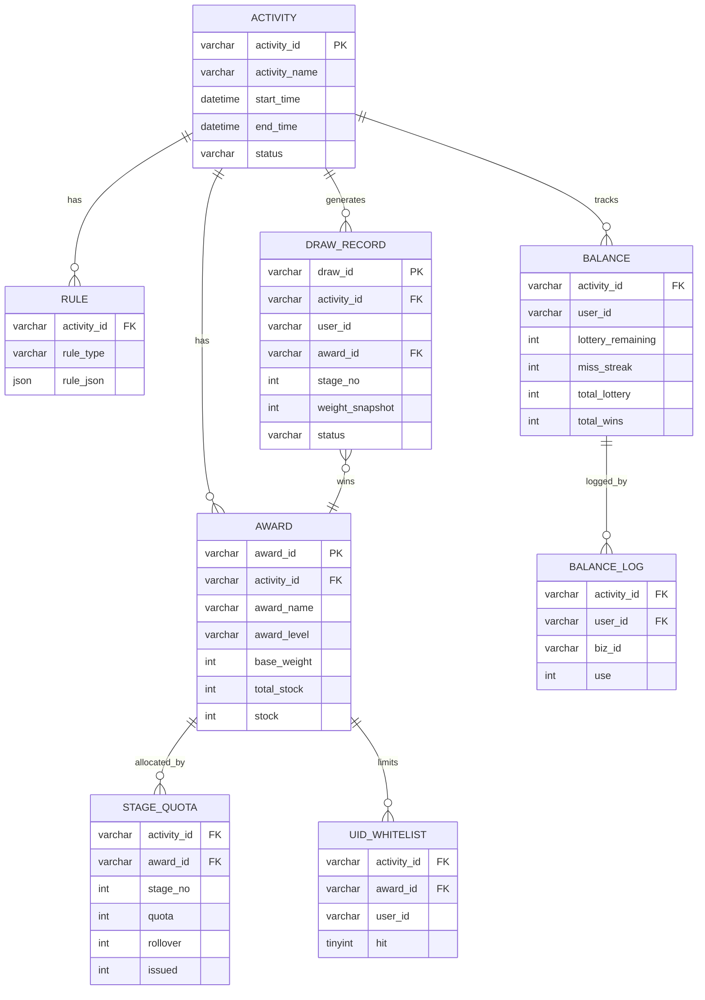
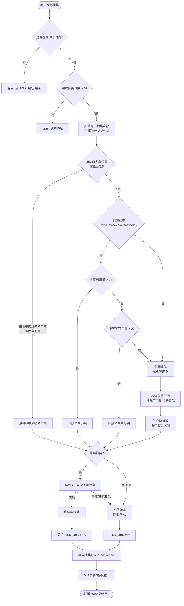
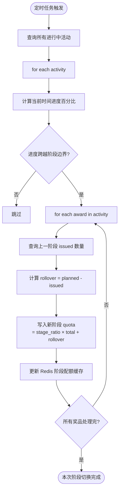
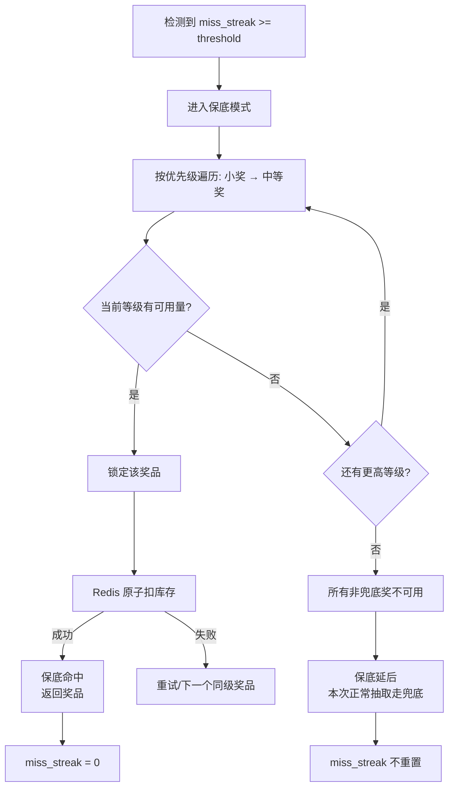
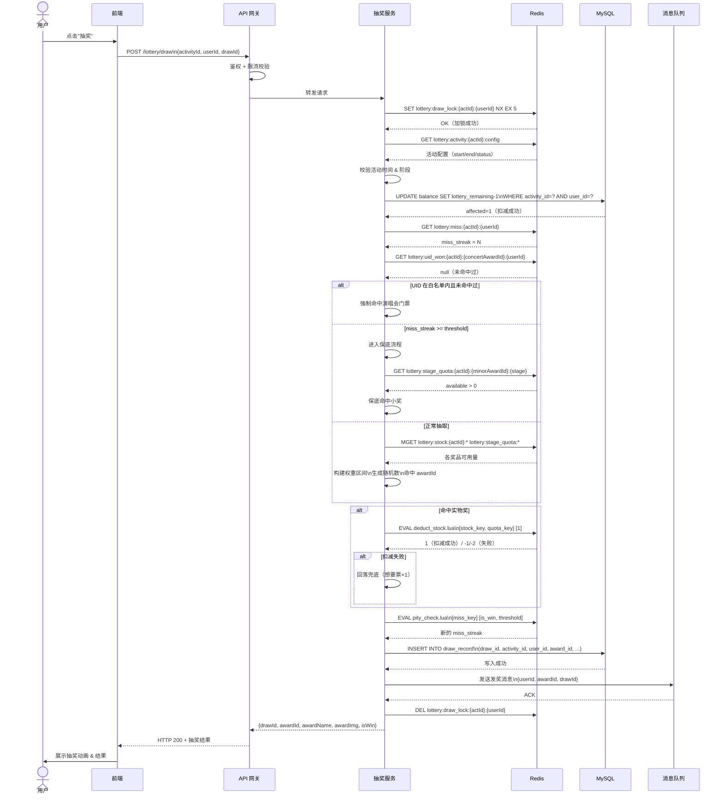
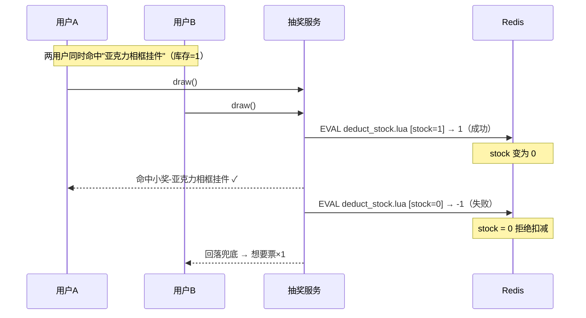
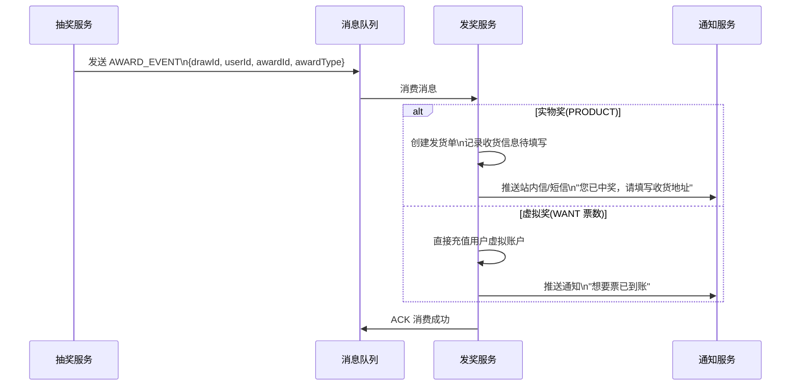

# 珠宝抽奖活动 — 技术设计文档

> 版本：1.0 | 日期：2026-03-16 | 状态：草稿

---

## 目录

1. [系统概述](#1-系统概述)
2. [整体架构](#2-整体架构)
3. [核心模块设计](#3-核心模块设计)
4. [存储设计](#4-存储设计)
5. [抽奖算法设计](#5-抽奖算法设计)
6. [程序流程图](#6-程序流程图)
7. [抽奖时序图](#7-抽奖时序图)
8. [前端 API 接口设计](#8-前端-api-接口设计)
9. [并发与幂等设计](#9-并发与幂等设计)
10. [运营配置与扩展](#10-运营配置与扩展)

---

## 1. 系统概述

### 1.1 业务目标

| 目标 | 说明 |
|------|------|
| 应发尽发 | 实物奖按三段时间配额释放，阶段差额自动顺延 |
| 时间均匀 | 前中后期都有非兜底奖品可中，避免前期透支 |
| 保底体验 | 用户连续 x 次未中实物奖，下一次必中（保底触发） |
| 特殊限定 | 演唱会门票：指定 UID 首抽直中，同一用户只能中一次 |

### 1.2 奖池基准

| 等级 | 奖品 | 数量 | 权重 | 占比 |
|------|------|------|------|------|
| 大奖 | 单依纯演唱会门票×2 | 2 | 2 | 0.02% |
| 大奖 | 游乐场门票×2 | 2 | 2 | 0.02% |
| 大奖 | 超大公仔（一对） | 3 | 3 | 0.02% |
| 中等奖 | 毛绒挂件 | 40 | 40 | 0.31% |
| 中等奖 | 早安机 | 10 | 10 | 0.08% |
| 中等奖 | 毛绒背包 | 25 | 25 | 0.19% |
| 中等奖 | 保温杯 | 25 | 25 | 0.19% |
| 小奖 | 亚克力相框挂件 | 1000 | 1000 | 7.69% |
| 兜底 | 想要票数×1 | 不限 | 11893 | 91.48% |
| **合计** | - | **13000（基准）** | **13000** | **100%** |

---

## 2. 整体架构

```
┌──────────────────────────────────────────────────────────┐
│                      客户端（H5/APP）                      │
└────────────────────────┬─────────────────────────────────┘
                         │ HTTPS
┌────────────────────────▼─────────────────────────────────┐
│                       API 网关                            │
│              （鉴权 / 限流 / 路由）                        │
└────────────────────────┬─────────────────────────────────┘
                         │
┌────────────────────────▼─────────────────────────────────┐
│                    抽奖服务（Lottery Service）              │
│                                                           │
│  ┌─────────────┐  ┌─────────────┐  ┌─────────────────┐  │
│  │ 活动管理模块 │  │ 规则引擎模块 │  │   奖品库存模块   │  │
│  └─────────────┘  └─────────────┘  └─────────────────┘  │
│  ┌─────────────┐  ┌─────────────┐  ┌─────────────────┐  │
│  │  抽奖核心   │  │  保底模块   │  │   UID 白名单模块  │  │
│  └─────────────┘  └─────────────┘  └─────────────────┘  │
└──────┬──────────────────┬──────────────────┬─────────────┘
       │                  │                  │
┌──────▼──────┐  ┌────────▼───────┐  ┌──────▼──────────┐
│    MySQL    │  │     Redis      │  │    消息队列MQ    │
│  (持久化)   │  │ (缓存/原子操作) │  │  (异步发奖通知) │
└─────────────┘  └────────────────┘  └─────────────────┘
```

### 2.1 关键设计原则

- **读多写少**：奖品权重表、活动配置优先走 Redis 缓存，DB 兜底。
- **原子扣减**：库存扣减通过 Redis `DECR` + Lua 脚本保证原子性，DB 做最终核对。
- **幂等防重**：每次抽奖生成唯一 `draw_id`，数据库唯一键防止重复写入。
- **异步发奖**：实物奖命中后通过 MQ 触发发奖流程，解耦抽奖主链路。

---

## 3. 核心模块设计

### 3.1 活动阶段管理

将活动总时长分三段，通过时间进度百分比确定当前阶段：

```
活动时间线：
|--------60%---------|------25%------|---15%----|
  前期 (stage=1)       中期 (stage=2)  末期 (stage=3)

各阶段释放配额占比：
- 前期：50%
- 中期：30%（+ 前期追差）
- 末期：20%（+ 中期追差）
```

**阶段可用量计算：**
```
stage_quota(award, stage) = total_stock × release_ratio[stage] + rollover[stage-1]
available(award, stage)   = stage_quota(award, stage) - issued_in_stage(award, stage)
```

### 3.2 规则引擎

`jewelry_lottery_rule` 表按 `rule_type` 存储五类规则，启动时加载到 Redis：

| rule_type | 说明 | rule_json 示例 |
|-----------|------|----------------|
| `TIME` | 活动时间与阶段比例 | `{"start":"2026-04-01T10:00:00","end":"2026-04-30T23:59:59","phases":[60,25,15]}` |
| `WEIGHT` | 各奖品基准权重 | `{"award001":2,"award002":2,"award003":3,...,"fallback":11893}` |
| `PITY` | 保底配置 | `{"threshold":26,"exclude_award_levels":["MAJOR"],"priority":["MINOR","MIDDLE"]}` |
| `UID` | 演唱会门票白名单 | `{"award_id":"award001","uids":["u001","u002",...]}` |
| `QUOTA` | 阶段配额比例 | `{"stage_ratios":[50,30,20]}` |

### 3.3 保底模块

```
用户 miss_streak 维护逻辑：
- 抽中兜底（fallback）→ miss_streak++
- 抽中任意实物奖      → miss_streak = 0
- miss_streak >= threshold → 触发保底流程
```

**保底优先级：**
1. 小奖（MINOR）可用量 > 0 → 直接命中小奖
2. 小奖不可用 → 尝试中等奖（MIDDLE）
3. 均不可用 → 保底延后（miss_streak 保持不变，等待库存释放）

---

## 4. 存储设计

### 4.1 MySQL 表设计

#### 4.1.1 活动主表

```sql
CREATE TABLE `jewelry_lottery_activity` (
  `id`            bigint       NOT NULL AUTO_INCREMENT COMMENT '主键',
  `activity_id`   varchar(128) NOT NULL COMMENT '活动ID（全局唯一）',
  `activity_name` varchar(255) NOT NULL COMMENT '活动名称',
  `start_time`    datetime     NOT NULL COMMENT '活动开始时间',
  `end_time`      datetime     NOT NULL COMMENT '活动结束时间',
  `status`        varchar(16)  NOT NULL DEFAULT 'INIT'
                  COMMENT '状态: INIT/RUNNING/PAUSED/ENDED',
  `create_time`   datetime     NOT NULL DEFAULT CURRENT_TIMESTAMP,
  `modified_time` datetime     NOT NULL DEFAULT CURRENT_TIMESTAMP ON UPDATE CURRENT_TIMESTAMP,
  `closed`        tinyint(1)   NOT NULL DEFAULT '0',
  PRIMARY KEY (`id`),
  UNIQUE KEY `udx_activity_id` (`activity_id`)
) ENGINE=InnoDB DEFAULT CHARSET=utf8mb4 COMMENT='抽奖活动';
```

#### 4.1.2 奖品表（已有，补充字段说明）

```sql
-- 已有表 jewelry_lottery_award，补充 award_level 字段
-- award_type: WANT(兜底) / PRODUCT(实物)
-- award_level: MAJOR(大奖) / MIDDLE(中等) / MINOR(小奖) / FALLBACK(兜底)
-- total_stock: 活动总库存（不变）
-- stock: 当前剩余库存（随发放扣减）
```

> **完整建表 DDL 见 jewelry_lottery_activity.sql，以下为补丁建议**

```sql
ALTER TABLE `jewelry_lottery_award`
  ADD COLUMN `award_level` varchar(16) NOT NULL DEFAULT 'FALLBACK'
    COMMENT '奖品等级: MAJOR/MIDDLE/MINOR/FALLBACK' AFTER `award_type`,
  ADD COLUMN `base_weight` int NOT NULL DEFAULT '0'
    COMMENT '基准权重（对应 rule_json 中的权重）' AFTER `award_level`;
```

#### 4.1.3 奖品阶段配额表（新增）

```sql
CREATE TABLE `jewelry_lottery_award_stage_quota` (
  `id`            bigint       NOT NULL AUTO_INCREMENT COMMENT '主键',
  `activity_id`   varchar(128) NOT NULL COMMENT '活动ID',
  `award_id`      varchar(128) NOT NULL COMMENT '奖品ID',
  `stage_no`      int          NOT NULL COMMENT '阶段序号: 1/2/3',
  `quota`         int          NOT NULL DEFAULT '0' COMMENT '本阶段计划配额',
  `rollover`      int          NOT NULL DEFAULT '0' COMMENT '上阶段顺延追差量',
  `issued`        int          NOT NULL DEFAULT '0' COMMENT '本阶段已发放数量',
  `create_time`   datetime     NOT NULL DEFAULT CURRENT_TIMESTAMP,
  `modified_time` datetime     NOT NULL DEFAULT CURRENT_TIMESTAMP ON UPDATE CURRENT_TIMESTAMP,
  `closed`        tinyint(1)   NOT NULL DEFAULT '0',
  PRIMARY KEY (`id`),
  UNIQUE KEY `udx_activity_award_stage` (`activity_id`,`award_id`,`stage_no`),
  KEY `idx_activity_id` (`activity_id`)
) ENGINE=InnoDB DEFAULT CHARSET=utf8mb4 COMMENT='奖品阶段配额';
```

#### 4.1.4 UID 白名单表（新增）

```sql
CREATE TABLE `jewelry_lottery_uid_whitelist` (
  `id`            bigint       NOT NULL AUTO_INCREMENT COMMENT '主键',
  `activity_id`   varchar(128) NOT NULL COMMENT '活动ID',
  `award_id`      varchar(128) NOT NULL COMMENT '指定奖品ID',
  `user_id`       varchar(32)  NOT NULL COMMENT '用户ID',
  `hit`           tinyint(1)   NOT NULL DEFAULT '0' COMMENT '是否已命中: 0=未中 1=已中',
  `hit_time`      datetime     DEFAULT NULL COMMENT '命中时间',
  `create_time`   datetime     NOT NULL DEFAULT CURRENT_TIMESTAMP,
  `modified_time` datetime     NOT NULL DEFAULT CURRENT_TIMESTAMP ON UPDATE CURRENT_TIMESTAMP,
  `closed`        tinyint(1)   NOT NULL DEFAULT '0',
  PRIMARY KEY (`id`),
  UNIQUE KEY `udx_activity_award_user` (`activity_id`,`award_id`,`user_id`),
  KEY `idx_activity_user` (`activity_id`,`user_id`)
) ENGINE=InnoDB DEFAULT CHARSET=utf8mb4 COMMENT='UID白名单（指定用户必中奖品）';
```

#### 4.1.5 已有表说明

| 表名 | 说明 |
|------|------|
| `jewelry_lottery_rule` | 活动规则（TIME/WEIGHT/PITY/UID/QUOTA） |
| `jewelry_lottery_activity_balance` | 用户抽奖余额（次数 + miss_streak） |
| `jewelry_lottery_activity_balance_log` | 余额变更流水（充值/消耗） |
| `jewelry_lottery_activity_draw_record` | 抽奖记录（每次一条，保留权重快照） |

### 4.2 ER 图



### 4.3 Redis 设计

#### 4.3.1 Key 规范

| Key | 类型 | 说明 | TTL |
|-----|------|------|-----|
| `lottery:activity:{activity_id}:config` | Hash | 活动配置缓存（start/end/status） | 活动结束后 +1h |
| `lottery:award:{activity_id}:list` | String(JSON) | 奖品列表（含权重/等级） | 同上 |
| `lottery:stock:{activity_id}:{award_id}` | String | 奖品剩余库存（原子扣减） | 同上 |
| `lottery:stage_quota:{activity_id}:{award_id}:{stage_no}` | Hash | 阶段配额 `quota/rollover/issued` | 同上 |
| `lottery:miss:{activity_id}:{user_id}` | String | 用户连续未中次数 | 活动结束后 +7d |
| `lottery:uid_won:{activity_id}:{award_id}:{user_id}` | String | 指定奖品是否已命中（1=已中） | 同上 |
| `lottery:pity_config:{activity_id}` | String(JSON) | 保底配置缓存 | 同上 |
| `lottery:draw_lock:{activity_id}:{user_id}` | String | 用户抽奖防并发锁 | 5s |
| `lottery:rule:{activity_id}:{rule_type}` | String(JSON) | 规则缓存 | 同上 |

#### 4.3.2 库存扣减 Lua 脚本

```lua
-- lottery_deduct_stock.lua
-- KEYS[1] = "lottery:stock:{activity_id}:{award_id}"
-- KEYS[2] = "lottery:stage_quota:{activity_id}:{award_id}:{stage_no}"
-- ARGV[1] = 扣减数量（通常为1）
local stock_key = KEYS[1]
local quota_key = KEYS[2]
local qty = tonumber(ARGV[1])

-- 检查全局库存
local global_stock = tonumber(redis.call('GET', stock_key) or 0)
if global_stock < qty then
    return -1  -- 全局库存不足
end

-- 检查阶段可用量（available = quota + rollover - issued）
local quota   = tonumber(redis.call('HGET', quota_key, 'quota')   or 0)
local rollover= tonumber(redis.call('HGET', quota_key, 'rollover') or 0)
local issued  = tonumber(redis.call('HGET', quota_key, 'issued')   or 0)
local available = quota + rollover - issued
if available < qty then
    return -2  -- 阶段配额不足
end

-- 原子扣减
redis.call('DECRBY', stock_key, qty)
redis.call('HINCRBY', quota_key, 'issued', qty)
return 1  -- 成功
```

#### 4.3.3 保底计数 Lua 脚本

```lua
-- lottery_pity_check.lua
-- KEYS[1] = "lottery:miss:{activity_id}:{user_id}"
-- ARGV[1] = 本次是否命中实物奖（1=命中 0=兜底）
-- ARGV[2] = 保底阈值 threshold
-- 返回：当前 miss_streak（若=threshold 表示本次触发保底）
local miss_key  = KEYS[1]
local is_win    = tonumber(ARGV[1])
local threshold = tonumber(ARGV[2])

if is_win == 1 then
    redis.call('SET', miss_key, 0)
    return 0
else
    local streak = redis.call('INCR', miss_key)
    return tonumber(streak)
end
```

---

## 5. 抽奖算法设计

### 5.1 完整抽奖决策流程（伪代码）

```
function draw(userId, activityId):

    1. 加载上下文
       activity  = getActivity(activityId)          // 活动信息
       stage     = getCurrentStage(activity)         // 当前阶段(1/2/3)
       awards    = getAwardsWithAvailable(activityId, stage)  // 有可用量的奖品
       missStreak= getMissStreak(activityId, userId) // 用户连续未中次数
       pityConf  = getPityConfig(activityId)         // 保底配置

    2. 特殊规则：UID 白名单检查（演唱会门票）
       if isInWhitelist(userId, activityId, concertAwardId)
          AND NOT alreadyWon(userId, activityId, concertAwardId)
          AND available(concertAwardId, stage) > 0:
              return forceDraw(concertAwardId)       // 100% 命中

    3. 特殊规则：保底检查
       if missStreak >= pityConf.threshold:
           for level in [MINOR, MIDDLE]:
               awardInLevel = findAvailableAward(awards, level)
               if awardInLevel != null:
                   return forceDraw(awardInLevel)    // 保底触发
           // 所有非兜底奖不可用 → 保底延后，走正常流程

    4. 正常权重抽取
       pool = buildWeightPool(awards, stage)         // 构建有效权重区间
       rand = random(1, totalWeight(pool))
       hit  = pickAward(pool, rand)                  // 区间命中

    5. 库存扣减（原子）
       if hit.type == PRODUCT:
           result = atomicDeductStock(hit.awardId, activityId, stage)
           if result == FAIL:
               hit = FALLBACK                        // 并发抢光，回落兜底

    6. 更新用户状态
       updateMissStreak(userId, activityId, hit)
       updateDrawRecord(userId, activityId, hit, stage)

    return hit
```

### 5.2 权重区间构建

```
示例（前期，所有奖品有可用量）：
totalWeight = 13000

区间分配：
[1,    2]    → 演唱会门票   (weight=2)
[3,    4]    → 游乐场门票   (weight=2)
[5,    7]    → 超大公仔     (weight=3)
[8,   47]    → 毛绒挂件     (weight=40)
[48,  57]    → 早安机       (weight=10)
[58,  82]    → 毛绒背包     (weight=25)
[83, 107]    → 保温杯       (weight=25)
[108,1107]   → 亚克力相框   (weight=1000)
[1108,13000] → 想要票×1    (weight=11893)

若"早安机"已售完（可用量=0），则跳过该奖品：
totalWeight = 12990
区间重新计算，其余奖品权重不变，兜底区间对应收缩
```

### 5.3 阶段追差计算

```
阶段切换时（定时任务/懒加载触发）：
for each award:
    planned   = total_stock × stage_ratio[stage]
    actual    = issued_in_prev_stage
    rollover  = max(0, planned - actual)   // 未完成配额顺延
    next_quota= total_stock × stage_ratio[stage+1] + rollover
    update stage_quota(award, stage+1, quota=next_quota, rollover=rollover)
```

---

## 6. 程序流程图

### 6.1 抽奖主流程



### 6.2 阶段切换流程（定时任务）



### 6.3 保底触发流程



---

## 7. 抽奖时序图

### 7.1 正常抽奖时序



### 7.2 并发抢库存时序（场景 E）



### 7.3 异步发奖时序



---

## 8. 前端 API 接口设计

> Base URL: `/api/v1/lottery`
> 认证方式: `Authorization: Bearer <token>` （统一网关处理）

---

### 8.1 获取活动信息

```
GET /api/v1/lottery/activity/{activityId}
```

**Response 200:**
```json
{
  "code": 0,
  "data": {
    "activityId": "ACT_2026_JEWELRY_01",
    "activityName": "珠宝品牌春季抽奖",
    "startTime": "2026-04-01T10:00:00+08:00",
    "endTime": "2026-04-30T23:59:59+08:00",
    "status": "RUNNING",
    "currentStage": 1,
    "userRemaining": 3,
    "awards": [
      {
        "awardId": "award_concert",
        "awardName": "单依纯演唱会门票×2",
        "awardImgUrl": "https://cdn.example.com/awards/concert.png",
        "awardLevel": "MAJOR",
        "probability": "极小概率"
      },
      {
        "awardId": "award_acrylic",
        "awardName": "亚克力相框挂件",
        "awardImgUrl": "https://cdn.example.com/awards/acrylic.png",
        "awardLevel": "MINOR",
        "probability": "小概率"
      },
      {
        "awardId": "award_fallback",
        "awardName": "想要票×1",
        "awardImgUrl": "https://cdn.example.com/awards/ticket.png",
        "awardLevel": "FALLBACK",
        "probability": "高概率"
      }
    ]
  }
}
```

---

### 8.2 执行抽奖

```
POST /api/v1/lottery/draw
```

**Request Body:**
```json
{
  "activityId": "ACT_2026_JEWELRY_01",
  "drawId": "DRAW_20260416_u001_1713248000123"
}
```

> `drawId` 由前端生成（建议格式 `DRAW_{yyyyMMddHHmmssSSS}_{userId}_{random}`），用于幂等。

**Response 200 — 中实物奖:**
```json
{
  "code": 0,
  "data": {
    "drawId": "DRAW_20260416_u001_1713248000123",
    "awardId": "award_acrylic",
    "awardName": "亚克力相框挂件",
    "awardImgUrl": "https://cdn.example.com/awards/acrylic.png",
    "awardLevel": "MINOR",
    "isWin": true,
    "isPity": false,
    "remainingLottery": 2,
    "tips": "恭喜获得亚克力相框挂件！"
  }
}
```

**Response 200 — 兜底:**
```json
{
  "code": 0,
  "data": {
    "drawId": "DRAW_20260416_u001_1713248000124",
    "awardId": "award_fallback",
    "awardName": "想要票×1",
    "awardImgUrl": "https://cdn.example.com/awards/ticket.png",
    "awardLevel": "FALLBACK",
    "isWin": false,
    "isPity": false,
    "remainingLottery": 1,
    "tips": "本次获得想要票×1"
  }
}
```

**错误码:**

| code | message | 说明 |
|------|---------|------|
| 0 | success | 正常 |
| 1001 | ACTIVITY_NOT_FOUND | 活动不存在 |
| 1002 | ACTIVITY_NOT_STARTED | 活动未开始 |
| 1003 | ACTIVITY_ENDED | 活动已结束 |
| 1004 | INSUFFICIENT_LOTTERY | 抽奖次数不足 |
| 1005 | DUPLICATE_DRAW | drawId 重复（幂等返回原结果） |
| 1006 | TOO_MANY_REQUESTS | 限流（用户请求过快） |
| 5000 | SYSTEM_ERROR | 系统异常 |

---

### 8.3 获取用户抽奖记录

```
GET /api/v1/lottery/records?activityId={activityId}&page=1&size=10
```

**Response 200:**
```json
{
  "code": 0,
  "data": {
    "total": 25,
    "page": 1,
    "size": 10,
    "records": [
      {
        "drawId": "DRAW_20260416_u001_1713248000123",
        "drawTime": "2026-04-16T14:30:00+08:00",
        "awardName": "亚克力相框挂件",
        "awardLevel": "MINOR",
        "isWin": true
      }
    ]
  }
}
```

---

### 8.4 用户抽奖次数查询

```
GET /api/v1/lottery/balance?activityId={activityId}
```

**Response 200:**
```json
{
  "code": 0,
  "data": {
    "activityId": "ACT_2026_JEWELRY_01",
    "lotteryRemaining": 3,
    "totalLottery": 10,
    "totalWins": 2
  }
}
```

---

### 8.5 中奖名单（公示）

```
GET /api/v1/lottery/winners?activityId={activityId}&awardLevel=MAJOR&page=1&size=20
```

**Response 200:**
```json
{
  "code": 0,
  "data": {
    "total": 7,
    "records": [
      {
        "maskedUserId": "u***01",
        "awardName": "单依纯演唱会门票×2",
        "winTime": "2026-04-16T15:00:00+08:00"
      }
    ]
  }
}
```

---

### 8.6 运营后台接口（内部）

| 方法 | 路径 | 说明 |
|------|------|------|
| POST | `/admin/lottery/activity` | 创建活动 |
| PUT | `/admin/lottery/activity/{activityId}` | 更新活动（暂停/恢复） |
| POST | `/admin/lottery/rule/{activityId}` | 更新规则（权重/保底/UID） |
| GET | `/admin/lottery/dashboard/{activityId}` | 实时奖品发放看板 |
| POST | `/admin/lottery/award/{activityId}/{awardId}/restock` | 手动补库存 |

---

## 9. 并发与幂等设计

### 9.1 防重放（幂等）

```
1. 前端生成全局唯一 drawId（UUID 或时间戳+随机数）
2. 服务端 draw_record 表有 UNIQUE KEY(draw_id)
3. INSERT 失败（重复）→ 查询已有记录直接返回原结果
4. Redis 分布式锁防止同一用户同时并发多次抽奖：
   SET lottery:draw_lock:{actId}:{userId} 1 NX EX 5
```

### 9.2 库存并发安全

```
Redis Lua 脚本（deduct_stock.lua）保证原子性：
- 检查全局库存 + 阶段配额在同一脚本内完成
- 任意一项不足直接返回错误码，不做扣减
- DB 库存作为 T+N 异步核对，不参与实时扣减主链路
```

### 9.3 用户次数扣减

```
DB UPDATE 乐观锁：
UPDATE jewelry_lottery_activity_balance
   SET lottery_remaining = lottery_remaining - 1
 WHERE activity_id = ? AND user_id = ? AND lottery_remaining > 0

影响行数 = 0 时返回次数不足，保证不超扣
```

### 9.4 保底计数并发

```
Redis INCR 天然原子，无需额外锁
Pity Lua 脚本将"读-判断-写"合并为原子操作
```

---

## 10. 运营配置与扩展

### 10.1 可配置参数一览

| 参数 | 类型 | 建议值 | 说明 |
|------|------|--------|------|
| `phases` | int[3] | [60,25,15] | 三段时间占比（%），需合计100 |
| `stage_ratios` | int[3] | [50,30,20] | 各阶段奖品释放占比（%） |
| `pity_threshold` | int | 26 | 保底阈值 x（连续未中次数） |
| `pity_exclude_levels` | string[] | ["MAJOR"] | 保底不触发的奖品等级 |
| `concert_uids` | string[] | [...] | 演唱会门票指定 UID 名单 |

### 10.2 监控指标建议

| 指标 | 说明 | 告警阈值 |
|------|------|---------|
| 抽奖 QPS | 实时抽奖请求量 | > 500/s 触发限流告警 |
| 库存消耗率 | 各奖品已发/总量 | 大奖消耗率 > 80% 告警 |
| 保底触发率 | 保底次数/总抽次数 | > 15% 评估成本 |
| Redis Lua 失败率 | deduct_stock 返回 -1/-2 比例 | > 5% 告警 |
| 幂等命中率 | 重复 drawId 请求比例 | > 1% 排查前端逻辑 |

### 10.3 活动结束库存处理

```
活动结束后剩余库存处理策略（运营人工决策）：
├── 结转下期：修改 activity_id 关联，库存数量顺延
├── 延长时间：更新 end_time，当前库存继续参与
└── 作废回收：status = ENDED，不再发放
```

---

*文档结束 — 如需详细的发奖服务设计或运营后台 API，可继续扩展。*
