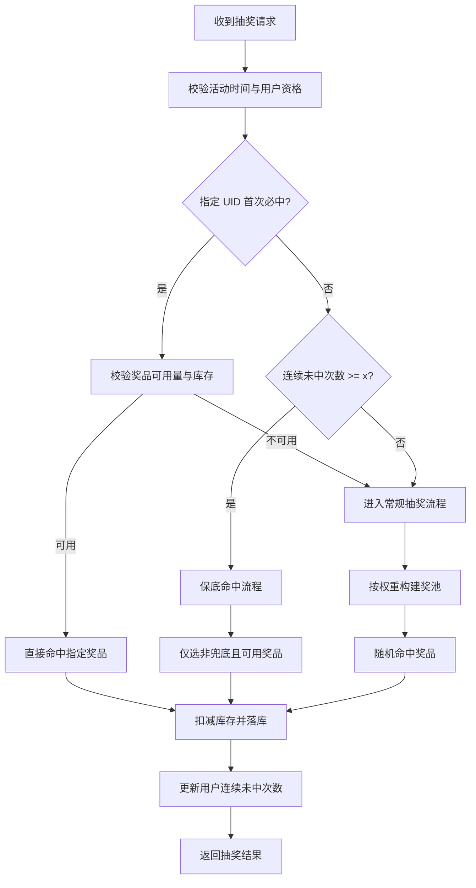

# 抽奖系统技术设计文档

本文档基于 `lottery-product-analysis.md` 的四个核心目标，并结合现有 SQL 结构 `jewelry_lottery_activity.sql` 进行技术设计。

**核心目标**
1. 实物奖数量固定，要尽量应发尽发。
2. 活动有时间范围，前期不能把实物奖发完，后期也要有非兜底奖。
3. 保底策略必须启用：任何用户连续 `x` 次未中实物奖时，下一次必触发保底命中。
4. 单依纯演唱会门票：同一用户只能中一次，且支持指定 UID。

**系统概览**
前端负责展示活动与发起抽奖。抽奖服务负责规则计算与并发控制。MySQL 负责持久化与审计，Redis 负责高并发读写、库存原子扣减与用户状态缓存。

**模块与职责**
1. Lottery API: 提供抽奖、历史、活动信息、规则配置等接口。
2. Rule Engine: 处理时间释放、权重、保底、UID 限制与阶段追差。
3. Stock Service: 原子扣减库存，保证并发一致性。
4. Persistence: 记录抽奖结果、余额变更、规则版本与审计。
5. Scheduler: 阶段切换、规则发布、缓存预热。

**规则实现要点**
1. 时间释放: 以活动时间计算阶段，阶段配额分别为 50% / 30% / 20%，决定当期可用量。
2. 阶段追差: 未发完配额顺延到下一阶段，确保尽量应发尽发。
3. 权重抽取: 仅可用奖品进入池，按截图权重抽取，兜底补齐概率。
4. 保底: 连续 `x` 次未中后下一次必命中非兜底奖，优先小奖再中奖。
5. UID 限制: 指定 UID 首次必中，且该奖品同一用户仅中一次。

**程序流程图**


**抽奖时序流程图（完整可编码版本，含一致性与高并发）**
```mermaid
sequenceDiagram
  participant U as User
  participant FE as FrontEnd
  participant API as Lottery API
  participant Rule as Rule Engine
  participant R as Redis
  participant DB as MySQL

  U->>FE: 点击抽奖
  FE->>API: POST /api/lottery/draw (activityId, draw_id)

  API->>R: SETNX draw:req:{draw_id} ttl (幂等锁)
  API->>R: SETNX draw:lock:{activityId}:{userId} ttl (用户互斥锁)
  alt 用户锁未获取
    API->>FE: 返回 USER_DRAW_IN_PROGRESS
  else 用户锁获取成功
  alt 幂等命中
    API->>DB: SELECT * FROM draw_record WHERE draw_id=?
    API->>R: DEL draw:lock:{activityId}:{userId}
    API->>FE: 返回已处理结果
  else 幂等未命中
    API->>DB: SELECT activity WHERE activity_id=? AND closed=0
    API->>Rule: 校验活动时间窗口
    alt 活动无效
      API->>R: DEL draw:lock:{activityId}:{userId}
      API->>FE: 返回 ACTIVITY_OFFLINE
    else 活动有效
      API->>DB: SELECT rules WHERE activity_id=? AND closed=0
      API->>R: GET user_state(remaining, miss_streak, uid_win_flags)
      API->>Rule: 校验抽奖额度 remaining > 0
      alt 抽奖额度不足
        API->>R: DEL draw:lock:{activityId}:{userId}
        API->>FE: 返回 NO_DRAW_REMAINING
      else 抽奖额度充足
      API->>Rule: 计算阶段(phase_no)与阶段配额
      API->>Rule: 计算奖品可用量(含阶段追差)
      API->>Rule: 组装权重池(剔除不可用奖品)

      API->>Rule: 评估 UID 首次必中资格
      alt UID 首次必中
        API->>Rule: 设定候选奖品 = 指定奖品
      else 非 UID 中奖
        API->>Rule: 评估保底条件 miss_streak >= x
        alt 保底命中
          API->>Rule: 候选奖品 = 非兜底且可用(优先小奖后中奖)
        else 常规抽取
          API->>Rule: 候选奖品 = 权重池抽样结果
        end
      end

      API->>R: Lua 原子脚本(校验可用量 + 扣减库存)
      alt 库存不足或不可用
        API->>Rule: 回退兜底奖品
      else 扣减成功
        API->>DB: BEGIN
        API->>DB: INSERT draw_record (INIT)
        API->>DB: UPDATE balance SET remaining=remaining-1, miss_streak=..., total_lottery=...
        API->>DB: INSERT balance_log (use=-1)
        API->>DB: UPDATE draw_record (SUCCESS)
        API->>DB: COMMIT
        opt DB 失败补偿
          API->>R: Lua 回滚库存
          API->>DB: UPDATE draw_record (FAIL)
        end
      end

      API->>R: 更新 user_state(remaining, miss_streak, uid_win_flags)
      API->>R: DEL draw:lock:{activityId}:{userId}
      API->>FE: 返回抽奖结果
    end
  end
```

补充说明：
- 用户互斥锁只用于同一用户的并发抽奖串行化。
- 幂等锁用于防止重放与重复请求。
```
  end
```

**存储设计 MySQL**
以下表结构与 `jewelry_lottery_activity.sql` 对齐，并补充用途说明。

`jewelry_lottery_award`  
用途: 奖品主数据与库存。  
关键字段: `award_id`, `award_name`, `award_type`, `total_stock`, `stock`。  

`jewelry_lottery_rule`  
用途: 规则配置。  
关键字段: `rule_type` 包含 `TIME/WEIGHT/PITY/UID/LIMIT`，`rule_json` 存储规则版本化配置。  

`jewelry_lottery_activity_balance`  
用途: 用户抽奖余额与统计状态。  
关键字段: `lottery_remaining`, `miss_streak`, `total_lottery`, `total_wins`。  

`jewelry_lottery_activity_balance_log`  
用途: 抽奖次数增减流水，保证审计与对账。  

`jewelry_lottery_activity_draw_record`  
用途: 抽奖记录与结果快照。  
关键字段: `draw_id`, `award_id`, `stage_no`, `weight_snapshot`, `status`。  

**表结构 DDL**
```sql
DROP TABLE IF EXISTS `jewelry_lottery_award`;
CREATE TABLE `jewelry_lottery_award` (
  `id` bigint NOT NULL AUTO_INCREMENT COMMENT '主键',
  `activity_id` varchar(128) NOT NULL COMMENT '活动ID',
  `award_id` varchar(128) NOT NULL COMMENT '奖励ID',
  `award_name` varchar(255) NOT NULL COMMENT '奖励名称',
  `award_img_url` varchar(255) NOT NULL COMMENT '奖励图片URL',
  `award_type` varchar(32) NOT NULL COMMENT 'WANT/PRODUCT',
  `total_stock` int NOT NULL DEFAULT '0' COMMENT '总库存',
  `stock` int NOT NULL DEFAULT '0' COMMENT '当前可用库存',
  `create_time` datetime NOT NULL DEFAULT CURRENT_TIMESTAMP,
  `modified_time` datetime NOT NULL DEFAULT CURRENT_TIMESTAMP ON UPDATE CURRENT_TIMESTAMP,
  `closed` tinyint(1) NOT NULL DEFAULT '0',
  PRIMARY KEY (`id`),
  KEY `idx_activity_id` (`activity_id`),
  KEY `idx_award_id` (`award_id`)
) ENGINE=InnoDB DEFAULT CHARSET=utf8mb4 COMMENT='活动奖励';

DROP TABLE IF EXISTS `jewelry_lottery_rule`;
CREATE TABLE `jewelry_lottery_rule` (
  `id` bigint NOT NULL AUTO_INCREMENT COMMENT '主键',
  `activity_id` varchar(128) NOT NULL COMMENT '活动ID',
  `rule_type` varchar(32) NOT NULL COMMENT 'TIME/WEIGHT/PITY/UID/LIMIT',
  `rule_version` int NOT NULL DEFAULT '1' COMMENT '规则版本',
  `rule_json` json NOT NULL COMMENT '规则内容(简化配置)',
  `create_time` datetime NOT NULL DEFAULT CURRENT_TIMESTAMP,
  `modified_time` datetime NOT NULL DEFAULT CURRENT_TIMESTAMP ON UPDATE CURRENT_TIMESTAMP,
  `closed` tinyint(1) NOT NULL DEFAULT '0',
  PRIMARY KEY (`id`),
  UNIQUE KEY `udx_activity_rule` (`activity_id`,`rule_type`)
) ENGINE=InnoDB DEFAULT CHARSET=utf8mb4 COMMENT='抽奖规则';

DROP TABLE IF EXISTS `jewelry_lottery_activity_balance`;
CREATE TABLE `jewelry_lottery_activity_balance` (
  `id` bigint NOT NULL AUTO_INCREMENT COMMENT '主键',
  `activity_id` varchar(128) NOT NULL COMMENT '活动ID',
  `user_id` varchar(32) NOT NULL COMMENT '用户ID',
  `lottery_remaining` int NOT NULL DEFAULT '0' COMMENT '剩余抽奖次数',
  `miss_streak` int NOT NULL DEFAULT '0' COMMENT '连续未中次数',
  `total_lottery` int NOT NULL DEFAULT '0' COMMENT '总抽奖次数',
  `total_wins` int NOT NULL DEFAULT '0' COMMENT '总中奖次数',
  `last_lottery_time` datetime DEFAULT NULL COMMENT '最后抽奖时间',
  `last_win_time` datetime DEFAULT NULL COMMENT '最后中奖时间',
  `last_non_fallback_win_time` datetime DEFAULT NULL COMMENT '最后非兜底中奖时间',
  `create_time` datetime NOT NULL DEFAULT CURRENT_TIMESTAMP,
  `modified_time` datetime NOT NULL DEFAULT CURRENT_TIMESTAMP ON UPDATE CURRENT_TIMESTAMP,
  `closed` tinyint(1) NOT NULL DEFAULT '0',
  PRIMARY KEY (`id`),
  UNIQUE KEY `udx_activity_user` (`activity_id`,`user_id`),
  KEY `idx_user_id` (`user_id`)
) ENGINE=InnoDB DEFAULT CHARSET=utf8mb4 COMMENT='抽奖余额';

DROP TABLE IF EXISTS `jewelry_lottery_activity_balance_log`;
CREATE TABLE `jewelry_lottery_activity_balance_log` (
  `id` bigint NOT NULL AUTO_INCREMENT COMMENT '主键',
  `activity_id` varchar(128) NOT NULL COMMENT '活动ID',
  `biz_id` varchar(128) NOT NULL COMMENT '业务ID',
  `biz_type` varchar(16) NOT NULL COMMENT 'TASK/DARW',
  `user_id` varchar(32) NOT NULL COMMENT '用户ID',
  `use` int NOT NULL COMMENT '变更(+/-)',
  `create_time` datetime NOT NULL DEFAULT CURRENT_TIMESTAMP,
  `modified_time` datetime NOT NULL DEFAULT CURRENT_TIMESTAMP ON UPDATE CURRENT_TIMESTAMP,
  `closed` tinyint(1) NOT NULL DEFAULT '0',
  PRIMARY KEY (`id`),
  UNIQUE KEY `uniq_biz_id` (`biz_id`),
  KEY `idx_activity_user` (`activity_id`,`user_id`)
) ENGINE=InnoDB DEFAULT CHARSET=utf8mb4 COMMENT='抽奖余额流水';

DROP TABLE IF EXISTS `jewelry_lottery_activity_draw_record`;
CREATE TABLE `jewelry_lottery_activity_draw_record` (
  `id` bigint NOT NULL AUTO_INCREMENT COMMENT '主键',
  `draw_id` varchar(128) NOT NULL COMMENT '抽奖ID',
  `activity_id` varchar(128) NOT NULL COMMENT '活动ID',
  `user_id` varchar(32) NOT NULL COMMENT '用户ID',
  `award_id` varchar(128) NOT NULL COMMENT '奖品ID',
  `stage_no` int NOT NULL COMMENT '阶段序号',
  `weight_snapshot` int NOT NULL DEFAULT '0' COMMENT '抽奖时权重',
  `status` varchar(16) NOT NULL COMMENT 'INIT/SUCCESS/FAIL',
  `fail_reason` varchar(64) DEFAULT NULL COMMENT '失败原因',
  `create_time` datetime NOT NULL DEFAULT CURRENT_TIMESTAMP,
  `modified_time` datetime NOT NULL DEFAULT CURRENT_TIMESTAMP ON UPDATE CURRENT_TIMESTAMP,
  `closed` tinyint(1) NOT NULL DEFAULT '0',
  PRIMARY KEY (`id`),
  UNIQUE KEY `udx_draw_id` (`draw_id`),
  KEY `idx_activity_id` (`activity_id`),
  KEY `idx_user_id` (`user_id`)
) ENGINE=InnoDB DEFAULT CHARSET=utf8mb4 COMMENT='抽奖记录';
```

**规则 JSON 建议结构**
TIME 规则示例:
```json
{"phase":[{"no":1,"start":"2026-03-01","end":"2026-03-10","release":0.5},{"no":2,"start":"2026-03-11","end":"2026-03-20","release":0.8},{"no":3,"start":"2026-03-21","end":"2026-03-31","release":1.0}]}
```
WEIGHT 规则示例:
```json
{"weights":{"grand_concert":2,"grand_park":2,"grand_toy":3,"mid_hanging":40,"mid_clock":10,"mid_bag":25,"mid_cup":25,"small_frame":1000,"fallback":11893}}
```
PITY 规则示例:
```json
{"x":26,"allow_grand":false,"priority":["SMALL","MID"]}
```
UID 规则示例:
```json
{"award_id":"grand_concert","uid_list":["u1","u2","u3"],"first_win_only":true}
```

**Redis 设计**
1. `lottery:stock:{activityId}:{awardId}` 当前可用库存，使用 `DECR` 或 Lua 保证原子扣减。  
2. `lottery:miss:{activityId}:{userId}` 连续未中次数。  
3. `lottery:remaining:{activityId}:{userId}` 可抽次数缓存。  
4. `lottery:uid:won:{activityId}:{awardId}` 用户是否中过指定奖品的集合或布隆。  
5. `lottery:phase:{activityId}` 当前阶段缓存，减少重复计算。  

**一致性与并发策略**
1. `draw_id` 全局唯一，接口层幂等，Redis `SETNX` 防重放。  
2. Redis Lua 脚本原子校验可用量与扣减库存，避免并发超发。  
3. MySQL 事务写入抽奖记录、余额与流水，失败时触发库存补偿。  
4. 保底与 UID 规则均需库存校验，库存不足时回退兜底。  

**前端 API 设计**
接口统一返回 `code`, `message`, `data`。

1. `GET /api/lottery/activity/{activityId}`  
用途: 获取活动基础信息与奖池展示。  

2. `GET /api/lottery/rules/{activityId}`  
用途: 获取规则与配置快照。  

3. `POST /api/lottery/draw`  
请求: `activityId`, `userId`, `requestId`  
返回: `awardId`, `awardName`, `awardType`, `reason`  

4. `GET /api/lottery/record?activityId=...&userId=...`  
用途: 用户抽奖记录分页。  

5. `POST /api/lottery/balance/credit`  
用途: 任务完成后发放抽奖次数。  

**监控与告警**
1. 库存剩余量与发放完成率。  
2. 保底触发比例与成本消耗。  
3. 抽奖接口 P95 与失败率。  
4. UID 指定奖品命中成功率。  

**与核心目标的对应关系**
1. 应发尽发: 阶段配额 + 追差 + 后期释放保证库存可持续消化。  
2. 时间范围: 三阶段释放避免前期透支。  
3. 保底: 连续未中触发必中奖，且优先低成本奖。  
4. UID 限制: 规则层控制资格与一次性命中。  
