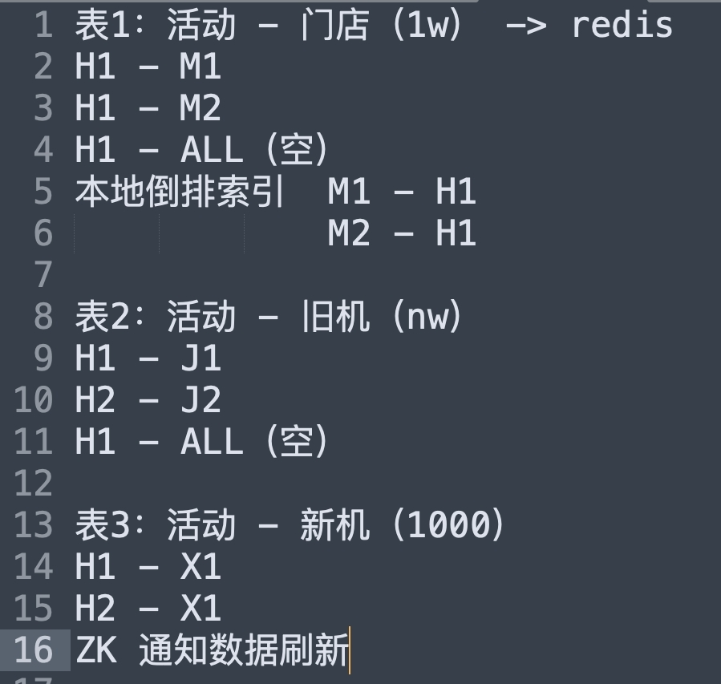
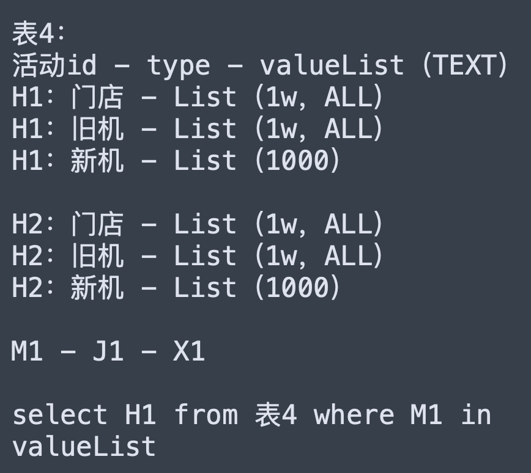

# 活动

### 存储

活动 1 --> n 门店 \
活动 1 --> n 旧机 \
活动 1 --> n 新机 \
活动 1 --> n 档位

### Q&A
Q: 为什么用zk? 当时做线下换新的时候，有个换新活动缓存，我记得是你来支援我们组做的。为什么选择用ZK进行通知机器缓存刷新，比如MQ广播消息也可以做到所有机器刷新吧？\
A: 当时认为 ZK通知比较及时，MQ有堵塞的风险

1. 获取所有审核通过的活动ID
2. 分页获取活动(根据活动ID列表异步获取优惠配置信息)
3. 读主库
4. 