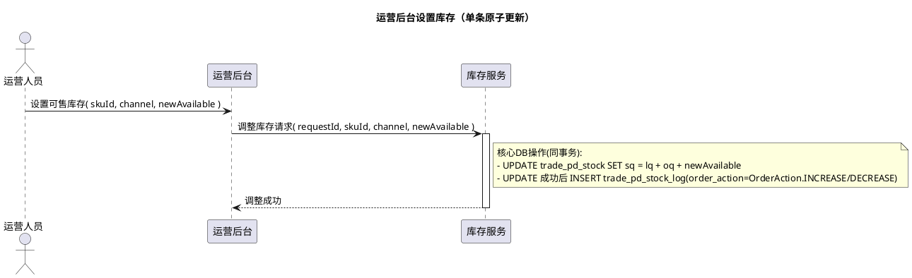
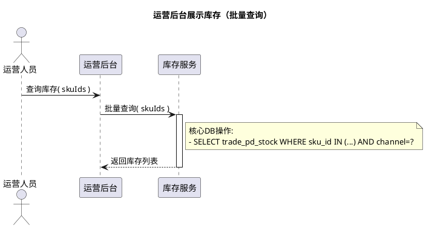
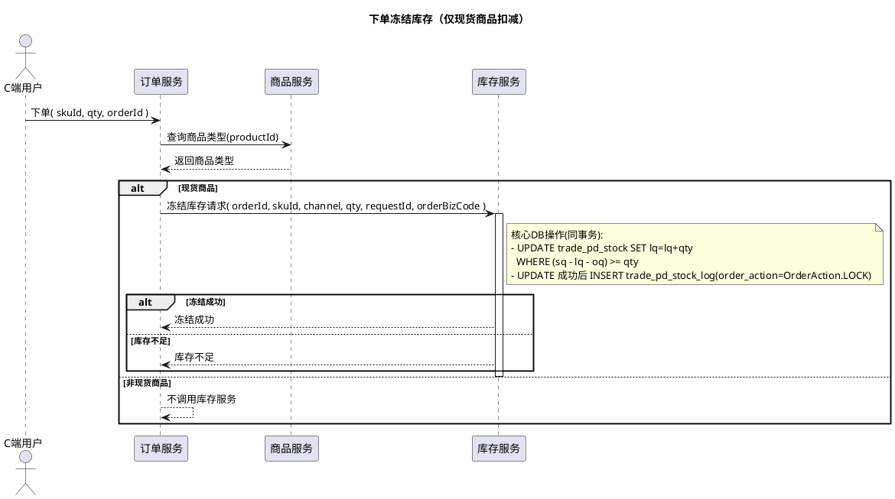
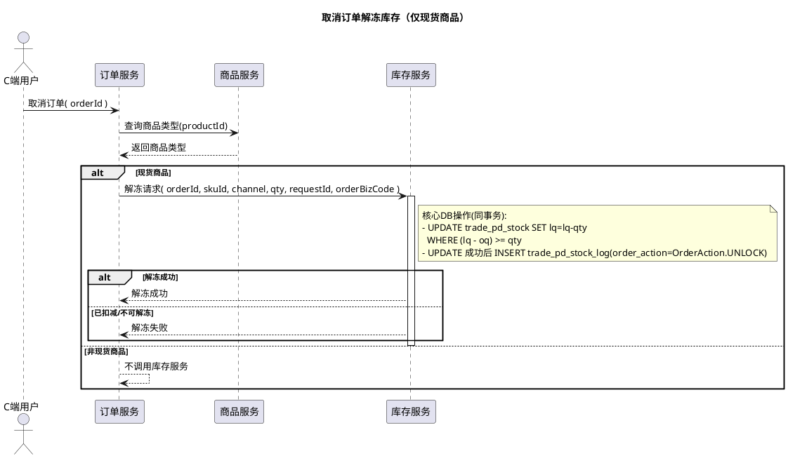
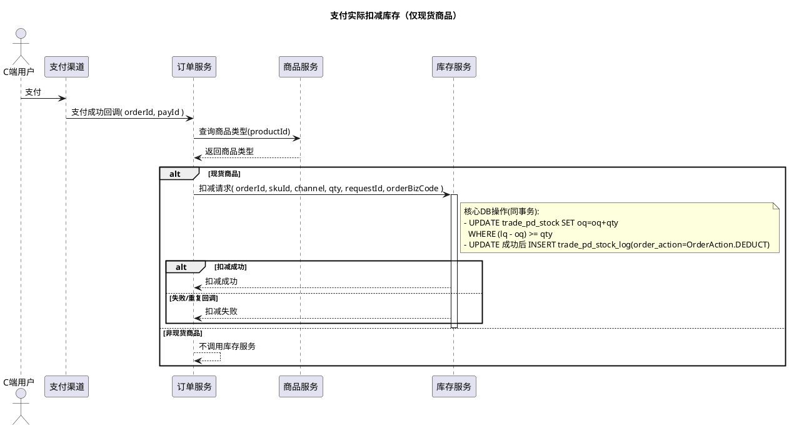
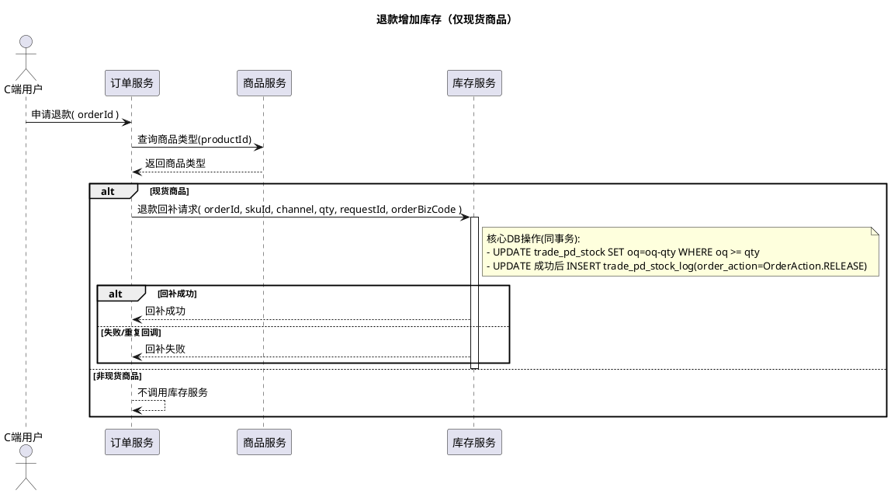
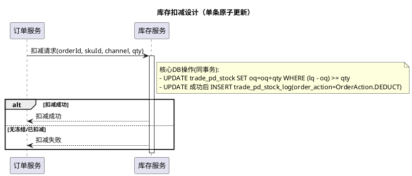
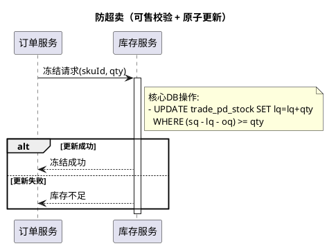
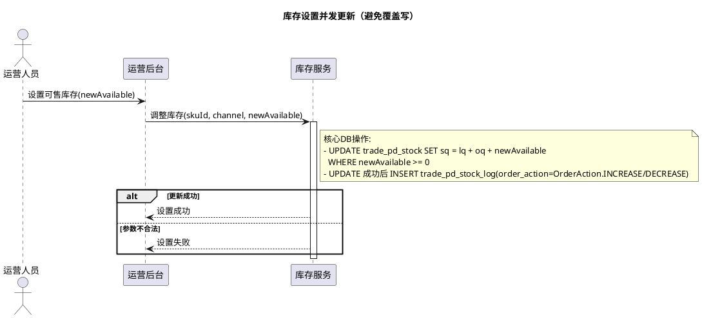

# 详细设计（补全）

## 1. 时序图（PlantUML）

### 1.1 运营后台设置库存（单条原子更新）


---

### 1.2 运营后台展示库存（批量查询）


### 1.3 下单冻结库存


### 1.4 取消订单解冻库存


### 1.5 支付实际扣减库存


### 1.6 退款增加库存


### 1.7 核心问题处理（时序图）

#### 1.7.1 库存扣减设计（单库原子扣减）


#### 1.7.2 防超卖（条件更新）


#### 1.7.3 库存设置并发更新（单条原子更新）



## 2. 单库原子扣减（推荐首选）实现细节

### 2.1 设计原则
- **不使用分布式锁**，依赖数据库原子条件更新保证不超卖
- **一次只更新一个字段**：冻结只动 `lq`，扣减只动 `oq`
- **口径**：`sq` 为总库存，可售 = `sq - lq - oq`
- **幂等控制**：依赖 `trade_pd_stock_log` 唯一索引 `(order_id, order_biz_code, sku_id, order_action)`
- **强一致日志**：库存更新与日志写入在同一事务

### 2.2 冻结库存（下单）
**关键约束**：`sq - lq - oq >= qty`  
**原子更新 SQL**：

```sql
UPDATE trade_pd_stock
SET lq = lq + :qty, modified_time = NOW()
WHERE sku_id = :skuId
  AND channel = :channel
  AND (sq - lq - oq) >= :qty;
```

**处理流程**：
1. 开启事务
2. 执行上述 `UPDATE`，影响行数为 1 则冻结成功
3. 插入 `trade_pd_stock_log`（`order_action=OrderAction.LOCK`，`change_qty=+qty`）
4. 提交事务；若 `UPDATE` 影响行数为 0，返回库存不足

### 2.3 解冻库存（取消/超时）
**约束**：`lq - oq >= qty`（确保未被支付扣减）  
**原子更新 SQL**：

```sql
UPDATE trade_pd_stock
SET lq = lq - :qty, modified_time = NOW()
WHERE sku_id = :skuId
  AND channel = :channel
  AND (lq - oq) >= :qty;
```

**流程**：同冻结逻辑，`order_action=OrderAction.UNLOCK`，`change_qty=-qty`

### 2.4 实际扣减（支付成功）
**约束**：`lq - oq >= qty`  
**原子更新 SQL**：

```sql
UPDATE trade_pd_stock
SET oq = oq + :qty, modified_time = NOW()
WHERE sku_id = :skuId
  AND channel = :channel
  AND (lq - oq) >= :qty;
```

**流程**：
1. 开启事务
2. 执行 `UPDATE`，影响行数为 1 则扣减成功
3. 插入 `trade_pd_stock_log`（`order_action=OrderAction.DEDUCT`，`change_qty=+qty`）
4. 提交事务；若影响行数为 0，说明冻结不存在或已扣减

### 2.5 退款回补（释放已用）
**说明**：`sq` 为总库存，退款只需减少 `oq`，可售会自动恢复为 `sq - lq - oq`。  
如需额外增加总库存，应走“运营后台设置可售”流程，避免混入退款逻辑。

```sql
UPDATE trade_pd_stock
SET oq = oq - :qty, modified_time = NOW()
WHERE sku_id = :skuId
  AND channel = :channel
  AND oq >= :qty;
```

日志写入：`order_action=OrderAction.RELEASE`，`change_qty=-qty`（与字段含义保持一致）

### 2.6 幂等控制
每个业务动作写入一条日志，依赖唯一索引：
`(order_id, order_biz_code, sku_id, order_action)`  
同一请求重复到达时，日志插入会触发唯一冲突，事务回滚，接口可返回“已处理”。

### 2.7 事务边界
同一事务中严格按顺序执行：
1. `UPDATE trade_pd_stock ...`
2. `INSERT trade_pd_stock_log ...`
3. `COMMIT`

禁止在事务内调用外部服务，避免锁时间过长。

---

## 4. 订单服务与库存服务近实时对账方案

### 4.1 总体思路
- **不阻塞C端扣减**，对账异步执行
- 订单事件流与库存事件流**实时比对**
- 设定**对账窗口**（例如 5-10 分钟），超时未匹配触发告警/补偿

### 4.2 事件产出（强一致）
- 订单服务：事务内落库订单状态 + 生成订单事件（Outbox/CDC）
- 库存服务：事务内落库 `trade_pd_stock_log` + 生成库存事件（Outbox/CDC）
- 事件幂等键：`order_id + order_biz_code + sku_id + order_action`

### 4.3 实时对账流程
1. 对账服务实时消费订单事件与库存事件
2. 按 `(order_id, order_biz_code, sku_id)` 进行关联匹配
3. 窗口内未匹配先缓存，超时未匹配进入差异队列

### 4.4 差异处理策略
- 订单有事件、库存无日志：触发库存补偿或人工审核
- 库存有日志、订单无事件：触发订单侧排查
- 数量不一致：记录差异并告警
### 4.5 实现建议
- 使用 **Outbox 表** 或 **CDC** 保证事件与数据库一致
- 对账结果落库（例如 `order_stock_reconcile_log`）
- 差异任务独立调度，避免影响交易链路

---